# 🔍 Deep Detailed Analysis Plan | منصة المناقصة العكسية لقطع الغيار

## 📋 Executive Summary

**Project**: Reverse Tender Platform for Auto Parts  
**Repository**: `larvrevrstender`  
**Current Status**: Pre-implementation (Planning Phase Complete)  
**Analysis Date**: January 29, 2026  
**Complexity Level**: High (Microservices + Real-time + PWA)

---

## 🎯 Project Overview Analysis

### **🏗️ Architecture Assessment**

```yaml
Current_State: "Planning Documents Only"
Target_Architecture: "Laravel Microservices + Vue.js PWA"
Complexity_Score: "9/10 (Very High)"
Implementation_Risk: "High"
Technical_Debt_Risk: "Medium"
```

### **📊 Business Model Analysis**

```mermaid
%%{init: {
  'theme': 'base',
  'themeVariables': {
    'primaryColor': '#FF6F00',
    'primaryTextColor': '#ffffff',
    'primaryBorderColor': '#E65100',
    'lineColor': '#FF8F00',
    'secondaryColor': '#FFA726',
    'tertiaryColor': '#FFE0B2',
    'background': '#ffffff'
  }
}}%%
flowchart TB
    subgraph "💰 Revenue Streams"
        R1["📊 Transaction Commission<br/>5-10% per successful bid"]
        R2["🏪 Merchant Subscriptions<br/>Monthly/Annual plans"]
        R3["⭐ Featured Listings<br/>Premium placement fees"]
        R4["🚚 Shipping Margins<br/>Logistics partnerships"]
    end
    
    subgraph "👥 User Segments"
        U1["🚗 Car Owners<br/>Individual customers"]
        U2["🔧 Workshops<br/>Professional mechanics"]
        U3["🏢 Fleet Companies<br/>Commercial clients"]
        U4["🏪 Parts Merchants<br/>Suppliers & dealers"]
    end
    
    subgraph "🎯 Value Propositions"
        V1["💰 Best Price Guaranteed<br/>Competitive bidding"]
        V2["⏰ Time & Effort Savings<br/>Automated matching"]
        V3["🔍 Full Transparency<br/>Open bidding process"]
        V4["✅ Quality Assurance<br/>Verified merchants"]
    end
    
    U1 --> V1
    U2 --> V2
    U3 --> V3
    U4 --> V4
    
    V1 --> R1
    V2 --> R2
    V3 --> R3
    V4 --> R4
```



---

## 🔬 Technical Deep Dive Analysis

### **1. 🏗️ Architecture Complexity Assessment**

#### **Microservices Breakdown**

```yaml
Service_Count: 7
Complexity_Level: "Enterprise-Grade"

Services:
  Auth_Service:
    Responsibility: "JWT + OAuth + OTP"
    Complexity: "Medium"
    Dependencies: ["SMS Provider", "Database"]
    Critical_Path: true
    
  Bidding_Service:
    Responsibility: "Real-time Auctions + WebSocket"
    Complexity: "Very High"
    Dependencies: ["Redis", "WebSocket Server", "Database"]
    Critical_Path: true
    
  User_Service:
    Responsibility: "Customer + Merchant Profiles"
    Complexity: "Medium"
    Dependencies: ["Database", "File Storage"]
    Critical_Path: false
    
  Order_Service:
    Responsibility: "Request Management + Order Processing"
    Complexity: "High"
    Dependencies: ["Database", "Payment Service"]
    Critical_Path: true
    
  Notification_Service:
    Responsibility: "Push + SMS + Email"
    Complexity: "High"
    Dependencies: ["Redis Queue", "External APIs"]
    Critical_Path: false
    
  Payment_Service:
    Responsibility: "Future Payment Integration"
    Complexity: "High"
    Dependencies: ["Payment Gateways", "Database"]
    Critical_Path: false
    
  Analytics_Service:
    Responsibility: "Reports + Business Intelligence"
    Complexity: "Medium"
    Dependencies: ["Database", "Data Warehouse"]
    Critical_Path: false
```

#### **Technology Stack Analysis**

```yaml
Backend_Stack:
  Framework: "Laravel 10+"
  Language: "PHP 8.2+"
  Database: "MySQL 8.0+"
  Cache: "Redis 7.0+"
  Queue: "Laravel Queue (Redis-based)"
  WebSocket: "Laravel WebSockets / Pusher"
  
Frontend_Stack:
  Framework: "Vue.js 3 + Composition API"
  PWA: "Vite PWA Plugin"
  State_Management: "Pinia"
  UI_Framework: "Tailwind CSS + Headless UI"
  Build_Tool: "Vite"
  
Infrastructure:
  Web_Server: "Nginx"
  Application_Server: "PHP-FPM"
  Container: "Docker + Docker Compose"
  CI_CD: "GitHub Actions"
  Monitoring: "Laravel Telescope + Horizon"
```

### **2. 🔄 Real-time System Analysis**

#### **Bidding System Requirements**


#### **Performance Requirements**

```yaml
Real_Time_Metrics:
  WebSocket_Connections: "1,000+ concurrent"
  Message_Latency: "< 100ms"
  Bid_Processing_Time: "< 50ms"
  Database_Response: "< 20ms"
  
Scalability_Targets:
  Concurrent_Auctions: "100+"
  Bids_Per_Second: "50+"
  Active_Users: "5,000+"
  Data_Throughput: "1MB/s"
```

### **3. 📱 PWA Implementation Analysis**

#### **PWA Requirements Matrix**

```yaml
Core_PWA_Features:
  Service_Worker: "Required"
    - Offline Caching Strategy
    - Background Sync
    - Push Notification Handling
    
  App_Manifest: "Required"
    - Installable on iOS/Android
    - Custom App Icons
    - Splash Screen
    
  Responsive_Design: "Critical"
    - Mobile-first Approach
    - Touch-friendly Interface
    - Adaptive Layouts
    
  Performance_Targets:
    Lighthouse_Score: "> 90"
    First_Contentful_Paint: "< 1.5s"
    Time_to_Interactive: "< 3s"
    Cumulative_Layout_Shift: "< 0.1"
```

---

## 📊 Implementation Roadmap Analysis

### **Phase-by-Phase Breakdown**

#### **Phase 0: Foundation Setup (Week 1-2)**

```yaml
Infrastructure_Setup:
  - Docker Development Environment
  - Laravel Project Structure (7 microservices)
  - Database Schema Design & Migrations
  - Redis Configuration
  - CI/CD Pipeline Setup
  
Development_Environment:
  - Local Development Stack
  - API Documentation (Swagger)
  - Code Quality Tools (PHPStan, Pint)
  - Testing Framework Setup
  
Estimated_Effort: "80 hours"
Risk_Level: "Low"
Dependencies: "None"
```

#### **Phase 1: Core Services (Week 3-6)**

```yaml
Auth_Service_Implementation:
  Features:
    - JWT Authentication
    - OTP Verification (SMS)
    - Role-based Access Control
    - Session Management
  
User_Service_Implementation:
  Features:
    - Customer Registration/Profile
    - Merchant Registration/Profile
    - Vehicle Information Management
    - Profile Image Upload
  
Order_Service_Foundation:
  Features:
    - Part Request Creation
    - Request Status Management
    - Basic CRUD Operations
    - Request Categories
  
Estimated_Effort: "200 hours"
Risk_Level: "Medium"
Critical_Dependencies: ["SMS Provider", "File Storage"]
```

#### **Phase 2: Bidding System (Week 7-10)**

```yaml
Bidding_Service_Core:
  Features:
    - Auction Creation & Management
    - Bid Submission & Validation
    - Bid Ranking Algorithm
    - Time-based Auction Control
  
Real_Time_Integration:
  Features:
    - WebSocket Server Setup
    - Real-time Bid Broadcasting
    - Live Auction Updates
    - Connection Management
  
Database_Optimization:
  Features:
    - Query Optimization
    - Indexing Strategy
    - Caching Layer
    - Performance Monitoring
  
Estimated_Effort: "240 hours"
Risk_Level: "High"
Critical_Dependencies: ["WebSocket Infrastructure", "Redis"]
```

#### **Phase 3: Frontend PWA (Week 11-14)**

```yaml
Customer_PWA:
  Features:
    - Request Creation Interface
    - Bid Viewing & Comparison
    - Real-time Updates
    - Order Tracking
  
Merchant_PWA:
  Features:
    - Bid Submission Interface
    - Request Notifications
    - Order Management
    - Analytics Dashboard
  
PWA_Features:
  Features:
    - Service Worker Implementation
    - Offline Mode
    - Push Notifications
    - App Installation
  
Estimated_Effort: "280 hours"
Risk_Level: "Medium"
Dependencies: ["Backend APIs", "Design System"]
```

#### **Phase 4: Integration & Admin (Week 15-17)**

```yaml
Admin_Dashboard:
  Features:
    - User Management
    - Auction Monitoring
    - System Analytics
    - Configuration Management
  
System_Integration:
  Features:
    - Service Communication
    - Error Handling
    - Logging & Monitoring
    - Performance Optimization
  
Testing_QA:
  Features:
    - Unit Testing (70% coverage)
    - Integration Testing
    - E2E Testing
    - Load Testing
  
Estimated_Effort: "200 hours"
Risk_Level: "Medium"
Dependencies: ["All Previous Phases"]
```

#### **Phase 5: Deployment & Launch (Week 18-19)**

```yaml
Production_Deployment:
  Features:
    - Server Configuration
    - SSL Certificate Setup
    - Domain Configuration
    - Monitoring Tools
  
Documentation_Training:
  Features:
    - User Manual (Arabic)
    - Admin Training
    - Developer Documentation
    - Video Tutorials
  
Launch_Support:
  Features:
    - Beta Testing
    - Bug Fixes
    - Performance Monitoring
    - User Support
  
Estimated_Effort: "120 hours"
Risk_Level: "Low"
Dependencies: ["Production Environment"]
```

---

## ⚠️ Risk Assessment & Mitigation

### **High-Risk Areas**

#### **1. Real-time Bidding Complexity**

```yaml
Risk_Level: "Critical"
Impact: "Project Success"
Probability: "High"

Challenges:
  - WebSocket connection management
  - Concurrent bid processing
  - Race condition handling
  - Message ordering guarantees

Mitigation_Strategies:
  - Prototype early (Week 3)
  - Load testing from Week 8
  - Fallback to polling if needed
  - Redis-based message queuing
  - Database transaction isolation
```

#### **2. Microservices Communication**

```yaml
Risk_Level: "High"
Impact: "System Reliability"
Probability: "Medium"

Challenges:
  - Service discovery
  - Network latency
  - Partial failures
  - Data consistency

Mitigation_Strategies:
  - Start with monolithic structure
  - Gradual service extraction
  - Circuit breaker pattern
  - Comprehensive logging
  - Health check endpoints
```

#### **3. PWA Performance on Mobile**

```yaml
Risk_Level: "Medium"
Impact: "User Experience"
Probability: "Medium"

Challenges:
  - Bundle size optimization
  - Offline functionality
  - iOS Safari limitations
  - Push notification reliability

Mitigation_Strategies:
  - Code splitting strategy
  - Progressive enhancement
  - Extensive mobile testing
  - Fallback mechanisms
  - Performance budgets
```

### **Technical Debt Prevention**

```yaml
Code_Quality_Measures:
  - PHPStan Level 5+ analysis
  - Laravel Pint formatting
  - Automated testing (70%+ coverage)
  - Code review process
  - Documentation standards

Architecture_Decisions:
  - ADR (Architecture Decision Records)
  - Regular architecture reviews
  - Refactoring sprints
  - Performance monitoring
  - Security audits
```

---

## 💰 Cost-Benefit Analysis

### **Development Cost Breakdown**

```yaml
Total_Budget: "28,000 SAR"
Timeline: "18 weeks"

Phase_Costs:
  Phase_0_Foundation: "3,000 SAR (Week 1-2)"
  Phase_1_Core_Services: "7,000 SAR (Week 3-6)"
  Phase_2_Bidding_System: "8,000 SAR (Week 7-10)"
  Phase_3_Frontend_PWA: "6,000 SAR (Week 11-14)"
  Phase_4_Integration: "3,000 SAR (Week 15-17)"
  Phase_5_Deployment: "1,000 SAR (Week 18-19)"

Resource_Allocation:
  Senior_Developer: "60% (Backend + Architecture)"
  Frontend_Developer: "30% (PWA + UI/UX)"
  DevOps_Engineer: "10% (Infrastructure + Deployment)"
```

### **ROI Projections**

```yaml
Revenue_Model:
  Commission_Rate: "5-10%"
  Average_Order_Value: "500 SAR"
  Commission_Per_Order: "25-50 SAR"
  
Break_Even_Analysis:
  Monthly_Orders_Needed: "560-1,120"
  Daily_Orders_Needed: "19-37"
  Active_Merchants_Needed: "20-30"
  
Year_1_Projections:
  Conservative: "50,000 SAR revenue"
  Optimistic: "150,000 SAR revenue"
  ROI: "78% - 435%"
```

---

## 🔧 Technical Implementation Strategy

### **Development Methodology**

```yaml
Approach: "Agile with MVP Focus"
Sprint_Duration: "2 weeks"
Review_Frequency: "Weekly"

MVP_Features:
  - Basic user registration
  - Simple part request creation
  - Basic bidding (no real-time)
  - Order management
  - Admin dashboard

Advanced_Features:
  - Real-time bidding
  - PWA capabilities
  - Advanced analytics
  - Mobile optimization
  - Push notifications
```

### **Quality Assurance Strategy**

```yaml
Testing_Pyramid:
  Unit_Tests: "60% (Models, Services, Helpers)"
  Integration_Tests: "30% (APIs, Database)"
  E2E_Tests: "10% (Critical User Journeys)"

Automation:
  - Continuous Integration (GitHub Actions)
  - Automated Testing on PR
  - Code Quality Checks
  - Security Scanning
  - Performance Monitoring

Manual_Testing:
  - User Acceptance Testing
  - Cross-browser Testing
  - Mobile Device Testing
  - Accessibility Testing
```

### **Performance Optimization Strategy**

```yaml
Backend_Optimization:
  - Database query optimization
  - Redis caching strategy
  - API response compression
  - Background job processing
  - Connection pooling

Frontend_Optimization:
  - Code splitting
  - Lazy loading
  - Image optimization
  - Service worker caching
  - Bundle size monitoring

Infrastructure_Optimization:
  - CDN implementation
  - Load balancing
  - Database indexing
  - Server-side caching
  - Monitoring & alerting
```

---

## 📈 Success Metrics & KPIs

### **Technical KPIs**

```yaml
Performance_Metrics:
  API_Response_Time: "< 200ms (95th percentile)"
  Page_Load_Time: "< 3s (3G network)"
  Lighthouse_Score: "> 90 (all categories)"
  Uptime: "> 99.5%"
  
Quality_Metrics:
  Code_Coverage: "> 70%"
  Bug_Density: "< 1 bug per 1000 lines"
  Security_Vulnerabilities: "0 critical"
  Performance_Regression: "< 5%"
```

### **Business KPIs**

```yaml
User_Engagement:
  Daily_Active_Users: "Target: 100+"
  Session_Duration: "Target: 5+ minutes"
  Conversion_Rate: "Target: 15%"
  User_Retention: "Target: 60% (30 days)"
  
Business_Metrics:
  Monthly_Transactions: "Target: 500+"
  Average_Order_Value: "Target: 500 SAR"
  Merchant_Satisfaction: "Target: 4.5/5"
  Customer_Satisfaction: "Target: 4.5/5"
```

---

## 🚀 Deployment & Infrastructure Plan

### **Infrastructure Architecture**

```yaml
Production_Environment:
  Web_Server: "Nginx (Load Balancer + Reverse Proxy)"
  Application_Server: "PHP-FPM (Multiple Instances)"
  Database: "MySQL 8.0 (Master-Slave Replication)"
  Cache: "Redis Cluster (3 nodes)"
  File_Storage: "S3-compatible (MinIO/AWS S3)"
  
Monitoring_Stack:
  Application_Monitoring: "Laravel Telescope + Horizon"
  Infrastructure_Monitoring: "Prometheus + Grafana"
  Log_Management: "ELK Stack (Elasticsearch + Logstash + Kibana)"
  Error_Tracking: "Sentry"
  Uptime_Monitoring: "UptimeRobot"
```

### **Security Implementation**

```yaml
Security_Layers:
  Network_Security:
    - Firewall configuration
    - VPN access for admin
    - DDoS protection
    - SSL/TLS encryption
    
  Application_Security:
    - JWT token authentication
    - Rate limiting
    - Input validation
    - SQL injection prevention
    - XSS protection
    
  Data_Security:
    - Database encryption at rest
    - Backup encryption
    - PII data anonymization
    - GDPR compliance
```

---

## 📚 Documentation & Knowledge Transfer

### **Documentation Deliverables**

```yaml
Technical_Documentation:
  - System Architecture Overview
  - API Documentation (Swagger)
  - Database Schema Documentation
  - Deployment Guide
  - Troubleshooting Guide
  
User_Documentation:
  - User Manual (Arabic/English)
  - Admin Guide
  - Video Tutorials (15 minutes total)
  - FAQ Document
  
Developer_Documentation:
  - Code Structure Overview
  - Coding Standards
  - Git Workflow
  - Feature Development Guide
  - Testing Guidelines
```

### **Training Plan**

```yaml
Admin_Training:
  Duration: "4 hours"
  Topics:
    - System Overview
    - User Management
    - Auction Monitoring
    - Reports & Analytics
    - Troubleshooting
    
Developer_Handover:
  Duration: "8 hours"
  Topics:
    - Architecture Deep Dive
    - Code Walkthrough
    - Deployment Process
    - Monitoring & Maintenance
    - Future Enhancement Guidelines
```

---

## 🔮 Future Enhancement Roadmap

### **Phase 2 Features (Post-Launch)**

```yaml
Quarter_1_Enhancements:
  ZATCA_Integration:
    - E-Invoice generation
    - QR code implementation
    - Tax compliance
    Estimated_Cost: "5,000 SAR"
    Timeline: "3 weeks"
    
  VIN_OCR_Integration:
    - Image to text processing
    - Automatic vehicle data population
    - VIN validation
    Estimated_Cost: "3,000 SAR"
    Timeline: "2 weeks"

Quarter_2_Enhancements:
  Advanced_Analytics:
    - Business intelligence dashboard
    - Predictive analytics
    - Market insights
    Estimated_Cost: "4,000 SAR"
    Timeline: "3 weeks"
    
  Mobile_Native_Apps:
    - iOS app development
    - Android app development
    - App store submission
    Estimated_Cost: "15,000 SAR"
    Timeline: "8 weeks"

Quarter_3_Enhancements:
  AI_Features:
    - Smart part recommendations
    - Price prediction algorithms
    - Fraud detection
    - Chatbot integration
    Estimated_Cost: "12,000 SAR"
    Timeline: "6 weeks"
```

---

## ✅ Conclusion & Recommendations

### **Project Viability Assessment**

```yaml
Overall_Score: "8.5/10"

Strengths:
  - ✅ Well-defined business model
  - ✅ Comprehensive planning
  - ✅ Modern technology stack
  - ✅ Clear market need
  - ✅ Realistic timeline
  
Challenges:
  - ⚠️ High technical complexity
  - ⚠️ Real-time system requirements
  - ⚠️ Microservices coordination
  - ⚠️ PWA performance optimization
  
Recommendations:
  - 🎯 Start with MVP approach
  - 🎯 Prototype real-time features early
  - 🎯 Consider monolithic-first approach
  - 🎯 Invest in comprehensive testing
  - 🎯 Plan for gradual feature rollout
```

### **Success Factors**

```yaml
Critical_Success_Factors:
  1. "Strong technical team with microservices experience"
  2. "Early prototyping of real-time bidding system"
  3. "Comprehensive testing strategy"
  4. "Performance optimization from day one"
  5. "User feedback integration throughout development"
  
Risk_Mitigation:
  1. "Start with simplified architecture"
  2. "Implement fallback mechanisms"
  3. "Regular performance testing"
  4. "Continuous user testing"
  5. "Flexible deployment strategy"
```

### **Next Steps**

```yaml
Immediate_Actions:
  1. "Approve this analysis and implementation plan"
  2. "Set up development environment"
  3. "Create detailed technical specifications"
  4. "Begin Phase 0: Foundation setup"
  5. "Establish communication protocols"
  
Week_1_Deliverables:
  - Development environment setup
  - Project structure creation
  - Database schema design
  - CI/CD pipeline configuration
  - Team onboarding completion
```

---

**📧 Contact Information**  
**📱 Project Manager:** [Contact Details]  
**🔧 Technical Lead:** [Contact Details]  
**📅 Next Review:** February 5, 2026  
**🚀 Project Start Date:** February 1, 2026

---

*This deep analysis provides a comprehensive roadmap for successful implementation of the Reverse Tender Platform. Every aspect has been carefully analyzed to ensure project success while managing risks and maintaining quality standards.* 🎯
