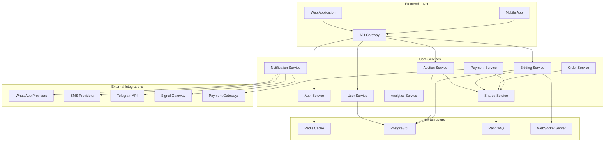
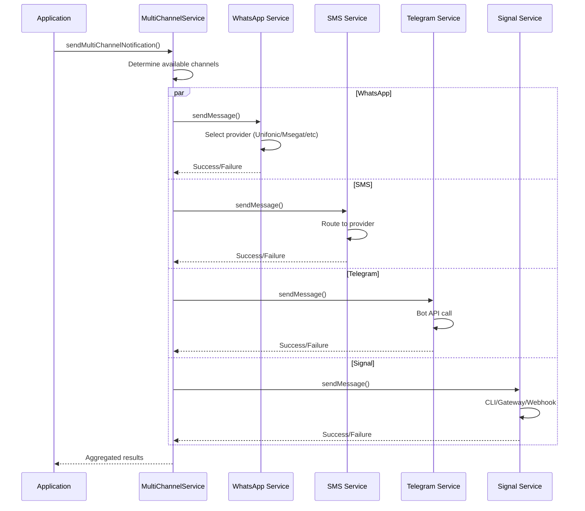
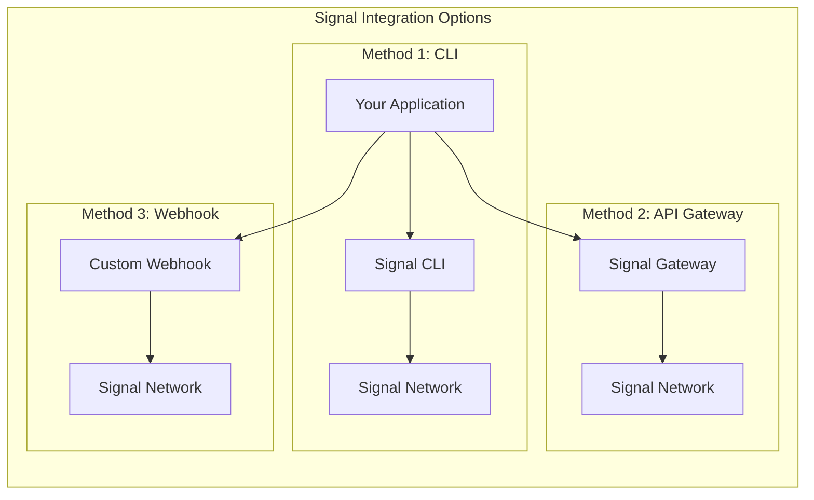
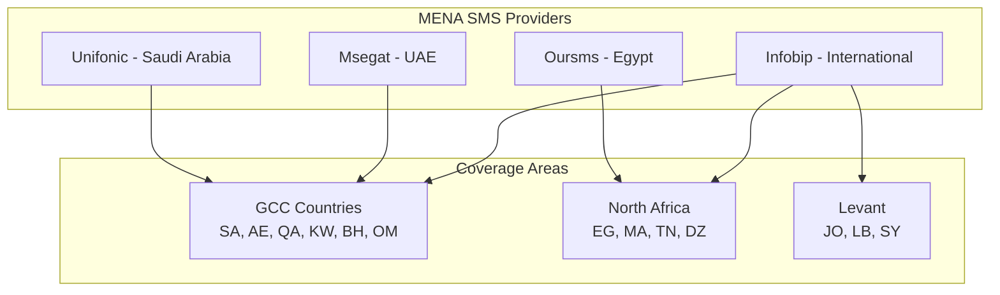
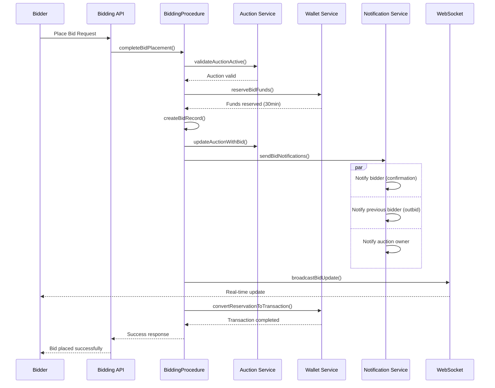
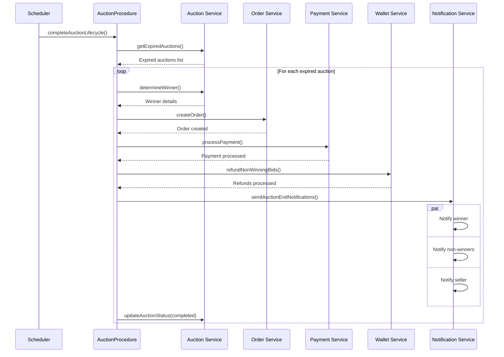

# 🏛️ Laravel Reverse Tender Platform

A comprehensive **microservices-based auction and reverse tender platform** built with Laravel, featuring advanced bidding systems, multi-channel notifications, and MENA-optimized communication services.

## 🌟 **Key Features**

### 🎯 **Core Auction System**
- **Reverse Tender Auctions** - Suppliers bid to provide services
- **Traditional Auctions** - Buyers bid on items
- **Real-time Bidding** - WebSocket-powered live updates
- **Smart Escrow** - Automated fund management and settlement
- **Multi-currency Support** - Global payment processing

### 📱 **MENA-Optimized Notifications**
- **WhatsApp Business** - 5 MENA-compatible providers
- **SMS Services** - 4 regional providers (Unifonic, Msegat, Oursms, Infobip)
- **Telegram Bot API** - Full-featured messaging
- **Signal Messaging** - Privacy-focused communications
- **Email & Web Push** - Traditional channels
- **Multi-channel Orchestration** - Smart fallback and routing

### 🏗️ **Microservices Architecture**
- **Service Isolation** - Independent, scalable services
- **Cross-service RPC** - Efficient inter-service communication
- **Shared Procedures** - Reusable business logic
- **Event-driven Design** - Asynchronous processing
- **Docker Containerization** - Consistent deployment

## 🏛️ **Architecture Overview**


```mermaid
graph TB
    subgraph "Frontend Layer"
        WEB[Web Application]
        MOBILE[Mobile App]
        API_GW[API Gateway]
    end
    
    subgraph "Core Services"
        AUTH[Auth Service]
        USER[User Service]
        AUCTION[Auction Service]
        BIDDING[Bidding Service]
        ORDER[Order Service]
        PAYMENT[Payment Service]
        NOTIFICATION[Notification Service]
        ANALYTICS[Analytics Service]
        SHARED[Shared Service]
    end
    
    subgraph "External Integrations"
        WHATSAPP[WhatsApp Providers]
        SMS[SMS Providers]
        TELEGRAM[Telegram API]
        SIGNAL[Signal Gateway]
        PAYMENT_GW[Payment Gateways]
    end
    
    subgraph "Infrastructure"
        REDIS[Redis Cache]
        POSTGRES[PostgreSQL]
        RABBITMQ[RabbitMQ]
        WEBSOCKET[WebSocket Server]
    end
    
    WEB --> API_GW
    MOBILE --> API_GW
    API_GW --> AUTH
    API_GW --> USER
    API_GW --> AUCTION
    API_GW --> BIDDING
    
    AUCTION --> SHARED
    BIDDING --> SHARED
    ORDER --> SHARED
    PAYMENT --> SHARED
    
    NOTIFICATION --> WHATSAPP
    NOTIFICATION --> SMS
    NOTIFICATION --> TELEGRAM
    NOTIFICATION --> SIGNAL
    
    PAYMENT --> PAYMENT_GW
    
    AUTH --> REDIS
    USER --> POSTGRES
    AUCTION --> POSTGRES
    BIDDING --> POSTGRES
    
    SHARED --> RABBITMQ
    BIDDING --> WEBSOCKET
```

## 🚀 **Quick Start**

### Prerequisites
- Docker & Docker Compose
- PHP 8.2+
- Node.js 18+
- PostgreSQL 15+
- Redis 7+

### 1. Clone & Setup
```bash
git clone https://github.com/abdoElHodaky/larvrevrstender.git
cd larvrevrstender
cp .env.example .env
```

### 2. Configure Environment
```bash
# Database
DB_CONNECTION=pgsql
DB_HOST=postgres
DB_DATABASE=laravel_reverse_tender
DB_USERNAME=postgres
DB_PASSWORD=password

# Redis
REDIS_HOST=redis
REDIS_PASSWORD=null
REDIS_PORT=6379

# MENA Notification Providers
WHATSAPP_PROVIDER=unifonic
UNIFONIC_API_KEY=your_unifonic_key
SMS_PROVIDER=unifonic
TELEGRAM_BOT_TOKEN=your_telegram_bot_token
```

### 3. Launch Services
```bash
# Start all services
docker-compose up -d

# Run migrations
docker-compose exec shared-service php artisan migrate

# Install dependencies
docker-compose exec shared-service composer install
```

### 4. Access Applications
- **Web Interface**: http://localhost:8080
- **API Gateway**: http://localhost:8000
- **Admin Panel**: http://localhost:8080/admin

## 📡 **Notification System Architecture**

### Multi-Channel Notification Flow


```mermaid
sequenceDiagram
    participant App as Application
    participant MCS as MultiChannelService
    participant WA as WhatsApp Service
    participant SMS as SMS Service
    participant TG as Telegram Service
    participant SG as Signal Service
    
    App->>MCS: sendMultiChannelNotification()
    MCS->>MCS: Determine available channels
    
    par WhatsApp
        MCS->>WA: sendMessage()
        WA->>WA: Select provider (Unifonic/Msegat/etc)
        WA-->>MCS: Success/Failure
    and SMS
        MCS->>SMS: sendMessage()
        SMS->>SMS: Route to provider
        SMS-->>MCS: Success/Failure
    and Telegram
        MCS->>TG: sendMessage()
        TG->>TG: Bot API call
        TG-->>MCS: Success/Failure
    and Signal
        MCS->>SG: sendMessage()
        SG->>SG: CLI/Gateway/Webhook
        SG-->>MCS: Success/Failure
    end
    
    MCS-->>App: Aggregated results
```

### Signal Service Integration Methods


```mermaid
graph LR
    subgraph "Signal Integration Options"
        APP[Your Application]
        
        subgraph "Method 1: CLI"
            CLI[Signal CLI]
            SIGNAL_NET1[Signal Network]
            APP --> CLI
            CLI --> SIGNAL_NET1
        end
        
        subgraph "Method 2: API Gateway"
            GATEWAY[Signal Gateway]
            SIGNAL_NET2[Signal Network]
            APP --> GATEWAY
            GATEWAY --> SIGNAL_NET2
        end
        
        subgraph "Method 3: Webhook"
            WEBHOOK[Custom Webhook]
            SIGNAL_NET3[Signal Network]
            APP --> WEBHOOK
            WEBHOOK --> SIGNAL_NET3
        end
    end
```

## 🌍 **MENA Provider Ecosystem**

### WhatsApp Providers by Region

| Provider | Region | Strengths | Use Case |
|----------|--------|-----------|----------|
| **Unifonic** | 🇸🇦 Saudi-based | Excellent GCC coverage | Saudi Arabia, Gulf states |
| **Msegat** | 🇦🇪 UAE-based | Strong Gulf presence | UAE, Gulf region |
| **Oursms** | 🇪🇬 Egypt-based | North Africa focus | Egypt, North Africa |
| **Infobip** | 🌍 MENA-friendly | Broad regional coverage | Multi-country deployments |
| **Meta** | 🌐 Official | Global coverage | Worldwide reach |

### SMS Provider Coverage


```mermaid
graph TB
    subgraph "MENA SMS Providers"
        UNIFONIC[Unifonic - Saudi Arabia]
        MSEGAT[Msegat - UAE]
        OURSMS[Oursms - Egypt]
        INFOBIP[Infobip - International]
    end
    
    subgraph "Coverage Areas"
        GCC[GCC Countries<br/>SA, AE, QA, KW, BH, OM]
        NORTH_AFRICA[North Africa<br/>EG, MA, TN, DZ]
        LEVANT[Levant<br/>JO, LB, SY]
    end
    
    UNIFONIC --> GCC
    MSEGAT --> GCC
    OURSMS --> NORTH_AFRICA
    INFOBIP --> GCC
    INFOBIP --> NORTH_AFRICA
    INFOBIP --> LEVANT
```

## 🎯 **Bidding & Auction Lifecycle**

### Complete Bid Placement Flow


```mermaid
sequenceDiagram
    participant User as Bidder
    participant API as Bidding API
    participant BP as BiddingProcedure
    participant AS as Auction Service
    participant WS as Wallet Service
    participant NS as Notification Service
    participant WS_CONN as WebSocket
    
    User->>API: Place Bid Request
    API->>BP: completeBidPlacement()
    
    BP->>AS: validateAuctionActive()
    AS-->>BP: Auction valid
    
    BP->>WS: reserveBidFunds()
    WS-->>BP: Funds reserved (30min)
    
    BP->>BP: createBidRecord()
    BP->>AS: updateAuctionWithBid()
    
    BP->>NS: sendBidNotifications()
    par
        NS->>NS: Notify bidder (confirmation)
    and
        NS->>NS: Notify previous bidder (outbid)
    and
        NS->>NS: Notify auction owner
    end
    
    BP->>WS_CONN: broadcastBidUpdate()
    WS_CONN-->>User: Real-time update
    
    BP->>WS: convertReservationToTransaction()
    WS-->>BP: Transaction completed
    
    BP-->>API: Success response
    API-->>User: Bid placed successfully
```

### Auction Settlement Process


```mermaid
sequenceDiagram
    participant CRON as Scheduler
    participant AP as AuctionProcedure
    participant AS as Auction Service
    participant OS as Order Service
    participant PS as Payment Service
    participant WS as Wallet Service
    participant NS as Notification Service
    
    CRON->>AP: completeAuctionLifecycle()
    AP->>AS: getExpiredAuctions()
    AS-->>AP: Expired auctions list
    
    loop For each expired auction
        AP->>AS: determineWinner()
        AS-->>AP: Winner details
        
        AP->>OS: createOrder()
        OS-->>AP: Order created
        
        AP->>PS: processPayment()
        PS-->>AP: Payment processed
        
        AP->>WS: refundNonWinningBids()
        WS-->>AP: Refunds processed
        
        AP->>NS: sendAuctionEndNotifications()
        par
            NS->>NS: Notify winner
        and
            NS->>NS: Notify non-winners
        and
            NS->>NS: Notify seller
        end
        
        AP->>AS: updateAuctionStatus(completed)
    end
```

## 🔧 **Service Configuration**

### Notification Service Setup

```php
// config/mena-services.php
return [
    'whatsapp' => [
        'provider' => env('WHATSAPP_PROVIDER', 'unifonic'),
        'providers' => [
            'unifonic' => [
                'api_key' => env('UNIFONIC_API_KEY'),
                'base_url' => 'https://api.unifonic.com',
                'sender_id' => env('UNIFONIC_SENDER_ID'),
            ],
            'msegat' => [
                'username' => env('MSEGAT_USERNAME'),
                'api_key' => env('MSEGAT_API_KEY'),
                'base_url' => 'https://www.msegat.com',
            ],
            // ... other providers
        ],
    ],
    'country_recommendations' => [
        'SA' => ['sms' => 'unifonic', 'whatsapp' => 'unifonic'],
        'AE' => ['sms' => 'msegat', 'whatsapp' => 'msegat'],
        'EG' => ['sms' => 'oursms', 'whatsapp' => 'oursms'],
    ],
];
```

### Signal Service Configuration

```php
// Three integration methods available
'signal' => [
    'method' => env('SIGNAL_METHOD', 'cli'), // cli, api_gateway, webhook
    
    // Method 1: CLI
    'cli_path' => '/usr/local/bin/signal-cli',
    'account' => env('SIGNAL_ACCOUNT'),
    
    // Method 2: API Gateway
    'api_gateway' => [
        'url' => env('SIGNAL_API_GATEWAY_URL'),
        'api_key' => env('SIGNAL_API_GATEWAY_KEY'),
    ],
    
    // Method 3: Webhook
    'webhook' => [
        'url' => env('SIGNAL_WEBHOOK_URL'),
        'secret' => env('SIGNAL_WEBHOOK_SECRET'),
    ],
];
```

## 📊 **Usage Examples**

### Multi-Channel Notification

```php
use App\Services\MultiChannelNotificationService;

$notificationService = app(MultiChannelNotificationService::class);

// Send across multiple channels
$result = $notificationService->sendMultiChannelNotification([
    'notification_id' => 'auction_123_ended',
    'channels' => ['whatsapp', 'sms', 'telegram', 'email'],
    'recipient' => [
        'user_id' => 1,
        'phone' => '+966501234567',
        'email' => 'user@example.com',
        'telegram_chat_id' => '123456789'
    ],
    'title' => 'Auction Won!',
    'message' => 'Congratulations! You won the auction.',
    'whatsapp_template' => 'auction_won',
    'template_parameters' => [
        'item_name' => 'iPhone 15 Pro',
        'amount' => '$999'
    ]
]);

// Auto-select best channels
$result = $notificationService->sendWithAutoChannelSelection([
    'recipient' => [
        'phone' => '+966501234567',
        'email' => 'user@example.com'
    ],
    'preferred_channels' => ['whatsapp', 'sms'],
    'fallback_channels' => ['email'],
    'message' => 'Your bid has been placed successfully!'
]);
```

### Bidding System Integration

```php
use Shared\Procedures\Micro\BiddingLifecycleProcedure;

$biddingProcedure = app(BiddingLifecycleProcedure::class);

// Complete bid placement with all validations
$result = $biddingProcedure->completeBidPlacement([
    'auction_id' => 'auction_123',
    'bidder_id' => 456,
    'amount' => 1500.00,
    'currency' => 'USD'
], [
    'auth_token' => $authToken,
    'user_id' => 456,
    'request_id' => 'req_789'
]);

if ($result['success']) {
    // Bid placed successfully
    $bidId = $result['data']['bid_id'];
    $reservationId = $result['data']['reservation_id'];
} else {
    // Handle error
    $error = $result['error'];
    $message = $result['message'];
}
```

## 🔍 **Monitoring & Analytics**

### Service Health Endpoints

```bash
# Check service health
curl http://localhost:8001/api/health  # Auth Service
curl http://localhost:8002/api/health  # User Service
curl http://localhost:8003/api/health  # Auction Service
curl http://localhost:8004/api/health  # Bidding Service
curl http://localhost:8005/api/health  # Notification Service

# Service information
curl http://localhost:8005/api/info   # Get service details
```

### Notification Analytics

```php
// Track notification performance
$analytics = [
    'total_sent' => $result['success_count'],
    'total_failed' => $result['failure_count'],
    'channels_used' => array_keys($result['channels']),
    'delivery_rate' => $result['success_count'] / $result['total_channels'],
    'preferred_channel' => 'whatsapp',
    'fallback_used' => $result['failure_count'] > 0
];
```

## 🛠️ **Development**

### Running Tests

```bash
# Run all service tests
docker-compose exec shared-service php artisan test

# Run specific service tests
docker-compose exec bidding-service php artisan test
docker-compose exec notification-service php artisan test

# Run with coverage
docker-compose exec shared-service php artisan test --coverage
```

### Adding New Notification Providers

1. **Extend the service class**:
```php
// Add new provider method
private function sendViaNewProvider(string $to, string $message, array $options): array
{
    // Implementation
}
```

2. **Update configuration**:
```php
// config/mena-services.php
'providers' => [
    'new_provider' => [
        'api_key' => env('NEW_PROVIDER_API_KEY'),
        'base_url' => env('NEW_PROVIDER_BASE_URL'),
    ],
],
```

3. **Add to provider selection**:
```php
$result = match ($this->provider) {
    'new_provider' => $this->sendViaNewProvider($to, $message, $options),
    // ... existing providers
};
```

## 📈 **Performance & Scaling**

### Optimization Features

- **Redis Caching** - Rate limiting and session management
- **Database Indexing** - Optimized queries for auctions and bids
- **Queue Processing** - Asynchronous notification delivery
- **WebSocket Clustering** - Horizontal scaling for real-time features
- **CDN Integration** - Static asset delivery
- **Database Sharding** - Multi-tenant data isolation

### Scaling Recommendations

```yaml
# docker-compose.production.yml
services:
  notification-service:
    deploy:
      replicas: 3
      resources:
        limits:
          memory: 512M
        reservations:
          memory: 256M
  
  redis:
    deploy:
      replicas: 1
      resources:
        limits:
          memory: 1G
```

## 🔐 **Security**

### Authentication & Authorization
- **JWT Tokens** - Stateless authentication
- **Role-based Access** - Granular permissions
- **API Rate Limiting** - DDoS protection
- **CORS Configuration** - Cross-origin security

### Data Protection
- **Encryption at Rest** - Database encryption
- **TLS/SSL** - Transport layer security
- **Input Validation** - XSS/SQL injection prevention
- **Audit Logging** - Security event tracking

## 🤝 **Contributing**

1. Fork the repository
2. Create a feature branch (`git checkout -b feature/amazing-feature`)
3. Commit your changes (`git commit -m 'Add amazing feature'`)
4. Push to the branch (`git push origin feature/amazing-feature`)
5. Open a Pull Request

## 📄 **License**

This project is licensed under the MIT License - see the [LICENSE](LICENSE) file for details.

## 🆘 **Support**

- **Documentation**: [docs/](docs/)
- **Issues**: [GitHub Issues](https://github.com/abdoElHodaky/larvrevrstender/issues)
- **Discussions**: [GitHub Discussions](https://github.com/abdoElHodaky/larvrevrstender/discussions)

---

**Built with ❤️ for the MENA region** 🌍
