# 🔄 Reverse Tender Platform | منصة المناقصة العكسية لقطع الغيار

[](https://github.com/abdoElHodaky/larvrevrstender/actions/workflows/ci-cd.yml)
[](LICENSE)
[](https://php.net)
[](https://laravel.com)
[](https://vuejs.org)

## 🎯 Project Overview

**Reverse Tender Platform for Auto Parts** - A sophisticated Laravel microservices platform where customers request auto parts and merchants submit competitive bids. Built with modern technologies including real-time WebSocket communication, PWA capabilities, and comprehensive business intelligence.

### 🏆 Key Features

- **🔄 Reverse Bidding System**: Customers request parts, merchants compete with bids
- **⚡ Real-time Updates**: WebSocket-powered live bidding and notifications
- **📱 PWA Frontend**: Mobile-first Progressive Web Application
- **🏗️ Microservices Architecture**: Scalable and maintainable service-oriented design
- **🔐 Secure Authentication**: JWT + OTP verification with SMS integration
- **📊 Business Intelligence**: Comprehensive analytics and reporting
- **🌐 Multi-language Support**: Arabic and English interfaces

## 🏗️ Architecture Overview

Based on the comprehensive microservices architecture:


## 🚀 Quick Start

### Prerequisites

- **Docker & Docker Compose** (recommended)
- **PHP 8.2+** with extensions: mbstring, xml, ctype, iconv, intl, pdo_mysql, redis
- **Node.js 18+** for frontend development
- **MySQL 8.0+** for database
- **Redis 7.0+** for caching and queues

### 🐳 Docker Setup (Recommended)

```bash
# Clone the repository
git clone https://github.com/abdoElHodaky/larvrevrstender.git
cd larvrevrstender

# Start all services with Docker Compose
docker-compose up -d

# Wait for services to initialize (30-60 seconds)
# Check service health
docker-compose ps

# Access the applications
echo "🌐 API Gateway: http://localhost:8000"
echo "📱 PWA Frontend: http://localhost:3000"
echo "🔧 Admin Dashboard: http://localhost:3001"
echo "📁 MinIO Console: http://localhost:9001"
```

### 🛠️ Manual Setup

```bash
# Install backend dependencies
find services -name "composer.json" -execdir composer install \;

# Install frontend dependencies
cd frontend/pwa && npm install
cd ../admin && npm install

# Setup environment files
find services -name ".env.example" -execdir cp .env.example .env \;

# Generate application keys
find services -name "artisan" -execdir php artisan key:generate \;

# Run database migrations
find services -name "artisan" -execdir php artisan migrate \;

# Start development servers
# (Run each in separate terminal)
cd services/api-gateway && php artisan serve --port=8000
cd frontend/pwa && npm run dev
cd frontend/admin && npm run dev
```

## 📊 Service Endpoints

| Service | Port | URL | Description |
|---------|------|-----|-------------|
| API Gateway | 8000 | http://localhost:8000 | Main API entry point |
| Auth Service | 8001 | http://localhost:8001 | Authentication & authorization |
| Bidding Service | 8002 | http://localhost:8002 | Real-time bidding system |
| User Service | 8003 | http://localhost:8003 | User & merchant management |
| Order Service | 8004 | http://localhost:8004 | Order & request processing |
| Notification Service | 8005 | http://localhost:8005 | Multi-channel notifications |
| Payment Service | 8006 | http://localhost:8006 | Payment processing (future) |
| Analytics Service | 8007 | http://localhost:8007 | Business intelligence |
| WebSocket Server | 6001 | ws://localhost:6001 | Real-time communication |
| PWA Frontend | 3000 | http://localhost:3000 | Customer interface |
| Admin Dashboard | 3001 | http://localhost:3001 | Administrative interface |

## 🔄 Business Process Flow

The platform follows a comprehensive reverse tender process:

```mermaid
%%{init: {
  'theme': 'base',
  'themeVariables': {
    'primaryColor': '#059669',
    'primaryTextColor': '#ffffff',
    'primaryBorderColor': '#047857',
    'lineColor': '#10b981',
    'secondaryColor': '#d1fae5',
    'tertiaryColor': '#ecfdf5',
    'background': '#ffffff'
  }
}}%%
sequenceDiagram
    participant C as 🚗 Customer
    participant S as 🔧 System
    participant M as 🏪 Merchants
    participant A as 👨‍💼 Admin
    
    Note over C,A: 📝 Request Creation Phase
    C->>S: 1. Create auto parts request
    S->>S: 2. Process & validate request
    S->>M: 3. Notify eligible merchants
    
    Note over C,A: 🎯 Bidding Phase (30 min)
    M->>S: 4. Submit competitive bids
    A->>S: 5. (Optional) Admin bid
    S->>S: 6. Real-time bid ranking
    S->>C: 7. Live bid updates
    
    Note over C,A: 🔍 Selection Phase
    S->>C: 8. Show top 5 bids
    C->>S: 9. Select winning bid
    S->>M: 10. Notify winning merchant
    
    Note over C,A: 📦 Fulfillment Phase
    M->>S: 11. Prepare & ship parts
    S->>C: 12. Tracking updates
    C->>S: 13. Confirm delivery
    
    Note over C,A: 💰 Payment Phase
    C->>S: 14. Process payment
    S->>M: 15. Transfer funds (minus commission)
    S->>A: 16. Platform commission (5-10%)
```



## 🛠️ Development

### 📋 Implementation Phases

The project follows an 8-phase development approach:

1. **Phase 0**: ✅ Foundation Setup (Complete)
2. **Phase 1**: 🔄 Core Services (In Progress)
3. **Phase 2**: ⏳ Real-time Bidding
4. **Phase 3**: ⏳ PWA Frontend
5. **Phase 4**: ⏳ Integration & Admin
6. **Phase 5**: ⏳ Testing & QA
7. **Phase 6**: ⏳ Deployment
8. **Phase 7**: ⏳ Launch & Support

### 🧪 Testing

```bash
# Run all tests
docker-compose exec api-gateway php artisan test

# Run specific test suites
docker-compose exec api-gateway php artisan test --testsuite=Unit
docker-compose exec api-gateway php artisan test --testsuite=Feature
docker-compose exec api-gateway php artisan test --testsuite=Integration

# Frontend tests
cd frontend/pwa && npm run test
cd frontend/admin && npm run test

# Code coverage
docker-compose exec api-gateway php artisan test --coverage
```

### 📊 Code Quality

```bash
# PHP Static Analysis
find services -name "composer.json" -execdir ./vendor/bin/phpstan analyse --level=5 app \;

# Code Formatting
find services -name "composer.json" -execdir ./vendor/bin/pint \;

# Frontend Linting
cd frontend/pwa && npm run lint
cd frontend/admin && npm run lint
```

## 📈 Business Model

### 💰 Revenue Streams

- **Transaction Commission**: 5-10% per successful bid
- **Merchant Subscriptions**: Monthly/Annual premium plans
- **Featured Listings**: Premium placement for merchant bids
- **Shipping Margins**: Logistics partnership revenue

### 📊 Success Metrics

**Technical KPIs**:
- API Response Time: <200ms (95th percentile)
- Page Load Time: <3s (3G network)
- Lighthouse Score: >90 (all categories)
- Uptime: >99.5%

**Business KPIs**:
- Daily Active Users: 100+
- Monthly Transactions: 500+
- Average Order Value: 500 SAR
- Customer Satisfaction: 4.5/5

## 🔮 Roadmap

### 🎯 Current Phase (Phase 0-1)
- ✅ Project foundation and Docker setup
- ✅ Database schema and migrations
- ✅ CI/CD pipeline configuration
- 🔄 Core services implementation

### 📅 Upcoming Features

**Q1 2026**:
- ZATCA Integration for e-invoicing (5,000 SAR)
- VIN OCR for automatic vehicle data (3,000 SAR)

**Q2 2026**:
- Advanced analytics dashboard (4,000 SAR)
- Native mobile applications (15,000 SAR)

**Q3 2026**:
- AI-powered recommendations (12,000 SAR)
- Fraud detection system
- Chatbot integration

## 📚 Documentation

- 📋 [Deep Detailed Analysis Plan](./DEEP_DETAILED_ANALYSIS_PLAN.md)
- 🏗️ [Project Structure](./PROJECT_STRUCTURE.md)
- 📖 [Original Implementation Plan](./Reverse%20Tender_implementation_plan.md)
- 🔧 [API Documentation](./docs/api/) (Coming Soon)
- 🚀 [Deployment Guide](./docs/deployment/) (Coming Soon)

## 🤝 Contributing

1. Fork the repository
2. Create a feature branch (`git checkout -b feature/amazing-feature`)
3. Commit your changes (`git commit -m 'Add amazing feature'`)
4. Push to the branch (`git push origin feature/amazing-feature`)
5. Open a Pull Request

### 📝 Development Guidelines

- Follow PSR-12 coding standards for PHP
- Use ESLint configuration for JavaScript/Vue.js
- Write comprehensive tests (target: 70%+ coverage)
- Update documentation for new features
- Follow conventional commit messages

## 📄 License

This project is licensed under the MIT License - see the [LICENSE](LICENSE) file for details.

## 👥 Team

- **Project Manager**: [Contact Details]
- **Technical Lead**: [Contact Details]
- **Frontend Developer**: [Contact Details]
- **DevOps Engineer**: [Contact Details]

## 📞 Support

- **Email**: support@reversetender.com
- **Documentation**: [Wiki](https://github.com/abdoElHodaky/larvrevrstender/wiki)
- **Issues**: [GitHub Issues](https://github.com/abdoElHodaky/larvrevrstender/issues)

---

**🚀 Built with modern technologies for the Saudi auto parts market** | **مبني بتقنيات حديثة لسوق قطع غيار السيارات السعودي**
