# 🚀 Reverse Tender Platform - Complete Implementation

A comprehensive microservices-based automotive parts reverse tender platform with real-time bidding, ZATCA compliance, and VIN OCR integration for the Saudi Arabian market.

## 📋 Table of Contents

- [🎯 Overview](#-overview)
- [🏛️ Architecture](#️-architecture)
- [✨ Features](#-features)
- [🔧 Services](#-services)
- [💾 Database Schema](#-database-schema)
- [🛠️ Technology Stack](#️-technology-stack)
- [🚀 Quick Start](#-quick-start)
- [⚙️ Configuration](#️-configuration)
- [📚 API Documentation](#-api-documentation)
- [⚡ Real-time Features](#-real-time-features)
- [🇸🇦 ZATCA Integration](#-zatca-integration)
- [🔍 VIN OCR Processing](#-vin-ocr-processing)
- [🌐 Deployment](#-deployment)
- [🧪 Development](#-development)
- [📊 Monitoring](#-monitoring)
- [🤝 Contributing](#-contributing)

## 🎯 Overview

The **Reverse Tender Platform** is a cutting-edge, microservices-based solution designed specifically for the automotive parts industry in Saudi Arabia. The platform enables customers to post part requirements and allows merchants to submit competitive bids in real-time.

### 🌟 Key Highlights

- **🏗️ Microservices Architecture**: 8+ independent, scalable services
- **⚡ Real-time Bidding**: Laravel Reverb WebSocket integration with live updates
- **🇸🇦 ZATCA Compliance**: Full Saudi Arabia e-invoicing integration
- **📊 Advanced Analytics**: Comprehensive business intelligence and reporting
- **🔍 VIN OCR**: AI-powered vehicle identification number processing
- **🔐 Enterprise Security**: JWT + OAuth + OTP multi-factor authentication
- **🌐 Multi-cloud Ready**: DigitalOcean + Linode infrastructure support
- **📱 Mobile-first Design**: Progressive Web App with offline capabilities

### 🎯 Business Value

- **For Customers**: Find the best parts at competitive prices with verified merchants
- **For Merchants**: Access to a large customer base with transparent bidding
- **For Platform**: Commission-based revenue with comprehensive analytics

## 🏛️ Architecture

### 🔄 Microservices Architecture

```mermaid
graph TB
    %% External Clients
    PWA[📱 PWA Client<br/>Vue.js + PWA]
    ADMIN[🖥️ Admin Dashboard<br/>Vue.js + Admin UI]
    MOBILE[📱 Mobile Apps<br/>React Native]
    
    %% Load Balancer & Gateway
    LB[⚖️ Load Balancer<br/>Nginx/HAProxy]
    GATEWAY[🚪 API Gateway<br/>Laravel + Rate Limiting<br/>Port: 8000]
    
    %% Core Services
    AUTH[🔐 Auth Service<br/>JWT + OAuth + OTP<br/>Port: 8001]
    USER[👥 User Service<br/>Profiles + KYC<br/>Port: 8003]
    ORDER[📋 Order Service<br/>Part Requests<br/>Port: 8002]
    BIDDING[🎯 Bidding Service<br/>Real-time Auctions<br/>Port: 8004]
    NOTIFICATION[📢 Notification Service<br/>Multi-channel<br/>Port: 8005]
    PAYMENT[💳 Payment Service<br/>ZATCA + Gateways<br/>Port: 8007]
    ANALYTICS[📊 Analytics Service<br/>BI + Reporting<br/>Port: 8008]
    VIN_OCR[🔍 VIN OCR Service<br/>AI + ML Models<br/>Port: 8006]
    
    %% Data Layer
    MYSQL[(🗃️ MySQL 8.0<br/>Primary Database)]
    REDIS[(⚡ Redis 7.0<br/>Cache + Sessions)]
    MINIO[(📁 MinIO S3<br/>File Storage)]
    
    %% Message Queue
    QUEUE[📨 Message Queue<br/>Redis Pub/Sub]
    
    %% External Services
    ZATCA[🏛️ ZATCA API<br/>E-Invoicing]
    SMS_PROVIDER[📱 SMS Provider<br/>Twilio/AWS SNS]
    EMAIL_PROVIDER[📧 Email Provider<br/>SendGrid/SES]
    PUSH_PROVIDER[🔔 Push Provider<br/>FCM/APNS]
    
    %% Client Connections
    PWA --> LB
    ADMIN --> LB
    MOBILE --> LB
    
    %% Load Balancer to Gateway
    LB --> GATEWAY
    
    %% Gateway to Services
    GATEWAY --> AUTH
    GATEWAY --> USER
    GATEWAY --> ORDER
    GATEWAY --> BIDDING
    GATEWAY --> NOTIFICATION
    GATEWAY --> PAYMENT
    GATEWAY --> ANALYTICS
    GATEWAY --> VIN_OCR
    
    %% Service Interconnections
    AUTH --> USER
    USER --> ORDER
    ORDER --> BIDDING
    BIDDING --> NOTIFICATION
    ORDER --> PAYMENT
    PAYMENT --> ZATCA
    
    %% Data Layer Connections
    AUTH --> MYSQL
    USER --> MYSQL
    ORDER --> MYSQL
    BIDDING --> MYSQL
    NOTIFICATION --> MYSQL
    PAYMENT --> MYSQL
    ANALYTICS --> MYSQL
    VIN_OCR --> MYSQL
    
    %% Cache Connections
    AUTH --> REDIS
    USER --> REDIS
    ORDER --> REDIS
    BIDDING --> REDIS
    GATEWAY --> REDIS
    
    %% File Storage
    USER --> MINIO
    ORDER --> MINIO
    VIN_OCR --> MINIO
    
    %% Message Queue
    BIDDING --> QUEUE
    NOTIFICATION --> QUEUE
    ORDER --> QUEUE
    
    %% External Service Connections
    NOTIFICATION --> SMS_PROVIDER
    NOTIFICATION --> EMAIL_PROVIDER
    NOTIFICATION --> PUSH_PROVIDER
    PAYMENT --> ZATCA
    
    %% Styling
    classDef clientStyle fill:#e1f5fe,stroke:#01579b,stroke-width:2px
    classDef serviceStyle fill:#f3e5f5,stroke:#4a148c,stroke-width:2px
    classDef dataStyle fill:#e8f5e8,stroke:#1b5e20,stroke-width:2px
    classDef externalStyle fill:#fff3e0,stroke:#e65100,stroke-width:2px
    
    class PWA,ADMIN,MOBILE clientStyle
    class AUTH,USER,ORDER,BIDDING,NOTIFICATION,PAYMENT,ANALYTICS,VIN_OCR,GATEWAY serviceStyle
    class MYSQL,REDIS,MINIO,QUEUE dataStyle
    class ZATCA,SMS_PROVIDER,EMAIL_PROVIDER,PUSH_PROVIDER externalStyle
```



### 🌐 Multi-Cloud Deployment Architecture

```mermaid
graph TB
    subgraph "DigitalOcean Infrastructure"
        DO_LB[🔄 DO Load Balancer]
        DO_K8S[☸️ DOKS Cluster<br/>Kubernetes 1.28]
        DO_DB[(🗃️ Managed MySQL<br/>2-node cluster)]
        DO_REDIS[(⚡ Managed Redis<br/>1-node cluster)]
        
        DO_LB --> DO_K8S
        DO_K8S --> DO_DB
        DO_K8S --> DO_REDIS
    end
    
    subgraph "Linode Infrastructure"
        LN_LB[🔄 NodeBalancer]
        LN_K8S[☸️ LKE Cluster<br/>Kubernetes 1.28]
        LN_DB[(🗃️ Managed MySQL<br/>Single instance)]
        LN_REDIS[⚡ In-Cluster Redis<br/>Deployment]
        
        LN_LB --> LN_K8S
        LN_K8S --> LN_DB
        LN_K8S --> LN_REDIS
    end
    
    subgraph "Kubernetes Services"
        K8S_SERVICES[🎯 Microservices<br/>7 Services + Gateway]
        K8S_HPA[📈 Horizontal Pod Autoscaler<br/>2-10 replicas]
        K8S_INGRESS[🚪 Nginx Ingress<br/>SSL Termination]
    end
    
    %% External Services
    DOMAIN[🌐 reverse-tender.com<br/>DNS Management]
    MONITORING[📊 Monitoring Stack<br/>Prometheus + Grafana]
    
    %% Connections
    DOMAIN --> DO_LB
    DOMAIN --> LN_LB
    DO_K8S --> K8S_SERVICES
    LN_K8S --> K8S_SERVICES
    K8S_SERVICES --> K8S_HPA
    K8S_SERVICES --> K8S_INGRESS
    K8S_SERVICES --> MONITORING
    
    %% Styling
    classDef doStyle fill:#0080ff,color:#fff,stroke:#0066cc,stroke-width:2px
    classDef lnStyle fill:#00b04f,color:#fff,stroke:#009639,stroke-width:2px
    classDef k8sStyle fill:#326ce5,color:#fff,stroke:#1a4480,stroke-width:2px
    classDef externalStyle fill:#ff9800,color:#fff,stroke:#f57c00,stroke-width:2px
    
    class DO_LB,DO_K8S,DO_DB,DO_REDIS doStyle
    class LN_LB,LN_K8S,LN_DB,LN_REDIS lnStyle
    class K8S_SERVICES,K8S_HPA,K8S_INGRESS k8sStyle
    class DOMAIN,MONITORING externalStyle
```



### 🔗 Service Communication

- **API Gateway**: Central entry point with rate limiting and authentication
- **Service Discovery**: Consul-based service registration and discovery
- **Load Balancing**: HAProxy with health checks
- **Circuit Breaker**: Hystrix pattern for fault tolerance
- **Message Queue**: Redis-based async communication
- **Event Sourcing**: Domain events for data consistency

## ✨ Features

### 🔐 Authentication & Authorization
- Multi-factor authentication (Email + Phone + OTP)
- JWT token-based authentication
- OAuth integration (Google, Facebook, Apple)
- Role-based access control (Customer, Merchant, Admin)
- Session management and device tracking

### 📱 Real-time Bidding
- **Laravel Reverb Integration**: Native WebSocket support
- **Live Bid Updates**: Real-time bid notifications
- **Competition Tracking**: Live competition level indicators
- **Multi-channel Broadcasting**: Public, private, and presence channels
- **Bid Analytics**: Real-time bidding insights

### 📊 Analytics & Reporting
- **User Analytics**: Behavior tracking and insights
- **Business Metrics**: KPI monitoring and trends
- **Custom Reports**: PDF and Excel export
- **Real-time Dashboard**: Live metrics and statistics
- **Conversion Funnel**: User journey analysis

### 🏛️ ZATCA E-Invoicing (Saudi Arabia)
- **Invoice Generation**: Automatic numbering and QR codes
- **ZATCA API Integration**: Direct submission to government servers
- **Tax Compliance**: VAT calculation and reporting
- **Audit Trail**: Complete logging and status tracking
- **National ID Validation**: Saudi-specific validation

### 🔍 VIN OCR Processing
- **Image Processing**: Vehicle identification from images
- **OCR Engine**: Tesseract and Google Vision API support
- **VIN Validation**: Luhn algorithm validation
- **Processing History**: Complete audit trail
- **Batch Processing**: Multiple image processing

## 🔧 Services

### 1. 🔐 Auth Service (Port 8001)
**Purpose**: User authentication and authorization
- Multi-factor authentication (Email + Phone + OTP)
- JWT token management with refresh tokens
- OAuth integration (Google, Apple, Facebook)
- Role-based access control (Customer, Merchant, Admin)
- Session management and device tracking

**Key Features**:
- Laravel Sanctum integration
- Rate limiting for login attempts
- Password strength validation
- Account lockout protection
- Audit logging

**Key Endpoints**:
- `POST /api/auth/register` - User registration
- `POST /api/auth/login` - User login
- `GET /api/auth/me` - Get user profile
- `POST /api/auth/otp/send` - Send OTP
- `POST /api/auth/refresh` - Refresh JWT token

### 2. 📋 Order Service (Port 8002)
**Purpose**: Part request and order management
- Order creation and lifecycle management
- Image upload and processing (up to 10 images per order)
- Order status tracking and history
- Search and filtering capabilities
- Integration with VIN OCR service

**Key Features**:
- Spatie Media Library for image handling
- Order number generation (ORD + date + random)
- Status workflow (draft → published → bidding → awarded → completed)
- Real-time order updates via WebSocket
- Comprehensive validation and error handling

**Key Endpoints**:
- `GET /api/orders` - List orders with filtering
- `POST /api/orders` - Create new order
- `GET /api/orders/{id}` - Get order details
- `PUT /api/orders/{id}` - Update order
- `POST /api/orders/{id}/publish` - Publish order
- `POST /api/orders/{id}/images` - Upload images

### 3. 👥 User Service (Port 8003)
**Purpose**: User profile and vehicle management
- Customer and merchant profile management
- Vehicle registration and VIN processing
- Document verification for merchants
- Profile completion tracking

**Key Features**:
- Customer profiles with loyalty points
- Merchant profiles with business verification
- Vehicle management with VIN OCR integration
- Document upload and verification workflow
- Profile completion scoring

### 4. 🎯 Bidding Service (Port 8004)
**Purpose**: Real-time bidding with Laravel Reverb
- Real-time bid submission and updates
- Auto-bidding functionality
- Bid messaging and communication
- Competition analytics and insights

**Key Features**:
- Laravel Reverb WebSocket integration
- Auto-bidding with confidence thresholds
- Rate limiting (10 bids/min, 20 messages/min)
- Real-time bid notifications
- Bid history and analytics

**Key Endpoints**:
- `GET /api/bids` - List bids with filtering
- `POST /api/bids` - Submit new bid
- `PUT /api/bids/{id}` - Update bid
- `POST /api/bids/{id}/messages` - Send bid message
- `GET /api/bids/statistics` - Get bidding statistics

### 5. 📢 Notification Service (Port 8005)
**Purpose**: Multi-channel notification delivery
- Push notifications, SMS, Email, WhatsApp
- Notification preferences management
- Template-based messaging
- Delivery tracking and analytics

**Key Features**:
- Multi-channel delivery (Push, SMS, Email, WhatsApp)
- User preference management
- Template engine for dynamic content
- Delivery status tracking
- Notification scheduling

### 6. 🔍 VIN OCR Service (Port 8006)
**Purpose**: Vehicle identification number processing
- OCR processing of VIN images
- VIN validation and verification
- Vehicle information lookup
- Processing history and confidence scoring

**Key Features**:
- Tesseract OCR engine integration
- Google Vision API support
- VIN validation using Luhn algorithm
- Confidence scoring (0-1 range)
- Batch processing capabilities

### 7. 💳 Payment Service (Port 8007)
**Purpose**: Payment processing and ZATCA compliance
- Payment gateway integration
- ZATCA e-invoicing for Saudi Arabia
- Tax calculation and compliance
- Payment history and reporting

**Key Features**:
- Multiple payment methods (Card, Bank Transfer, STC Pay)
- ZATCA invoice generation with QR codes
- VAT calculation (15% for Saudi Arabia)
- Payment status tracking
- Refund and dispute management

### 8. 📊 Analytics Service (Port 8008)
**Purpose**: Business intelligence and reporting
- User behavior analytics
- Business metrics and KPIs
- Custom report generation
- Real-time dashboard data

**Key Features**:
- Event tracking and analysis
- Business metrics aggregation
- Custom report builder
- Real-time dashboard APIs
- Data export (PDF, Excel, CSV)

## 💾 Database Schema

### 🗃️ Enhanced Entity Relationship Diagram


### 📊 Database Statistics

- **Total Tables**: 18 core tables
- **Relationships**: 25+ foreign key relationships
- **Indexes**: 40+ optimized indexes for performance
- **ZATCA Ready**: Full Saudi e-invoicing compliance
- **VIN OCR Support**: Complete vehicle identification workflow
- **Multi-tenant**: Isolated data per user type

The platform uses a comprehensive database schema with **13 business domains**:

### 🔐 Authentication & User Management
- `users` - Core user accounts
- `user_sessions` - Session management
- `oauth_providers` - OAuth integrations
- `otp_verifications` - Two-factor authentication

### 👥 Customer & Merchant Profiles
- `customer_profiles` - Customer information and preferences
- `merchant_profiles` - Business information and verification
- `merchant_verifications` - Document verification workflow

### 🚗 Vehicle Management
- `vehicle_brands` - Car manufacturers
- `vehicle_models` - Car models by brand
- `vehicle_trims` - Specific trim levels
- `vehicles` - Customer vehicles with VIN
- `vin_ocr_logs` - VIN processing history

### 🔧 Parts & Categories
- `part_categories` - Hierarchical part categories
- `parts` - Part catalog with specifications
- `vehicle_parts` - Vehicle-part compatibility

### 📋 Orders & Requests
- `orders` - Part requests from customers
- `order_images` - Order-related images
- `order_status_history` - Status change tracking

### 🎯 Bidding System
- `bids` - Merchant bids on orders
- `bid_messages` - Bid-related communication
- `bid_history` - Bid change tracking

### 🏆 Awards & Contracts
- `awards` - Winning bids and contracts

### 📢 Notifications
- `notifications` - System notifications
- `notification_preferences` - User preferences

### 💳 Payments & ZATCA
- `payments` - Payment transactions
- `zatca_invoices` - ZATCA-compliant invoices

### ⭐ Reviews & Ratings
- `reviews` - Customer and merchant reviews

### 📊 Analytics
- `user_analytics` - User behavior tracking
- `business_metrics` - Aggregated business data

### ⚙️ System Configuration
- `system_settings` - Platform configuration

**Key Features**:
- **ZATCA Compliance**: National ID, Tax numbers, Invoice generation
- **VIN OCR Support**: Confidence scoring, Processing logs
- **Performance Optimization**: Composite indexes, Partitioning-ready
- **Data Integrity**: Foreign key constraints, Soft deletes
- **Audit Trail**: Complete change tracking
- Real-time bid placement
- Competition tracking
- Bid management
- WebSocket connections

**Key Features**:
- Laravel Reverb WebSocket server
- Real-time bid notifications
- Competition level indicators
- Multi-channel broadcasting

### 3. 👥 User Service (Port 8003)
**Purpose**: User profile and preference management
- Customer profiles
- Merchant profiles
- Preference management
- Profile verification

### 4. 📦 Order Service (Port 8004)
**Purpose**: Order and requirement management
- Order creation and management
- Requirement specifications
- Order tracking
- Status management

### 5. 📢 Notification Service (Port 8005)
**Purpose**: Multi-channel notifications
- Push notifications (FCM, APNS)
- SMS notifications (Twilio)
- Email notifications (SendGrid)
- In-app notifications

### 6. 💳 Payment Service (Port 8006)
**Purpose**: Payment processing and ZATCA compliance
- Payment gateway integration
- ZATCA e-invoicing
- Tax calculations
- Invoice generation

### 7. 📊 Analytics Service (Port 8007)
**Purpose**: Business intelligence and reporting
- Event tracking
- User analytics
- Business metrics
- Custom reports

### 8. 🔍 VIN OCR Service (Port 8008)
**Purpose**: Vehicle identification processing
- Image upload and processing
- OCR text extraction
- VIN validation
- Vehicle information lookup

### 9. 🌐 API Gateway (Port 8000)
**Purpose**: Request routing and load balancing
- Service discovery
- Load balancing
- Rate limiting
- Request/response transformation

## 🚀 Installation

### Prerequisites

- Docker & Docker Compose
- PHP 8.1+
- Composer
- Node.js 18+ (for frontend)
- MySQL 8.0
- Redis 6.0+

### Quick Start

1. **Clone the repository**
```bash
git clone https://github.com/abdoElHodaky/larvrevrstender.git
cd larvrevrstender
```

2. **Environment Setup**
```bash
# Copy environment files
cp .env.example .env
cp services/auth-service/.env.example services/auth-service/.env
cp services/bidding-service/.env.example services/bidding-service/.env
# ... repeat for all services
```

3. **Install Dependencies**
```bash
# Install PHP dependencies for each service
cd services/auth-service && composer install
cd ../bidding-service && composer install
cd ../analytics-service && composer install
# ... repeat for all services
```

4. **Database Setup**
```bash
# Start infrastructure services
docker-compose -f deployment/docker/development/docker-compose.yml up -d mysql redis

# Run migrations for each service
cd services/auth-service && php artisan migrate --seed
cd ../user-service && php artisan migrate --seed
# ... repeat for all services
```

5. **Start Services**
```bash
# Development mode
docker-compose -f deployment/docker/development/docker-compose.yml up -d

# Or start individual services
cd services/auth-service && php artisan serve --port=8001
cd services/bidding-service && php artisan serve --port=8002
# ... repeat for all services
```

## ⚙️ Configuration

### Environment Variables

Each service has its own `.env` file with specific configurations:

#### Auth Service
```env
APP_NAME="Reverse Tender Auth Service"
DB_DATABASE=reverse_tender_auth
JWT_SECRET=your-jwt-secret
TWILIO_SID=your-twilio-sid
GOOGLE_CLIENT_ID=your-google-client-id
```

#### Bidding Service (Laravel Reverb)
```env
APP_NAME="Reverse Tender Bidding Service"
DB_DATABASE=reverse_tender_bidding
BROADCAST_DRIVER=reverb
REVERB_APP_ID=reverse-tender
REVERB_APP_KEY=reverse-tender-key
REVERB_HOST=0.0.0.0
REVERB_PORT=8080
```

#### Payment Service (ZATCA)
```env
APP_NAME="Reverse Tender Payment Service"
DB_DATABASE=reverse_tender_payments
ZATCA_API_URL=https://api.zatca.gov.sa
ZATCA_API_KEY=your-zatca-api-key
ZATCA_CERTIFICATE_PATH=/path/to/certificate.pem
```

### Service Discovery

Services communicate through environment-defined URLs:

```env
API_GATEWAY_URL=http://localhost:8000
AUTH_SERVICE_URL=http://localhost:8001
BIDDING_SERVICE_URL=http://localhost:8002
USER_SERVICE_URL=http://localhost:8003
```

## 📚 API Documentation

### Authentication

All API requests (except public endpoints) require authentication:

```bash
# Login to get token
curl -X POST http://localhost:8001/api/v1/auth/login \
  -H "Content-Type: application/json" \
  -d '{"email": "user@example.com", "password": "password"}'

# Use token in subsequent requests
curl -X GET http://localhost:8001/api/v1/auth/me \
  -H "Authorization: Bearer YOUR_TOKEN"
```

### Real-time Bidding

Connect to Laravel Reverb WebSocket:

```javascript
// Frontend JavaScript
import Echo from 'laravel-echo';
import Pusher from 'pusher-js';

window.Pusher = Pusher;

window.Echo = new Echo({
    broadcaster: 'reverb',
    key: 'reverse-tender-key',
    wsHost: 'localhost',
    wsPort: 8080,
    wssPort: 8080,
    forceTLS: false,
    enabledTransports: ['ws', 'wss'],
});

// Listen for bid events
Echo.channel('bidding.order.123')
    .listen('BidPlaced', (e) => {
        console.log('New bid placed:', e.bid);
    })
    .listen('BidUpdated', (e) => {
        console.log('Bid updated:', e.bid);
    })
    .listen('BidAwarded', (e) => {
        console.log('Bid awarded:', e.bid);
    });
```

### Service Endpoints

#### Auth Service (8001)
- `POST /api/v1/auth/register` - User registration
- `POST /api/v1/auth/login` - User login
- `GET /api/v1/auth/me` - Get user profile
- `POST /api/v1/auth/otp/send` - Send OTP
- `POST /api/v1/auth/social/{provider}/login` - Social login

#### Bidding Service (8002)
- `GET /api/v1/bids` - Get bids
- `POST /api/v1/bids` - Place bid
- `PUT /api/v1/bids/{id}` - Update bid
- `DELETE /api/v1/bids/{id}` - Cancel bid

#### Analytics Service (8007)
- `POST /api/v1/analytics/events` - Track event
- `GET /api/v1/analytics/dashboard` - Dashboard data
- `GET /api/v1/analytics/metrics` - Business metrics
- `POST /api/v1/analytics/reports` - Generate report

#### VIN OCR Service (8008)
- `POST /api/v1/vin/upload` - Upload VIN image
- `GET /api/v1/vin/process/{id}` - Get processing status
- `GET /api/v1/vin/history` - Processing history

## ⚡ Real-time Features

### Laravel Reverb Integration

The platform uses Laravel Reverb for real-time features:

#### Bidding Events
- **BidPlaced**: Notifies when a new bid is placed
- **BidUpdated**: Notifies when a bid is modified
- **BidAwarded**: Notifies when a bid wins

#### Channel Types
- **Public Channels**: `bidding.order.{orderId}` - Open bidding updates
- **Private Channels**: `private-user.{userId}` - User-specific notifications
- **Presence Channels**: `presence-bidding.{orderId}` - Active bidders

#### Configuration
```php
// config/broadcasting.php
'reverb' => [
    'driver' => 'reverb',
    'key' => env('REVERB_APP_KEY'),
    'secret' => env('REVERB_APP_SECRET'),
    'app_id' => env('REVERB_APP_ID'),
    'options' => [
        'host' => env('REVERB_HOST', '127.0.0.1'),
        'port' => env('REVERB_PORT', 8080),
        'scheme' => env('REVERB_SCHEME', 'http'),
    ],
],
```

## 🚀 Deployment

### 🐳 Docker Development Environment

```mermaid
graph TB
    subgraph "Docker Compose Stack"
        NGINX[🌐 Nginx Reverse Proxy<br/>Port: 80, 443]
        
        subgraph "Microservices"
            AUTH_DOCKER[🔐 Auth Service<br/>Port: 8001]
            USER_DOCKER[👥 User Service<br/>Port: 8003]
            ORDER_DOCKER[📋 Order Service<br/>Port: 8002]
            BIDDING_DOCKER[🎯 Bidding Service<br/>Port: 8004]
            NOTIFICATION_DOCKER[📢 Notification Service<br/>Port: 8005]
            PAYMENT_DOCKER[💳 Payment Service<br/>Port: 8007]
            ANALYTICS_DOCKER[📊 Analytics Service<br/>Port: 8008]
            VIN_OCR_DOCKER[🔍 VIN OCR Service<br/>Port: 8006]
        end
        
        subgraph "Data Services"
            MYSQL_DOCKER[(🗃️ MySQL 8.0<br/>Port: 3306)]
            REDIS_DOCKER[(⚡ Redis 7.0<br/>Port: 6379)]
            MINIO_DOCKER[(📁 MinIO S3<br/>Port: 9000)]
        end
        
        subgraph "Volumes"
            MYSQL_VOL[💾 mysql_data]
            REDIS_VOL[💾 redis_data]
            MINIO_VOL[💾 minio_data]
            SSL_VOL[🔒 ssl_certs]
        end
    end
    
    %% External Access
    BROWSER[🌐 Browser<br/>localhost:80]
    API_CLIENT[📱 API Client<br/>localhost:8000]
    
    %% Connections
    BROWSER --> NGINX
    API_CLIENT --> NGINX
    
    NGINX --> AUTH_DOCKER
    NGINX --> USER_DOCKER
    NGINX --> ORDER_DOCKER
    NGINX --> BIDDING_DOCKER
    NGINX --> NOTIFICATION_DOCKER
    NGINX --> PAYMENT_DOCKER
    NGINX --> ANALYTICS_DOCKER
    NGINX --> VIN_OCR_DOCKER
    
    %% Data Connections
    AUTH_DOCKER --> MYSQL_DOCKER
    USER_DOCKER --> MYSQL_DOCKER
    ORDER_DOCKER --> MYSQL_DOCKER
    BIDDING_DOCKER --> MYSQL_DOCKER
    NOTIFICATION_DOCKER --> MYSQL_DOCKER
    PAYMENT_DOCKER --> MYSQL_DOCKER
    ANALYTICS_DOCKER --> MYSQL_DOCKER
    VIN_OCR_DOCKER --> MYSQL_DOCKER
    
    AUTH_DOCKER --> REDIS_DOCKER
    USER_DOCKER --> REDIS_DOCKER
    ORDER_DOCKER --> REDIS_DOCKER
    BIDDING_DOCKER --> REDIS_DOCKER
    
    USER_DOCKER --> MINIO_DOCKER
    ORDER_DOCKER --> MINIO_DOCKER
    VIN_OCR_DOCKER --> MINIO_DOCKER
    
    %% Volume Mounts
    MYSQL_DOCKER --> MYSQL_VOL
    REDIS_DOCKER --> REDIS_VOL
    MINIO_DOCKER --> MINIO_VOL
    NGINX --> SSL_VOL
    
    %% Styling
    classDef serviceStyle fill:#f3e5f5,stroke:#4a148c,stroke-width:2px
    classDef dataStyle fill:#e8f5e8,stroke:#1b5e20,stroke-width:2px
    classDef volumeStyle fill:#fff3e0,stroke:#e65100,stroke-width:2px
    classDef externalStyle fill:#e1f5fe,stroke:#01579b,stroke-width:2px
    
    class AUTH_DOCKER,USER_DOCKER,ORDER_DOCKER,BIDDING_DOCKER,NOTIFICATION_DOCKER,PAYMENT_DOCKER,ANALYTICS_DOCKER,VIN_OCR_DOCKER,NGINX serviceStyle
    class MYSQL_DOCKER,REDIS_DOCKER,MINIO_DOCKER dataStyle
    class MYSQL_VOL,REDIS_VOL,MINIO_VOL,SSL_VOL volumeStyle
    class BROWSER,API_CLIENT externalStyle
```



#### 🚀 Quick Start with Docker

```bash
# Clone the repository
git clone https://github.com/abdoElHodaky/larvrevrstender.git
cd larvrevrstender

# Start all services
docker-compose up -d

# View logs
docker-compose logs -f

# Access services
# API Gateway: http://localhost:8000
# Individual services: http://localhost:800X
# MySQL: localhost:3306 (root/root_password)
# Redis: localhost:6379
```

#### 📁 Docker Structure

```
docker/
├── README.md                    # Docker documentation
├── nginx/                       # Nginx reverse proxy
│   ├── nginx.conf              # Main configuration
│   └── conf.d/                 # Virtual hosts
├── mysql/                      # MySQL configuration
│   └── init/                   # Database initialization
└── ssl/                        # SSL certificates

deployment/docker/
└── production/                  # Production Docker configs
    └── docker-compose.yml      # Production stack
```

### ☸️ Kubernetes Production Deployment

```bash
# Deploy to production
docker-compose -f deployment/docker/production/docker-compose.yml up -d

# Or use Kubernetes
kubectl apply -f deployment/kubernetes/
```

### 🌐 Multi-cloud Deployment

The platform supports deployment across multiple cloud providers:

- **Primary**: DigitalOcean (Application servers)
- **Secondary**: Linode (Database and storage)
- **CDN**: CloudFlare for global content delivery

### Environment-specific Configurations

#### Development
- Debug mode enabled
- Local database and Redis
- Detailed logging
- Development tools (Telescope, DebugBar)

#### Staging
- Production-like environment
- Staging database
- Monitoring enabled
- Rate limiting active

#### Production
- Optimized performance
- Production database with replication
- Enhanced security
- Comprehensive monitoring

## 👨‍💻 Development

### Project Structure

```
larvrevrstender/
├── services/                    # Microservices
│   ├── auth-service/           # Authentication service
│   ├── bidding-service/        # Real-time bidding
│   ├── user-service/           # User management
│   ├── order-service/          # Order management
│   ├── notification-service/   # Notifications
│   ├── payment-service/        # Payments & ZATCA
│   ├── analytics-service/      # Analytics & reporting
│   ├── vin-ocr-service/       # VIN OCR processing
│   └── api-gateway/           # API gateway
├── deployment/                 # Deployment configurations
│   ├── docker/                # Docker configurations
│   ├── kubernetes/            # Kubernetes manifests
│   └── terraform/             # Infrastructure as code
├── docs/                      # Documentation
├── frontend/                  # Frontend applications
└── shared/                    # Shared libraries
```

### Service Structure (Laravel/Lumen Compatible)

Each service follows standard Laravel/Lumen structure:

```
service-name/
├── app/
│   ├── Http/Controllers/      # API controllers
│   ├── Models/               # Eloquent models
│   ├── Services/             # Business logic
│   ├── Events/               # Laravel events
│   ├── Listeners/            # Event listeners
│   ├── Providers/            # Service providers
│   └── Middleware/           # Custom middleware
├── config/                   # Configuration files
├── database/
│   ├── migrations/           # Database migrations
│   ├── seeders/             # Database seeders
│   └── factories/           # Model factories
├── routes/
│   └── api.php              # API routes
├── tests/
│   ├── Feature/             # Feature tests
│   └── Unit/                # Unit tests
├── composer.json            # PHP dependencies
├── .env.example            # Environment template
└── README.md               # Service documentation
```

### Development Workflow

1. **Feature Development**
```bash
# Create feature branch
git checkout -b feature/new-feature

# Make changes to relevant services
cd services/auth-service
# ... make changes

# Run tests
composer test

# Commit changes
git add .
git commit -m "feat: add new feature"
```

2. **Testing**
```bash
# Run tests for specific service
cd services/auth-service
composer test

# Run all tests
./scripts/run-all-tests.sh
```

3. **Code Quality**
```bash
# Run code formatting
composer pint

# Run static analysis
composer analyse
```

### Adding New Services

1. **Create Service Structure**
```bash
mkdir services/new-service
cd services/new-service

# Copy structure from existing service
cp -r ../auth-service/* .

# Update composer.json and configurations
```

2. **Update Docker Compose**
```yaml
# Add to docker-compose.yml
new-service:
  image: reversetender/new-service:latest
  ports:
    - "8009:8009"
  environment:
    - APP_ENV=production
    - DB_DATABASE=reverse_tender_new
```

3. **Update API Gateway**
```php
// Add routing rules
Route::prefix('new')->group(function () {
    Route::any('{path?}', function ($path = '') {
        return app('gateway')->forward('new-service', $path);
    })->where('path', '.*');
});
```

## 🤝 Contributing

We welcome contributions! Please follow these guidelines:

### Development Setup

1. Fork the repository
2. Create a feature branch
3. Make your changes
4. Add tests for new functionality
5. Ensure all tests pass
6. Submit a pull request

### Code Standards

- Follow PSR-12 coding standards
- Write comprehensive tests
- Document new features
- Use meaningful commit messages

### Pull Request Process

1. Update documentation if needed
2. Add tests for new features
3. Ensure CI/CD passes
4. Request review from maintainers

## 📄 License

This project is licensed under the MIT License - see the [LICENSE](LICENSE) file for details.

## 🆘 Support

- **Documentation**: [docs/](docs/)
- **Issues**: [GitHub Issues](https://github.com/abdoElHodaky/larvrevrstender/issues)
- **Discussions**: [GitHub Discussions](https://github.com/abdoElHodaky/larvrevrstender/discussions)

## 🙏 Acknowledgments

- Laravel Framework team for the excellent framework
- Laravel Reverb team for real-time capabilities
- ZATCA for e-invoicing standards
- All contributors and supporters

---

**Built with ❤️ for the Saudi Arabian market and beyond**

*Last updated: January 2024*
