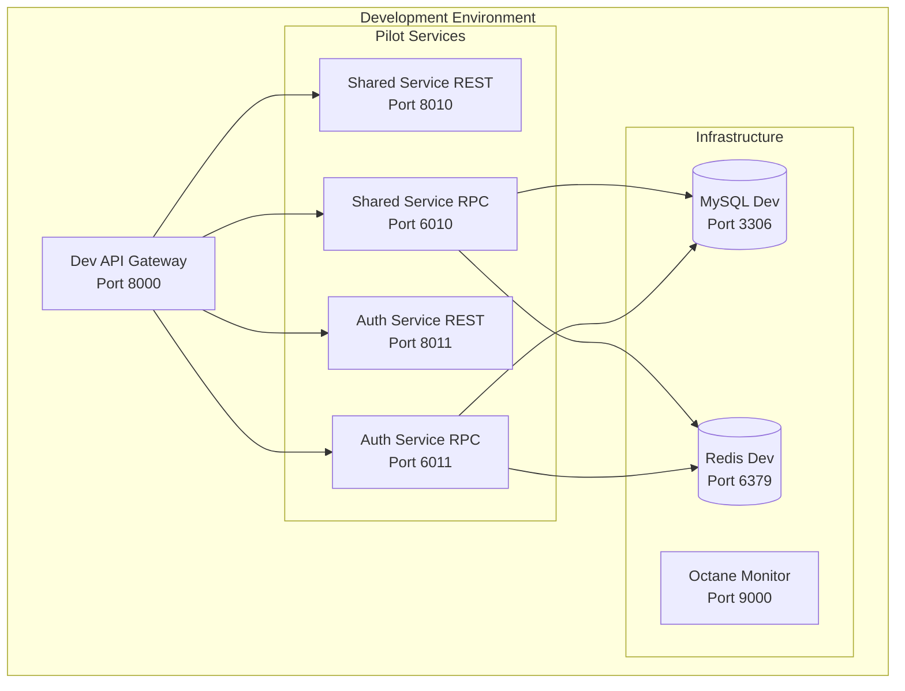

# 🚀 RPC Pilot Implementation Guide
## Proof of Concept with Shared Service & Auth Service

> **🎯 Objective**: Implement RPC transformation pilot with least critical services to validate performance improvements and ensure smooth Octane integration before full-scale deployment.

---

## 📋 Pilot Service Selection Strategy

### **Selected Pilot Services**

#### **1. Shared Service (Primary Pilot)**
- **Risk Level**: ⭐ VERY LOW
- **Complexity**: ⭐ LOW  
- **Dependencies**: None (utility functions)
- **Impact**: Minimal if issues occur
- **Benefits**: Perfect for testing RPC infrastructure

#### **2. Auth Service (Secondary Pilot)**
- **Risk Level**: ⭐⭐ LOW-MEDIUM
- **Complexity**: ⭐⭐ MEDIUM
- **Dependencies**: User Service (read-only)
- **Impact**: Controlled (can fallback to REST)
- **Benefits**: Tests authentication flow with RPC

### **Why These Services?**
- **Shared Service**: Contains utility functions, health checks, common procedures
- **Auth Service**: Critical but isolated, perfect for testing security with RPC
- **Low Risk**: Both services can easily fallback to REST if issues arise
- **High Learning Value**: Will validate RPC + Octane integration patterns

---

## 📊 Performance Baseline Establishment

### **Current Guzzle Performance Metrics Collection**

#### **Baseline Measurement Setup**
```php
<?php
// services/shared/app/Http/Middleware/PerformanceBaselineMiddleware.php

namespace App\Http\Middleware;

use Closure;
use Illuminate\Support\Facades\Log;
use Illuminate\Support\Facades\Cache;

class PerformanceBaselineMiddleware
{
    public function handle($request, Closure $next)
    {
        $startTime = microtime(true);
        $startMemory = memory_get_usage(true);
        
        $response = $next($request);
        
        $endTime = microtime(true);
        $endMemory = memory_get_usage(true);
        
        $metrics = [
            'service' => config('app.name'),
            'endpoint' => $request->path(),
            'method' => $request->method(),
            'response_time_ms' => round(($endTime - $startTime) * 1000, 2),
            'memory_usage_mb' => round(($endMemory - $startMemory) / 1024 / 1024, 2),
            'peak_memory_mb' => round(memory_get_peak_usage(true) / 1024 / 1024, 2),
            'status_code' => $response->status(),
            'timestamp' => now()->toISOString(),
        ];
        
        // Log metrics for analysis
        Log::channel('performance')->info('REST_BASELINE', $metrics);
        
        // Store in cache for dashboard
        $cacheKey = "baseline_metrics:" . date('Y-m-d-H');
        $cached = Cache::get($cacheKey, []);
        $cached[] = $metrics;
        Cache::put($cacheKey, $cached, 3600);
        
        return $response;
    }
}
```

#### **Guzzle HTTP Client Performance Tracking**
```php
<?php
// services/shared/app/Http/Clients/BaselineHttpClient.php

namespace App\Http\Clients;

use Illuminate\Support\Facades\Http;
use Illuminate\Support\Facades\Log;

class BaselineHttpClient
{
    public function post(string $url, array $data = []): array
    {
        $startTime = microtime(true);
        $startMemory = memory_get_usage(true);
        
        try {
            $response = Http::timeout(30)->post($url, $data);
            
            $endTime = microtime(true);
            $endMemory = memory_get_usage(true);
            
            $metrics = [
                'type' => 'guzzle_http_call',
                'url' => $url,
                'method' => 'POST',
                'response_time_ms' => round(($endTime - $startTime) * 1000, 2),
                'memory_usage_mb' => round(($endMemory - $startMemory) / 1024 / 1024, 2),
                'status_code' => $response->status(),
                'success' => $response->successful(),
                'timestamp' => now()->toISOString(),
            ];
            
            Log::channel('performance')->info('GUZZLE_BASELINE', $metrics);
            
            return [
                'success' => $response->successful(),
                'data' => $response->json(),
                'metrics' => $metrics,
            ];
            
        } catch (\Exception $e) {
            $endTime = microtime(true);
            
            $metrics = [
                'type' => 'guzzle_http_call',
                'url' => $url,
                'method' => 'POST',
                'response_time_ms' => round(($endTime - $startTime) * 1000, 2),
                'error' => $e->getMessage(),
                'success' => false,
                'timestamp' => now()->toISOString(),
            ];
            
            Log::channel('performance')->error('GUZZLE_BASELINE_ERROR', $metrics);
            
            throw $e;
        }
    }
}
```

### **Performance Metrics Dashboard**
```yaml
# deployment/monitoring/grafana/dashboards/baseline-performance.json
{
  "dashboard": {
    "title": "REST vs RPC Performance Baseline",
    "panels": [
      {
        "title": "Response Time Comparison",
        "type": "graph",
        "targets": [
          {
            "expr": "avg(rest_response_time_ms) by (service)",
            "legendFormat": "REST - {{service}}"
          },
          {
            "expr": "avg(rpc_response_time_ms) by (service)",
            "legendFormat": "RPC - {{service}}"
          }
        ]
      },
      {
        "title": "Memory Usage Comparison",
        "type": "graph",
        "targets": [
          {
            "expr": "avg(rest_memory_usage_mb) by (service)",
            "legendFormat": "REST Memory - {{service}}"
          },
          {
            "expr": "avg(rpc_memory_usage_mb) by (service)",
            "legendFormat": "RPC Memory - {{service}}"
          }
        ]
      },
      {
        "title": "Throughput Comparison",
        "type": "stat",
        "targets": [
          {
            "expr": "rate(rest_requests_total[5m])",
            "legendFormat": "REST RPS"
          },
          {
            "expr": "rate(rpc_requests_total[5m])",
            "legendFormat": "RPC RPS"
          }
        ]
      }
    ]
  }
}
```

---

## 🛠️ RPC Development Environment Setup

### **Development Environment Architecture**


### **Docker Compose Development Setup**
```yaml
# deployment/docker/docker-compose.pilot.yml
version: '3.8'

services:
  # Shared Service - REST & RPC
  shared-service-rest:
    build:
      context: ../../services/shared-service
      dockerfile: ../../deployment/docker/Dockerfile.rest
    ports:
      - "8010:8000"
    environment:
      - APP_NAME=shared-service-rest
      - APP_ENV=development
      - DB_HOST=mysql-dev
      - REDIS_HOST=redis-dev
    volumes:
      - ../../services/shared-service:/app
    networks:
      - pilot-network
    depends_on:
      - mysql-dev
      - redis-dev

  shared-service-rpc:
    build:
      context: ../../services/shared-service
      dockerfile: ../../deployment/docker/Dockerfile.rpc
    ports:
      - "6010:6010"
      - "8012:8000"  # HTTP health checks
    environment:
      - APP_NAME=shared-service-rpc
      - APP_ENV=development
      - OCTANE_SERVER=frankenphp
      - OCTANE_WORKERS=2
      - RPC_PORT=6010
      - RPC_HOST=0.0.0.0
      - DB_HOST=mysql-dev
      - REDIS_HOST=redis-dev
    volumes:
      - ../../services/shared-service:/app
    networks:
      - pilot-network
    depends_on:
      - mysql-dev
      - redis-dev

  # Auth Service - REST & RPC
  auth-service-rest:
    build:
      context: ../../services/auth-service
      dockerfile: ../../deployment/docker/Dockerfile.rest
    ports:
      - "8011:8000"
    environment:
      - APP_NAME=auth-service-rest
      - APP_ENV=development
      - DB_HOST=mysql-dev
      - REDIS_HOST=redis-dev
    volumes:
      - ../../services/auth-service:/app
    networks:
      - pilot-network
    depends_on:
      - mysql-dev
      - redis-dev

  auth-service-rpc:
    build:
      context: ../../services/auth-service
      dockerfile: ../../deployment/docker/Dockerfile.rpc
    ports:
      - "6011:6011"
      - "8013:8000"  # HTTP health checks
    environment:
      - APP_NAME=auth-service-rpc
      - APP_ENV=development
      - OCTANE_SERVER=frankenphp
      - OCTANE_WORKERS=2
      - RPC_PORT=6011
      - RPC_HOST=0.0.0.0
      - DB_HOST=mysql-dev
      - REDIS_HOST=redis-dev
    volumes:
      - ../../services/auth-service:/app
    networks:
      - pilot-network
    depends_on:
      - mysql-dev
      - redis-dev

  # Infrastructure
  mysql-dev:
    image: mysql:8.0
    ports:
      - "3306:3306"
    environment:
      - MYSQL_ROOT_PASSWORD=pilot123
      - MYSQL_DATABASE=reversetender_pilot
    volumes:
      - mysql_pilot_data:/var/lib/mysql
    networks:
      - pilot-network

  redis-dev:
    image: redis:7-alpine
    ports:
      - "6379:6379"
    volumes:
      - redis_pilot_data:/data
    networks:
      - pilot-network

  # Monitoring
  octane-monitor:
    image: grafana/grafana:latest
    ports:
      - "9000:3000"
    environment:
      - GF_SECURITY_ADMIN_PASSWORD=pilot123
    volumes:
      - grafana_pilot_data:/var/lib/grafana
      - ./monitoring/grafana/dashboards:/etc/grafana/provisioning/dashboards
    networks:
      - pilot-network

volumes:
  mysql_pilot_data:
  redis_pilot_data:
  grafana_pilot_data:

networks:
  pilot-network:
    driver: bridge
```

---

## 🔧 Shared Service RPC Implementation

### **Shared Service Structure**
```
services/shared-service/
├── app/
│   ├── RPC/
│   │   ├── BaseProcedure.php
│   │   └── Procedures/
│   │       ├── HealthProcedure.php
│   │       ├── UtilityProcedure.php
│   │       └── CacheProcedure.php
│   ├── Services/
│   │   ├── HealthService.php
│   │   ├── UtilityService.php
│   │   └── CacheService.php
│   └── Http/
│       └── Controllers/
│           └── HealthController.php (REST fallback)
├── config/
│   ├── octane.php
│   └── rpc.php
└── routes/
    ├── api.php (REST routes)
    └── rpc.php (RPC routes)
```

### **Base Procedure Implementation**
```php
<?php
// services/shared-service/app/RPC/BaseProcedure.php

namespace App\RPC;

use Sajya\Server\Procedure;
use Illuminate\Support\Facades\Validator;
use Sajya\Server\Exceptions\RuntimeException;
use Illuminate\Support\Facades\Log;

abstract class BaseProcedure extends Procedure
{
    /**
     * Validate request parameters
     */
    protected function validate(array $data, array $rules): void
    {
        $validator = Validator::make($data, $rules);
        
        if ($validator->fails()) {
            throw new RuntimeException(
                'Invalid parameters',
                -32602,
                $validator->errors()->toArray()
            );
        }
    }

    /**
     * Get correlation ID from request
     */
    protected function getCorrelationId(): string
    {
        return request()->header('X-Correlation-ID', uniqid('rpc_', true));
    }

    /**
     * Log RPC performance metrics
     */
    protected function logPerformance(string $method, array $params, mixed $result, float $startTime): void
    {
        $endTime = microtime(true);
        $metrics = [
            'type' => 'rpc_call',
            'service' => 'shared-service',
            'method' => $method,
            'correlation_id' => $this->getCorrelationId(),
            'response_time_ms' => round(($endTime - $startTime) * 1000, 2),
            'memory_usage_mb' => round(memory_get_usage(true) / 1024 / 1024, 2),
            'peak_memory_mb' => round(memory_get_peak_usage(true) / 1024 / 1024, 2),
            'params_count' => count($params),
            'success' => !is_null($result),
            'timestamp' => now()->toISOString(),
        ];
        
        Log::channel('performance')->info('RPC_PERFORMANCE', $metrics);
    }
}
```

### **Health Procedure Implementation**
```php
<?php
// services/shared-service/app/RPC/Procedures/HealthProcedure.php

namespace App\RPC\Procedures;

use App\RPC\BaseProcedure;
use Illuminate\Support\Facades\DB;
use Illuminate\Support\Facades\Redis;
use Illuminate\Support\Facades\Cache;

class HealthProcedure extends BaseProcedure
{
    /**
     * Basic health ping
     */
    public function ping(): array
    {
        $startTime = microtime(true);
        
        $result = [
            'status' => 'healthy',
            'service' => 'shared-service',
            'version' => config('app.version', '1.0.0'),
            'timestamp' => now()->toISOString(),
            'octane_enabled' => config('octane.server') !== null,
        ];
        
        $this->logPerformance('Health@ping', [], $result, $startTime);
        
        return $result;
    }

    /**
     * Comprehensive health check
     */
    public function check(): array
    {
        $startTime = microtime(true);
        
        $checks = [
            'database' => $this->checkDatabase(),
            'redis' => $this->checkRedis(),
            'cache' => $this->checkCache(),
            'memory' => $this->checkMemory(),
            'octane' => $this->checkOctane(),
        ];

        $overallStatus = collect($checks)->every(fn($check) => $check['status'] === 'healthy')
            ? 'healthy'
            : 'degraded';

        $result = [
            'status' => $overallStatus,
            'checks' => $checks,
            'timestamp' => now()->toISOString(),
            'uptime' => $this->getUptime(),
        ];
        
        $this->logPerformance('Health@check', [], $result, $startTime);
        
        return $result;
    }

    private function checkDatabase(): array
    {
        try {
            DB::connection()->getPdo();
            return ['status' => 'healthy', 'message' => 'Database connection successful'];
        } catch (\Exception $e) {
            return ['status' => 'unhealthy', 'message' => $e->getMessage()];
        }
    }

    private function checkRedis(): array
    {
        try {
            Redis::ping();
            return ['status' => 'healthy', 'message' => 'Redis connection successful'];
        } catch (\Exception $e) {
            return ['status' => 'unhealthy', 'message' => $e->getMessage()];
        }
    }

    private function checkCache(): array
    {
        try {
            $testKey = 'health_check_' . time();
            Cache::put($testKey, 'test', 10);
            $value = Cache::get($testKey);
            Cache::forget($testKey);
            
            return $value === 'test' 
                ? ['status' => 'healthy', 'message' => 'Cache working correctly']
                : ['status' => 'unhealthy', 'message' => 'Cache read/write failed'];
        } catch (\Exception $e) {
            return ['status' => 'unhealthy', 'message' => $e->getMessage()];
        }
    }

    private function checkMemory(): array
    {
        $memoryUsage = memory_get_usage(true);
        $memoryLimit = $this->parseBytes(ini_get('memory_limit'));
        $percentage = ($memoryUsage / $memoryLimit) * 100;

        return [
            'status' => $percentage < 80 ? 'healthy' : 'warning',
            'usage' => $this->formatBytes($memoryUsage),
            'limit' => $this->formatBytes($memoryLimit),
            'percentage' => round($percentage, 2),
        ];
    }

    private function checkOctane(): array
    {
        $octaneEnabled = config('octane.server') !== null;
        $workers = config('octane.workers', 0);
        
        return [
            'status' => $octaneEnabled ? 'healthy' : 'disabled',
            'enabled' => $octaneEnabled,
            'server' => config('octane.server', 'none'),
            'workers' => $workers,
            'max_requests' => config('octane.max_requests', 0),
        ];
    }

    private function getUptime(): string
    {
        if (file_exists('/proc/uptime')) {
            $uptime = file_get_contents('/proc/uptime');
            $seconds = (int) explode(' ', $uptime)[0];
            return gmdate('H:i:s', $seconds);
        }
        
        return 'unknown';
    }

    private function parseBytes(string $size): int
    {
        $unit = preg_replace('/[^bkmgtpezy]/i', '', $size);
        $size = preg_replace('/[^0-9\.]/', '', $size);
        
        if ($unit) {
            return round($size * pow(1024, stripos('bkmgtpezy', $unit[0])));
        }
        
        return round($size);
    }

    private function formatBytes(int $bytes, int $precision = 2): string
    {
        $units = ['B', 'KB', 'MB', 'GB', 'TB', 'PB'];
        
        for ($i = 0; $bytes > 1024 && $i < count($units) - 1; $i++) {
            $bytes /= 1024;
        }
        
        return round($bytes, $precision) . ' ' . $units[$i];
    }
}
```

### **Utility Procedure Implementation**
```php
<?php
// services/shared-service/app/RPC/Procedures/UtilityProcedure.php

namespace App\RPC\Procedures;

use App\RPC\BaseProcedure;
use Illuminate\Support\Str;
use Illuminate\Support\Facades\Hash;

class UtilityProcedure extends BaseProcedure
{
    /**
     * Generate UUID
     */
    public function generateUuid(): array
    {
        $startTime = microtime(true);
        
        $result = [
            'uuid' => Str::uuid()->toString(),
            'generated_at' => now()->toISOString(),
        ];
        
        $this->logPerformance('Utility@generateUuid', [], $result, $startTime);
        
        return $result;
    }

    /**
     * Hash password
     */
    public function hashPassword(array $params): array
    {
        $startTime = microtime(true);
        
        $this->validate($params, [
            'password' => 'required|string|min:8',
        ]);

        $result = [
            'hash' => Hash::make($params['password']),
            'algorithm' => 'bcrypt',
            'generated_at' => now()->toISOString(),
        ];
        
        $this->logPerformance('Utility@hashPassword', $params, $result, $startTime);
        
        return $result;
    }

    /**
     * Verify password hash
     */
    public function verifyPassword(array $params): array
    {
        $startTime = microtime(true);
        
        $this->validate($params, [
            'password' => 'required|string',
            'hash' => 'required|string',
        ]);

        $isValid = Hash::check($params['password'], $params['hash']);
        
        $result = [
            'valid' => $isValid,
            'verified_at' => now()->toISOString(),
        ];
        
        $this->logPerformance('Utility@verifyPassword', $params, $result, $startTime);
        
        return $result;
    }

    /**
     * Generate random string
     */
    public function generateRandomString(array $params): array
    {
        $startTime = microtime(true);
        
        $this->validate($params, [
            'length' => 'required|integer|min:1|max:255',
            'type' => 'sometimes|string|in:alphanumeric,alphabetic,numeric,mixed',
        ]);

        $type = $params['type'] ?? 'alphanumeric';
        $length = $params['length'];
        
        $result = [
            'string' => $this->generateString($length, $type),
            'length' => $length,
            'type' => $type,
            'generated_at' => now()->toISOString(),
        ];
        
        $this->logPerformance('Utility@generateRandomString', $params, $result, $startTime);
        
        return $result;
    }

    private function generateString(int $length, string $type): string
    {
        $characters = match($type) {
            'alphabetic' => 'abcdefghijklmnopqrstuvwxyzABCDEFGHIJKLMNOPQRSTUVWXYZ',
            'numeric' => '0123456789',
            'alphanumeric' => 'abcdefghijklmnopqrstuvwxyzABCDEFGHIJKLMNOPQRSTUVWXYZ0123456789',
            'mixed' => 'abcdefghijklmnopqrstuvwxyzABCDEFGHIJKLMNOPQRSTUVWXYZ0123456789!@#$%^&*',
            default => 'abcdefghijklmnopqrstuvwxyzABCDEFGHIJKLMNOPQRSTUVWXYZ0123456789',
        };
        
        return substr(str_shuffle(str_repeat($characters, ceil($length / strlen($characters)))), 0, $length);
    }
}
```

---

## 🔐 Auth Service RPC Implementation

### **Auth Service Structure**
```
services/auth-service/
├── app/
│   ├── RPC/
│   │   ├── BaseProcedure.php (extends shared)
│   │   └── Procedures/
│   │       ├── AuthProcedure.php
│   │       ├── TokenProcedure.php
│   │       └── HealthProcedure.php
│   ├── Services/
│   │   ├── AuthService.php
│   │   └── TokenService.php
│   └── Http/
│       └── Controllers/
│           └── AuthController.php (REST fallback)
├── config/
│   ├── octane.php
│   └── rpc.php
└── routes/
    ├── api.php (REST routes)
    └── rpc.php (RPC routes)
```

### **Auth Procedure Implementation**
```php
<?php
// services/auth-service/app/RPC/Procedures/AuthProcedure.php

namespace App\RPC\Procedures;

use App\RPC\BaseProcedure;
use App\Services\AuthService;
use Illuminate\Support\Facades\Hash;
use Illuminate\Support\Facades\Cache;
use Sajya\Server\Exceptions\RuntimeException;

class AuthProcedure extends BaseProcedure
{
    public function __construct(
        private AuthService $authService
    ) {}

    /**
     * Authenticate user credentials
     */
    public function authenticate(array $params): array
    {
        $startTime = microtime(true);
        
        $this->validate($params, [
            'email' => 'required|email',
            'password' => 'required|string',
            'remember' => 'sometimes|boolean',
        ]);

        try {
            $result = $this->authService->authenticate(
                $params['email'],
                $params['password'],
                $params['remember'] ?? false
            );
            
            $this->logPerformance('Auth@authenticate', $params, $result, $startTime);
            
            return $result;
            
        } catch (\Exception $e) {
            throw new RuntimeException(
                'Authentication failed: ' . $e->getMessage(),
                -32001,
                ['email' => $params['email']]
            );
        }
    }

    /**
     * Verify JWT token
     */
    public function verifyToken(array $params): array
    {
        $startTime = microtime(true);
        
        $this->validate($params, [
            'token' => 'required|string',
        ]);

        // Check cache first for performance
        $cacheKey = 'token_verification:' . hash('sha256', $params['token']);
        $cached = Cache::get($cacheKey);
        
        if ($cached !== null) {
            $this->logPerformance('Auth@verifyToken', $params, $cached, $startTime);
            return $cached;
        }

        try {
            $result = $this->authService->verifyToken($params['token']);
            
            // Cache valid tokens for 5 minutes
            if ($result['valid']) {
                Cache::put($cacheKey, $result, 300);
            }
            
            $this->logPerformance('Auth@verifyToken', $params, $result, $startTime);
            
            return $result;
            
        } catch (\Exception $e) {
            throw new RuntimeException(
                'Token verification failed: ' . $e->getMessage(),
                -32002,
                ['token_hash' => hash('sha256', $params['token'])]
            );
        }
    }

    /**
     * Refresh JWT token
     */
    public function refreshToken(array $params): array
    {
        $startTime = microtime(true);
        
        $this->validate($params, [
            'refresh_token' => 'required|string',
        ]);

        try {
            $result = $this->authService->refreshToken($params['refresh_token']);
            
            $this->logPerformance('Auth@refreshToken', $params, $result, $startTime);
            
            return $result;
            
        } catch (\Exception $e) {
            throw new RuntimeException(
                'Token refresh failed: ' . $e->getMessage(),
                -32003,
                ['refresh_token_hash' => hash('sha256', $params['refresh_token'])]
            );
        }
    }

    /**
     * Logout user (invalidate token)
     */
    public function logout(array $params): array
    {
        $startTime = microtime(true);
        
        $this->validate($params, [
            'token' => 'required|string',
        ]);

        try {
            $result = $this->authService->logout($params['token']);
            
            // Clear token from cache
            $cacheKey = 'token_verification:' . hash('sha256', $params['token']);
            Cache::forget($cacheKey);
            
            $this->logPerformance('Auth@logout', $params, $result, $startTime);
            
            return $result;
            
        } catch (\Exception $e) {
            throw new RuntimeException(
                'Logout failed: ' . $e->getMessage(),
                -32004,
                ['token_hash' => hash('sha256', $params['token'])]
            );
        }
    }
}
```

---

## 🧪 Octane Integration Testing

### **Octane Configuration for Pilot Services**
```php
<?php
// services/shared-service/config/octane.php

return [
    'server' => env('OCTANE_SERVER', 'frankenphp'),
    'https' => env('OCTANE_HTTPS', false),
    'workers' => env('OCTANE_WORKERS', 2),
    'task_workers' => env('OCTANE_TASK_WORKERS', 4),
    'max_requests' => env('OCTANE_MAX_REQUESTS', 500),

    // RPC-specific configuration
    'rpc' => [
        'host' => env('OCTANE_RPC_HOST', '127.0.0.1'),
        'port' => env('OCTANE_RPC_PORT', 6010),
        'timeout' => env('OCTANE_RPC_TIMEOUT', 30),
    ],

    // Warm-up procedures for better performance
    'warm' => [
        'procedures' => [
            \App\RPC\Procedures\HealthProcedure::class,
            \App\RPC\Procedures\UtilityProcedure::class,
        ],
    ],

    // Memory optimization
    'cache' => [
        'procedures' => true,
        'routes' => true,
        'config' => true,
    ],

    // Listeners for cleanup
    'listeners' => [
        WorkerStarting::class => [
            EnsureUploadedFilesAreValid::class,
            EnsureUploadedFilesCanBeMoved::class,
        ],
        RequestReceived::class => [
            // Custom request received listeners
        ],
        RequestHandled::class => [
            FlushTemporaryContainerInstances::class,
        ],
        RequestTerminated::class => [
            // Custom cleanup listeners
        ],
        TaskReceived::class => [
            // Task handling listeners
        ],
        TaskTerminated::class => [
            // Task cleanup listeners
        ],
        TickReceived::class => [
            // Periodic task listeners
        ],
        TickTerminated::class => [
            // Periodic cleanup listeners
        ],
        WorkerErrorOccurred::class => [
            ReportException::class,
            StopWorkerIfNecessary::class,
        ],
        WorkerStopping::class => [
            // Worker cleanup listeners
        ],
    ],
];
```

### **RPC Routes Configuration**
```php
<?php
// services/shared-service/routes/rpc.php

use Sajya\Server\Route;
use App\RPC\Procedures\HealthProcedure;
use App\RPC\Procedures\UtilityProcedure;

Route::rpc('/', [
    HealthProcedure::class,
    UtilityProcedure::class,
])->middleware(['rpc.correlation', 'rpc.performance']);
```

```php
<?php
// services/auth-service/routes/rpc.php

use Sajya\Server\Route;
use App\RPC\Procedures\AuthProcedure;
use App\RPC\Procedures\TokenProcedure;
use App\RPC\Procedures\HealthProcedure;

Route::rpc('/', [
    AuthProcedure::class,
    TokenProcedure::class,
    HealthProcedure::class,
])->middleware(['rpc.correlation', 'rpc.performance']);
```

---

## 🔬 Performance Testing & Validation

### **Load Testing Script**
```bash
#!/bin/bash
# deployment/scripts/pilot-load-test.sh

echo "🚀 Starting RPC Pilot Load Testing"

# Test Shared Service Health Check
echo "Testing Shared Service Health Check..."
echo "REST Endpoint:"
ab -n 1000 -c 10 http://localhost:8010/api/health

echo "RPC Endpoint:"
# Custom RPC load test script
node deployment/scripts/rpc-load-test.js http://localhost:6010 Health ping 1000 10

# Test Auth Service Authentication
echo "Testing Auth Service Authentication..."
echo "REST Endpoint:"
ab -n 500 -c 5 -p auth-test-data.json -T application/json http://localhost:8011/api/auth/login

echo "RPC Endpoint:"
node deployment/scripts/rpc-load-test.js http://localhost:6011 Auth authenticate 500 5

echo "📊 Load testing completed. Check Grafana dashboard at http://localhost:9000"
```

### **RPC Load Testing Script**
```javascript
// deployment/scripts/rpc-load-test.js
const axios = require('axios');

async function rpcLoadTest(url, method, procedure, requests, concurrency) {
    console.log(`Testing RPC ${method}@${procedure} - ${requests} requests with ${concurrency} concurrency`);
    
    const startTime = Date.now();
    const promises = [];
    
    for (let i = 0; i < requests; i++) {
        const promise = axios.post(url, {
            jsonrpc: '2.0',
            method: `${method}@${procedure}`,
            params: {},
            id: i
        }).catch(err => ({ error: err.message }));
        
        promises.push(promise);
        
        // Control concurrency
        if (promises.length >= concurrency) {
            await Promise.all(promises.splice(0, concurrency));
        }
    }
    
    // Wait for remaining requests
    await Promise.all(promises);
    
    const endTime = Date.now();
    const totalTime = endTime - startTime;
    const rps = Math.round((requests / totalTime) * 1000);
    
    console.log(`Completed ${requests} requests in ${totalTime}ms (${rps} RPS)`);
}

// Run test
const [url, method, procedure, requests, concurrency] = process.argv.slice(2);
rpcLoadTest(url, method, procedure, parseInt(requests), parseInt(concurrency));
```

---

## 📋 Pilot Implementation Checklist

### **Phase 1: Environment Setup (Week 1)**
- [ ] Set up Docker development environment
- [ ] Configure MySQL and Redis for pilot services
- [ ] Set up Grafana monitoring dashboard
- [ ] Install and configure Laravel Octane on pilot services
- [ ] Verify FrankenPHP server functionality

### **Phase 2: Shared Service Implementation (Week 2)**
- [ ] Implement BaseProcedure class with performance logging
- [ ] Create HealthProcedure with comprehensive checks
- [ ] Implement UtilityProcedure with common functions
- [ ] Set up RPC routes and middleware
- [ ] Configure Octane with RPC procedures
- [ ] Test REST vs RPC performance baseline

### **Phase 3: Auth Service Implementation (Week 3)**
- [ ] Implement AuthProcedure with authentication logic
- [ ] Add token verification and refresh procedures
- [ ] Implement caching for token verification
- [ ] Set up circuit breaker for fallback to REST
- [ ] Test authentication flow with RPC
- [ ] Validate security with RPC communication

### **Phase 4: Performance Validation (Week 4)**
- [ ] Run comprehensive load testing
- [ ] Compare REST vs RPC performance metrics
- [ ] Validate Octane memory persistence benefits
- [ ] Test concurrent request handling
- [ ] Verify error handling and logging
- [ ] Document performance improvements

### **Success Criteria**
- **Performance**: 40-60% improvement in response times
- **Memory**: 30-50% reduction in memory usage per request
- **Throughput**: 2x increase in requests per second
- **Reliability**: 99.9% success rate for RPC calls
- **Octane Integration**: Smooth operation with persistent memory

---

*This pilot implementation provides a solid foundation for validating RPC transformation benefits before full-scale deployment across all microservices.*
