# 🚀 خطة التنفيذ الشاملة | منصة وساطة قطع غيار السيارات

## 📋 نظرة عامة على المشروع

```yaml
اسم_المشروع: "منصة المناقصة العكسية لقطع الغيار"
النوع: PWA + Laravel Microservices
المدة_المتوقعة: 18 أسبوع (4.5 شهر)
الميزانية: 28,000 ريال سعودي
عدد_المراحل: 5 مراحل رئيسية
```

---

## 🏗️ البنية المعمارية (System Architecture)

### 📊 Microservices Architecture Overview

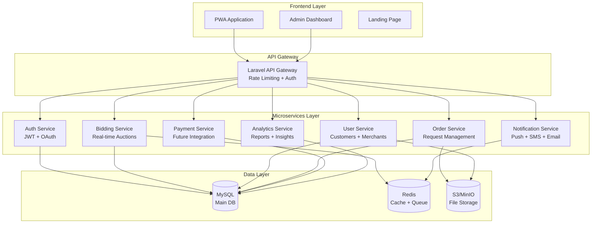

---

## 📊 Business Model & Process Diagrams

### 💼 Business Model Canvas

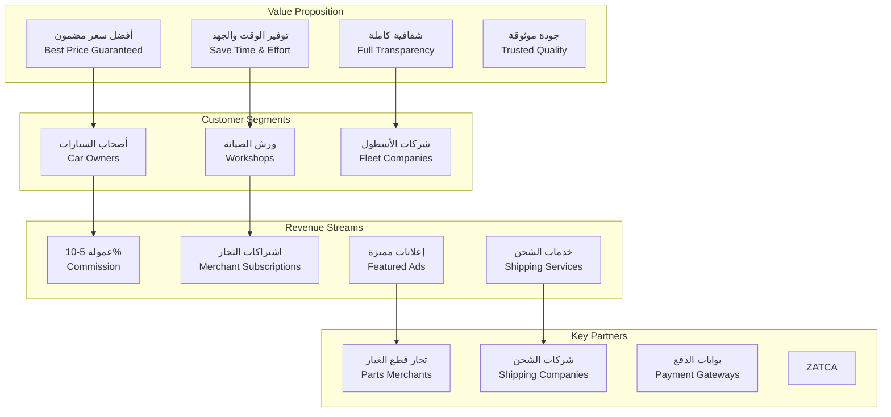

### 🔄 Business Process Flow

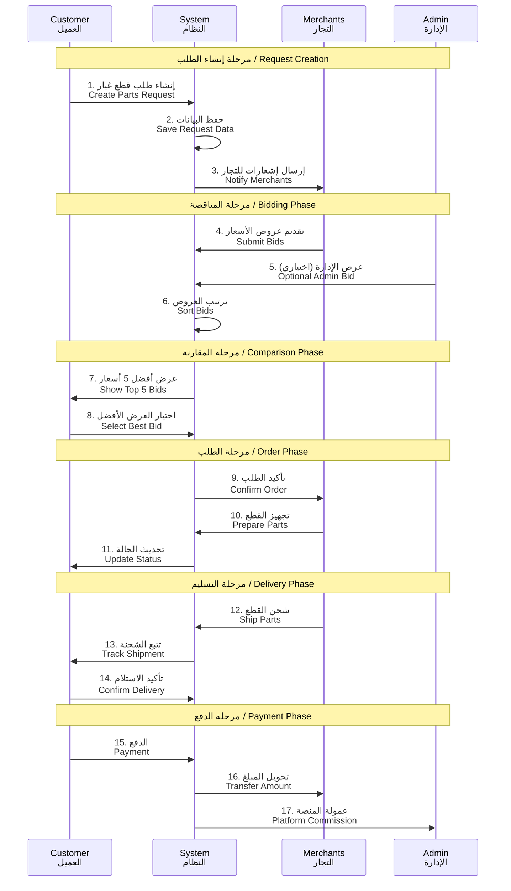

### 📈 Revenue Model Breakdown

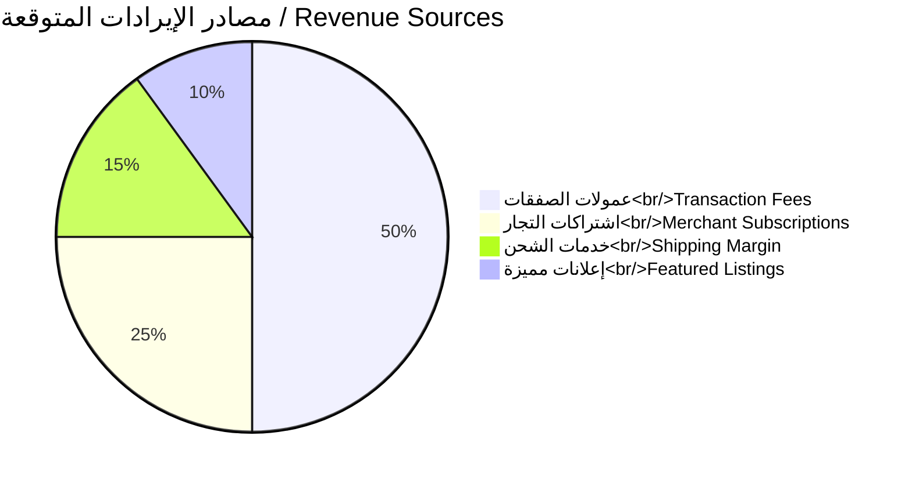

### 🎯 Customer Journey Map

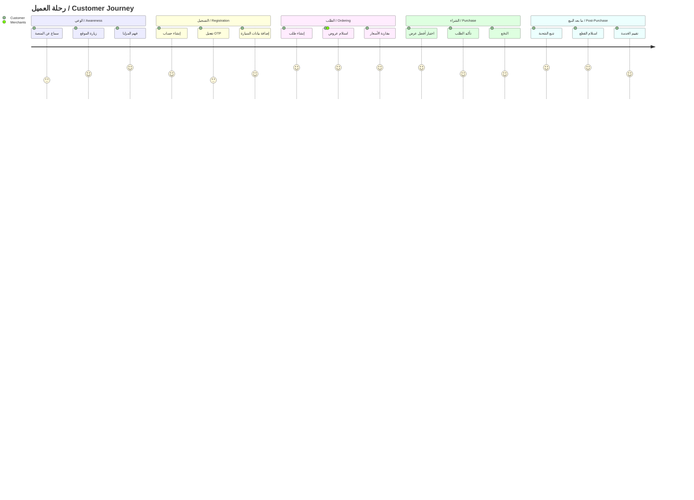

---

## 🏗️ System Architecture Diagrams

### 🔐 Authentication Flow

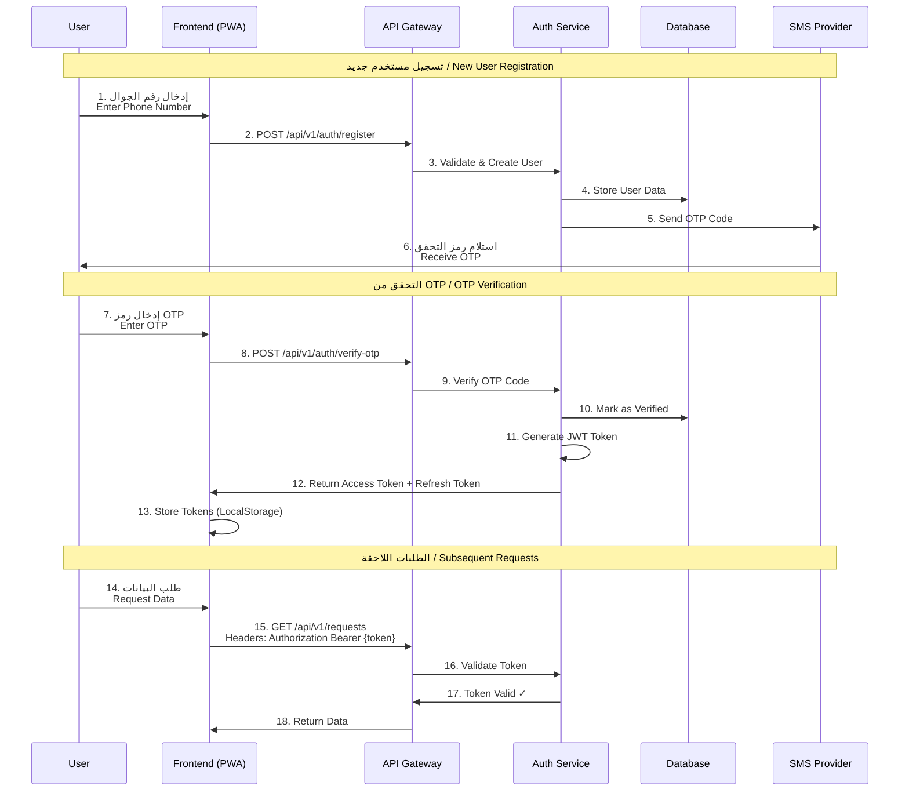

### 🎯 Bidding System Flow

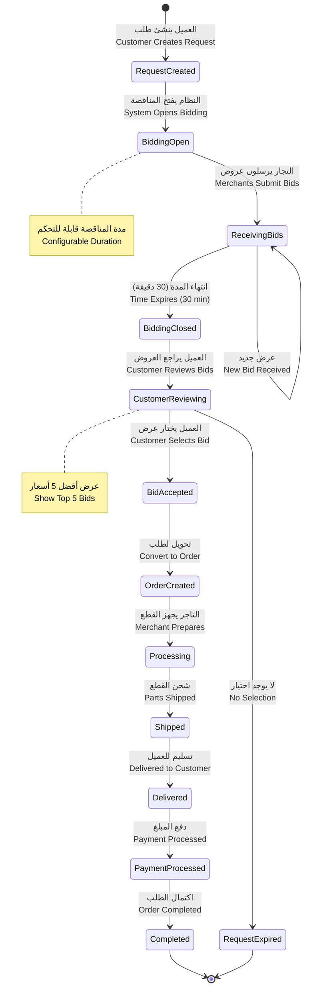

### 📡 Real-time Notification Architecture

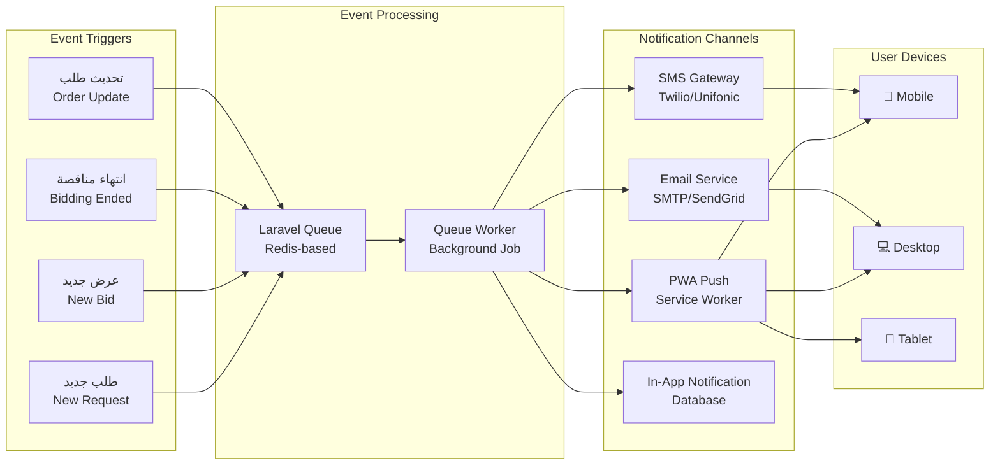

### 🗄️ Enhanced Database Schema

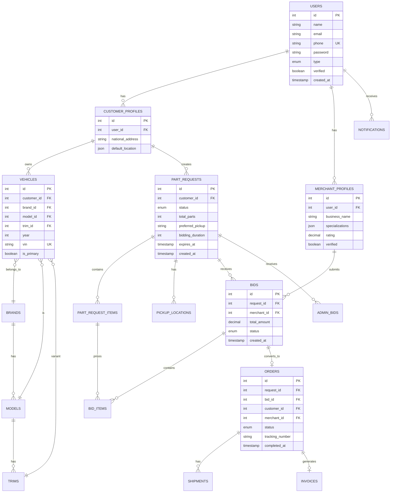

### 🔄 Data Flow Diagram (DFD)

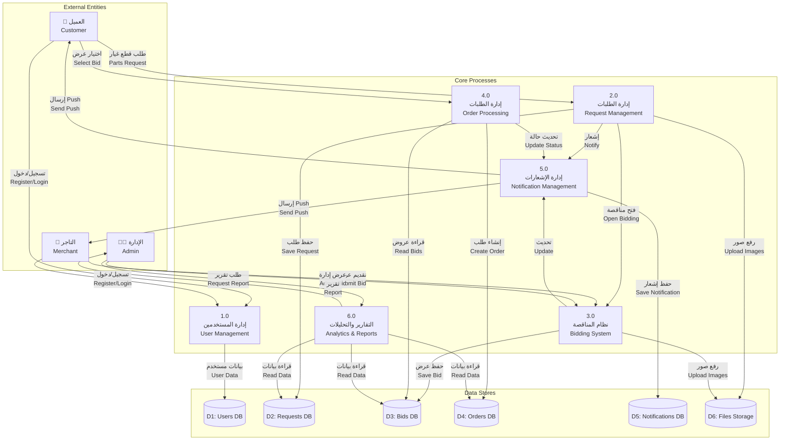

### 🏃 Deployment Architecture

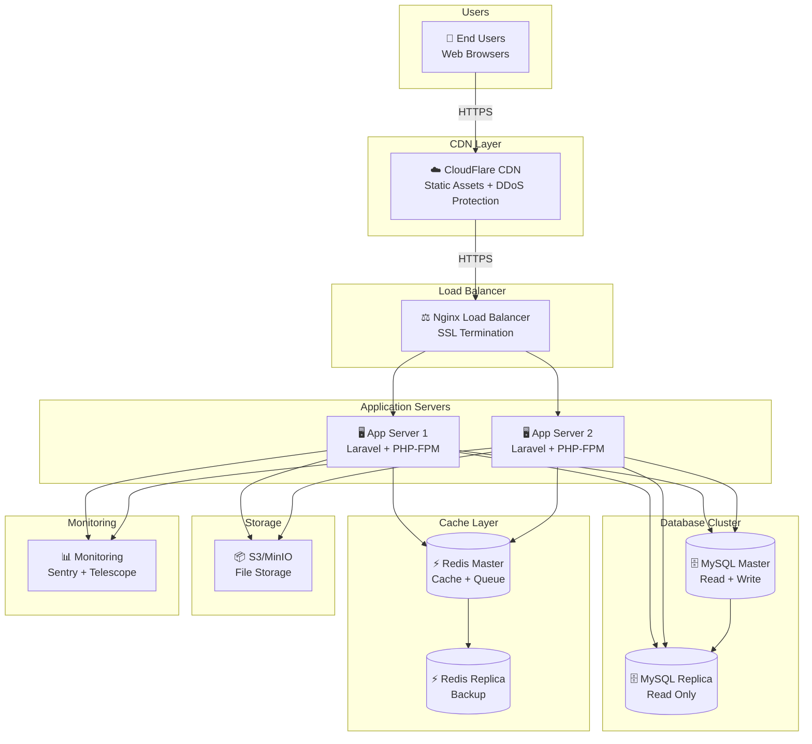

### 📱 PWA Architecture

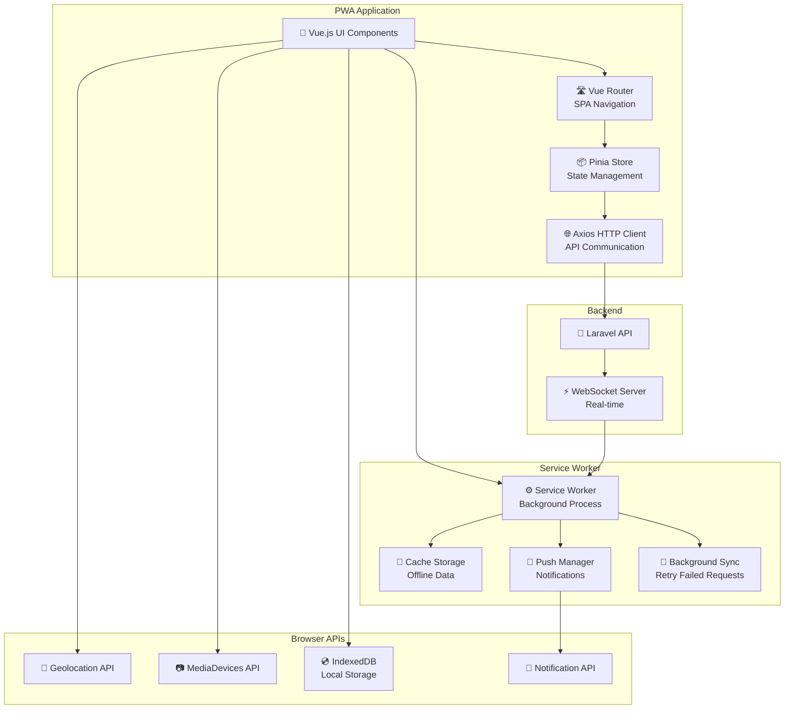

---

## 🛠️ Tech Stack المثالي

### **Backend Architecture**

| المكون | التقنية | السبب |
|--------|---------|-------|
| **Framework** | Laravel 11.x | Modular, Robust, Saudi Market Standard |
| **API Style** | RESTful + GraphQL (optional) | Flexibility + Performance |
| **Database** | MySQL 8.0 | ACID Compliance, Proven Reliability |
| **Cache** | Redis 7.x | Real-time Bidding + Session Management |
| **Queue** | Laravel Queue (Redis) | Background Jobs + Notifications |
| **File Storage** | AWS S3 / MinIO | Scalable Image Storage |
| **Search** | Laravel Scout + Meilisearch | Fast Part Search |
| **Authentication** | Laravel Sanctum + JWT | Stateless API Auth |
| **Real-time** | Laravel Reverb / Pusher | Live Bidding Updates |
| **API Documentation** | Scribe / Swagger | Auto-generated Docs |

### **Frontend Architecture**

| المكون | التقنية | السبب |
|--------|---------|-------|
| **Framework** | Vue.js 3 + Composition API | Lightweight, Progressive |
| **UI Library** | Vuetify 3 / PrimeVue | Material Design, RTL Support |
| **State Management** | Pinia | Modern Vuex Alternative |
| **Build Tool** | Vite | Lightning Fast HMR |
| **PWA Plugin** | Vite PWA Plugin | Service Worker Management |
| **HTTP Client** | Axios + Interceptors | API Communication |
| **Forms** | VeeValidate + Yup | Robust Validation |
| **Charts** | Chart.js / ApexCharts | Analytics Visualization |
| **Maps** | Google Maps JS API | Location Picking |
| **Animations** | Lottie + GSAP | Smooth Transitions |
| **Icons** | Material Design Icons | Comprehensive Icon Set |

### **DevOps & Infrastructure**

| المكون | التقنية | السبب |
|--------|---------|-------|
| **Version Control** | Git + GitHub/GitLab | Industry Standard |
| **CI/CD** | GitHub Actions | Automated Testing + Deployment |
| **Containerization** | Docker + Docker Compose | Consistent Environment |
| **Hosting** | DigitalOcean / AWS | Scalable Cloud Hosting |
| **CDN** | CloudFlare | Fast Content Delivery |
| **Monitoring** | Laravel Telescope + Sentry | Error Tracking + Performance |
| **Logging** | Monolog + ELK Stack (future) | Centralized Logging |
| **SSL** | Let's Encrypt | Free HTTPS |
| **Server** | Nginx + PHP-FPM 8.2 | High Performance |

### **Development Tools**

| المكون | التقنية | السبب |
|--------|---------|-------|
| **IDE** | VS Code + Extensions | Lightweight, Powerful |
| **API Testing** | Postman + Newman | Comprehensive API Testing |
| **Database Client** | TablePlus / DBeaver | Visual DB Management |
| **Code Quality** | PHPStan + Laravel Pint | Static Analysis + Formatting |
| **Testing** | PHPUnit + Pest | Unit + Feature Testing |
| **Documentation** | Markdown + Docsify | Simple, Beautiful Docs |

---

## 📐 Database Schema Design

### **Core Entities ERD**

```sql
-- Users & Authentication
users (id, name, email, phone, password, type[customer/merchant/admin], status, created_at)
merchant_profiles (id, user_id, business_name, specializations[], rating, verified)
customer_profiles (id, user_id, national_address, default_location)

-- Vehicle Data
vehicles (id, customer_id, brand, model, trim, year, vin, is_primary)
brands (id, name_ar, name_en, logo)
models (id, brand_id, name_ar, name_en)
trims (id, model_id, name_ar, name_en, year_range)

-- Parts & Requests
part_requests (id, customer_id, status, total_parts, preferred_pickup, bidding_duration, created_at)
part_request_items (id, request_id, part_name, vehicle_id, quantity, notes)
pickup_locations (id, request_id, type[workshop/home/national], address, lat, lng)

-- Bidding System
bids (id, request_id, merchant_id, total_amount, status[pending/accepted/rejected], created_at)
bid_items (id, bid_id, request_item_id, part_number, price, image_url, condition[original/commercial/salvage])

-- Admin Bids
admin_bids (id, request_id, admin_id, total_amount, notes)

-- Orders & Shipping
orders (id, request_id, bid_id, customer_id, merchant_id, status, tracking_number)
shipments (id, order_id, type[express/local/international], estimated_delivery, actual_delivery)

-- Notifications
notifications (id, user_id, type, title, body, read_at, data_json)

-- Future: ZATCA Integration
invoices (id, order_id, invoice_number, qr_code, zatca_uuid, xml_hash, issued_at)
```

### **Indexing Strategy**

```sql
-- Performance Optimization Indexes
CREATE INDEX idx_requests_status_created ON part_requests(status, created_at);
CREATE INDEX idx_bids_request_merchant ON bids(request_id, merchant_id);
CREATE INDEX idx_merchant_specializations ON merchant_profiles USING GIN(specializations);
CREATE INDEX idx_vehicles_customer_brand ON vehicles(customer_id, brand);
CREATE INDEX idx_notifications_user_read ON notifications(user_id, read_at);
```

---

## 🔄 خطة التنفيذ المفصلة

### **المرحلة 1️⃣: التخطيط والتصميم (5 أسابيع)**

#### **الأسبوع 1-2: تحليل المتطلبات والتخطيط**

```yaml
المهام:
  - مراجعة متطلبات المشروع بالتفصيل
  - إعداد مخططات User Stories و Use Cases
  - تصميم Database Schema النهائي
  - تحديد API Endpoints (RESTful Structure)
  - إعداد بيئة التطوير (Docker Setup)
  
المخرجات:
  - ✅ ERD Diagram (Database Structure)
  - ✅ API Documentation Draft (Swagger)
  - ✅ User Flow Diagrams
  - ✅ Technical Architecture Document
  - ✅ Development Environment Ready
```

#### **الأسبوع 3-5: تصميم UI/UX**

```yaml
المهام:
  - إنشاء Wireframes لجميع الشاشات
  - تصميم High-Fidelity Mockups
  - تصميم Splash Screen Animation (Lottie)
  - إعداد Design System (Colors, Typography, Components)
  - مراجعة والحصول على موافقة العميل
  
المخرجات:
  - ✅ Figma/Adobe XD Designs (50+ Screens)
  - ✅ Design System Documentation
  - ✅ Splash Screen Animation (JSON)
  - ✅ Icon Set و Assets
  - ✅ Client Approval Document
```

---

### **المرحلة 2️⃣: تطوير Backend (4 أسابيع)**

#### **الأسبوع 6-7: Core Backend Setup**

```yaml
المهام:
  - إعداد Laravel Project (Modular Structure)
  - تطبيق Database Migrations
  - إعداد Authentication (Sanctum + JWT)
  - بناء User Management Module
  - إعداد API Rate Limiting و Middleware
  
التقنيات:
  - Laravel 11 + Sanctum
  - MySQL 8.0
  - Redis Cache
  
المخرجات:
  - ✅ Authentication APIs (Login, Register, OTP)
  - ✅ User CRUD Operations
  - ✅ Role-Based Access Control (Customer/Merchant/Admin)
  - ✅ API Versioning Setup
```

#### **الأسبوع 8-9: Business Logic Modules**

```yaml
المهام:
  - بناء Part Request Module
  - تطوير Bidding System Logic
  - إعداد Real-time Notifications (Pusher/Reverb)
  - تطوير Vehicle Management Module
  - بناء Merchant Filtering System
  
التقنيات:
  - Laravel Events & Listeners
  - Laravel Queue Jobs
  - WebSocket/Pusher
  
المخرجات:
  - ✅ Part Request APIs (Create, View, Update)
  - ✅ Bidding APIs (Submit, View, Accept/Reject)
  - ✅ Real-time Notification System
  - ✅ Vehicle CRUD APIs
  - ✅ Smart Filter APIs (Brand/Specialty)
  - ✅ Admin Bid Functionality
```

---

### **المرحلة 3️⃣: تطوير PWA Frontend (6 أسابيع)**

#### **الأسبوع 10-11: PWA Foundation**

```yaml
المهام:
  - إعداد Vue 3 Project (Vite + PWA Plugin)
  - تطبيق Service Worker Strategy
  - بناء Navigation و Routing
  - تطوير Splash Screen Animation
  - إعداد State Management (Pinia)
  
التقنيات:
  - Vue 3 + Composition API
  - Vite PWA Plugin
  - Lottie Animation
  
المخرجات:
  - ✅ PWA Manifest + Icons
  - ✅ Service Worker (Cache Strategy)
  - ✅ App Shell Architecture
  - ✅ Animated Splash Screen
  - ✅ Navigation System
```

#### **الأسبوع 12-13: Customer Interface**

```yaml
المهام:
  - صفحة الرئيسية (Home Dashboard)
  - إنشاء طلب قطع غيار (Multi-step Form)
  - إدخال بيانات السيارة (Brand/Model/Trim)
  - اختيار موقع الاستلام (Google Maps Integration)
  - صفحة عرض المناقصات (Real-time Updates)
  - صفحة طلباتي السابقة
  - صفحة سياراتي
  - الملف الشخصي
  
التقنيات:
  - Vue 3 Components
  - VeeValidate Forms
  - Google Maps API
  - Axios HTTP Client
  
المخرجات:
  - ✅ 12+ Customer Screens
  - ✅ Real-time Bidding Interface
  - ✅ Responsive Design (Mobile/Tablet/Desktop)
```

#### **الأسبوع 14-15: Merchant Interface**

```yaml
المهام:
  - لوحة تحكم التاجر (Dashboard)
  - صفحة الطلبات الواردة (Filtered View)
  - تقديم عرض سعر (Multi-item Pricing)
  - رفع صور القطع (Image Upload)
  - صفحة طلباتي المقبولة
  - صفحة الإعدادات (Specializations/Profile)
  - صفحة التقارير الأساسية
  
التقنيات:
  - Vue 3 Components
  - Image Compression (Client-side)
  - Chart.js for Reports
  
المخرجات:
  - ✅ 10+ Merchant Screens
  - ✅ Advanced Filtering System
  - ✅ Image Upload with Preview
  - ✅ Basic Analytics Dashboard
```

---

### **المرحلة 4️⃣: Admin Dashboard + Integration (3 أسابيع)**

#### **الأسبوع 16: Admin Dashboard**

```yaml
المهام:
  - لوحة تحكم شاملة (Overview Dashboard)
  - إدارة المستخدمين (Customers/Merchants)
  - متابعة المناقصات الجارية
  - إضافة عروض باسم الإدارة
  - إدارة الإعدادات العامة (Bidding Duration)
  - صفحة التقارير المتقدمة
  
التقنيات:
  - Vue 3 + Vuetify/PrimeVue
  - ApexCharts
  
المخرجات:
  - ✅ Admin Dashboard (8+ Screens)
  - ✅ User Management System
  - ✅ Advanced Analytics
  - ✅ System Configuration
```

#### **الأسبوع 17: System Integration**

```yaml
المهام:
  - ربط جميع الموديولات
  - تطبيق Push Notifications (PWA)
  - اختبار Real-time Features
  - تحسين الأداء (Lazy Loading, Code Splitting)
  - إعداد Offline Mode
  
المخرجات:
  - ✅ Fully Integrated System
  - ✅ Push Notifications Working
  - ✅ Offline Capability
  - ✅ Optimized Bundle Size
```

---

### **المرحلة 5️⃣: الاختبار والنشر (3 أسابيع)**

#### **الأسبوع 18: Testing & QA**

```yaml
أنواع_الاختبار:
  Unit_Testing:
    - PHPUnit Tests لـ Backend
    - Jest Tests لـ Frontend
    - Code Coverage > 70%
  
  Integration_Testing:
    - API Integration Tests
    - Database Transaction Tests
    - Real-time Communication Tests
  
  Manual_Testing:
    - User Acceptance Testing (UAT)
    - Cross-browser Testing (Chrome, Safari, Firefox)
    - Cross-device Testing (iOS, Android, Desktop)
    - Performance Testing (Lighthouse Score > 90)
  
  Security_Testing:
    - SQL Injection Prevention
    - XSS Prevention
    - CSRF Protection
    - Authentication Bypass Tests

المخرجات:
  - ✅ Test Suite (200+ Tests)
  - ✅ Bug Tracking Report
  - ✅ Performance Audit Report
  - ✅ Security Audit Report
```

#### **الأسبوع 19: Deployment & Launch**

```yaml
المهام:
  Production_Setup:
    - إعداد Production Server (DigitalOcean/AWS)
    - تكوين Nginx + SSL Certificate
    - Database Migration to Production
    - Redis Setup for Caching
    - CDN Configuration (CloudFlare)
  
  Deployment:
    - Deploy Backend APIs
    - Deploy PWA (with Service Worker)
    - Deploy Admin Dashboard
    - Deploy Landing Page
  
  Monitoring:
    - Setup Laravel Telescope
    - Configure Sentry Error Tracking
    - Setup Uptime Monitoring
  
  Documentation:
    - API Documentation (Swagger/Postman)
    - User Guide (Arabic + English)
    - Admin Manual
    - Developer Documentation

المخرجات:
  - ✅ Live Production System
  - ✅ SSL Certificate Active
  - ✅ Monitoring Tools Active
  - ✅ Complete Documentation Package
```

---

## 🎨 PWA Features & Optimization

### **Progressive Web App Capabilities**

```yaml
Core_PWA_Features:
  - ✅ Add to Home Screen (Install Prompt)
  - ✅ Offline Mode (Cached Data + Fallback UI)
  - ✅ Push Notifications (Bidding Updates)
  - ✅ Background Sync (Pending Requests)
  - ✅ App-like Navigation (No Browser UI)
  - ✅ Fast Load Time (<3s on 3G)

Service_Worker_Strategy:
  Static_Assets: "Cache First"
  API_Calls: "Network First with Cache Fallback"
  Images: "Stale While Revalidate"
  Offline_Page: "Cached Fallback"

Performance_Targets:
  Lighthouse_Performance: "> 90"
  First_Contentful_Paint: "< 1.8s"
  Time_to_Interactive: "< 3.8s"
  Speed_Index: "< 3.4s"
  Total_Bundle_Size: "< 500KB (gzipped)"
```

### **PWA Manifest Configuration**

```json
{
  "name": "منصة قطع الغيار - المناقصة العكسية",
  "short_name": "قطع غيار",
  "description": "أفضل منصة للحصول على أسعار قطع الغيار بنظام المناقصة",
  "start_url": "/",
  "display": "standalone",
  "orientation": "portrait",
  "theme_color": "#1976d2",
  "background_color": "#ffffff",
  "dir": "rtl",
  "lang": "ar",
  "icons": [
    {
      "src": "/icons/icon-192x192.png",
      "sizes": "192x192",
      "type": "image/png",
      "purpose": "any maskable"
    },
    {
      "src": "/icons/icon-512x512.png",
      "sizes": "512x512",
      "type": "image/png",
      "purpose": "any maskable"
    }
  ],
  "screenshots": [
    {
      "src": "/screenshots/home.png",
      "sizes": "540x720",
      "type": "image/png"
    }
  ]
}
```

---

## 🔐 Security Implementation

### **Security Layers**

```yaml
Authentication_Security:
  - Laravel Sanctum for API Token Management
  - JWT with 24h Expiry + Refresh Tokens
  - OTP Verification for Phone Numbers
  - Rate Limiting (60 requests/minute)
  - Brute Force Protection (5 attempts lockout)

API_Security:
  - CORS Configuration (Whitelist Domains)
  - CSRF Protection (SameSite Cookies)
  - XSS Prevention (Input Sanitization)
  - SQL Injection Prevention (Eloquent ORM)
  - Request Validation (Form Requests)
  - API Versioning (/api/v1/)

Data_Security:
  - Password Hashing (bcrypt, cost 12)
  - Sensitive Data Encryption (AES-256)
  - HTTPS Only (Redirect HTTP)
  - Secure Headers (HSTS, CSP, X-Frame-Options)
  - File Upload Validation (Type, Size, Virus Scan)

Infrastructure_Security:
  - Firewall Rules (UFW/iptables)
  - SSH Key Authentication Only
  - Regular Security Updates
  - Database Access Restricted (Localhost Only)
  - Environment Variables (.env protection)
```

---

## 📊 Performance Optimization Strategy

### **Backend Optimization**

```yaml
Database:
  - Query Optimization (Eager Loading, Indexes)
  - Database Connection Pooling
  - Read/Write Splitting (Future)
  
Caching:
  Redis_Cache:
    - API Response Caching (5 min TTL)
    - Session Storage
    - Real-time Data (Bidding Countdown)
  
  Laravel_Cache:
    - Config Cache
    - Route Cache
    - View Cache
    - Query Result Cache

Queue_Jobs:
  - Asynchronous Email Sending
  - Asynchronous SMS Sending
  - Image Processing (Resize, Compress)
  - Notification Broadcasting
```

### **Frontend Optimization**

```yaml
Code_Splitting:
  - Route-based Lazy Loading
  - Component Lazy Loading
  - Dynamic Imports for Heavy Libraries

Asset_Optimization:
  - Image Compression (WebP format)
  - Icon Sprite Sheets
  - CSS Minification
  - JS Tree Shaking
  - Gzip Compression

Bundle_Management:
  - Separate Vendor Bundle
  - Critical CSS Inline
  - Preload Key Resources
  - Prefetch Next Pages
```

---

## 📱 Responsive Design Breakpoints

```css
/* Mobile First Approach */
/* Extra Small Devices (Phones, < 600px) */
$xs: 0px;

/* Small Devices (Tablets, 600px - 959px) */
$sm: 600px;

/* Medium Devices (Small Laptops, 960px - 1279px) */
$md: 960px;

/* Large Devices (Desktops, 1280px - 1919px) */
$lg: 1280px;

/* Extra Large Devices (Large Desktops, > 1920px) */
$xl: 1920px;
```

---

## 🧪 Testing Strategy

### **Testing Pyramid**

```yaml
Unit_Tests: "60% Coverage"
  Backend:
    - Model Tests (Relationships, Scopes)
    - Service Class Tests (Business Logic)
    - Helper Function Tests
  Frontend:
    - Component Tests (Props, Events, Slots)
    - Store Tests (Pinia Actions/Getters)
    - Utility Function Tests

Integration_Tests: "30% Coverage"
  - API Endpoint Tests (Request/Response)
  - Database Transaction Tests
  - Authentication Flow Tests
  - Real-time Communication Tests

E2E_Tests: "10% Coverage"
  - Critical User Journeys
  - Payment Flow (Future)
  - Bidding Complete Cycle
```

### **Test Automation**

```yaml
CI_CD_Pipeline:
  - Automated Testing on Every Push
  - Code Quality Checks (PHPStan Level 5)
  - Code Formatting (Laravel Pint)
  - Build Verification
  - Deployment to Staging (on main branch)
  - Manual Approval for Production
```

---

## 📦 Delivery Checklist

### **Phase 1 Delivery (Week 5)**

- [ ] Database ERD Approved
- [ ] API Documentation Complete
- [ ] UI/UX Designs Approved (All Screens)
- [ ] Splash Screen Animation Delivered
- [ ] Design System Documentation

### **Phase 2 Delivery (Week 9)**

- [ ] Authentication APIs Working
- [ ] Part Request APIs Complete
- [ ] Bidding System APIs Functional
- [ ] Real-time Notifications Working
- [ ] Postman Collection Delivered

### **Phase 3 Delivery (Week 15)**

- [ ] Customer PWA Complete
- [ ] Merchant PWA Complete
- [ ] PWA Installable (Add to Home)
- [ ] Offline Mode Functional
- [ ] Push Notifications Working

### **Phase 4 Delivery (Week 17)**

- [ ] Admin Dashboard Complete
- [ ] All Modules Integrated
- [ ] System Fully Functional
- [ ] User Manual (Arabic) Delivered

### **Final Delivery (Week 19)**

- [ ] Production Deployment Complete
- [ ] SSL Certificate Active
- [ ] Monitoring Tools Setup
- [ ] Complete Documentation Package
- [ ] Source Code Delivered (GitHub)
- [ ] Training Video Recorded
- [ ] Landing Page Live

---

## 🎓 Knowledge Transfer

### **Documentation Deliverables**

```yaml
Technical_Documentation:
  - Architecture Overview (Diagrams + Explanations)
  - Database Schema Documentation
  - API Reference (Swagger/Postman)
  - Deployment Guide (Step-by-step)
  - Environment Setup Guide
  
User_Documentation:
  - User Manual (Arabic) - PDF
  - Admin Guide (Arabic) - PDF
  - Video Tutorials (15 min total)
  - FAQ Document
  
Developer_Documentation:
  - Code Structure Overview
  - Naming Conventions
  - Git Workflow
  - How to Add New Features
  - Troubleshooting Guide
```

### **Training Sessions**

```yaml
Session_1: "Admin Dashboard Training (2 hours)"
  - Managing Users
  - Monitoring Bidding
  - Adding Admin Bids
  - System Settings
  - Reports & Analytics

Session_2: "System Maintenance (1 hour)"
  - Server Access
  - Database Backup
  - Log Monitoring
  - Basic Troubleshooting
```

---

## 🔮 Future Enhancements Roadmap

### **Phase 2 Features (Post-Launch)**

```yaml
Quarter_1:
  ZATCA_Integration:
    - E-Invoice Generation
    - QR Code on Invoices
    - ZATCA API Integration
    - Tax Reports
    Estimated_Cost: "5,000 SAR"
    Estimated_Time: "3 weeks"
  
  VIN_OCR:
    - Image to Text (Tesseract.js/Cloud Vision API)
    - Automatic Vehicle Data Population
    - VIN Validation
    Estimated_Cost: "2,000 SAR + API Fees"
    Estimated_Time: "2 weeks"

Quarter_2:
  Advanced_Shipping:
    - Integration with Smsa/Aramex APIs
    - Real-time Tracking
    - Shipping Cost Calculator
    - Multi-warehouse Support
    Estimated_Cost: "4,000 SAR"
    Estimated_Time: "3 weeks"
  
  Merchant_Analytics:
    - Advanced Reports
    - Sales Forecasting
    - Inventory Insights
    - Customer Behavior Analysis
    Estimated_Cost: "3,000 SAR"
    Estimated_Time: "2 weeks"

Quarter_3:
  Mobile_Native_Apps:
    - iOS App (Swift/SwiftUI)
    - Android App (Kotlin)
    - Push Notifications (FCM)
    - App Store Submission
    Estimated_Cost: "15,000 SAR"
    Estimated_Time: "8 weeks"

Quarter_4:
  AI_Features:
    - Smart Part Recommendations
    - Price Prediction
    - Fraud Detection
    - Chatbot Support
    Estimated_Cost: "10,000 SAR"
    Estimated_Time: "6 weeks"
```

---

## 💼 Project Management

### **Communication Protocol**

```yaml
Weekly_Meetings:
  - Every Monday 10:00 AM (1 hour)
  - Progress Review
  - Demo Latest Features
  - Plan Next Week
  - Address Concerns

Daily_Updates:
  - End of Day Summary (WhatsApp/Email)
  - Completed Tasks
  - Blockers/Issues
  - Next Day Plan

Milestone_Reviews:
  - End of Each Phase
  - Formal Presentation
  - Client Approval
  - Payment Trigger

Tools:
  - Project Management: Trello/ClickUp
  - Version Control: GitHub
  - Communication: WhatsApp + Email
  - Demos: Loom Screen Recordings
```

### **Risk Management**

```yaml
Technical_Risks:
  Risk_1: "ZATCA Complexity"
    Mitigation: "Defer to Phase 2, Find Specialist"
    Impact: "Medium"
  
  Risk_2: "VIN API Availability"
    Mitigation: "Manual Input as Fallback, Explore Alternatives"
    Impact: "Low"
  
  Risk_3: "Performance Issues"
    Mitigation: "Load Testing Early, Optimize Incrementally"
    Impact: "Medium"

Business_Risks:
  Risk_1: "Scope Creep"
    Mitigation: "Strict Change Request Process, MVP Focus"
    Impact: "High"
  
  Risk_2: "Design Approval Delays"
    Mitigation: "Iterative Reviews, Quick Feedback Loops"
    Impact: "Medium"
```

---

## ✅ Success Criteria

### **Technical KPIs**

```yaml
Performance:
  - Lighthouse Score > 90 (All Categories)
  - API Response Time < 200ms (95th percentile)
  - Page Load Time < 3s (on 3G)
  - Zero Critical Security Vulnerabilities

Quality:
  - Code Coverage > 70%
  - Zero High-priority Bugs at Launch
  - 99% Uptime (First Month)
  - All Features Working as Specified

User_Experience:
  - PWA Installable on iOS and Android
  - Offline Mode Functional
  - Push Notifications Delivered < 5s
  - Responsive on All Devices
```

### **Business KPIs**

```yaml
Launch_Readiness:
  - All MVP Features Complete
  - 10+ Beta Users Tested Successfully
  - Admin Trained and Confident
  - Documentation Complete

Post_Launch (Month 1):
  - 100+ Part Requests Created
  - 20+ Active Merchants
  - 500+ App Installs
  - < 5% User Complaint Rate
```

---

## 📞 Support & Maintenance

### **Post-Launch Support (3 Months)**

```yaml
Included_Services:
  - Bug Fixes (Critical: 24h, High: 48h, Medium: 1 week)
  - Performance Monitoring
  - Security Updates
  - Minor Feature Tweaks
  - Technical Support (Email/WhatsApp)
  - Monthly Progress Reports

Response_Times:
  Critical: "2 hours (Business Hours)"
  High: "8 hours (Business Hours)"
  Medium: "24 hours"
  Low: "1 week"
```

### **Maintenance Package (Optional)**

```yaml
Monthly_Maintenance: "1,500 SAR/month"
  Includes:
    - Server Monitoring & Optimization
    - Security Patches
    - Database Backup & Maintenance
    - 5 Hours Development Time
    - Priority Support
    - Monthly Analytics Report
```

---

## 🎯 Conclusion

```yaml
Project_Summary:
  - ✅ Modern, Scalable Architecture
  - ✅ Optimal Tech Stack for Saudi Market
  - ✅ Clear 18-week Timeline
  - ✅ Realistic Budget (28,000 SAR)
  - ✅ MVP-first Approach
  - ✅ Future-proof Design
  - ✅ Comprehensive Documentation
  - ✅ 3 Months Support Included

Competitive_Advantages:
  - PWA Technology (Fast, No App Store)
  - Microservices Ready (Easy to Scale)
  - Real-time Bidding (Engaging UX)
  - Modular Codebase (Easy Maintenance)
  - Performance Optimized (90+ Lighthouse)
  - Security Hardened (Multiple Layers)

Next_Steps:
  1. Review and Approve This Plan
  2. Sign Contract & Make Initial Payment
  3. Kickoff Meeting (Week 1, Day 1)
  4. Start Phase 1: Planning & Design
```

---

**📧 Contact:** [Your Email]  
**📱 WhatsApp:** [Your Number]  
**🌐 Portfolio:** [Your Portfolio URL]  
**📅 Availability:** Ready to Start Immediately

---

*This plan is designed to be comprehensive, actionable, and transparent. Every detail has been carefully considered to ensure project success.* 🚀
