```mermaid
%%{init: {
  'theme': 'base',
  'themeVariables': {
    'primaryColor': '#667eea',
    'primaryTextColor': '#ffffff',
    'primaryBorderColor': '#764ba2',
    'lineColor': '#4facfe',
    'secondaryColor': '#ff9a9e',
    'tertiaryColor': '#a8edea'
  }
}}%%

graph LR
    subgraph "📋 Configuration Hierarchy (Priority: Left → Right)"
        BASE[🔧 base.env<br/>📊 100+ Variables<br/>🌍 Common Settings<br/>🔧 Default Values]
        
        ENV[🌍 environment.env<br/>🏠 Development<br/>🧪 Staging<br/>🏭 Production]
        
        PROVIDER[☁️ provider.env<br/>🌊 DigitalOcean<br/>🔵 Linode<br/>🔧 Cloud-specific]
        
        RUNTIME[🔐 Runtime Secrets<br/>💻 Environment Variables<br/>🔑 JWT_SECRET<br/>🗄️ DB_PASSWORD]
    end
    
    subgraph "🎯 Configuration Examples"
        subgraph "🏠 Development"
            DEV_BASE[APP_ENV=development<br/>APP_DEBUG=true<br/>LOG_LEVEL=debug]
            DEV_DB[DB_HOST=localhost<br/>DB_PORT=3306<br/>REDIS_HOST=localhost]
            DEV_TOOLS[PHPMYADMIN_ENABLED=true<br/>MAILHOG_ENABLED=true<br/>HOT_RELOAD=true]
        end
        
        subgraph "🧪 Staging"
            STAGE_BASE[APP_ENV=staging<br/>APP_DEBUG=true<br/>LOG_LEVEL=info]
            STAGE_CLOUD[KUBERNETES_ENABLED=true<br/>MONITORING_ENABLED=true<br/>SSL_ENABLED=true]
            STAGE_SCALE[REPLICAS_MIN=2<br/>REPLICAS_MAX=5<br/>AUTO_SCALING=true]
        end
        
        subgraph "🏭 Production"
            PROD_BASE[APP_ENV=production<br/>APP_DEBUG=false<br/>LOG_LEVEL=warning]
            PROD_SEC[SSL_ENFORCE=true<br/>SECURITY_HEADERS=true<br/>RATE_LIMIT=1000]
            PROD_SCALE[REPLICAS_MIN=3<br/>REPLICAS_MAX=10<br/>HPA_ENABLED=true]
        end
        
        subgraph "☁️ DigitalOcean"
            DO_REGION[DO_REGION=fra1<br/>DO_SIZE=s-2vcpu-4gb<br/>DO_K8S_VERSION=1.28]
            DO_SERVICES[MANAGED_DB=true<br/>MANAGED_REDIS=true<br/>SPACES_ENABLED=true]
        end
        
        subgraph "🔵 Linode"
            LIN_REGION[LINODE_REGION=eu-west<br/>LINODE_TYPE=g6-standard-2<br/>LKE_VERSION=1.28]
            LIN_SERVICES[MANAGED_DB=true<br/>OBJECT_STORAGE=true<br/>NODEBALANCER=true]
        end
    end
    
    BASE --> ENV
    ENV --> PROVIDER
    PROVIDER --> RUNTIME
    
    ENV --> DEV_BASE
    ENV --> STAGE_BASE
    ENV --> PROD_BASE
    
    DEV_BASE --> DEV_DB
    DEV_DB --> DEV_TOOLS
    
    STAGE_BASE --> STAGE_CLOUD
    STAGE_CLOUD --> STAGE_SCALE
    
    PROD_BASE --> PROD_SEC
    PROD_SEC --> PROD_SCALE
    
    PROVIDER --> DO_REGION
    DO_REGION --> DO_SERVICES
    
    PROVIDER --> LIN_REGION
    LIN_REGION --> LIN_SERVICES
    
    classDef baseClass fill:#e2e8f0,stroke:#64748b,stroke-width:3px,color:#1e293b
    classDef envClass fill:#4facfe,stroke:#00f2fe,stroke-width:2px,color:#ffffff
    classDef providerClass fill:#ff9a9e,stroke:#fecfef,stroke-width:2px,color:#be185d
    classDef runtimeClass fill:#bbf7d0,stroke:#10b981,stroke-width:3px,color:#047857
    classDef devClass fill:#a8edea,stroke:#fed6e3,stroke-width:2px,color:#0e7490
    classDef stageClass fill:#ffecd2,stroke:#fcb69f,stroke-width:2px,color:#92400e
    classDef prodClass fill:#fecaca,stroke:#ef4444,stroke-width:2px,color:#991b1b
    classDef cloudClass fill:#ddd6fe,stroke:#8b5cf6,stroke-width:2px,color:#5b21b6
    
    class BASE baseClass
    class ENV envClass
    class PROVIDER providerClass
    class RUNTIME runtimeClass
    class DEV_BASE,DEV_DB,DEV_TOOLS devClass
    class STAGE_BASE,STAGE_CLOUD,STAGE_SCALE stageClass
    class PROD_BASE,PROD_SEC,PROD_SCALE prodClass
    class DO_REGION,DO_SERVICES,LIN_REGION,LIN_SERVICES cloudClass
```

//<<<<<<< codegen-bot/fix-cicd-errors-1769840306
# Unified Deployment System for Reverse Tender Platform

This directory contains the unified deployment system that consolidates all deployment configurations and scripts into a single, maintainable structure.

## 🏗️ Architecture Overview

The unified deployment system supports:
- **Multi-Environment**: Development, Staging, Production
- **Multi-Cloud**: DigitalOcean, Linode
- **Multi-Platform**: Docker Compose, Kubernetes, Terraform
- **Configuration Management**: Hierarchical configuration loading
- **Validation**: Comprehensive pre-deployment validation
//=======
# 🚀 Unified Deployment System for Reverse Tender Platform

```
╔══════════════════════════════════════════════════════════════════════════════════╗
║                    🌟 UNIFIED DEPLOYMENT ARCHITECTURE 🌟                        ║
╠══════════════════════════════════════════════════════════════════════════════════╣
║  Multi-Environment  │  Multi-Cloud  │  Multi-Platform  │  Auto-Scaling Ready   ║
║  🏠 Development     │  ☁️  DigitalOcean │  🐳 Docker      │  📈 Kubernetes HPA    ║
║  🧪 Staging        │  🌊 Linode      │  ⚓ Kubernetes  │  🔄 Load Balancing    ║
║  🏭 Production     │  🔧 Extensible  │  🏗️  Terraform   │  🛡️  Security Ready   ║
╚══════════════════════════════════════════════════════════════════════════════════╝
```

## 🎯 System Architecture Overview

```mermaid
%%{init: {
  'theme': 'base',
  'themeVariables': {
    'primaryColor': '#667eea',
    'primaryTextColor': '#ffffff',
    'primaryBorderColor': '#764ba2',
    'lineColor': '#4facfe',
    'secondaryColor': '#ff9a9e',
    'tertiaryColor': '#a8edea',
    'background': '#f8fafc',
    'mainBkg': '#ffffff',
    'secondBkg': '#f1f5f9',
    'tertiaryBkg': '#e2e8f0'
  }
}}%%

graph TB
    subgraph "🎛️ DEPLOYMENT CONTROL CENTER"
        subgraph "📋 Configuration Layer"
            BASE[🔧 base.env<br/>100+ Variables]
            ENV[🌍 environment.env<br/>dev/staging/prod]
            PROV[☁️ provider.env<br/>DO/Linode]
            SEC[🔐 Runtime Secrets<br/>JWT/Keys/Tokens]
        end
        
        ENTRY[🚀 deploy.sh<br/>Single Entry Point<br/>All Deployments]
        
        subgraph "☁️ Multi-Cloud Support"
            DO[🌊 DigitalOcean<br/>K8s + VPC + LB]
            LIN[🔵 Linode<br/>LKE + VLAN + NB]
            EXT[🔧 Extensible<br/>AWS/GCP/Azure]
        end
    end
    
    subgraph "🎪 Deployment Targets"
        subgraph "🏠 DEVELOPMENT"
            DEV_DOCKER[🐳 Docker Compose<br/>Local Environment]
            DEV_TOOLS[🔧 Dev Tools<br/>phpMyAdmin/MailHog]
            DEV_RELOAD[🔄 Hot Reload<br/>Live Code Changes]
            DEV_DB[🗄️ Local DBs<br/>MySQL/Redis]
        end
        
        subgraph "🧪 STAGING"
            STAGE_K8S[⚓ Kubernetes<br/>Cloud Deployment]
            STAGE_TEST[🧪 Testing Ready<br/>CI/CD Integration]
            STAGE_MON[📊 Monitoring<br/>Prometheus/Grafana]
            STAGE_DEBUG[🔍 Debug Mode<br/>Troubleshooting]
        end
        
        subgraph "🏭 PRODUCTION"
            PROD_CLOUD[☁️ Full Cloud Stack<br/>Auto-Scaling]
            PROD_SEC[🛡️ Security Hardened<br/>SSL/TLS/Policies]
            PROD_SCALE[📈 Auto-Scaling<br/>HPA/VPA]
            PROD_SSL[🔒 SSL/TLS<br/>Let's Encrypt]
        end
    end
    
    BASE --> ENV
    ENV --> PROV
    PROV --> SEC
    SEC --> ENTRY
    
    ENTRY --> DO
    ENTRY --> LIN
    ENTRY --> EXT
    
    ENTRY --> DEV_DOCKER
    ENTRY --> STAGE_K8S
    ENTRY --> PROD_CLOUD
    
    DEV_DOCKER --> DEV_TOOLS
    DEV_DOCKER --> DEV_RELOAD
    DEV_DOCKER --> DEV_DB
    
    STAGE_K8S --> STAGE_TEST
    STAGE_K8S --> STAGE_MON
    STAGE_K8S --> STAGE_DEBUG
    
    PROD_CLOUD --> PROD_SEC
    PROD_CLOUD --> PROD_SCALE
    PROD_CLOUD --> PROD_SSL
    
    classDef configClass fill:#e2e8f0,stroke:#64748b,stroke-width:2px,color:#1e293b
    classDef entryClass fill:#667eea,stroke:#764ba2,stroke-width:3px,color:#ffffff
    classDef cloudClass fill:#4facfe,stroke:#00f2fe,stroke-width:2px,color:#ffffff
    classDef devClass fill:#a8edea,stroke:#fed6e3,stroke-width:2px,color:#0e7490
    classDef stageClass fill:#ff9a9e,stroke:#fecfef,stroke-width:2px,color:#be185d
    classDef prodClass fill:#ffecd2,stroke:#fcb69f,stroke-width:2px,color:#92400e
    
    class BASE,ENV,PROV,SEC configClass
    class ENTRY entryClass
    class DO,LIN,EXT cloudClass
    class DEV_DOCKER,DEV_TOOLS,DEV_RELOAD,DEV_DB devClass
    class STAGE_K8S,STAGE_TEST,STAGE_MON,STAGE_DEBUG stageClass
    class PROD_CLOUD,PROD_SEC,PROD_SCALE,PROD_SSL prodClass
```



## 🏗️ Microservices Architecture

```mermaid
%%{init: {
  'theme': 'base',
  'themeVariables': {
    'primaryColor': '#667eea',
    'primaryTextColor': '#ffffff',
    'primaryBorderColor': '#764ba2',
    'lineColor': '#4facfe',
    'secondaryColor': '#ff9a9e',
    'tertiaryColor': '#a8edea'
  }
}}%%

graph TB
    subgraph "🌐 External Traffic"
        USER[👥 Users]
        MOBILE[📱 Mobile Apps]
        WEB[🌐 Web Apps]
    end
    
    subgraph "⚖️ Load Balancer Layer"
        LB[🔄 Load Balancer<br/>SSL Termination<br/>Health Checks]
    end
    
    subgraph "🚪 API Gateway Layer"
        GATEWAY[🌐 API Gateway :8000<br/>Rate Limiting<br/>Authentication<br/>Request Routing]
    end
    
    subgraph "🔐 Authentication Layer"
        AUTH[🔐 Auth Service :8001<br/>JWT Tokens<br/>OAuth2<br/>User Sessions]
    end
    
    subgraph "🎯 Core Business Services"
        BIDDING[🎯 Bidding Service :8002/8080<br/>Real-time Bidding<br/>WebSocket Support<br/>Reverb Integration]
        USER_SVC[👤 User Service :8003<br/>Profile Management<br/>File Uploads<br/>S3 Integration]
        ORDER[📦 Order Service :8004<br/>Order Management<br/>Request Processing<br/>Workflow Engine]
    end
    
    subgraph "🔔 Communication Services"
        NOTIFY[🔔 Notification Service :8005<br/>FCM Push Notifications<br/>APNS (iOS)<br/>Email (SendGrid)<br/>SMS (Twilio)]
    end
    
    subgraph "💳 Financial Services"
        PAYMENT[💳 Payment Service :8006<br/>ZATCA Compliance<br/>Payment Gateways<br/>Transaction Processing]
    end
    
    subgraph "📊 Analytics & Intelligence"
        ANALYTICS[📊 Analytics Service :8007<br/>Business Intelligence<br/>Reporting<br/>Data Visualization]
        VIN_OCR[🚗 VIN OCR Service :8008<br/>Google Cloud Vision<br/>Tesseract OCR<br/>Vehicle Identification]
    end
    
    subgraph "🗄️ Data Layer"
        MYSQL[(🗄️ MySQL Database<br/>Managed Service<br/>Automated Backups<br/>Point-in-time Recovery)]
        REDIS[(⚡ Redis Cache<br/>Session Storage<br/>Real-time Data<br/>Pub/Sub)]
        S3[(💾 Object Storage<br/>File Uploads<br/>CDN Integration<br/>Versioning)]
    end
    
    subgraph "📊 Monitoring Stack"
        PROMETHEUS[📈 Prometheus<br/>Metrics Collection<br/>Time Series DB]
        GRAFANA[📊 Grafana<br/>Dashboards<br/>Visualization<br/>Alerting]
        ALERTS[🚨 AlertManager<br/>Notification Routing<br/>Slack/Email/PagerDuty]
    end
    
    USER --> LB
    MOBILE --> LB
    WEB --> LB
    
    LB --> GATEWAY
    
    GATEWAY --> AUTH
    GATEWAY --> BIDDING
    GATEWAY --> USER_SVC
    GATEWAY --> ORDER
    GATEWAY --> NOTIFY
    GATEWAY --> PAYMENT
    GATEWAY --> ANALYTICS
    GATEWAY --> VIN_OCR
    
    AUTH --> MYSQL
    AUTH --> REDIS
    
    BIDDING --> MYSQL
    BIDDING --> REDIS
    
    USER_SVC --> MYSQL
    USER_SVC --> S3
    
    ORDER --> MYSQL
    ORDER --> NOTIFY
    
    PAYMENT --> MYSQL
    
    ANALYTICS --> MYSQL
    
    VIN_OCR --> S3
    
    PROMETHEUS --> GRAFANA
    GRAFANA --> ALERTS
    
    classDef externalClass fill:#e2e8f0,stroke:#64748b,stroke-width:2px,color:#1e293b
    classDef lbClass fill:#667eea,stroke:#764ba2,stroke-width:3px,color:#ffffff
    classDef gatewayClass fill:#f59e0b,stroke:#d97706,stroke-width:2px,color:#ffffff
    classDef authClass fill:#ef4444,stroke:#dc2626,stroke-width:2px,color:#ffffff
    classDef coreClass fill:#8b5cf6,stroke:#7c3aed,stroke-width:2px,color:#ffffff
    classDef commClass fill:#06b6d4,stroke:#0891b2,stroke-width:2px,color:#ffffff
    classDef finClass fill:#10b981,stroke:#059669,stroke-width:2px,color:#ffffff
    classDef analyticsClass fill:#ec4899,stroke:#db2777,stroke-width:2px,color:#ffffff
    classDef dataClass fill:#64748b,stroke:#475569,stroke-width:2px,color:#ffffff
    classDef monitorClass fill:#84cc16,stroke:#65a30d,stroke-width:2px,color:#ffffff
    
    class USER,MOBILE,WEB externalClass
    class LB lbClass
    class GATEWAY gatewayClass
    class AUTH authClass
    class BIDDING,USER_SVC,ORDER coreClass
    class NOTIFY commClass
    class PAYMENT finClass
    class ANALYTICS,VIN_OCR analyticsClass
    class MYSQL,REDIS,S3 dataClass
    class PROMETHEUS,GRAFANA,ALERTS monitorClass
```

## 🔄 Deployment Flow

```mermaid
%%{init: {
  'theme': 'base',
  'themeVariables': {
    'primaryColor': '#667eea',
    'primaryTextColor': '#ffffff',
    'primaryBorderColor': '#764ba2',
    'lineColor': '#4facfe',
    'secondaryColor': '#ff9a9e',
    'tertiaryColor': '#a8edea'
  }
}}%%

flowchart TD
    START([🚀 ./deploy.sh]) --> PARSE[📋 Parse Arguments<br/>Environment<br/>Provider<br/>Type]
    
    PARSE --> VALIDATE{🔍 Validation<br/>Phase}
    
    VALIDATE -->|✅ Pass| CONFIG[📋 Load Configuration<br/>base.env → env.env → provider.env]
    VALIDATE -->|❌ Fail| ERROR[❌ Exit with Error<br/>Show Validation Issues]
    
    CONFIG --> TYPE{🎯 Deployment Type}
    
    TYPE -->|🐳 Docker| DOCKER_FLOW[🐳 Docker Deployment]
    TYPE -->|🏗️ Infrastructure| INFRA_FLOW[☁️ Infrastructure Only]
    TYPE -->|⚓ Application| APP_FLOW[⚓ Application Only]
    TYPE -->|🌟 Full| FULL_FLOW[🌟 Full Deployment]
    
    subgraph "🐳 Docker Development Flow"
        DOCKER_FLOW --> DOCKER_ENV[🔧 Setup Environment<br/>Create .env files]
        DOCKER_ENV --> DOCKER_BUILD[🏗️ Build Images<br/>Pull Dependencies]
        DOCKER_BUILD --> DOCKER_START[▶️ Start Services<br/>All 9 Microservices]
        DOCKER_START --> DOCKER_HEALTH[🏥 Health Checks<br/>Wait for Ready]
        DOCKER_HEALTH --> DOCKER_TOOLS[🛠️ Start Dev Tools<br/>phpMyAdmin/MailHog]
    end
    
    subgraph "☁️ Infrastructure Flow"
        INFRA_FLOW --> TERRAFORM_INIT[🏗️ Terraform Init<br/>Download Providers]
        TERRAFORM_INIT --> TERRAFORM_PLAN[📋 Terraform Plan<br/>Preview Changes]
        TERRAFORM_PLAN --> TERRAFORM_APPLY[⚡ Terraform Apply<br/>Create Infrastructure]
        TERRAFORM_APPLY --> INFRA_VERIFY[✅ Verify Infrastructure<br/>K8s Cluster Ready]
    end
    
    subgraph "⚓ Application Flow"
        APP_FLOW --> K8S_CONNECT[🔗 Connect to K8s<br/>Setup kubectl]
        K8S_CONNECT --> K8S_NAMESPACE[📦 Create Namespace<br/>reverse-tender]
        K8S_NAMESPACE --> K8S_SECRETS[🔐 Deploy Secrets<br/>JWT/DB/Redis]
        K8S_SECRETS --> K8S_DEPLOY[🚀 Deploy Services<br/>All Microservices]
        K8S_DEPLOY --> K8S_WAIT[⏳ Wait for Ready<br/>Health Checks]
        K8S_WAIT --> K8S_MONITOR[📊 Setup Monitoring<br/>Prometheus/Grafana]
    end
    
    subgraph "🌟 Full Deployment Flow"
        FULL_FLOW --> FULL_INFRA[☁️ Infrastructure Phase]
        FULL_INFRA --> FULL_APP[⚓ Application Phase]
        FULL_APP --> FULL_VERIFY[✅ End-to-End Verification]
    end
    
    DOCKER_TOOLS --> SUCCESS[🎉 Deployment Complete<br/>Services Running]
    INFRA_VERIFY --> SUCCESS
    K8S_MONITOR --> SUCCESS
    FULL_VERIFY --> SUCCESS
    
    SUCCESS --> SUMMARY[📊 Deployment Summary<br/>URLs & Access Info]
    
    classDef startClass fill:#667eea,stroke:#764ba2,stroke-width:3px,color:#ffffff
    classDef processClass fill:#4facfe,stroke:#00f2fe,stroke-width:2px,color:#ffffff
    classDef decisionClass fill:#ff9a9e,stroke:#fecfef,stroke-width:2px,color:#be185d
    classDef dockerClass fill:#a8edea,stroke:#fed6e3,stroke-width:2px,color:#0e7490
    classDef infraClass fill:#ffecd2,stroke:#fcb69f,stroke-width:2px,color:#92400e
    classDef appClass fill:#e2e8f0,stroke:#64748b,stroke-width:2px,color:#1e293b
    classDef successClass fill:#bbf7d0,stroke:#10b981,stroke-width:3px,color:#047857
    classDef errorClass fill:#fecaca,stroke:#ef4444,stroke-width:2px,color:#991b1b
    
    class START startClass
    class PARSE,CONFIG processClass
    class VALIDATE,TYPE decisionClass
    class DOCKER_FLOW,DOCKER_ENV,DOCKER_BUILD,DOCKER_START,DOCKER_HEALTH,DOCKER_TOOLS dockerClass
    class INFRA_FLOW,TERRAFORM_INIT,TERRAFORM_PLAN,TERRAFORM_APPLY,INFRA_VERIFY,FULL_INFRA infraClass
    class APP_FLOW,K8S_CONNECT,K8S_NAMESPACE,K8S_SECRETS,K8S_DEPLOY,K8S_WAIT,K8S_MONITOR,FULL_APP appClass
    class FULL_FLOW,FULL_VERIFY processClass
    class SUCCESS,SUMMARY successClass
    class ERROR errorClass
```



## ☁️ Cloud Infrastructure Architecture

```mermaid
%%{init: {
  'theme': 'base',
  'themeVariables': {
    'primaryColor': '#667eea',
    'primaryTextColor': '#ffffff',
    'primaryBorderColor': '#764ba2',
    'lineColor': '#4facfe',
    'secondaryColor': '#ff9a9e',
    'tertiaryColor': '#a8edea'
  }
}}%%

graph TB
    subgraph "🌐 Internet"
        USERS[👥 End Users]
        DNS[🌍 DNS<br/>Custom Domain]
    end
    
    subgraph "☁️ Cloud Provider (DigitalOcean/Linode)"
        subgraph "🔒 VPC/VLAN Network"
            subgraph "⚖️ Load Balancer"
                LB[🔄 Load Balancer<br/>SSL Termination<br/>Health Checks<br/>Auto-scaling]
            end
            
            subgraph "⚓ Kubernetes Cluster"
                subgraph "🎯 Control Plane"
                    MASTER[🧠 Master Nodes<br/>API Server<br/>etcd<br/>Scheduler]
                end
                
                subgraph "💪 Worker Nodes"
                    NODE1[🖥️ Worker Node 1<br/>2-4 vCPUs<br/>4-8GB RAM]
                    NODE2[🖥️ Worker Node 2<br/>2-4 vCPUs<br/>4-8GB RAM]
                    NODE3[🖥️ Worker Node 3<br/>2-4 vCPUs<br/>4-8GB RAM]
                end
                
                subgraph "📦 Application Pods"
                    POD_GATEWAY[🌐 API Gateway<br/>Replicas: 3<br/>Resources: 1GB/1CPU]
                    POD_AUTH[🔐 Auth Service<br/>Replicas: 3<br/>Resources: 512MB/0.5CPU]
                    POD_BIDDING[🎯 Bidding Service<br/>Replicas: 5<br/>Resources: 1.5GB/1.5CPU]
                    POD_USER[👤 User Service<br/>Replicas: 3<br/>Resources: 1GB/1CPU]
                    POD_ORDER[📦 Order Service<br/>Replicas: 3<br/>Resources: 1GB/1CPU]
                    POD_NOTIFY[🔔 Notification<br/>Replicas: 3<br/>Resources: 512MB/0.5CPU]
                    POD_PAYMENT[💳 Payment Service<br/>Replicas: 3<br/>Resources: 1GB/1CPU]
                    POD_ANALYTICS[📊 Analytics<br/>Replicas: 2<br/>Resources: 2GB/1CPU]
                    POD_VIN[🚗 VIN OCR<br/>Replicas: 3<br/>Resources: 1GB/1CPU]
                end
                
                subgraph "📊 Monitoring Pods"
                    POD_PROMETHEUS[📈 Prometheus<br/>Metrics Collection<br/>Time Series DB]
                    POD_GRAFANA[📊 Grafana<br/>Dashboards<br/>Visualization]
                    POD_ALERT[🚨 AlertManager<br/>Notification Routing]
                end
            end
            
            subgraph "🗄️ Managed Databases"
                MYSQL_PRIMARY[(🗄️ MySQL Primary<br/>4GB RAM<br/>2 vCPUs<br/>100GB SSD)]
                MYSQL_REPLICA[(🗄️ MySQL Replica<br/>Read-only<br/>Auto-failover)]
                REDIS_CLUSTER[(⚡ Redis Cluster<br/>2GB RAM<br/>High Availability<br/>Persistence)]
            end
            
            subgraph "💾 Storage Services"
                OBJECT_STORAGE[(💾 Object Storage<br/>File Uploads<br/>CDN Integration<br/>Versioning)]
                BACKUP_STORAGE[(💿 Backup Storage<br/>Database Backups<br/>Point-in-time Recovery)]
            end
            
            subgraph "🔐 Security Services"
                FIREWALL[🛡️ Firewall<br/>Network Policies<br/>Ingress/Egress Rules]
                SSL_CERT[🔒 SSL Certificates<br/>Let's Encrypt<br/>Auto-renewal]
                SECRETS[🔐 Secrets Management<br/>Encrypted Storage<br/>Rotation]
            end
        end
        
        subgraph "📊 External Monitoring"
            UPTIME[📈 Uptime Monitoring<br/>External Health Checks]
            LOGS[📝 Log Aggregation<br/>Centralized Logging<br/>Search & Analysis]
        end
    end
    
    subgraph "🔧 CI/CD Pipeline"
        GITHUB[📚 GitHub<br/>Source Code<br/>Actions]
        REGISTRY[📦 Container Registry<br/>Docker Images<br/>Vulnerability Scanning]
        DEPLOY[🚀 Deployment<br/>Automated Rollouts<br/>Blue/Green]
    end
    
    USERS --> DNS
    DNS --> LB
    
    LB --> POD_GATEWAY
    
    POD_GATEWAY --> POD_AUTH
    POD_GATEWAY --> POD_BIDDING
    POD_GATEWAY --> POD_USER
    POD_GATEWAY --> POD_ORDER
    POD_GATEWAY --> POD_NOTIFY
    POD_GATEWAY --> POD_PAYMENT
    POD_GATEWAY --> POD_ANALYTICS
    POD_GATEWAY --> POD_VIN
    
    POD_AUTH --> MYSQL_PRIMARY
    POD_BIDDING --> MYSQL_PRIMARY
    POD_USER --> MYSQL_PRIMARY
    POD_ORDER --> MYSQL_PRIMARY
    POD_PAYMENT --> MYSQL_PRIMARY
    POD_ANALYTICS --> MYSQL_REPLICA
    
    POD_AUTH --> REDIS_CLUSTER
    POD_BIDDING --> REDIS_CLUSTER
    
    POD_USER --> OBJECT_STORAGE
    POD_VIN --> OBJECT_STORAGE
    
    MYSQL_PRIMARY --> MYSQL_REPLICA
    MYSQL_PRIMARY --> BACKUP_STORAGE
    
    POD_PROMETHEUS --> POD_GRAFANA
    POD_GRAFANA --> POD_ALERT
    
    GITHUB --> REGISTRY
    REGISTRY --> DEPLOY
    DEPLOY --> POD_GATEWAY
    
    UPTIME --> LB
    LOGS --> POD_PROMETHEUS
    
    classDef userClass fill:#e2e8f0,stroke:#64748b,stroke-width:2px,color:#1e293b
    classDef lbClass fill:#667eea,stroke:#764ba2,stroke-width:3px,color:#ffffff
    classDef k8sClass fill:#4facfe,stroke:#00f2fe,stroke-width:2px,color:#ffffff
    classDef podClass fill:#ff9a9e,stroke:#fecfef,stroke-width:2px,color:#be185d
    classDef dataClass fill:#ffecd2,stroke:#fcb69f,stroke-width:2px,color:#92400e
    classDef storageClass fill:#a8edea,stroke:#fed6e3,stroke-width:2px,color:#0e7490
    classDef securityClass fill:#bbf7d0,stroke:#10b981,stroke-width:2px,color:#047857
    classDef monitorClass fill:#e2e8f0,stroke:#64748b,stroke-width:2px,color:#1e293b
    classDef cicdClass fill:#ddd6fe,stroke:#8b5cf6,stroke-width:2px,color:#5b21b6
    
    class USERS,DNS userClass
    class LB lbClass
    class MASTER,NODE1,NODE2,NODE3 k8sClass
    class POD_GATEWAY,POD_AUTH,POD_BIDDING,POD_USER,POD_ORDER,POD_NOTIFY,POD_PAYMENT,POD_ANALYTICS,POD_VIN podClass
    class MYSQL_PRIMARY,MYSQL_REPLICA,REDIS_CLUSTER dataClass
    class OBJECT_STORAGE,BACKUP_STORAGE storageClass
    class FIREWALL,SSL_CERT,SECRETS securityClass
    class POD_PROMETHEUS,POD_GRAFANA,POD_ALERT,UPTIME,LOGS monitorClass
    class GITHUB,REGISTRY,DEPLOY cicdClass
```


//>>>>>>> main

## 📁 Directory Structure

```
deployment/
├── deploy.sh                    # 🎯 Single entry point for all deployments
├── config/                      # 📋 Hierarchical configuration management
│   ├── base.env                # Common settings (100+ variables)
│   ├── environments/           # Environment-specific configs
│   │   ├── development.env     # Local development settings
│   │   ├── staging.env         # Staging cloud deployment
│   │   └── production.env      # Production deployment
│   └── providers/              # Cloud provider configurations
│       ├── digitalocean.env    # DigitalOcean-specific settings
│       └── linode.env          # Linode-specific settings
├── docker/                     # 🐳 Consolidated Docker configurations
│   ├── docker-compose.base.yml        # All 8 microservices (450+ lines)
│   ├── docker-compose.override.yml    # Development tools & overrides
│   └── environments/                  # Environment-specific overlays
│       ├── production.yml      # Production resource limits
│       └── staging.yml         # Staging configuration
├── terraform/                  # ☁️ Infrastructure as Code
│   ├── main.tf                # Main orchestration layer
│   ├── variables.tf           # Comprehensive variable definitions
│   └── modules/               # Provider-specific modules
│       ├── common/            # Shared resources
│       ├── digitalocean/      # DO K8s, VPC, Load Balancer, SSL
│       └── linode/            # Linode LKE, NodeBalancer, Storage
├── k8s/                       # ⚓ Kubernetes with Kustomize
│   ├── base/                  # Base Kubernetes manifests
│   │   ├── kustomization.yaml # Base configuration
│   │   ├── namespace.yaml     # Namespace definition
│   │   ├── deployments.yaml   # All microservice deployments
│   │   └── services.yaml      # Service definitions with LB
│   └── overlays/              # Environment-specific overlays
│       ├── development/       # Local development
│       ├── staging/           # Staging with reduced resources
│       └── production/        # Production with scaling & security
├── scripts/                   # 🛠️ Deployment automation
│   ├── lib/                   # Shared deployment libraries
│   │   ├── common.sh         # Common utilities (500+ lines)
│   │   ├── docker.sh         # Docker operations (600+ lines)
│   │   ├── terraform.sh      # Terraform automation
│   │   └── kubernetes.sh     # Kubernetes deployment
│   └── validate.sh           # Comprehensive validation (400+ lines)
└── README.md                  # This file
```

## 🚀 Quick Start

### 1. Development Environment (Local Docker)

```bash
cd deployment
./deploy.sh -e development -t docker
//<<<<<<< codegen-bot/fix-cicd-errors-1769840306
```

This will:
- Start all 8 microservices locally
- Include development tools (phpMyAdmin, MailHog, Redis Commander)
- Enable hot-reload for code changes
- Use local MySQL and Redis containers

### 2. Staging Environment (Cloud)

```bash
cd deployment
./deploy.sh -e staging -p digitalocean
```

This will:
- Deploy to DigitalOcean Kubernetes
- Use managed MySQL and Redis
- Enable debug mode for troubleshooting
- Include monitoring stack

### 3. Production Environment (Cloud)

```bash
cd deployment
./deploy.sh -e production -p digitalocean
```

This will:
- Deploy to production Kubernetes cluster
- Use high-availability configurations
- Enable full monitoring and alerting
- Apply security hardening

## 🔧 Configuration Management

### Configuration Hierarchy

Configurations load in this order (later overrides earlier):
1. `config/base.env` - Common/shared configuration
2. `config/environments/${ENVIRONMENT}.env` - Environment-specific overrides
3. `config/providers/${CLOUD_PROVIDER}.env` - Provider-specific configuration
4. **Environment variables** - Highest priority (runtime overrides)

### Example: Production DigitalOcean

For production DigitalOcean deployment, configuration loads:
```
base.env → production.env → digitalocean.env → ${ENV_VARS}
```

### Required Environment Variables

#### For All Environments
```bash
export ENVIRONMENT=production
export CLOUD_PROVIDER=digitalocean
```

#### For Production
```bash
export JWT_SECRET="your-jwt-secret"
export APP_KEY="your-app-key"
export DB_PASSWORD="your-db-password"
export REDIS_PASSWORD="your-redis-password"
```

#### For DigitalOcean
```bash
export DIGITALOCEAN_TOKEN="your-do-token"
export DO_REGION="fra1"
```

## 📋 Command Reference

### Basic Usage

```bash
./deploy.sh [OPTIONS]
```

### Options

- `-e, --environment ENV` - Environment (development, staging, production)
- `-p, --provider PROVIDER` - Cloud provider (digitalocean, linode)
- `-t, --type TYPE` - Deployment type (full, infrastructure, application, docker)
- `-d, --dry-run` - Preview changes without executing
- `-v, --verbose` - Enable verbose output
- `-s, --skip-validation` - Skip configuration validation
- `-f, --force` - Force deployment even if validation fails
- `-h, --help` - Show help message

### Examples

```bash
# Full production deployment to DigitalOcean
./deploy.sh -e production -p digitalocean

# Staging deployment to Linode (dry run)
./deploy.sh -e staging -p linode --dry-run

# Infrastructure only deployment
./deploy.sh -e production -p digitalocean -t infrastructure

# Application only deployment (assumes infrastructure exists)
./deploy.sh -e production -p digitalocean -t application

# Local Docker development
./deploy.sh -e development -t docker

# Verbose output for debugging
./deploy.sh -e production -p digitalocean -v
```

## 🐳 Docker Deployment

### Development Environment

The development environment includes:
- All 8 microservices with hot-reload
- Development tools:
  - **phpMyAdmin** (http://localhost:8080)
  - **MailHog** (http://localhost:8025)
  - **Redis Commander** (http://localhost:8081)
- Local MySQL and Redis containers
- Volume mounts for live code editing

### Service Ports

| Service | Port | Description |
|---------|------|-------------|
| API Gateway | 8000 | Main application entry point |
| Auth Service | 8001 | Authentication and authorization |
| Bidding Service | 8002/8080 | Bidding with WebSocket support |
| User Service | 8003 | User and profile management |
| Order Service | 8004 | Order and request management |
| Notification Service | 8005 | Multi-channel notifications |
| Payment Service | 8006 | Payment processing |
| Analytics Service | 8007 | Business intelligence |
| VIN OCR Service | 8008 | Vehicle identification |

### Development Tools

| Tool | Port | Credentials |
|------|------|-------------|
| phpMyAdmin | 8080 | root/password |
| MailHog | 8025 | No auth required |
| Redis Commander | 8081 | No auth required |

## ☁️ Cloud Deployment

### Infrastructure Components

#### DigitalOcean
- **Kubernetes Cluster** with auto-scaling
- **VPC** with private networking
- **Load Balancer** with SSL termination
- **Managed MySQL** with backups
- **Managed Redis** for caching
- **Spaces** for object storage
- **Container Registry** for images

#### Linode
- **LKE Cluster** with auto-scaling
- **VLAN** for private networking
- **NodeBalancer** with SSL termination
- **Managed MySQL** with backups
- **Managed Redis** for caching
- **Object Storage** for files
- **Container Registry** for images

### Monitoring Stack

When `MONITORING_ENABLED=true`:
- **Prometheus** for metrics collection
- **Grafana** for dashboards and visualization
- **AlertManager** for alerting
- **Node Exporter** for system metrics

## ⚓ Kubernetes Deployment

### Base Configuration

The base Kubernetes configuration includes:
- **Namespace** isolation
- **Deployments** for all microservices
- **Services** with load balancing
- **ConfigMaps** for configuration
- **Secrets** for sensitive data
- **Health checks** and readiness probes

### Environment Overlays

#### Production Overlay
- **Higher replica counts** for scalability
- **Resource limits** and requests
- **Security contexts** with non-root users
- **Pod disruption budgets** for availability
- **Network policies** for security
- **Horizontal Pod Autoscaler** for auto-scaling

#### Staging Overlay
- **Reduced resources** for cost optimization
- **Debug mode** enabled for troubleshooting
- **Optional monitoring** stack

## 🔍 Validation

The deployment system includes comprehensive validation:

### Configuration Validation
- Environment variable validation
- Configuration file syntax checking
- Required variable verification
- Security configuration validation

### Infrastructure Validation
- Terraform configuration validation
- Kubernetes manifest validation
- Docker Compose syntax validation
- Provider-specific validation

### Security Validation
- Weak password detection
- SSL configuration verification
- Debug mode checks for production
- Secret strength validation

## 🔒 Security Features

### Production Security
- **SSL/TLS termination** with Let's Encrypt
- **Security contexts** with non-root containers
- **Network policies** for traffic isolation
- **Secrets management** with encryption
- **Resource limits** to prevent resource exhaustion
- **Pod security policies** for hardening

### Development Security
- **Local-only access** for development tools
- **Mock services** for external integrations
- **Isolated networking** for containers

## 📊 Monitoring and Observability

### Health Checks
- **Liveness probes** for container health
- **Readiness probes** for traffic routing
- **Service health endpoints** (/health, /ready)
- **Infrastructure monitoring** with alerts

### Metrics Collection
- **Application metrics** via Prometheus
- **Infrastructure metrics** via Node Exporter
- **Custom business metrics** via Analytics Service
- **Performance monitoring** with APM integration

### Alerting
- **Slack notifications** for critical alerts
- **Email alerts** for infrastructure issues
- **PagerDuty integration** for on-call rotation
- **Custom alert rules** for business metrics

## 🛠️ Troubleshooting

### Common Issues

#### Docker Issues
```bash
# Check container logs
docker-compose logs [service-name]

# Restart specific service
docker-compose restart [service-name]

# Rebuild containers
docker-compose build --no-cache [service-name]
```

#### Kubernetes Issues
```bash
# Check pod status
kubectl get pods -n reverse-tender

# Check pod logs
kubectl logs -f deployment/[service-name] -n reverse-tender

# Describe pod for events
kubectl describe pod [pod-name] -n reverse-tender
```

#### Terraform Issues
```bash
# Check Terraform state
terraform show

# Refresh state
terraform refresh

# Plan changes
terraform plan
```

### Debug Mode

Enable debug mode for detailed logging:
```bash
./deploy.sh -e development -t docker -v
```

### Dry Run

Preview changes without executing:
```bash
./deploy.sh -e production -p digitalocean --dry-run
```

## 🔄 Maintenance

### Updates

#### Application Updates
```bash
# Update application only (assumes infrastructure exists)
./deploy.sh -e production -p digitalocean -t application
```

#### Infrastructure Updates
```bash
# Update infrastructure only
./deploy.sh -e production -p digitalocean -t infrastructure
```

### Scaling

#### Manual Scaling
```bash
# Scale specific service
kubectl scale deployment [service-name] --replicas=5 -n reverse-tender
```

//=======
```

This will:
- Start all 8 microservices locally
- Include development tools (phpMyAdmin, MailHog, Redis Commander)
- Enable hot-reload for code changes
- Use local MySQL and Redis containers

### 2. Staging Environment (Cloud)

```bash
cd deployment
./deploy.sh -e staging -p digitalocean
```

This will:
- Deploy to DigitalOcean Kubernetes
- Use managed MySQL and Redis
- Enable debug mode for troubleshooting
- Include monitoring stack

### 3. Production Environment (Cloud)

```bash
cd deployment
./deploy.sh -e production -p digitalocean
```

This will:
- Deploy to production Kubernetes cluster
- Use high-availability configurations
- Enable full monitoring and alerting
- Apply security hardening

## 🔧 Configuration Management



### Configuration Hierarchy

Configurations load in this order (later overrides earlier):
1. `config/base.env` - Common/shared configuration
2. `config/environments/${ENVIRONMENT}.env` - Environment-specific overrides
3. `config/providers/${CLOUD_PROVIDER}.env` - Provider-specific configuration
4. **Environment variables** - Highest priority (runtime overrides)

### Example: Production DigitalOcean

For production DigitalOcean deployment, configuration loads:
```
base.env → production.env → digitalocean.env → ${ENV_VARS}
```

### Required Environment Variables

#### For All Environments
```bash
export ENVIRONMENT=production
export CLOUD_PROVIDER=digitalocean
```

#### For Production
```bash
export JWT_SECRET="your-jwt-secret"
export APP_KEY="your-app-key"
export DB_PASSWORD="your-db-password"
export REDIS_PASSWORD="your-redis-password"
```

#### For DigitalOcean
```bash
export DIGITALOCEAN_TOKEN="your-do-token"
export DO_REGION="fra1"
```

## 📋 Command Reference

### Basic Usage

```bash
./deploy.sh [OPTIONS]
```

### Options

- `-e, --environment ENV` - Environment (development, staging, production)
- `-p, --provider PROVIDER` - Cloud provider (digitalocean, linode)
- `-t, --type TYPE` - Deployment type (full, infrastructure, application, docker)
- `-d, --dry-run` - Preview changes without executing
- `-v, --verbose` - Enable verbose output
- `-s, --skip-validation` - Skip configuration validation
- `-f, --force` - Force deployment even if validation fails
- `-h, --help` - Show help message

### Examples

```bash
# Full production deployment to DigitalOcean
./deploy.sh -e production -p digitalocean

# Staging deployment to Linode (dry run)
./deploy.sh -e staging -p linode --dry-run

# Infrastructure only deployment
./deploy.sh -e production -p digitalocean -t infrastructure

# Application only deployment (assumes infrastructure exists)
./deploy.sh -e production -p digitalocean -t application

# Local Docker development
./deploy.sh -e development -t docker

# Verbose output for debugging
./deploy.sh -e production -p digitalocean -v
```

## 🐳 Docker Deployment

### Development Environment

The development environment includes:
- All 8 microservices with hot-reload
- Development tools:
  - **phpMyAdmin** (http://localhost:8080)
  - **MailHog** (http://localhost:8025)
  - **Redis Commander** (http://localhost:8081)
- Local MySQL and Redis containers
- Volume mounts for live code editing

### Service Ports

| Service | Port | Description |
|---------|------|-------------|
| API Gateway | 8000 | Main application entry point |
| Auth Service | 8001 | Authentication and authorization |
| Bidding Service | 8002/8080 | Bidding with WebSocket support |
| User Service | 8003 | User and profile management |
| Order Service | 8004 | Order and request management |
| Notification Service | 8005 | Multi-channel notifications |
| Payment Service | 8006 | Payment processing |
| Analytics Service | 8007 | Business intelligence |
| VIN OCR Service | 8008 | Vehicle identification |

### Development Tools

| Tool | Port | Credentials |
|------|------|-------------|
| phpMyAdmin | 8080 | root/password |
| MailHog | 8025 | No auth required |
| Redis Commander | 8081 | No auth required |

## ☁️ Cloud Deployment

### Infrastructure Components

#### DigitalOcean
- **Kubernetes Cluster** with auto-scaling
- **VPC** with private networking
- **Load Balancer** with SSL termination
- **Managed MySQL** with backups
- **Managed Redis** for caching
- **Spaces** for object storage
- **Container Registry** for images

#### Linode
- **LKE Cluster** with auto-scaling
- **VLAN** for private networking
- **NodeBalancer** with SSL termination
- **Managed MySQL** with backups
- **Managed Redis** for caching
- **Object Storage** for files
- **Container Registry** for images

### Monitoring Stack

When `MONITORING_ENABLED=true`:
- **Prometheus** for metrics collection
- **Grafana** for dashboards and visualization
- **AlertManager** for alerting
- **Node Exporter** for system metrics

## ⚓ Kubernetes Deployment

### Base Configuration

The base Kubernetes configuration includes:
- **Namespace** isolation
- **Deployments** for all microservices
- **Services** with load balancing
- **ConfigMaps** for configuration
- **Secrets** for sensitive data
- **Health checks** and readiness probes

### Environment Overlays

#### Production Overlay
- **Higher replica counts** for scalability
- **Resource limits** and requests
- **Security contexts** with non-root users
- **Pod disruption budgets** for availability
- **Network policies** for security
- **Horizontal Pod Autoscaler** for auto-scaling

#### Staging Overlay
- **Reduced resources** for cost optimization
- **Debug mode** enabled for troubleshooting
- **Optional monitoring** stack

## 🔍 Validation

The deployment system includes comprehensive validation:

### Configuration Validation
- Environment variable validation
- Configuration file syntax checking
- Required variable verification
- Security configuration validation

### Infrastructure Validation
- Terraform configuration validation
- Kubernetes manifest validation
- Docker Compose syntax validation
- Provider-specific validation

### Security Validation
- Weak password detection
- SSL configuration verification
- Debug mode checks for production
- Secret strength validation

## 🔒 Security Features

### Production Security
- **SSL/TLS termination** with Let's Encrypt
- **Security contexts** with non-root containers
- **Network policies** for traffic isolation
- **Secrets management** with encryption
- **Resource limits** to prevent resource exhaustion
- **Pod security policies** for hardening

### Development Security
- **Local-only access** for development tools
- **Mock services** for external integrations
- **Isolated networking** for containers

## 📊 Monitoring and Observability

### Health Checks
- **Liveness probes** for container health
- **Readiness probes** for traffic routing
- **Service health endpoints** (/health, /ready)
- **Infrastructure monitoring** with alerts

### Metrics Collection
- **Application metrics** via Prometheus
- **Infrastructure metrics** via Node Exporter
- **Custom business metrics** via Analytics Service
- **Performance monitoring** with APM integration

### Alerting
- **Slack notifications** for critical alerts
- **Email alerts** for infrastructure issues
- **PagerDuty integration** for on-call rotation
- **Custom alert rules** for business metrics

## 🛠️ Troubleshooting

### Common Issues

#### Docker Issues
```bash
# Check container logs
docker-compose logs [service-name]

# Restart specific service
docker-compose restart [service-name]

# Rebuild containers
docker-compose build --no-cache [service-name]
```

#### Kubernetes Issues
```bash
# Check pod status
kubectl get pods -n reverse-tender

# Check pod logs
kubectl logs -f deployment/[service-name] -n reverse-tender

# Describe pod for events
kubectl describe pod [pod-name] -n reverse-tender
```

#### Terraform Issues
```bash
# Check Terraform state
terraform show

# Refresh state
terraform refresh

# Plan changes
terraform plan
```

### Debug Mode

Enable debug mode for detailed logging:
```bash
./deploy.sh -e development -t docker -v
```

### Dry Run

Preview changes without executing:
```bash
./deploy.sh -e production -p digitalocean --dry-run
```

## 🔄 Maintenance

### Updates

#### Application Updates
```bash
# Update application only (assumes infrastructure exists)
./deploy.sh -e production -p digitalocean -t application
```

#### Infrastructure Updates
```bash
# Update infrastructure only
./deploy.sh -e production -p digitalocean -t infrastructure
```

### Scaling

#### Manual Scaling
```bash
# Scale specific service
kubectl scale deployment [service-name] --replicas=5 -n reverse-tender
```

//>>>>>>> main
#### Auto-scaling
Auto-scaling is configured via HPA (Horizontal Pod Autoscaler) in production overlay.

### Backups

#### Database Backups
- Automated daily backups for managed databases
- Point-in-time recovery available
- Cross-region backup replication for production

#### Configuration Backups
- All configurations are version-controlled
- Infrastructure state is stored in remote backend
- Deployment history is tracked in Git

## 📚 Additional Resources

- **[Deployment Analysis](../DEPLOYMENT_ANALYSIS.md)** - Comprehensive analysis of the refactoring
- **[Migration Guide](../DEPLOYMENT_MIGRATION_GUIDE.md)** - Step-by-step migration instructions
- **[Architecture Documentation](../docs/architecture.md)** - Detailed system architecture
- **[API Documentation](../docs/api.md)** - API reference and examples

## 🆘 Support

For deployment issues or questions:
1. Check the troubleshooting section above
2. Review the logs with verbose mode: `./deploy.sh -v`
3. Run validation: `./scripts/validate.sh`
4. Check the GitHub issues for known problems
5. Contact the development team

---
//<<<<<<< codegen-bot/fix-cicd-errors-1769840306

**Note**: This unified deployment system replaces the previous fragmented deployment structure and provides a single, consistent interface for all deployment operations.
//=======
>//>>>>>> main

**Note**: This unified deployment system replaces the previous fragmented deployment structure and provides a single, consistent interface for all deployment operations.
