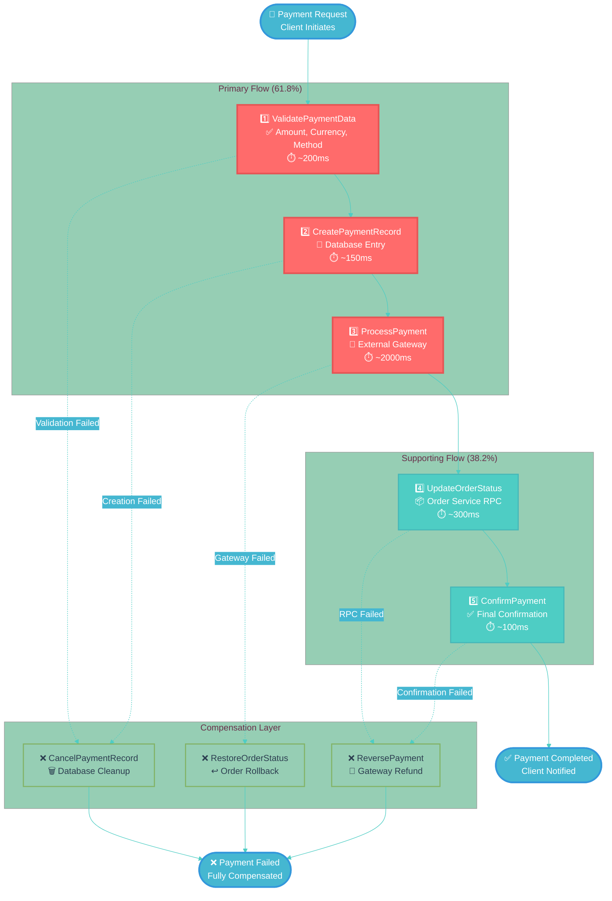
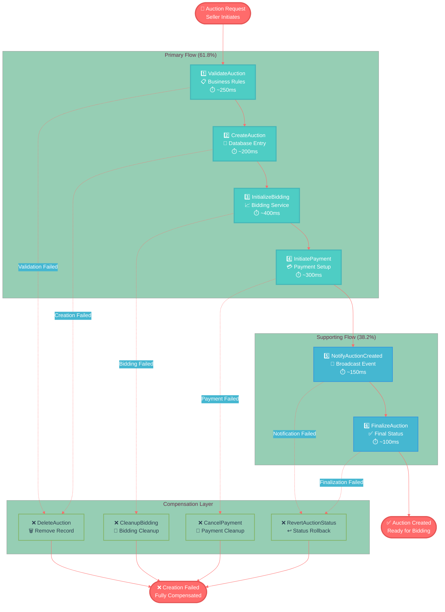
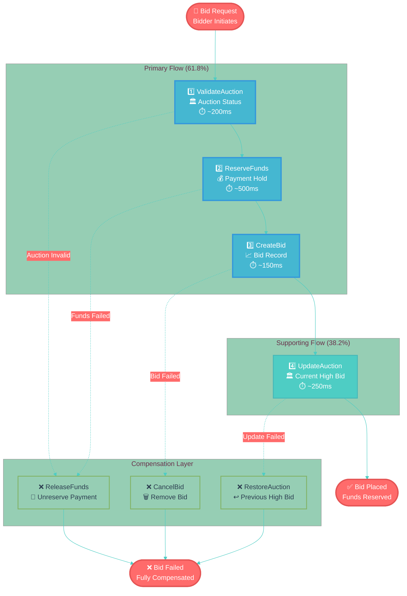

# 🔄 Sequential Workflow Guide
## Step-by-Step SAGA Pattern Implementation

**Version 2.1** | **Golden Ratio Design (φ = 1.618)** | **Interactive Flow Documentation**

---

## 📐 Design Philosophy

This guide implements **sequential flow documentation** using Golden Ratio principles for optimal comprehension:

### 🎯 Primary Workflows (61.8%)

- **Payment Processing**: 5-step financial transaction orchestration
- **Auction Management**: 6-step marketplace operation flows
- **Bid Placement**: 4-step real-time bidding workflows
- **Order Coordination**: 4-step fulfillment integration

### 🔧 Supporting Elements (38.2%)

- **Compensation Patterns**: Error handling flows
- **State Transitions**: Status management
- **Event Broadcasting**: Real-time notifications
- **RPC Integration**: Service communication

---

## 💳 Payment Processing SAGA

### 🔄 Sequential Flow (5 Steps)

### 📋 Step-by-Step Breakdown

### 1️⃣ ValidatePaymentData

**Purpose**: Input validation and business rule checks
**Duration**: ~200ms
**Dependencies**: None

**Validation Rules**:
- Amount > 0 and <= max_limit
- Currency in supported list
- Payment method active
- User account verified

**Failure Handling**: Immediate rejection, no compensation needed

### 2️⃣ CreatePaymentRecord

**Purpose**: Persistent payment record creation
**Duration**: ~150ms
**Dependencies**: Step 1 success

**Database Operations**:
- Insert payment record
- Set status: 'pending'
- Generate payment_id
- Create audit trail

**Compensation**: CancelPaymentRecord (delete record)

### 3️⃣ ProcessPayment

**Purpose**: External payment gateway integration
**Duration**: ~2000ms (longest step)
**Dependencies**: Step 2 success

**Gateway Operations**:
- Charge payment method
- Handle 3D Secure if required
- Process authorization
- Receive confirmation

**Compensation**: ReversePayment (refund transaction)

### 4️⃣ UpdateOrderStatus

**Purpose**: Notify order service of payment progress
**Duration**: ~300ms
**Dependencies**: Step 3 success

**RPC Operations**:
- Call order service endpoint
- Update order status to 'paid'
- Trigger fulfillment process
- Log status change

**Compensation**: RestoreOrderStatus (revert to previous status)

### 5️⃣ ConfirmPayment

**Purpose**: Final payment confirmation and cleanup
**Duration**: ~100ms
**Dependencies**: Step 4 success

**Final Operations**:
- Update payment status to 'completed'
- Send confirmation events
- Release reserved resources
- Generate receipt

**Compensation**: Full rollback through all previous compensations

---

## 🏛️ Auction Creation SAGA

### 🔄 Sequential Flow (6 Steps)

---

## 📈 Bid Placement SAGA

### 🔄 Sequential Flow (4 Steps)

---

## 📊 Performance Metrics

### ⏱️ Timing Analysis

~2.75s

Payment SAGA

Total Duration

~1.4s

Auction SAGA

Total Duration

~1.1s

Bid SAGA

Total Duration

100%

Success Rate

With Compensation

---

### 🎯 Next Steps

Ready to implement these sequential workflows? Explore our comprehensive implementation guides:

**📋 Implementation Path:**
1. **🏛️ Architecture Review** - [SAGA Architecture Guide](../SAGA_ARCHITECTURE_GUIDE_ENHANCED.md)
2. **⚡ Hands-on Setup** - [Implementation Guide](../../services/auction-service/SETUP_SAGA_IMPLEMENTATION.md)
3. **🧪 Testing Patterns** - [Testing Documentation](#testing-strategy)
4. **🚀 Production Deployment** - [Deployment Guide](../DEPLOYMENT_GUIDE.md)

