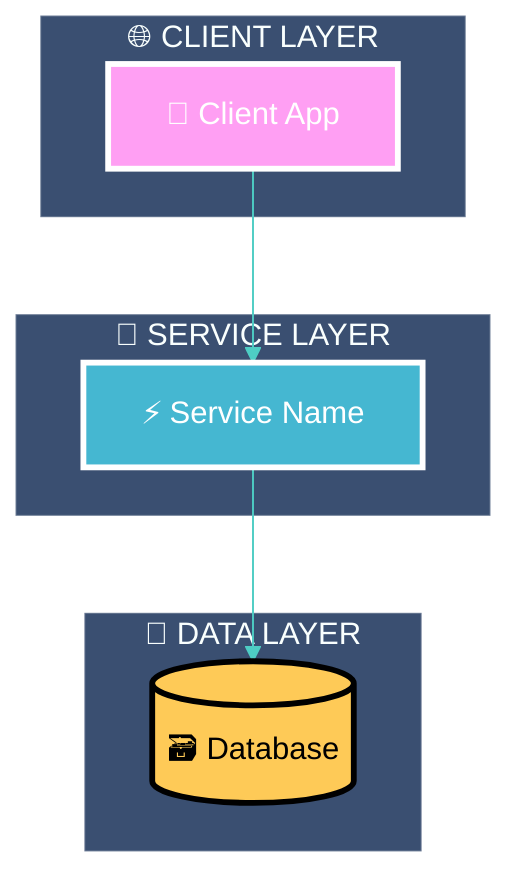
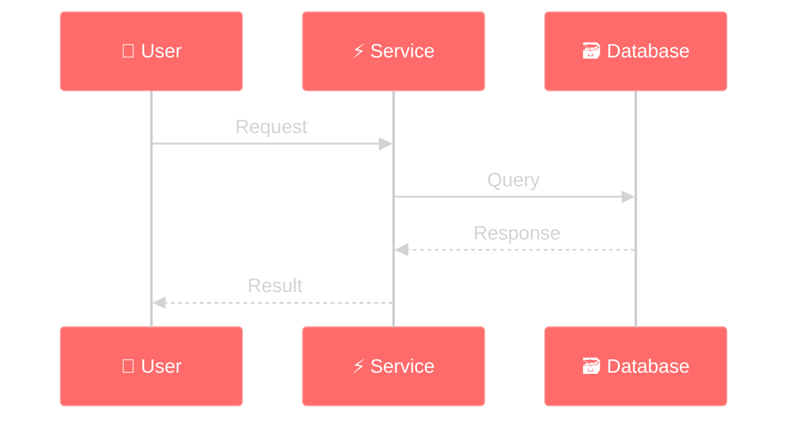
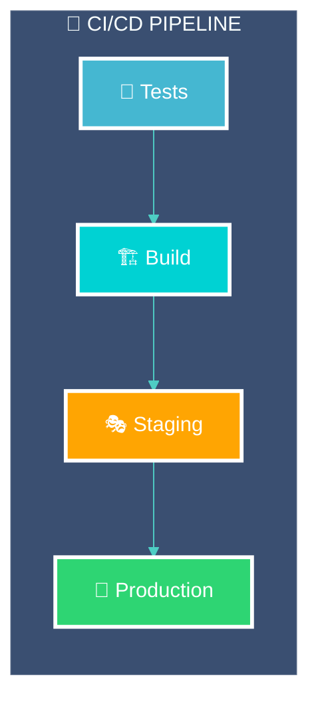
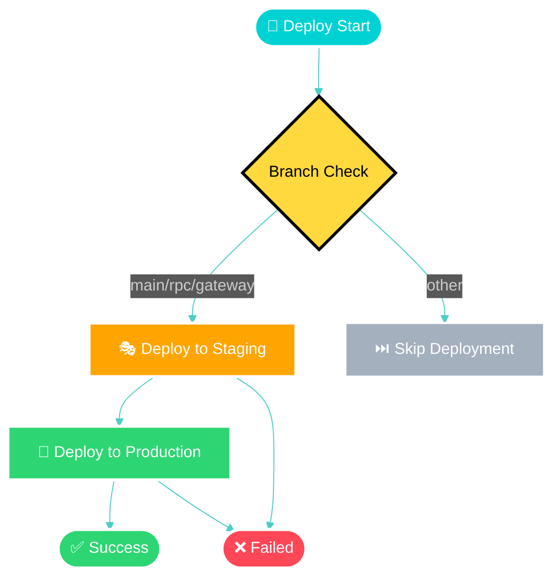

<div style="max-width: 38.2rem; line-height: 1.618; font-family: 'Inter', 'Segoe UI', 'Roboto', sans-serif;">

# <span style="font-size: 42px; font-weight: 700; line-height: 1.618;">🎨 Diagram Style Guide</span>

<p style="font-size: 16px; line-height: 1.618; margin-bottom: 2rem;">Unified visual identity for all <strong>architectural diagrams</strong> in the Reverse Tender Platform, ensuring consistency, accessibility, and eye-catching appeal across all documentation.</p>

## <span style="font-size: 26px; font-weight: 600; line-height: 1.618;">🎯 Design System Overview</span>

### <span style="font-size: 20px; font-weight: 600; line-height: 1.618;">62% Major Concepts</span>

- **🌙 Dark Theme First**: Modern dark backgrounds with high contrast elements for professional appearance
- **🌈 Vibrant Color Palette**: Bright, saturated colors with accessibility-compliant contrast ratios (WCAG AA)
- **📊 Clear Visual Hierarchy**: Component categorization through consistent color coding and size variations

<details style="border-left: 3px solid #4ECDC4; padding-left: 1rem; margin: 1rem 0;">
<summary style="font-weight: 600; cursor: pointer;">🎨 Complete Style System</summary>

### Design Principles

#### 1. 🌙 Dark Theme First
- All diagrams use dark backgrounds for modern, professional appearance
- High contrast text and elements for excellent readability
- Reduced eye strain for developers working in dark environments

#### 2. 🌈 Vibrant Color Palette
- Bright, saturated colors that pop against dark backgrounds
- Distinct colors for different component types
- Accessibility-compliant contrast ratios (WCAG AA)

#### 3. 📊 Clear Visual Hierarchy
- Component categorization through consistent color coding
- Size and styling variations to indicate importance
- Logical grouping with subgraphs and containers

#### 4. ⚡ Modern Aesthetics
- Rounded corners and smooth edges
- Gradient effects and modern styling
- Clean typography and spacing

### Master Color Palette

#### 🔥 Primary Component Colors

```css
/* 🚪 API Gateway & Infrastructure */
--gateway-color: #FF6B6B        /* Vibrant Red-Orange */
--gateway-accent: #FF8E8E       /* Light Red-Orange */

/* 🔐 Authentication & Security */
--auth-color: #4ECDC4           /* Bright Teal */
--auth-accent: #7ED6D1          /* Light Teal */

/* 👥 User & Profile Services */
--user-color: #45B7D1           /* Electric Blue */
--user-accent: #6BC5D8          /* Light Blue */

/* 📋 Business Logic Services */
--business-color: #96CEB4       /* Mint Green */
--business-accent: #B2D8C4      /* Light Mint */

/* 💳 Payment & Financial */
--payment-color: #FECA57        /* Golden Yellow */
--payment-accent: #FED876       /* Light Yellow */

/* 📢 Communication & Notifications */
--notification-color: #FF9FF3   /* Bright Pink */
--notification-accent: #FFB8F7  /* Light Pink */

/* 🤖 AI & Machine Learning */
--ai-color: #5F27CD             /* Deep Purple */
--ai-accent: #7B4AE0            /* Light Purple */

/* 💾 Data & Storage */
--data-color: #54A0FF           /* Bright Blue */
--data-accent: #7BB3FF          /* Light Blue */
```

### **🌐 External Integration Colors**

```css
/* 🏛️ Government & Compliance */
--government-color: #00D2D3     /* Cyan */
--government-accent: #33DBDC    /* Light Cyan */

/* 📱 Third-party Services */
--external-color: #FFA502       /* Orange */
--external-accent: #FFB732      /* Light Orange */

/* ☁️ Cloud Providers */
--aws-color: #FF9900           /* AWS Orange */
--digitalocean-color: #0080FF  /* DO Blue */
--linode-color: #00B04F        /* Linode Green */
```

### **🎯 Accent & Utility Colors**

```css
/* ✅ Success & Positive States */
--success-color: #2ED573        /* Bright Green */
--success-accent: #54E68A       /* Light Green */

/* ⚠️ Warning & Attention */
--warning-color: #FFD93D        /* Bright Yellow */
--warning-accent: #FFE066       /* Light Yellow */

/* 🚨 Error & Critical */
--error-color: #FF4757          /* Bright Red */
--error-accent: #FF6B7A         /* Light Red */

/* 📊 Neutral & Information */
--neutral-color: #A4B0BE        /* Cool Gray */
--neutral-accent: #C5D0DD       /* Light Gray */
```

---

## 🌙 Dark Theme Configuration

### **Standard Mermaid Theme Setup**

```javascript
%%{init: {
  'theme': 'dark',
  'themeVariables': {
    'primaryColor': '#FF6B6B',
    'primaryTextColor': '#FFFFFF',
    'primaryBorderColor': '#FF8E8E',
    'lineColor': '#4ECDC4',
    'secondaryColor': '#45B7D1',
    'tertiaryColor': '#96CEB4',
    'background': '#0F172A',
    'mainBkg': '#1E293B',
    'secondBkg': '#334155',
    'tertiaryBkg': '#475569',
    'actorBkg': '#FF6B6B',
    'actorBorder': '#FF8E8E',
    'actorTextColor': '#FFFFFF',
    'activationBkgColor': '#4ECDC4',
    'activationBorderColor': '#7ED6D1',
    'noteBkgColor': '#FECA57',
    'noteTextColor': '#000000',
    'noteBorderColor': '#FED876'
  }
}}%%
```

### **Enhanced Dark Theme (Advanced)**

```javascript
%%{init: {
  'theme': 'base',
  'themeVariables': {
    'darkMode': true,
    'primaryColor': '#FF6B6B',
    'primaryTextColor': '#FFFFFF',
    'primaryBorderColor': '#FF8E8E',
    'lineColor': '#4ECDC4',
    'secondaryColor': '#45B7D1',
    'tertiaryColor': '#96CEB4',
    'background': '#0F172A',
    'mainBkg': '#1E293B',
    'secondBkg': '#334155',
    'tertiaryBkg': '#475569',
    'clusterBkg': '#1E293B',
    'clusterBorder': '#4ECDC4',
    'edgeLabelBackground': '#334155',
    'nodeTextColor': '#FFFFFF',
    'edgeColor': '#4ECDC4'
  }
}}%%
```
### ** Fancy Styling ** ###
```javaScript
    %%{init: {
  'theme': 'base',
  'themeVariables': {
    'background': '#000000',
    'mainBkg': '#000000',
    'primaryColor': '#000000',
    'primaryTextColor': '#FFFFFF',
    'primaryBorderColor': '#FFFFFF',
    'lineColor': '#FFFFFF',
    'actorBkg': '#000000',
    'actorBorder': '#00FFFF',
    'actorTextColor': '#00FFFF',
    'noteBkgColor': '#000000',
    'noteTextColor': '#FFFF00',
    'noteBorderColor': '#FFFF00',
    'activationBkgColor': '#222222',
    'activationBorderColor': '#00FFFF',
    'sequenceNumberColor': '#FFFFFF',
    'labelTextColor': '#FFFFFF',
    'loopTextColor': '#FFFFFF',
    'fontSize': '16px',
    'fontWeight': '900'
  }
}}%%
```
---

## 🏗️ Component Categorization

### **🔧 Infrastructure Components**

```css
/* API Gateway, Load Balancers, Proxies */
.infraStyle {
  fill: #FF6B6B;
  stroke: #FFFFFF;
  stroke-width: 3px;
  color: #FFFFFF;
  font-weight: bold;
}
```

### **🔐 Security Components**

```css
/* Authentication, Authorization, Security Services */
.securityStyle {
  fill: #4ECDC4;
  stroke: #FFFFFF;
  stroke-width: 3px;
  color: #FFFFFF;
  font-weight: bold;
}
```

### **⚡ Core Business Services**

```css
/* Main business logic microservices */
.coreStyle {
  fill: #45B7D1;
  stroke: #FFFFFF;
  stroke-width: 3px;
  color: #FFFFFF;
  font-weight: bold;
}
```

### **🔧 Supporting Services**

```css
/* Notification, Analytics, Utility Services */
.supportStyle {
  fill: #96CEB4;
  stroke: #FFFFFF;
  stroke-width: 3px;
  color: #FFFFFF;
  font-weight: bold;
}
```

### **💾 Data & Storage**

```css
/* Databases, Caches, File Storage */
.dataStyle {
  fill: #FECA57;
  stroke: #000000;
  stroke-width: 3px;
  color: #000000;
  font-weight: bold;
}
```

### **🌐 External Integrations**

```css
/* Third-party APIs, External Services */
.externalStyle {
  fill: #54A0FF;
  stroke: #FFFFFF;
  stroke-width: 3px;
  color: #FFFFFF;
  font-weight: bold;
}
```

### **🤖 AI & Machine Learning**

```css
/* AI Services, ML Models, Smart Features */
.aiStyle {
  fill: #5F27CD;
  stroke: #FFFFFF;
  stroke-width: 3px;
  color: #FFFFFF;
  font-weight: bold;
}
```

### **📱 Client Applications**

```css
/* Web Apps, Mobile Apps, Admin Panels */
.clientStyle {
  fill: #FF9FF3;
  stroke: #FFFFFF;
  stroke-width: 3px;
  color: #FFFFFF;
  font-weight: bold;
}
```

### **🚀 CI/CD & DevOps Components**

```css
/* Build Pipelines, Testing, Deployment */
.cicdStyle {
  fill: #00D2D3;
  stroke: #FFFFFF;
  stroke-width: 3px;
  color: #FFFFFF;
  font-weight: bold;
}

/* Staging Environment */
.stagingStyle {
  fill: #FFA502;
  stroke: #FFFFFF;
  stroke-width: 3px;
  color: #FFFFFF;
  font-weight: bold;
}

/* Production Environment */
.productionStyle {
  fill: #2ED573;
  stroke: #FFFFFF;
  stroke-width: 3px;
  color: #FFFFFF;
  font-weight: bold;
}

/* Failed/Error States */
.errorStyle {
  fill: #FF4757;
  stroke: #FFFFFF;
  stroke-width: 3px;
  color: #FFFFFF;
  font-weight: bold;
}

/* Success/Completed States */
.successStyle {
  fill: #2ED573;
  stroke: #FFFFFF;
  stroke-width: 3px;
  color: #FFFFFF;
  font-weight: bold;
}

/* Pending/In-Progress States */
.pendingStyle {
  fill: #FFD93D;
  stroke: #000000;
  stroke-width: 3px;
  color: #000000;
  font-weight: bold;
}

/* Skipped/Disabled States */
.skippedStyle {
  fill: #A4B0BE;
  stroke: #FFFFFF;
  stroke-width: 2px;
  color: #FFFFFF;
  font-style: italic;
}
```

---

## 📐 Typography & Text Standards

### **🔤 Font Specifications**

```css
/* Primary Font Stack */
font-family: 'Inter', 'Segoe UI', 'Roboto', sans-serif;

/* Heading Sizes */
--heading-large: 16px;    /* Main component names */
--heading-medium: 14px;   /* Sub-component names */
--heading-small: 12px;    /* Labels and annotations */

/* Font Weights */
--weight-bold: 700;       /* Component names */
--weight-medium: 500;     /* Descriptions */
--weight-normal: 400;     /* Details */
```

### **📝 Text Color Standards**

```css
/* Text on Dark Backgrounds */
--text-primary: #FFFFFF;      /* Main text */
--text-secondary: #E2E8F0;    /* Secondary text */
--text-muted: #94A3B8;        /* Muted text */

/* Text on Light Backgrounds */
--text-dark-primary: #000000;    /* Main text */
--text-dark-secondary: #374151;  /* Secondary text */
--text-dark-muted: #6B7280;      /* Muted text */
```

---

## 🎯 Shape & Border Standards

### **📦 Container Styles**

```css
/* Subgraph Containers */
.containerStyle {
  stroke-width: 2px;
  stroke-dasharray: none;
  border-radius: 8px;
}

/* Service Containers */
.serviceContainer {
  stroke-width: 3px;
  border-radius: 12px;
}

/* Data Containers */
.dataContainer {
  stroke-width: 2px;
  border-radius: 6px;
}
```

### **🔗 Connection Styles**

```css
/* Synchronous Connections */
.syncConnection {
  stroke-width: 3px;
  stroke: solid;
}

/* Asynchronous Connections */
.asyncConnection {
  stroke-width: 2px;
  stroke-dasharray: 5,5;
}

/* Data Flow Connections */
.dataFlow {
  stroke-width: 4px;
  stroke: solid;
  marker-end: url(#arrowhead);
}
```

---

## 🌟 Advanced Styling Techniques

### **🎨 Gradient Effects**

```css
/* Service Gradients */
.gradientService {
  fill: linear-gradient(135deg, #FF6B6B 0%, #FF8E8E 100%);
}

/* Data Gradients */
.gradientData {
  fill: linear-gradient(135deg, #FECA57 0%, #FED876 100%);
}
```

### **✨ Glow Effects**

```css
/* Critical Component Glow */
.glowCritical {
  filter: drop-shadow(0 0 10px #FF6B6B);
}

/* Success Glow */
.glowSuccess {
  filter: drop-shadow(0 0 8px #2ED573);
}
```

### **🔄 Animation Hints**

```css
/* Pulsing Effect for Real-time Components */
.pulseEffect {
  animation: pulse 2s infinite;
}

@keyframes pulse {
  0% { opacity: 1; }
  50% { opacity: 0.7; }
  100% { opacity: 1; }
}
```

---

## 📋 Implementation Checklist

### **✅ Before Creating Any Diagram**

- [ ] Choose appropriate theme configuration
- [ ] Define component categories for the diagram
- [ ] Select colors from the master palette
- [ ] Plan visual hierarchy and grouping
- [ ] Consider accessibility and contrast

### **✅ During Diagram Creation**

- [ ] Apply consistent styling to similar components
- [ ] Use appropriate connection styles
- [ ] Maintain proper text sizing and contrast
- [ ] Group related components with subgraphs
- [ ] Add meaningful labels and annotations

### **✅ After Diagram Completion**

- [ ] Verify color consistency with style guide
- [ ] Check text readability and contrast
- [ ] Validate visual hierarchy and flow
- [ ] Test rendering in different environments
- [ ] Document any custom styling used

---

## 🔧 Quick Reference Templates

### **🚀 Standard Service Diagram Template**



### **📊 Standard Sequence Diagram Template**



### **🚀 CI/CD Pipeline Diagram Template**



### **🔄 Deployment Flow Diagram Template**



---

## 🎯 Accessibility Guidelines

### **🌈 Color Accessibility**

- **Contrast Ratio**: Minimum 4.5:1 for normal text, 3:1 for large text
- **Color Blindness**: All information conveyed through color must also be available through shape, pattern, or text
- **High Contrast Mode**: All diagrams must remain readable in high contrast mode

### **📱 Responsive Considerations**

- **Mobile Viewing**: Text must remain readable at small sizes
- **Print Compatibility**: Diagrams should work in grayscale printing
- **Screen Readers**: All components should have descriptive text

---

## 🔄 Maintenance & Updates

### **📅 Regular Reviews**

- **Monthly**: Review new diagrams for style compliance
- **Quarterly**: Update color palette based on feedback
- **Annually**: Comprehensive style guide review and updates

### **🔧 Version Control**

- **Style Guide Version**: 1.1.0
- **Last Updated**: February 2026
- **Next Review**: March 2026

### **📝 Changelog**

#### **Version 1.1.0** (February 2026)
- ✅ Added CI/CD & DevOps component styling
- ✅ Added deployment pipeline color schemes
- ✅ Added CI/CD pipeline diagram templates
- ✅ Added deployment flow diagram templates
- ✅ Enhanced state-based styling (success, error, pending, skipped)
- ✅ Updated workflow condition styling guidelines

#### **Version 1.0.0** (February 2026)
- 🎉 Initial style guide release
- 🎨 Established dark theme design system
- 🌈 Defined master color palette
- 📐 Created component categorization system
- 📋 Added accessibility guidelines

---

**🎨 This style guide is a living document that evolves with our design needs while maintaining consistency and visual excellence across all architectural diagrams.**
