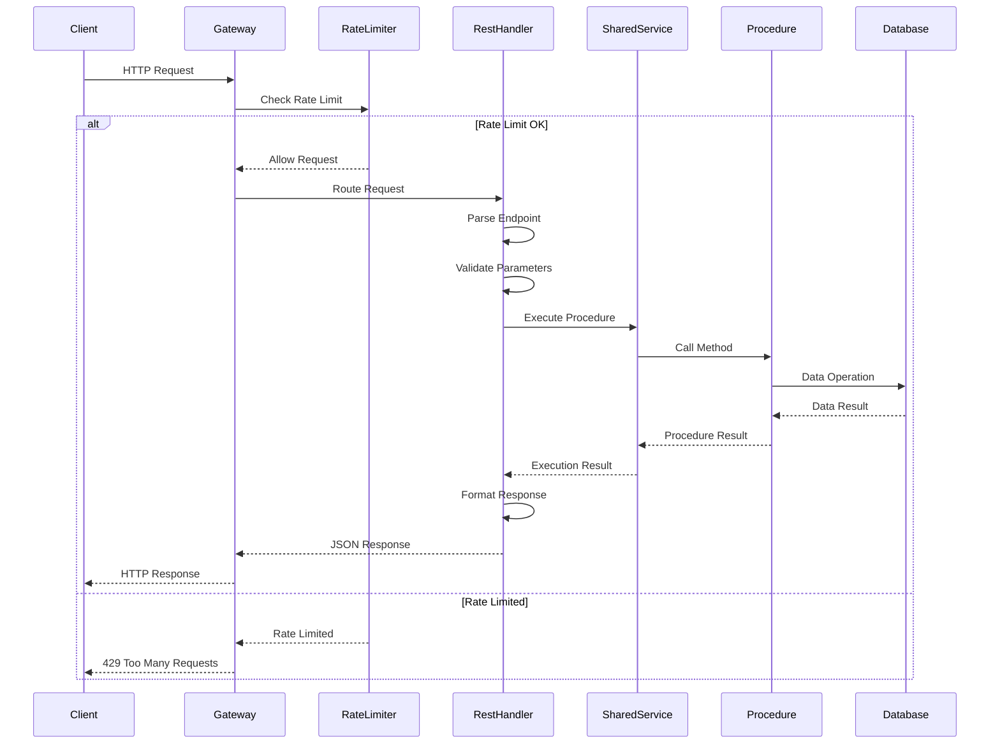
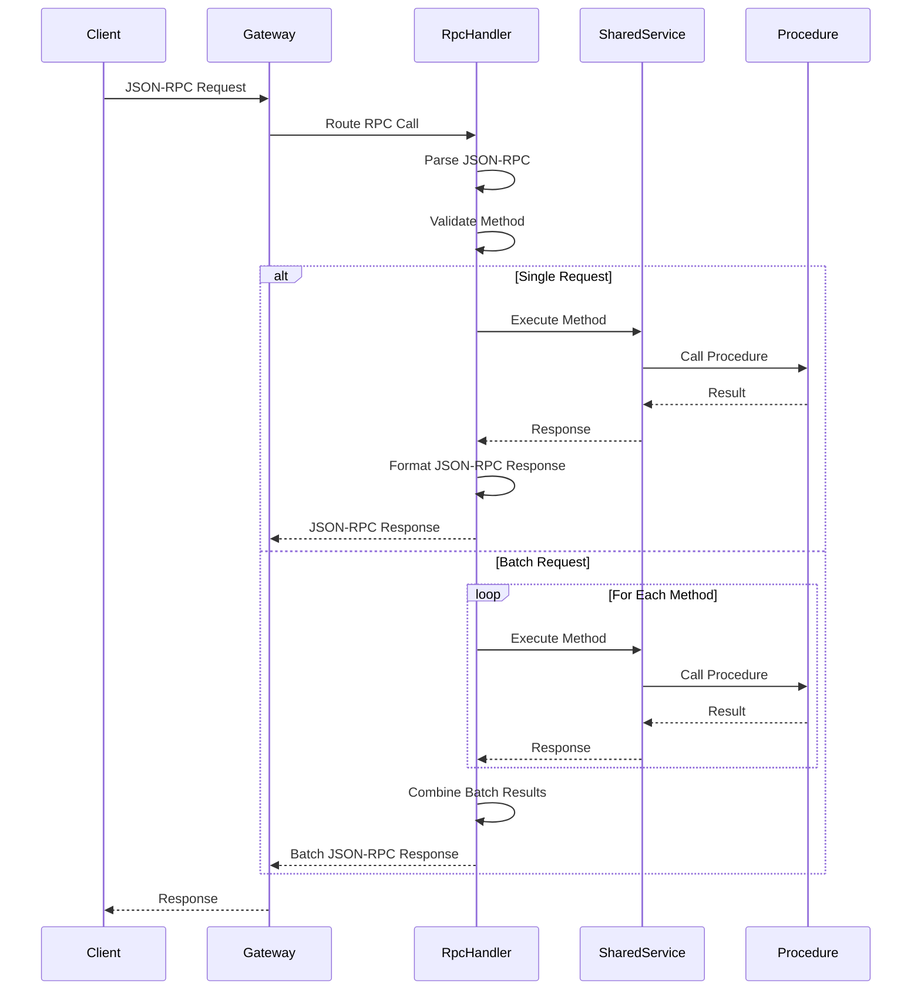
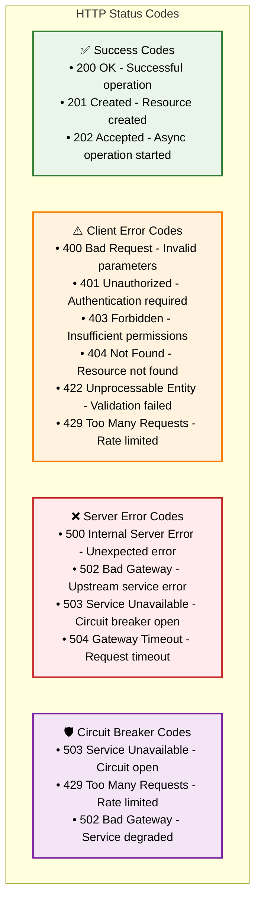
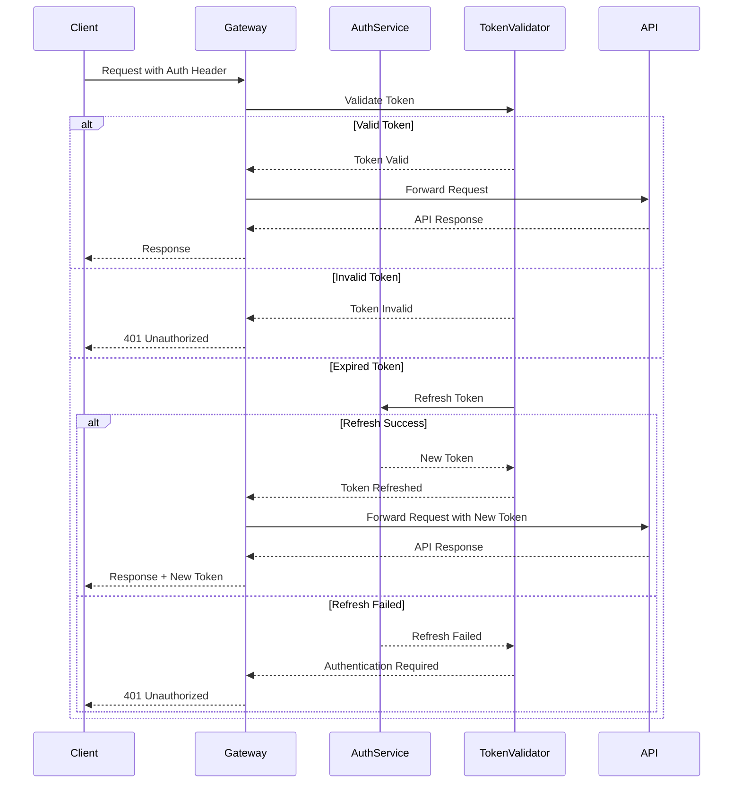
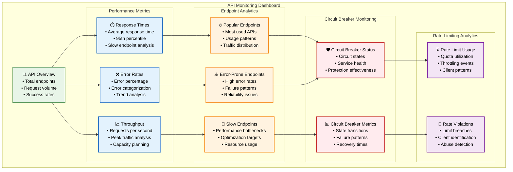

# 📡 Complete API Architecture

## 🎯 **Overview**

The **Complete API Architecture** provides **80+ endpoints** across multiple service categories, supporting both REST and RPC protocols with comprehensive functionality for workflow orchestration, circuit breaker management, and third-party integrations.

## 🏗️ **Complete API Architecture Overview**

```mermaid
%%{init: {
  'theme': 'dark',
  'themeVariables': {
    'primaryColor': '#45B7D1',
    'primaryTextColor': '#FFFFFF',
    'primaryBorderColor': '#6BC5D8',
    'lineColor': '#4ECDC4',
    'secondaryColor': '#54A0FF',
    'tertiaryColor': '#96CEB4',
    'background': '#0F172A',
    'mainBkg': '#1E293B',
    'secondBkg': '#334155',
    'tertiaryBkg': '#475569',
    'clusterBkg': '#1E293B',
    'clusterBorder': '#45B7D1',
    'edgeLabelBackground': '#334155',
    'nodeTextColor': '#FFFFFF',
    'edgeColor': '#4ECDC4'
  }
}}%%

graph TB
    subgraph "🌐 CLIENT LAYER"
        WEB_CLIENT[🌐 Web Clients<br/>• React/Vue apps<br/>• Mobile apps<br/>• Third-party integrations]
        API_CLIENT[🔌 API Clients<br/>• SDKs<br/>• CLI tools<br/>• Automation scripts]
    end

    subgraph "🚪 API GATEWAY LAYER"
        GATEWAY[🚪 API Gateway<br/>Port: 8000<br/>• Request routing<br/>• Load balancing<br/>• Rate limiting]
        
        subgraph "⚡ Protocol Support"
            REST_HANDLER[🌐 REST Handler<br/>• HTTP methods<br/>• Resource-based<br/>• JSON responses]
            RPC_HANDLER[⚡ RPC Handler<br/>• JSON-RPC 2.0<br/>• Method calls<br/>• Batch requests]
        end
    end

    subgraph "📡 API CATEGORIES (80+ Endpoints)"
        subgraph "⚡ Core Infrastructure APIs (40+ endpoints)"
            EVENT_API[📡 Event Publishing API<br/>• /api/event-publishing/*<br/>• Publish, subscribe, status<br/>• Event routing & delivery]
            CACHE_API[💾 Cache Management API<br/>• /api/cache-management/*<br/>• Set, get, delete, flush<br/>• TTL & tag management]
            NOTIFY_API[📢 Notification API<br/>• /api/notification/*<br/>• Send, bulk, status<br/>• Multi-channel delivery]
            VALID_API[✅ Validation API<br/>• /api/validation/*<br/>• Validate, custom rules<br/>• Business logic validation]
            SEC_API[🔐 Security API<br/>• /api/security/*<br/>• Encrypt, decrypt, tokens<br/>• Auth & authorization]
        end
        
        subgraph "🛡️ Circuit Breaker APIs (10+ endpoints)"
            CB_API[🛡️ Circuit Breaker API<br/>• /api/circuit-breaker/*<br/>• Stats, reset, force-open<br/>• Sync protection]
            QCB_API[⚡ Queue Circuit Breaker API<br/>• /api/queue-circuit-breaker/*<br/>• Dispatch, stats, health<br/>• Async protection]
        end
        
        subgraph "🔌 Integration & Workflow APIs (20+ endpoints)"
            TPI_API[🔌 Third-Party Integration API<br/>• /api/third-party-integration/*<br/>• Initialize, call, webhook<br/>• External services]
            WF_API[🔄 Workflow API<br/>• /api/workflow/*<br/>• Start, status, register<br/>• Orchestration management]
        end
        
        subgraph "🎯 Business Domain APIs (10+ endpoints)"
            TENDER_API[📋 Tender API<br/>• /api/tenders/*<br/>• CRUD operations<br/>• Bidding management]
            USER_API[👤 User API<br/>• /api/users/*<br/>• Profile management<br/>• Authentication]
        end
    end

    subgraph "🎯 SHARED SERVICE HUB"
        SHARED_SERVICE[🎯 Shared Service<br/>Port: 8001<br/>• Cross-service orchestration<br/>• Procedure execution<br/>• State management]
    end

    subgraph "📋 RESPONSE & ERROR HANDLING"
        RESPONSE_FORMAT[📋 Consistent Response Format<br/>• Success/error structure<br/>• Metadata inclusion<br/>• Trace ID tracking]
        ERROR_HANDLER[❌ Error Handler<br/>• HTTP status codes<br/>• Error categorization<br/>• Circuit breaker errors]
        RATE_LIMITER[⏳ Rate Limiter<br/>• Per-endpoint limits<br/>• Burst handling<br/>• Quota management]
    end

    %% Client connections
    WEB_CLIENT --> GATEWAY
    API_CLIENT --> GATEWAY

    %% Gateway protocol handling
    GATEWAY --> REST_HANDLER
    GATEWAY --> RPC_HANDLER

    %% API routing
    REST_HANDLER --> EVENT_API
    REST_HANDLER --> CACHE_API
    REST_HANDLER --> NOTIFY_API
    REST_HANDLER --> VALID_API
    REST_HANDLER --> SEC_API
    REST_HANDLER --> CB_API
    REST_HANDLER --> QCB_API
    REST_HANDLER --> TPI_API
    REST_HANDLER --> WF_API
    REST_HANDLER --> TENDER_API
    REST_HANDLER --> USER_API

    RPC_HANDLER --> SHARED_SERVICE

    %% Response handling
    EVENT_API --> RESPONSE_FORMAT
    CACHE_API --> RESPONSE_FORMAT
    NOTIFY_API --> RESPONSE_FORMAT
    VALID_API --> RESPONSE_FORMAT
    SEC_API --> RESPONSE_FORMAT
    CB_API --> RESPONSE_FORMAT
    QCB_API --> RESPONSE_FORMAT
    TPI_API --> RESPONSE_FORMAT
    WF_API --> RESPONSE_FORMAT
    TENDER_API --> RESPONSE_FORMAT
    USER_API --> RESPONSE_FORMAT

    RESPONSE_FORMAT --> ERROR_HANDLER
    GATEWAY --> RATE_LIMITER

    %% Service connections
    EVENT_API --> SHARED_SERVICE
    CACHE_API --> SHARED_SERVICE
    NOTIFY_API --> SHARED_SERVICE
    VALID_API --> SHARED_SERVICE
    SEC_API --> SHARED_SERVICE
    CB_API --> SHARED_SERVICE
    QCB_API --> SHARED_SERVICE
    TPI_API --> SHARED_SERVICE
    WF_API --> SHARED_SERVICE

    %% Distinguished Eye-Catching Styling
    classDef clientStyle fill:#FF9FF3,stroke:#FFFFFF,stroke-width:3px,color:#FFFFFF,font-weight:bold
    classDef gatewayStyle fill:#FF6B6B,stroke:#FFFFFF,stroke-width:3px,color:#FFFFFF,font-weight:bold
    classDef protocolStyle fill:#2ED573,stroke:#FFFFFF,stroke-width:3px,color:#FFFFFF,font-weight:bold
    classDef coreApiStyle fill:#45B7D1,stroke:#FFFFFF,stroke-width:3px,color:#FFFFFF,font-weight:bold
    classDef cbApiStyle fill:#FF4757,stroke:#FFFFFF,stroke-width:3px,color:#FFFFFF,font-weight:bold
    classDef intApiStyle fill:#96CEB4,stroke:#FFFFFF,stroke-width:3px,color:#FFFFFF,font-weight:bold
    classDef domainApiStyle fill:#5F27CD,stroke:#FFFFFF,stroke-width:3px,color:#FFFFFF,font-weight:bold
    classDef sharedStyle fill:#54A0FF,stroke:#FFFFFF,stroke-width:3px,color:#FFFFFF,font-weight:bold
    classDef responseStyle fill:#FECA57,stroke:#000000,stroke-width:3px,color:#000000,font-weight:bold

    class WEB_CLIENT,API_CLIENT clientStyle
    class GATEWAY gatewayStyle
    class REST_HANDLER,RPC_HANDLER protocolStyle
    class EVENT_API,CACHE_API,NOTIFY_API,VALID_API,SEC_API coreApiStyle
    class CB_API,QCB_API cbApiStyle
    class TPI_API,WF_API intApiStyle
    class TENDER_API,USER_API domainApiStyle
    class SHARED_SERVICE sharedStyle
    class RESPONSE_FORMAT,ERROR_HANDLER,RATE_LIMITER responseStyle
```



## 📋 **API Endpoint Categories**

### **Core Infrastructure APIs (40+ Endpoints)**

```mermaid
graph TB
    subgraph "Event Publishing API (/api/event-publishing/)"
        EP_PUBLISH[📤 POST /publish<br/>• Publish events<br/>• Target services<br/>• Priority levels]
        EP_SUBSCRIBE[📥 POST /subscribe<br/>• Service subscription<br/>• Event types<br/>• Webhook URLs]
        EP_STATUS[📊 GET /status/{eventId}<br/>• Event delivery status<br/>• Target confirmations<br/>• Error tracking]
        EP_UNSUBSCRIBE[📤 DELETE /unsubscribe<br/>• Remove subscription<br/>• Service cleanup<br/>• Event filtering]
        EP_HISTORY[📜 GET /history<br/>• Event history<br/>• Filtering options<br/>• Pagination]
    end
    
    subgraph "Cache Management API (/api/cache-management/)"
        CM_SET[💾 POST /set<br/>• Store cache data<br/>• TTL configuration<br/>• Tag management]
        CM_GET[📥 GET /get/{key}<br/>• Retrieve cached data<br/>• Key-based lookup<br/>• Expiration check]
        CM_DELETE[🗑️ DELETE /delete/{key}<br/>• Remove cache entry<br/>• Key cleanup<br/>• Cascade deletion]
        CM_FLUSH[🧹 POST /flush-tags<br/>• Tag-based flush<br/>• Bulk operations<br/>• Pattern matching]
        CM_STATS[📊 GET /stats<br/>• Cache statistics<br/>• Hit/miss ratios<br/>• Memory usage]
    end
    
    subgraph "Notification API (/api/notification/)"
        N_SEND[📤 POST /send<br/>• Single notification<br/>• Multi-channel<br/>• Template support]
        N_BULK[📦 POST /send-bulk<br/>• Batch notifications<br/>• Parallel processing<br/>• Progress tracking]
        N_STATUS[📊 GET /status/{notificationId}<br/>• Delivery status<br/>• Channel results<br/>• Error details]
        N_TEMPLATES[📋 GET /templates<br/>• Available templates<br/>• Template metadata<br/>• Preview support]
        N_PREFERENCES[⚙️ POST /preferences<br/>• User preferences<br/>• Channel settings<br/>• Opt-in/out]
    end
    
    subgraph "Validation API (/api/validation/)"
        V_VALIDATE[✅ POST /validate<br/>• Data validation<br/>• Rule-based checks<br/>• Custom validators]
        V_CUSTOM[🎯 POST /custom<br/>• Custom validation<br/>• Business rules<br/>• Domain logic]
        V_RULES[📋 GET /rules<br/>• Available rules<br/>• Rule documentation<br/>• Examples]
        V_BATCH[📦 POST /batch<br/>• Batch validation<br/>• Multiple datasets<br/>• Parallel processing]
    end
    
    subgraph "Security API (/api/security/)"
        S_ENCRYPT[🔐 POST /encrypt<br/>• Data encryption<br/>• Algorithm selection<br/>• Key management]
        S_DECRYPT[🔓 POST /decrypt<br/>• Data decryption<br/>• Key validation<br/>• Access control]
        S_TOKEN[🎫 POST /generate-token<br/>• JWT generation<br/>• Claims management<br/>• Expiration control]
        S_VERIFY[✅ POST /verify-token<br/>• Token validation<br/>• Signature check<br/>• Expiration check]
        S_HASH[#️⃣ POST /hash<br/>• Password hashing<br/>• Salt generation<br/>• Algorithm selection]
    end

    classDef eventStyle fill:#e3f2fd,stroke:#1565c0,stroke-width:2px,color:#000
    classDef cacheStyle fill:#e8f5e8,stroke:#2e7d32,stroke-width:2px,color:#000
    classDef notifyStyle fill:#fff3e0,stroke:#f57c00,stroke-width:2px,color:#000
    classDef validStyle fill:#f1f8e9,stroke:#388e3c,stroke-width:2px,color:#000
    classDef secStyle fill:#f3e5f5,stroke:#7b1fa2,stroke-width:2px,color:#000

    class EP_PUBLISH,EP_SUBSCRIBE,EP_STATUS,EP_UNSUBSCRIBE,EP_HISTORY eventStyle
    class CM_SET,CM_GET,CM_DELETE,CM_FLUSH,CM_STATS cacheStyle
    class N_SEND,N_BULK,N_STATUS,N_TEMPLATES,N_PREFERENCES notifyStyle
    class V_VALIDATE,V_CUSTOM,V_RULES,V_BATCH validStyle
    class S_ENCRYPT,S_DECRYPT,S_TOKEN,S_VERIFY,S_HASH secStyle
```

### **Circuit Breaker APIs (10+ Endpoints)**

```mermaid
graph TB
    subgraph "Synchronous Circuit Breaker API (/api/circuit-breaker/)"
        CB_STATS[📊 GET /stats/{serviceName?}<br/>• Circuit breaker statistics<br/>• Service-specific metrics<br/>• Failure rate analysis]
        CB_RESET[🔄 POST /reset<br/>• Reset circuit breaker<br/>• Service restoration<br/>• Manual intervention]
        CB_FORCE_OPEN[🚨 POST /force-open<br/>• Force circuit open<br/>• Maintenance mode<br/>• Emergency protection]
        CB_HEALTH[💚 GET /health<br/>• Overall health status<br/>• Service availability<br/>• System overview]
        CB_CONFIG[⚙️ GET /config/{serviceName}<br/>• Configuration details<br/>• Threshold settings<br/>• Timeout values]
    end
    
    subgraph "Queue Circuit Breaker API (/api/queue-circuit-breaker/)"
        QCB_DISPATCH[📤 POST /dispatch<br/>• Protected job dispatch<br/>• Circuit state check<br/>• Queue management]
        QCB_STATS[📊 GET /stats/{serviceName?}<br/>• Queue circuit statistics<br/>• Job success rates<br/>• Release metrics]
        QCB_RESET[🔄 POST /reset<br/>• Reset queue circuit<br/>• Clear failure counts<br/>• Service recovery]
        QCB_FORCE_OPEN[🚨 POST /force-open<br/>• Force queue circuit open<br/>• Block job dispatch<br/>• Maintenance mode]
        QCB_HEALTH[💚 GET /health?queue={queueName}<br/>• Queue health status<br/>• Job processing rates<br/>• Failed job counts]
    end

    classDef cbStyle fill:#ffebee,stroke:#c62828,stroke-width:2px,color:#000
    classDef qcbStyle fill:#fff3e0,stroke:#f57c00,stroke-width:2px,color:#000

    class CB_STATS,CB_RESET,CB_FORCE_OPEN,CB_HEALTH,CB_CONFIG cbStyle
    class QCB_DISPATCH,QCB_STATS,QCB_RESET,QCB_FORCE_OPEN,QCB_HEALTH qcbStyle
```

### **Integration & Workflow APIs (20+ Endpoints)**

```mermaid
graph TB
    subgraph "Third-Party Integration API (/api/third-party-integration/)"
        TPI_INIT[🔌 POST /initialize<br/>• Service initialization<br/>• Authentication setup<br/>• Configuration validation]
        TPI_CALL[📞 POST /api-call<br/>• Protected API calls<br/>• Circuit breaker protection<br/>• Rate limiting]
        TPI_WEBHOOK[🎣 POST /webhook<br/>• Webhook processing<br/>• Signature verification<br/>• Event routing]
        TPI_TEST[🧪 POST /test-connection<br/>• Connection testing<br/>• Service validation<br/>• Health checks]
        TPI_STATS[📊 GET /stats/{serviceName?}<br/>• Integration statistics<br/>• Performance metrics<br/>• Error tracking]
        TPI_RESET_CB[🔄 POST /reset-circuit-breaker<br/>• Reset integration circuit<br/>• Service recovery<br/>• Manual intervention]
    end
    
    subgraph "Workflow Orchestration API (/api/workflow/)"
        WF_START[🚀 POST /start<br/>• Start workflow execution<br/>• Parameter validation<br/>• State initialization]
        WF_STATUS[📊 GET /status/{workflowId}<br/>• Workflow status<br/>• Progress tracking<br/>• Step details]
        WF_REGISTER[📋 POST /register<br/>• Register workflow definition<br/>• Validation & storage<br/>• Version management]
        WF_EXECUTE[⚡ POST /execute-simple<br/>• Execute inline workflow<br/>• Simple orchestration<br/>• Quick processing]
        WF_LIST[📜 GET /list<br/>• List workflows<br/>• Filtering options<br/>• Pagination support]
        WF_CANCEL[❌ POST /cancel/{workflowId}<br/>• Cancel workflow<br/>• Compensation execution<br/>• Cleanup operations]
        WF_RETRY[🔄 POST /retry/{workflowId}<br/>• Retry failed workflow<br/>• Resume from failure<br/>• State recovery]
        WF_HISTORY[📜 GET /history/{workflowId}<br/>• Execution history<br/>• Step timeline<br/>• Error details]
    end

    classDef tpiStyle fill:#e8f5e8,stroke:#2e7d32,stroke-width:2px,color:#000
    classDef wfStyle fill:#e3f2fd,stroke:#1565c0,stroke-width:2px,color:#000

    class TPI_INIT,TPI_CALL,TPI_WEBHOOK,TPI_TEST,TPI_STATS,TPI_RESET_CB tpiStyle
    class WF_START,WF_STATUS,WF_REGISTER,WF_EXECUTE,WF_LIST,WF_CANCEL,WF_RETRY,WF_HISTORY wfStyle
```

## 🔄 **Request/Response Flow**

### **REST API Request Flow**



### **RPC API Request Flow**



## 📋 **Response Format Standards**

### **Consistent Response Structure**

```mermaid
graph TB
    subgraph "Standard Response Format"
        RESPONSE[📋 API Response] --> SUCCESS_FLAG[✅ success: boolean]
        RESPONSE --> DATA_FIELD[📊 data: object|array|null]
        RESPONSE --> ERROR_FIELD[❌ error: string|null]
        RESPONSE --> METADATA[📋 metadata: object]
        
        METADATA --> PROCEDURE[🎯 procedure: string]
        METADATA --> EXEC_TIME[⏱️ execution_time_ms: number]
        METADATA --> TRACE_ID[🔍 trace_id: string]
        METADATA --> TIMESTAMP[📅 timestamp: string]
        METADATA --> VERSION[🏷️ api_version: string]
    end
    
    subgraph "Success Response Example"
        SUCCESS_EXAMPLE[```json
{
  "success": true,
  "data": {
    "workflow_id": "wf_abc123",
    "status": "running",
    "progress": 45.5
  },
  "error": null,
  "metadata": {
    "procedure": "startWorkflow",
    "execution_time_ms": 123.45,
    "trace_id": "req_xyz789",
    "timestamp": "2024-01-01T12:00:00Z",
    "api_version": "v1"
  }
}```]
    end
    
    subgraph "Error Response Example"
        ERROR_EXAMPLE[```json
{
  "success": false,
  "data": null,
  "error": "Validation failed: email is required",
  "metadata": {
    "procedure": "validateData",
    "execution_time_ms": 45.67,
    "trace_id": "req_abc456",
    "timestamp": "2024-01-01T12:00:00Z",
    "api_version": "v1",
    "error_code": "VALIDATION_ERROR"
  }
}```]
    end

    classDef responseStyle fill:#e3f2fd,stroke:#1565c0,stroke-width:2px,color:#000
    classDef fieldStyle fill:#e8f5e8,stroke:#2e7d32,stroke-width:2px,color:#000
    classDef metaStyle fill:#fff3e0,stroke:#f57c00,stroke-width:2px,color:#000
    classDef exampleStyle fill:#f1f8e9,stroke:#388e3c,stroke-width:2px,color:#000

    class RESPONSE responseStyle
    class SUCCESS_FLAG,DATA_FIELD,ERROR_FIELD fieldStyle
    class METADATA,PROCEDURE,EXEC_TIME,TRACE_ID,TIMESTAMP,VERSION metaStyle
    class SUCCESS_EXAMPLE,ERROR_EXAMPLE exampleStyle
```

### **HTTP Status Code Standards**



## 🔐 **Authentication & Authorization**

### **API Authentication Flow**



## 📊 **API Monitoring & Analytics**

### **API Metrics Dashboard**



## 🎯 **Key Benefits**

### **📡 Comprehensive API Coverage**
- **80+ Endpoints** across all service categories
- **Dual Protocol Support** (REST + RPC) for flexibility
- **Consistent Response Format** for predictable integration
- **Complete CRUD Operations** for all business entities

### **🛡️ Built-in Protection**
- **Circuit Breaker Integration** for fault tolerance
- **Rate Limiting** with configurable quotas
- **Authentication & Authorization** with JWT tokens
- **Input Validation** with comprehensive rule sets

### **🔄 Advanced Orchestration**
- **Workflow Management APIs** for complex processes
- **Third-Party Integration APIs** for external services
- **Event-Driven Architecture** with publish/subscribe
- **State Management** with caching and persistence

### **📊 Monitoring & Observability**
- **Real-time Metrics** for all endpoints
- **Performance Analytics** with detailed insights
- **Error Tracking** with categorization and trends
- **Circuit Breaker Monitoring** for service health

### **🚀 Developer Experience**
- **Comprehensive Documentation** with examples
- **Consistent Error Handling** across all endpoints
- **Trace ID Support** for request tracking
- **SDK Generation** support for multiple languages

This complete API architecture provides enterprise-grade capabilities with comprehensive functionality, robust protection mechanisms, and excellent developer experience across all service categories.
