# 🔐 Authentication Flow Diagram

```mermaid
sequenceDiagram
    participant Client as 📱 Client App
    participant Gateway as 🚪 API Gateway
    participant Auth as 🔐 Auth Service
    participant User as 👥 User Service
    participant SMS as 📱 SMS Provider
    participant Email as 📧 Email Provider
    participant Redis as ⚡ Redis Cache
    participant DB as 🗃️ Database
    
    Note over Client,DB: User Registration Flow
    
    Client->>Gateway: POST /api/auth/register
    Gateway->>Auth: Forward registration request
    Auth->>DB: Check if phone/email exists
    
    alt Phone/Email already exists
        Auth->>Gateway: 409 Conflict
        Gateway->>Client: User already exists
    else New user
        Auth->>DB: Create user record (unverified)
        Auth->>SMS: Send OTP to phone
        Auth->>Email: Send verification email
        Auth->>Redis: Store OTP with expiration
        Auth->>Gateway: 201 Created (pending verification)
        Gateway->>Client: Registration successful, verify OTP
    end
    
    Note over Client,DB: OTP Verification Flow
    
    Client->>Gateway: POST /api/auth/verify-otp
    Gateway->>Auth: Forward OTP verification
    Auth->>Redis: Validate OTP code
    
    alt Invalid or expired OTP
        Auth->>Gateway: 400 Bad Request
        Gateway->>Client: Invalid OTP
    else Valid OTP
        Auth->>DB: Mark user as verified
        Auth->>DB: Create user session
        Auth->>Redis: Store session token
        Auth->>Gateway: 200 OK + JWT token
        Gateway->>Client: Authentication successful
    end
    
    Note over Client,DB: Login Flow (Phone + Password)
    
    Client->>Gateway: POST /api/auth/login
    Gateway->>Auth: Forward login request
    Auth->>DB: Validate credentials
    
    alt Invalid credentials
        Auth->>Gateway: 401 Unauthorized
        Gateway->>Client: Invalid credentials
    else Valid credentials
        Auth->>SMS: Send login OTP
        Auth->>Redis: Store login OTP
        Auth->>Gateway: 200 OK (OTP sent)
        Gateway->>Client: OTP sent for verification
        
        Client->>Gateway: POST /api/auth/verify-login-otp
        Gateway->>Auth: Verify login OTP
        Auth->>Redis: Validate OTP
        
        alt Invalid OTP
            Auth->>Gateway: 400 Bad Request
            Gateway->>Client: Invalid OTP
        else Valid OTP
            Auth->>DB: Create user session
            Auth->>Redis: Store session token
            Auth->>User: Get user profile
            User->>DB: Fetch profile data
            User->>Auth: Return profile data
            Auth->>Gateway: 200 OK + JWT + Profile
            Gateway->>Client: Login successful
        end
    end
    
    Note over Client,DB: OAuth Flow (Google/Apple)
    
    Client->>Gateway: POST /api/auth/oauth/google
    Gateway->>Auth: Forward OAuth request
    Auth->>Auth: Validate OAuth token with Google
    
    alt Invalid OAuth token
        Auth->>Gateway: 401 Unauthorized
        Gateway->>Client: Invalid OAuth token
    else Valid OAuth token
        Auth->>DB: Check if OAuth user exists
        
        alt User exists
            Auth->>DB: Update OAuth token
            Auth->>DB: Create user session
            Auth->>Redis: Store session token
            Auth->>Gateway: 200 OK + JWT
            Gateway->>Client: Login successful
        else New OAuth user
            Auth->>DB: Create user from OAuth data
            Auth->>DB: Create OAuth provider record
            Auth->>DB: Create user session
            Auth->>Redis: Store session token
            Auth->>Gateway: 201 Created + JWT
            Gateway->>Client: Registration successful
        end
    end
    
    Note over Client,DB: Token Refresh Flow
    
    Client->>Gateway: POST /api/auth/refresh
    Gateway->>Auth: Forward refresh request
    Auth->>Redis: Validate refresh token
    
    alt Invalid refresh token
        Auth->>Gateway: 401 Unauthorized
        Gateway->>Client: Token expired, please login
    else Valid refresh token
        Auth->>DB: Check user session validity
        Auth->>Redis: Generate new access token
        Auth->>Redis: Update session expiration
        Auth->>Gateway: 200 OK + New JWT
        Gateway->>Client: Token refreshed
    end
    
    Note over Client,DB: Password Reset Flow
    
    Client->>Gateway: POST /api/auth/forgot-password
    Gateway->>Auth: Forward reset request
    Auth->>DB: Check if user exists
    
    alt User not found
        Auth->>Gateway: 404 Not Found
        Gateway->>Client: User not found
    else User exists
        Auth->>SMS: Send reset OTP
        Auth->>Email: Send reset email
        Auth->>Redis: Store reset OTP
        Auth->>Gateway: 200 OK
        Gateway->>Client: Reset OTP sent
        
        Client->>Gateway: POST /api/auth/reset-password
        Gateway->>Auth: Forward reset with OTP + new password
        Auth->>Redis: Validate reset OTP
        
        alt Invalid OTP
            Auth->>Gateway: 400 Bad Request
            Gateway->>Client: Invalid reset OTP
        else Valid OTP
            Auth->>DB: Update user password
            Auth->>DB: Invalidate all user sessions
            Auth->>Redis: Clear user session tokens
            Auth->>Gateway: 200 OK
            Gateway->>Client: Password reset successful
        end
    end
    
    Note over Client,DB: Logout Flow
    
    Client->>Gateway: POST /api/auth/logout
    Gateway->>Auth: Forward logout request
    Auth->>Redis: Invalidate session token
    Auth->>DB: Update session status
    Auth->>Gateway: 200 OK
    Gateway->>Client: Logout successful
    
    Note over Client,DB: Session Validation (Middleware)
    
    Client->>Gateway: Any authenticated request
    Gateway->>Auth: Validate JWT token
    Auth->>Redis: Check token in cache
    
    alt Token not in cache or expired
        Auth->>DB: Validate session in database
        
        alt Session invalid
            Auth->>Gateway: 401 Unauthorized
            Gateway->>Client: Authentication required
        else Session valid
            Auth->>Redis: Cache token for future requests
            Auth->>Gateway: Token valid + User data
            Gateway->>Gateway: Process request
        end
    else Token valid in cache
        Auth->>Gateway: Token valid + User data
        Gateway->>Gateway: Process request
    end
```

## 🔐 Authentication Features

### **1. Multi-Factor Authentication (MFA)**
- **Primary**: Phone number (required for all users)
- **Secondary**: Email verification (optional but recommended)
- **OTP**: 6-digit codes with 5-minute expiration
- **Backup**: OAuth providers (Google, Apple, Facebook)

### **2. JWT Token Management**
- **Access Token**: Short-lived (15 minutes) for API access
- **Refresh Token**: Long-lived (30 days) for token renewal
- **Session Token**: Stored in Redis for quick validation
- **Device Tracking**: Multiple device support with session management

### **3. OAuth Integration**
- **Google OAuth**: Google Sign-In integration
- **Apple OAuth**: Sign in with Apple
- **Facebook OAuth**: Facebook Login (optional)
- **Token Validation**: Server-side validation of OAuth tokens

### **4. Security Features**
- **Rate Limiting**: Login attempt throttling
- **Device Fingerprinting**: Suspicious login detection
- **Session Management**: Concurrent session limits
- **Password Policy**: Strong password requirements
- **Account Lockout**: Temporary lockout after failed attempts

### **5. Saudi Arabia Compliance**
- **National ID Integration**: Optional Saudi National ID for enhanced verification
- **Phone Verification**: Mandatory for all Saudi users
- **ZATCA Preparation**: User data structure ready for e-invoicing

## 🛡️ Security Considerations

### **Token Security**
- **JWT Signing**: RS256 algorithm with rotating keys
- **Token Expiration**: Short-lived access tokens
- **Refresh Rotation**: Refresh tokens rotate on use
- **Blacklisting**: Compromised token invalidation

### **Data Protection**
- **Password Hashing**: bcrypt with salt rounds
- **PII Encryption**: Sensitive data encryption at rest
- **Audit Logging**: All authentication events logged
- **GDPR Compliance**: Data retention and deletion policies

### **Network Security**
- **HTTPS Only**: All authentication endpoints require TLS
- **CORS Configuration**: Strict cross-origin policies
- **API Rate Limiting**: Per-user and per-IP limits
- **DDoS Protection**: CloudFlare or AWS Shield integration

This authentication system provides a secure, scalable foundation for the Reverse Tender Platform with full support for Saudi Arabia market requirements and modern security best practices.

