# 🔐 Modern Authentication & Authorization Flow

> **🚀 Laravel 12+ DDD Architecture** | **🛡️ Zero Trust Security** | **⚡ Multi-Factor Authentication**

## 🎯 Authentication Overview

This diagram showcases our **modern authentication system** implementing **Domain-Driven Design**, **JWT with RS256**, **Multi-Factor Authentication**, and **Zero Trust Security** principles.

## 🔐 Complete Authentication Flow

```mermaid
%%{init: {
  'theme': 'dark',
  'themeVariables': {
    'primaryColor': '#ff6b6b',
    'primaryTextColor': '#ffffff',
    'lineColor': '#4ecdc4',
    'secondaryColor': '#f7d794',
    'tertiaryColor': '#a29bfe',
    'mainBkg': '#1a1a2e',
    'nodeBorder': '#4ecdc4'
  }
}}%%

sequenceDiagram
    autonumber
    participant Client as 🚀 Client (Vue PWA)
    participant Gateway as 🚪 API Gateway
    participant Auth as 🔐 Auth Service
    participant Cache as ⚡ Redis
    participant DB as 🗃️ MySQL 8.0
    participant Notify as 📢 Notification Hub

    rect rgb(255, 107, 107, 0.15)
        Note over Client, Notify: 🔴 PHASE 1: IDENTITY PROVISIONING
        Client->>+Gateway: POST /register
        Gateway->>+Auth: Execute: RegisterUser
        Auth->>DB: Check Unique Identity
        Auth->>DB: Persist User (Status: PENDING)
        
        par Async Notification
            Auth->>Notify: Dispatch SMS OTP
            Auth->>Notify: Dispatch Email Link
        and State Management
            Auth->>Cache: Set OTP Key (TTL 300s)
        end
        
        Auth-->>Gateway: 201 Created
        Gateway-->>-Client: Redirect to OTP Screen
    end

    rect rgb(78, 205, 196, 0.15)
        Note over Client, Cache: 🟢 PHASE 2: CHALLENGE-RESPONSE (OTP)
        Client->>+Gateway: POST /verify-otp
        Gateway->>+Auth: Execute: VerifyOTP
        Auth->>Cache: Get OTP
        
        alt Success
            Auth->>DB: Update User (Status: ACTIVE)
            Auth->>Auth: Mint JWT (RS256)
            Auth-->>Gateway: 200 OK + Tokens
        else Failure
            Auth->>Cache: Increment Throttle Counter
            Auth-->>Gateway: 401 Unauthorized
        end
        Gateway-->>-Client: App Dashboard Access
    end

    rect rgb(162, 155, 254, 0.15)
        Note over Client, Auth: 🟣 PHASE 3: BIOMETRIC TRUST (FIDO2/WebAuthn)
        Client->>+Gateway: POST /biometric-login
        Gateway->>+Auth: Validate Signature
        Auth->>DB: Match Biometric Token
        Auth-->>Gateway: 200 OK (New Session)
        Gateway-->>-Client: Biometric Authenticated
    end
```



---

## 🚀 Modern Authentication Features

### **🔐 Multi-Factor Authentication (MFA)**
```yaml
🎯 Primary Authentication:
  - Email/Phone + Password (Required)
  - Biometric Authentication (Touch ID, Face ID)
  - Hardware Security Keys (FIDO2/WebAuthn)

📱 Secondary Verification:
  - SMS OTP (6-digit, 5min expiry)
  - Email Verification Links (24h expiry)
  - TOTP Apps (Google Authenticator, Authy)
  - Backup Codes (One-time use)

🌐 Social Authentication:
  - Google OAuth 2.0
  - Apple Sign In
  - Microsoft Azure AD
  - LinkedIn (Business accounts)
```

### **🎫 Advanced JWT Token Management**
```yaml
🔐 Token Types:
  - Access Token: 15 minutes (API access)
  - Refresh Token: 30 days (token renewal)
  - ID Token: User identity claims
  - Session Token: Redis-cached validation

🛡️ Security Features:
  - RS256 Algorithm with key rotation
  - Token fingerprinting per device
  - Automatic token refresh
  - Blacklist for compromised tokens
  - Concurrent session limits
```

### **🔒 Biometric & Device Security**
```yaml
📱 Biometric Support:
  - Touch ID (iOS/Android)
  - Face ID (iOS/Android)
  - Fingerprint (Android)
  - Voice Recognition (Future)

🖥️ Device Management:
  - Device fingerprinting
  - Trusted device registration
  - Suspicious login detection
  - Remote device logout
  - Device-specific tokens
```

### **🌐 OAuth 2.0 & OpenID Connect**
```yaml
🔗 Supported Providers:
  - Google (OAuth 2.0 + OpenID)
  - Apple (Sign in with Apple)
  - Microsoft (Azure AD)
  - LinkedIn (Professional)

🛡️ Security Features:
  - PKCE (Proof Key for Code Exchange)
  - State parameter validation
  - Nonce verification
  - Token introspection
  - Provider token validation
```

### **🛡️ Advanced Security Features**
```yaml
🔒 Zero Trust Security:
  - Every request authenticated
  - Principle of least privilege
  - Continuous verification
  - Context-aware access

🚨 Threat Protection:
  - Rate limiting (Redis-based)
  - Brute force protection
  - Account lockout policies
  - Suspicious activity detection
  - Geo-location validation

📊 Audit & Compliance:
  - Complete audit trail
  - GDPR compliance
  - ZATCA preparation
  - PCI DSS alignment
  - SOC 2 Type II ready
```

### **🇸🇦 Saudi Arabia Compliance**
```yaml
🏛️ Regulatory Compliance:
  - National ID integration
  - Absher API compatibility
  - ZATCA e-invoicing ready
  - SAMA banking regulations
  - CITC telecommunications compliance

📱 Local Requirements:
  - Arabic language support
  - Saudi phone number validation
  - Hijri calendar support
  - Prayer time considerations
  - Cultural sensitivity
```

---

## 🏗️ Domain-Driven Design Implementation

### **🎯 Domain Layer**
```php
// Domain Entities
Domain/Auth/Models/User.php
Domain/Auth/ValueObjects/UserId.php
Domain/Auth/ValueObjects/Email.php
Domain/Auth/Events/UserAuthenticated.php

// Domain Services
Domain/Auth/Services/AuthenticationService.php
Domain/Auth/Services/PasswordService.php
Domain/Auth/Services/TokenService.php
```

### **🔄 Application Layer**
```php
// Use Cases
Application/UseCases/RegisterUser.php
Application/UseCases/AuthenticateUser.php
Application/UseCases/RefreshToken.php

// DTOs
Application/DTOs/LoginRequest.php
Application/DTOs/RegisterRequest.php
Application/DTOs/AuthResponse.php
```

### **🏗️ Infrastructure Layer**
```php
// Repositories
Infrastructure/Database/UserRepository.php
Infrastructure/Database/SessionRepository.php

// External Services
Infrastructure/Http/OAuthProviders/GoogleProvider.php
Infrastructure/Http/OAuthProviders/AppleProvider.php
Infrastructure/Cache/RedisSessionStore.php
```

---

## 🎯 Performance & Scalability

### **⚡ Caching Strategy**
- **Redis Cluster**: Session storage and token caching
- **Application Cache**: User permissions and roles
- **CDN**: Static authentication assets
- **Database Query Cache**: Optimized user lookups

### **📈 Horizontal Scaling**
- **Stateless Authentication**: JWT-based, no server-side sessions
- **Load Balancing**: Multiple auth service instances
- **Database Sharding**: User data distribution
- **Microservice Architecture**: Independent scaling

### **🔍 Monitoring & Analytics**
- **Real-time Metrics**: Login success/failure rates
- **Security Analytics**: Threat detection and response
- **Performance Monitoring**: Response time optimization
- **User Behavior**: Authentication pattern analysis

---

## 🚀 Future Enhancements

### **🤖 AI-Powered Security**
- **Behavioral Biometrics**: Typing patterns, mouse movements
- **Risk-Based Authentication**: Dynamic MFA requirements
- **Fraud Detection**: ML-powered anomaly detection
- **Adaptive Security**: Context-aware authentication

### **🌐 Emerging Technologies**
- **WebAuthn/FIDO2**: Passwordless authentication
- **Blockchain Identity**: Decentralized identity verification
- **Quantum-Resistant Cryptography**: Future-proof security
- **Zero-Knowledge Proofs**: Privacy-preserving authentication

This modern authentication system provides enterprise-grade security, scalability, and compliance while delivering an exceptional user experience across all platforms and devices.
