# 🎯 Bidding System Flow Diagram

```mermaid
   graph TB
    subgraph Clients
        PWA[📱 PWA / Mobile App]
    end

    subgraph API_Layer [Edge Layer]
        GW[🚪 API Gateway]
    end

    subgraph Core_Services [Logic Layer]
        Order[📋 Order Service]
        Bidding[🎯 Bidding Service]
        Notif[📢 Notification Service]
    end

    subgraph Data_Messaging [Infrastructure Layer]
        Redis[âš¡ Redis Event Bus]
        WS[🔄 WebSocket Server]
        DB[(ðŸ—ƒï¸ Primary DB)]
    end

    subgraph External [External Integrations]
        SMS[📲 SMS Provider]
        Email[📧 Email Provider]
    end

    %% Relationships
    PWA -->|HTTPS| GW
    GW --> Order
    GW --> Bidding
    
    Order --> DB
    Order -.->|Publish Event| Redis
    
    Bidding --> DB
    Bidding -.->|Publish Event| Redis
    Bidding --> WS
    
    Redis -.->|Subscribe| Notif
    Notif --> DB
    Notif --> SMS
    Notif --> Email
    
    WS -.->|Push Update| PWA
```

```mermaid
%%{init: {
  'theme': 'dark',
  'themeVariables': {
    'primaryColor': '#FF4757',
    'primaryTextColor': '#FFFFFF',
    'primaryBorderColor': '#FF6B81',
    'lineColor': '#2ED573',
    'secondaryColor': '#1E90FF',
    'tertiaryColor': '#FFA502',
    'background': '#0F172A',
    'mainBkg': '#1E293B',
    'secondBkg': '#334155',
    'tertiaryBkg': '#1E293B',
    'actorBkg': '#FF4757',
    'actorBorder': '#FF6B81',
    'actorTextColor': '#FFFFFF',
    'activationBkgColor': '#2ED573',
    'activationBorderColor': '#FFFFFF',
    'noteBkgColor': '#FFA502',
    'noteTextColor': '#000000'
  }
}}%%

sequenceDiagram
    autonumber
    participant Customer as 👤 Customer
    participant PWA as 📱 PWA Client
    participant Gateway as 🚪 API Gateway
    participant Order as 📋 Order Service
    participant Bidding as 🎯 Bidding Service
    participant Notification as 📢 Notification Service
    participant Merchant as 🏪 Merchant
    participant WebSocket as 🔄 WebSocket Server
    participant Redis as ⚡ Redis Queue
    participant DB as 🗃️ Database
    
    rect rgb(30, 41, 59)
    Note over Customer,DB: 1. Order Creation & Publishing
    Customer->>PWA: Create part request
    PWA->>Gateway: POST /api/orders
    Gateway->>Order: Create order
    Order->>DB: Save order (status: draft)
    Order->>PWA: Order ID Created
    
    Customer->>PWA: Publish order
    PWA->>Gateway: PUT /api/orders/{id}/publish
    Order->>DB: Update status to 'published'
    Order->>Redis: Publish order_published event
    Order->>PWA: Order is now live
    end

    rect rgb(15, 23, 42)
    Note over Customer,DB: 2. Merchant Discovery & Bidding
    Redis->>Notification: order_published event
    Notification->>DB: Filter merchants (Geo/Specs)
    Notification->>Merchant: Push/SMS/Email Alert
    
    Merchant->>Gateway: POST /api/bids
    Bidding->>DB: Validate constraints
    alt Valid bid
        Bidding->>DB: Save bid
        Bidding->>Redis: Publish bid_created
        Bidding->>WebSocket: Broadcast to Customer
        Bidding->>Merchant: 201 Created
    else Invalid bid
        Bidding->>Merchant: 400 Bad Request
    end
    end

    rect rgb(30, 41, 59)
    Note over Customer,DB: 3. Real-time Communication & Auto-bidding
    Merchant->>Gateway: POST /api/bids/{id}/messages
    Bidding->>WebSocket: Push message to Customer
    Customer->>PWA: Reply to Merchant
    PWA->>WebSocket: Push reply to Merchant

    Note right of Bidding: Auto-bid Trigger
    loop On competing bid
        Bidding->>Bidding: Check merchant rules
        alt Threshold met
            Bidding->>DB: Create counter-bid
            Bidding->>WebSocket: Broadcast auto-bid
        end
    end
    end

    rect rgb(15, 23, 42)
    Note over Customer,DB: 4. Bid Management (Withdrawal & Expiration)
    Merchant->>Gateway: DELETE /api/bids/{id}
    Bidding->>DB: Check if award exists
    Bidding->>DB: Set status: 'withdrawn'
    Bidding->>WebSocket: Update Customer UI

    Note left of Bidding: Cron Job: Check Deadlines
    Bidding->>DB: Update status: 'expired'
    Bidding->>Redis: Publish order_expired
    Notification->>Customer: Notify: No winner selected
    end

    rect rgb(30, 41, 59)
    Note over Customer,DB: 5. Final Award Process
    Customer->>PWA: Select winning bid
    PWA->>Gateway: POST /api/orders/{id}/award
    Bidding->>DB: Update 'awarded' & 'rejected' statuses
    Bidding->>Redis: Publish bid_awarded
    
    par Async Notifications
        Notification->>Merchant: Push (You Won!)
        Notification->>Merchant: Email (Contract/Next Steps)
        Notification->>Customer: Confirmation Receipt
    end
    end
```

## 🎯 Bidding System Features

### **1. Real-time Bidding**
- **WebSocket Integration**: Live bid updates without page refresh
- **Instant Notifications**: Push notifications for all bid events
- **Live Chat**: Direct communication between customers and merchants
- **Auto-refresh**: Automatic bid list updates

### **2. Smart Bidding Rules**
- **Minimum Bid**: Configurable minimum bid amounts
- **Bid Increments**: Minimum increment requirements
- **Time Extensions**: Automatic deadline extensions for last-minute bids
- **Maximum Bids**: Customer budget constraints

### **3. Auto-bidding System**
- **Merchant Auto-bids**: Automatic counter-bidding within limits
- **Bid Strategies**: Conservative, aggressive, or custom strategies
- **Maximum Limits**: Auto-bid ceiling amounts
- **Smart Logic**: Intelligent bidding based on competition

### **4. Bid Validation**
- **Merchant Verification**: Only verified merchants can bid
- **Specialization Check**: Merchants must have relevant specializations
- **Location Validation**: Service area coverage verification
- **Capacity Check**: Merchant availability and capacity

### **5. Award Management**
- **Winner Selection**: Customer chooses winning bid
- **Automatic Awards**: Lowest bid auto-award (optional)
- **Contract Generation**: Automatic contract creation
- **Escrow Integration**: Payment hold until completion

## 📊 Bidding Analytics

### **Real-time Metrics**
- **Active Bids**: Current bidding activity
- **Average Response Time**: Merchant response speed
- **Bid Competition**: Number of bids per order
- **Success Rates**: Merchant win rates

### **Business Intelligence**
- **Pricing Trends**: Market price analysis
- **Merchant Performance**: Success rates and ratings
- **Customer Behavior**: Bidding patterns and preferences
- **Market Insights**: Supply and demand analytics

## 🔄 Event-Driven Architecture

### **Key Events**
- `order_published`: New order available for bidding
- `bid_created`: New bid submitted
- `bid_updated`: Bid amount or details changed
- `bid_awarded`: Winning bid selected
- `bid_withdrawn`: Merchant withdraws bid
- `order_expired`: Order deadline reached
- `auto_bid_triggered`: Automatic bid placed

### **Event Handlers**
- **Notification Service**: Sends notifications for all events
- **Analytics Service**: Tracks metrics and generates insights
- **WebSocket Server**: Broadcasts real-time updates
- **Audit Service**: Logs all bidding activities

This bidding system provides a competitive, transparent, and efficient marketplace for automotive parts with real-time capabilities and comprehensive business intelligence.

