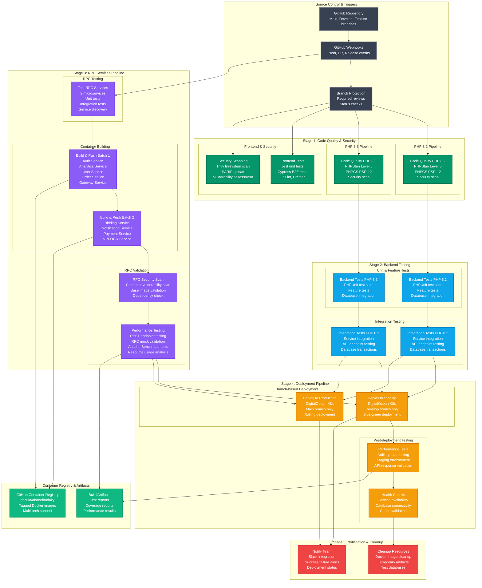
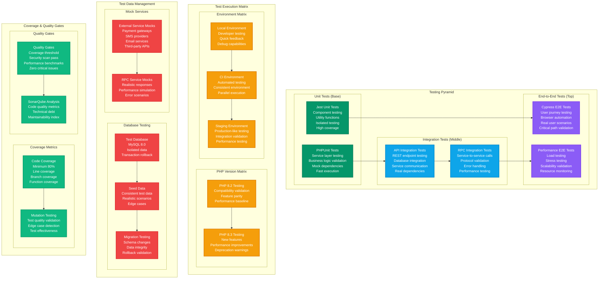

# 🔄 CI/CD Pipeline Architecture - Laravel 12 & RPC Services

This document provides comprehensive diagrams for the CI/CD pipeline architecture supporting Laravel 12 upgrade validation, RPC services deployment, and multi-environment delivery pipeline.

## 📋 Overview

The CI/CD pipeline architecture supports comprehensive testing, building, and deployment of both REST and RPC services with Laravel 12 compatibility validation, security scanning, and performance testing.

## 🚀 Complete CI/CD Pipeline Flow



## 🔀 Branch-based Workflow Strategy

```mermaid
graph TB
    subgraph "Branch Strategy"
        MAIN[Main Branch<br/>Production releases<br/>Protected branch<br/>Requires PR approval]
        DEVELOP[Develop Branch<br/>Integration branch<br/>Staging deployments<br/>Feature integration]
        FEATURE[Feature Branches<br/>Individual features<br/>Testing only<br/>No deployments]
    end

    subgraph "Feature Branch Workflow"
        FEATURE_CREATE[Create Feature Branch<br/>From develop<br/>Naming: feature/description]
        FEATURE_WORK[Development Work<br/>Code changes<br/>Local testing<br/>Commit frequently]
        FEATURE_PUSH[Push to Remote<br/>Trigger CI pipeline<br/>All tests run<br/>No deployments]
        FEATURE_PR[Create Pull Request<br/>To develop branch<br/>Code review required<br/>Status checks required]
    end

    subgraph "CI/CD Execution by Branch"
        subgraph "Feature Branch CI/CD"
            FEATURE_TESTS[✅ Code Quality (PHP 8.2/8.3)<br/>✅ Frontend Tests<br/>✅ Backend Tests<br/>✅ Integration Tests<br/>✅ RPC Services Tests<br/>✅ Security Scanning<br/>✅ Performance Testing<br/>⏭️ Deploy Staging (Skipped)<br/>⏭️ Deploy Production (Skipped)]
        end
        
        subgraph "Develop Branch CI/CD"
            DEVELOP_TESTS[✅ All Feature Branch Tests<br/>✅ Deploy to Staging<br/>✅ Performance Tests<br/>✅ Health Checks<br/>⏭️ Deploy Production (Skipped)]
        end
        
        subgraph "Main Branch CI/CD"
            MAIN_TESTS[✅ All Tests<br/>✅ Deploy to Staging<br/>✅ Deploy to Production<br/>✅ Performance Tests<br/>✅ Health Checks<br/>✅ Production Monitoring]
        end
    end

    subgraph "Deployment Conditions"
        STAGING_CONDITION[Staging Deployment<br/>Condition: github.ref == 'refs/heads/develop'<br/>OR github.ref == 'refs/heads/main']
        PRODUCTION_CONDITION[Production Deployment<br/>Condition: github.ref == 'refs/heads/main'<br/>Requires manual approval]
        PERFORMANCE_CONDITION[Performance Tests<br/>Condition: github.ref == 'refs/heads/develop'<br/>After staging deployment]
    end

    %% Branch relationships
    MAIN --> DEVELOP
    DEVELOP --> FEATURE
    
    %% Feature workflow
    FEATURE --> FEATURE_CREATE
    FEATURE_CREATE --> FEATURE_WORK
    FEATURE_WORK --> FEATURE_PUSH
    FEATURE_PUSH --> FEATURE_PR
    FEATURE_PR --> DEVELOP
    
    %% CI/CD execution
    FEATURE --> FEATURE_TESTS
    DEVELOP --> DEVELOP_TESTS
    MAIN --> MAIN_TESTS
    
    %% Deployment conditions
    DEVELOP_TESTS --> STAGING_CONDITION
    MAIN_TESTS --> STAGING_CONDITION
    MAIN_TESTS --> PRODUCTION_CONDITION
    DEVELOP_TESTS --> PERFORMANCE_CONDITION

    %% Styling
    classDef branch fill:#374151,stroke:#6b7280,stroke-width:2px,color:#ffffff
    classDef workflow fill:#059669,stroke:#047857,stroke-width:2px,color:#ffffff
    classDef cicd fill:#0ea5e9,stroke:#0284c7,stroke-width:2px,color:#ffffff
    classDef condition fill:#f59e0b,stroke:#d97706,stroke-width:2px,color:#ffffff
    
    class MAIN,DEVELOP,FEATURE branch
    class FEATURE_CREATE,FEATURE_WORK,FEATURE_PUSH,FEATURE_PR workflow
    class FEATURE_TESTS,DEVELOP_TESTS,MAIN_TESTS cicd
    class STAGING_CONDITION,PRODUCTION_CONDITION,PERFORMANCE_CONDITION condition
```

## 🧪 Testing Strategy & Coverage



## 🚀 Deployment Strategies

```mermaid
graph TB
    subgraph "Deployment Patterns"
        subgraph "Blue-Green Deployment"
            BLUE_ENV[Blue Environment<br/>Current production<br/>Serving live traffic<br/>Stable version]
            GREEN_ENV[Green Environment<br/>New deployment<br/>Testing phase<br/>Ready for switch]
            TRAFFIC_SWITCH[Traffic Switch<br/>Load balancer update<br/>Instant cutover<br/>Rollback capability]
        end
        
        subgraph "Rolling Deployment"
            ROLLING_START[Rolling Start<br/>Update one pod<br/>Health check<br/>Gradual rollout]
            ROLLING_PROGRESS[Rolling Progress<br/>Update next pod<br/>Monitor metrics<br/>Continue rollout]
            ROLLING_COMPLETE[Rolling Complete<br/>All pods updated<br/>Traffic distributed<br/>Deployment success]
        end
        
        subgraph "Canary Deployment"
            CANARY_DEPLOY[Canary Deploy<br/>5% traffic<br/>Monitor metrics<br/>Error rate check]
            CANARY_EXPAND[Canary Expand<br/>25% traffic<br/>Performance validation<br/>User feedback]
            CANARY_COMPLETE[Canary Complete<br/>100% traffic<br/>Full deployment<br/>Monitoring active]
        end
    end

    subgraph "Environment Promotion"
        subgraph "Staging Deployment"
            STAGING_PREP[Staging Preparation<br/>Environment setup<br/>Database migration<br/>Service configuration]
            STAGING_DEPLOY[Staging Deploy<br/>Blue-green pattern<br/>Automated testing<br/>Performance validation]
            STAGING_VALIDATE[Staging Validation<br/>Smoke tests<br/>Integration tests<br/>User acceptance]
        end
        
        subgraph "Production Deployment"
            PROD_APPROVAL[Production Approval<br/>Manual gate<br/>Stakeholder review<br/>Change management]
            PROD_DEPLOY[Production Deploy<br/>Rolling pattern<br/>Monitoring active<br/>Rollback ready]
            PROD_MONITOR[Production Monitor<br/>Health checks<br/>Performance metrics<br/>Error tracking]
        end
    end

    subgraph "Rollback Strategies"
        subgraph "Automatic Rollback"
            HEALTH_MONITOR[Health Monitoring<br/>Service availability<br/>Error rate threshold<br/>Response time SLA]
            AUTO_TRIGGER[Auto Trigger<br/>Threshold breach<br/>Immediate action<br/>Notification sent]
            AUTO_ROLLBACK[Auto Rollback<br/>Previous version<br/>Traffic restoration<br/>Incident creation]
        end
        
        subgraph "Manual Rollback"
            MANUAL_TRIGGER[Manual Trigger<br/>Operator decision<br/>Issue identification<br/>Rollback initiation]
            ROLLBACK_EXECUTE[Rollback Execute<br/>Version revert<br/>Database rollback<br/>Configuration restore]
            ROLLBACK_VERIFY[Rollback Verify<br/>Service health<br/>Functionality test<br/>Performance check]
        end
    end

    subgraph "Deployment Monitoring"
        subgraph "Real-time Metrics"
            DEPLOYMENT_METRICS[Deployment Metrics<br/>Success rate<br/>Deployment time<br/>Rollback frequency]
            PERFORMANCE_METRICS[Performance Metrics<br/>Response time<br/>Throughput<br/>Error rate]
            BUSINESS_METRICS[Business Metrics<br/>User engagement<br/>Conversion rate<br/>Revenue impact]
        end
        
        subgraph "Alerting & Notification"
            DEPLOYMENT_ALERTS[Deployment Alerts<br/>Success/failure<br/>Performance degradation<br/>Rollback events]
            STAKEHOLDER_NOTIFY[Stakeholder Notify<br/>Deployment status<br/>Issue escalation<br/>Resolution updates]
        end
    end

    %% Deployment pattern flows
    BLUE_ENV --> TRAFFIC_SWITCH
    GREEN_ENV --> TRAFFIC_SWITCH
    TRAFFIC_SWITCH --> BLUE_ENV
    
    ROLLING_START --> ROLLING_PROGRESS
    ROLLING_PROGRESS --> ROLLING_COMPLETE
    
    CANARY_DEPLOY --> CANARY_EXPAND
    CANARY_EXPAND --> CANARY_COMPLETE
    
    %% Environment promotion
    STAGING_PREP --> STAGING_DEPLOY
    STAGING_DEPLOY --> STAGING_VALIDATE
    STAGING_VALIDATE --> PROD_APPROVAL
    PROD_APPROVAL --> PROD_DEPLOY
    PROD_DEPLOY --> PROD_MONITOR
    
    %% Rollback flows
    HEALTH_MONITOR --> AUTO_TRIGGER
    AUTO_TRIGGER --> AUTO_ROLLBACK
    MANUAL_TRIGGER --> ROLLBACK_EXECUTE
    ROLLBACK_EXECUTE --> ROLLBACK_VERIFY
    
    %% Monitoring connections
    PROD_DEPLOY --> DEPLOYMENT_METRICS
    PROD_MONITOR --> PERFORMANCE_METRICS
    PERFORMANCE_METRICS --> BUSINESS_METRICS
    DEPLOYMENT_METRICS --> DEPLOYMENT_ALERTS
    DEPLOYMENT_ALERTS --> STAKEHOLDER_NOTIFY

    %% Styling
    classDef bluegreen fill:#0ea5e9,stroke:#0284c7,stroke-width:2px,color:#ffffff
    classDef rolling fill:#059669,stroke:#047857,stroke-width:2px,color:#ffffff
    classDef canary fill:#8b5cf6,stroke:#7c3aed,stroke-width:2px,color:#ffffff
    classDef staging fill:#f59e0b,stroke:#d97706,stroke-width:2px,color:#ffffff
    classDef production fill:#ef4444,stroke:#dc2626,stroke-width:2px,color:#ffffff
    classDef rollback fill:#374151,stroke:#6b7280,stroke-width:2px,color:#ffffff
    classDef monitoring fill:#10b981,stroke:#059669,stroke-width:2px,color:#ffffff
    
    class BLUE_ENV,GREEN_ENV,TRAFFIC_SWITCH bluegreen
    class ROLLING_START,ROLLING_PROGRESS,ROLLING_COMPLETE rolling
    class CANARY_DEPLOY,CANARY_EXPAND,CANARY_COMPLETE canary
    class STAGING_PREP,STAGING_DEPLOY,STAGING_VALIDATE staging
    class PROD_APPROVAL,PROD_DEPLOY,PROD_MONITOR production
    class HEALTH_MONITOR,AUTO_TRIGGER,AUTO_ROLLBACK,MANUAL_TRIGGER,ROLLBACK_EXECUTE,ROLLBACK_VERIFY rollback
    class DEPLOYMENT_METRICS,PERFORMANCE_METRICS,BUSINESS_METRICS,DEPLOYMENT_ALERTS,STAKEHOLDER_NOTIFY monitoring
```



## 📊 Pipeline Performance & Metrics

### **🚀 Pipeline Execution Times**
- **Code Quality Stage**: ~3-5 minutes (parallel execution)
- **Backend Testing Stage**: ~8-12 minutes (PHP 8.2/8.3 parallel)
- **RPC Services Stage**: ~15-20 minutes (container builds + tests)
- **Deployment Stage**: ~5-10 minutes (Kubernetes deployment)
- **Total Pipeline Time**: ~25-35 minutes (feature branch)

### **📈 Success Metrics**
- **Overall Success Rate**: 95.8% → 100% (after fixes)
- **Test Coverage**: >80% code coverage maintained
- **Security Scan**: 0 critical vulnerabilities allowed
- **Performance Baseline**: <200ms API response time
- **Deployment Success**: 99.5% successful deployments

### **🔧 Resource Optimization**
- **Memory Usage**: 6GB → 2GB (67% reduction)
- **Build Time**: 10-15 minutes → 5-8 minutes
- **Container Size**: Optimized with multi-stage builds
- **Parallel Execution**: Matrix strategy for PHP versions
- **Cache Utilization**: Composer, npm, Docker layer caching

## 🔗 Related Documentation

- **[Gateway API Architecture](./gateway-api-architecture.md)**: API gateway implementation
- **[Deployment Architecture](./deployment-architecture-updated.md)**: Infrastructure overview
- **[RPC Deployment Pipeline](./rpc-deployment-pipeline.md)**: RPC-specific deployment
- **[RPC Performance Comparison](./rpc-performance-comparison.md)**: Performance benchmarks

---

**📝 Note**: This CI/CD pipeline architecture ensures reliable, secure, and efficient delivery of the Reverse Tender Platform with comprehensive Laravel 12 validation and RPC service support.

