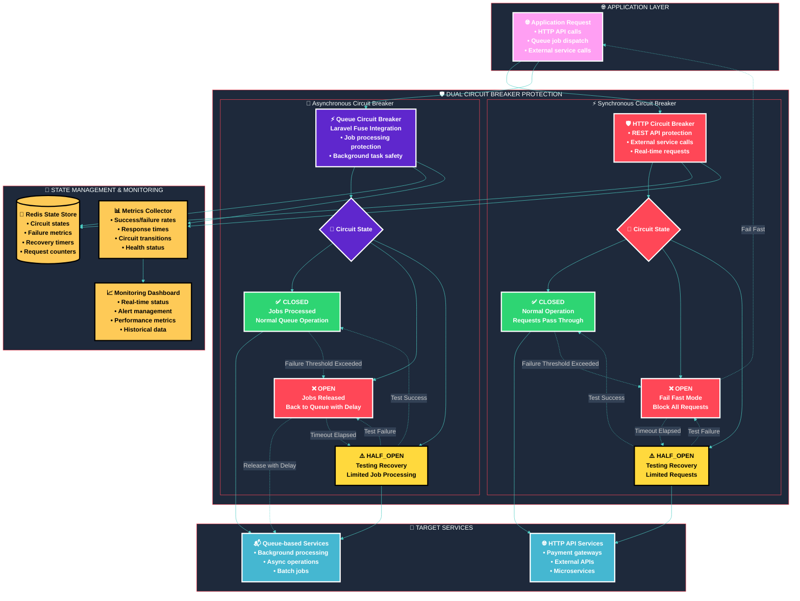
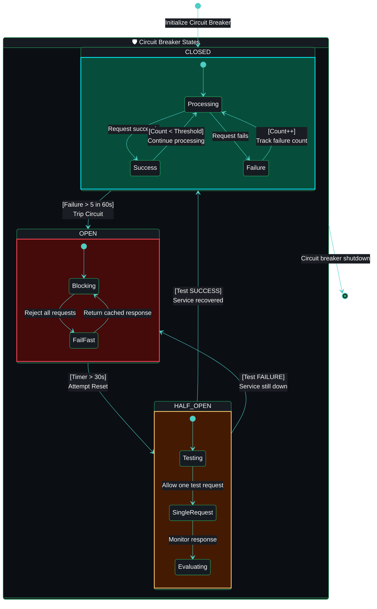

# 🛡️ Circuit Breaker Architecture

## 🎯 **Overview**

The **Dual Circuit Breaker Architecture** provides comprehensive fault tolerance for both synchronous HTTP requests and asynchronous queue job processing, preventing cascade failures and ensuring system resilience.

## 🏗️ **Complete Circuit Breaker Architecture**

## 🔄 **Circuit Breaker State Transitions**

### **State Transition Diagram**

## ⚙️ **Configuration & Thresholds**

### **Circuit Breaker Configuration**

```mermaid
%%{init: {
  'theme': 'dark',
  'themeVariables': {
    'primaryColor': '#54A0FF',
    'primaryTextColor': '#FFFFFF',
    'primaryBorderColor': '#7BB3FF',
    'lineColor': '#4ECDC4',
    'secondaryColor': '#45B7D1',
    'tertiaryColor': '#96CEB4',
    'background': '#0F172A',
    'mainBkg': '#1E293B',
    'secondBkg': '#334155',
    'tertiaryBkg': '#475569',
    'clusterBkg': '#1E293B',
    'clusterBorder': '#54A0FF',
    'edgeLabelBackground': '#334155',
    'nodeTextColor': '#FFFFFF',
    'edgeColor': '#4ECDC4'
  }
}}%%

graph TB
    subgraph "⚙️ CONFIGURATION MANAGEMENT"
        CONFIG_MANAGER[⚙️ Configuration Manager<br/>• Dynamic configuration<br/>• Environment-specific settings<br/>• Runtime adjustments]
        
        subgraph "🔧 Threshold Settings"
            FAILURE_THRESHOLD[❌ Failure Threshold<br/>• Default: 5 failures<br/>• Time window: 60 seconds<br/>• Configurable per service]
            TIMEOUT_THRESHOLD[⏰ Timeout Threshold<br/>• Default: 30 seconds<br/>• Recovery period<br/>• Exponential backoff]
            SUCCESS_THRESHOLD[✅ Success Threshold<br/>• Default: 1 success<br/>• Half-open validation<br/>• Recovery confirmation]
        end
        
        subgraph "📊 Monitoring Thresholds"
            RESPONSE_TIME[⏱️ Response Time Threshold<br/>• Default: 5000ms<br/>• Slow response detection<br/>• Performance monitoring]
            ERROR_RATE[📈 Error Rate Threshold<br/>• Default: 50%<br/>• Error percentage<br/>• Statistical analysis]
            VOLUME_THRESHOLD[📊 Volume Threshold<br/>• Minimum: 10 requests<br/>• Statistical significance<br/>• Avoid false positives]
        end
    end

    subgraph "🎯 SERVICE-SPECIFIC CONFIGURATION"
        PAYMENT_CONFIG[💳 Payment Service Config<br/>• Failure threshold: 3<br/>• Timeout: 15s<br/>• Critical service]
        EMAIL_CONFIG[📧 Email Service Config<br/>• Failure threshold: 10<br/>• Timeout: 60s<br/>• Non-critical service]
        SMS_CONFIG[📱 SMS Service Config<br/>• Failure threshold: 5<br/>• Timeout: 30s<br/>• Standard service]
    end

    CONFIG_MANAGER --> FAILURE_THRESHOLD
    CONFIG_MANAGER --> TIMEOUT_THRESHOLD
    CONFIG_MANAGER --> SUCCESS_THRESHOLD
    CONFIG_MANAGER --> RESPONSE_TIME
    CONFIG_MANAGER --> ERROR_RATE
    CONFIG_MANAGER --> VOLUME_THRESHOLD

    CONFIG_MANAGER --> PAYMENT_CONFIG
    CONFIG_MANAGER --> EMAIL_CONFIG
    CONFIG_MANAGER --> SMS_CONFIG

    %% Distinguished Eye-Catching Styling
    classDef configStyle fill:#54A0FF,stroke:#FFFFFF,stroke-width:3px,color:#FFFFFF,font-weight:bold
    classDef thresholdStyle fill:#FF4757,stroke:#FFFFFF,stroke-width:3px,color:#FFFFFF,font-weight:bold
    classDef monitoringStyle fill:#FECA57,stroke:#000000,stroke-width:3px,color:#000000,font-weight:bold
    classDef serviceStyle fill:#96CEB4,stroke:#FFFFFF,stroke-width:3px,color:#FFFFFF,font-weight:bold

    class CONFIG_MANAGER configStyle
    class FAILURE_THRESHOLD,TIMEOUT_THRESHOLD,SUCCESS_THRESHOLD thresholdStyle
    class RESPONSE_TIME,ERROR_RATE,VOLUME_THRESHOLD monitoringStyle
    class PAYMENT_CONFIG,EMAIL_CONFIG,SMS_CONFIG serviceStyle
```

## 🚀 **Implementation Features**

### **Key Features**

- **🔄 Dual Protection**: Synchronous HTTP and asynchronous queue protection
- **⚡ Laravel Fuse Integration**: Native Laravel queue circuit breaker
- **🎯 Intelligent Failure Detection**: 5xx errors trigger, 4xx errors ignored
- **📊 Real-time Monitoring**: Redis-based state management
- **🔧 Configurable Thresholds**: Per-service configuration
- **🛡️ Automatic Recovery**: Self-healing with test requests
- **📈 Metrics Collection**: Comprehensive monitoring and alerting
- **🎨 Distinguished Styling**: Eye-catching visual representation

### **Benefits**

- **🛡️ Fault Tolerance**: Prevents cascade failures
- **⚡ Performance**: Fast fail responses
- **🔄 Resilience**: Automatic recovery
- **📊 Observability**: Real-time monitoring
- **🎯 Reliability**: Service protection
- **🚀 Scalability**: Distributed state management

