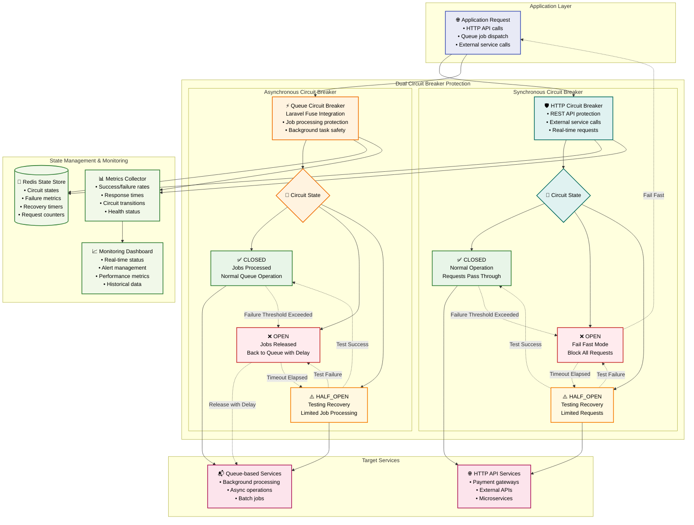
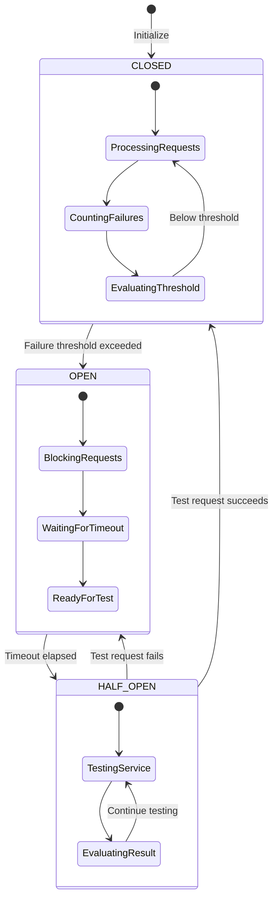
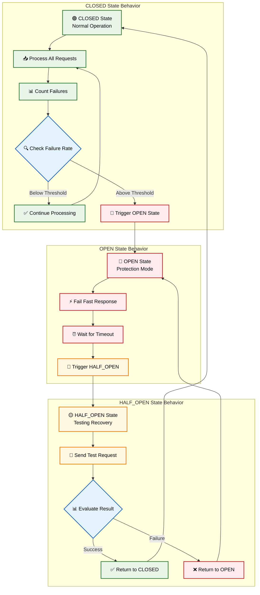
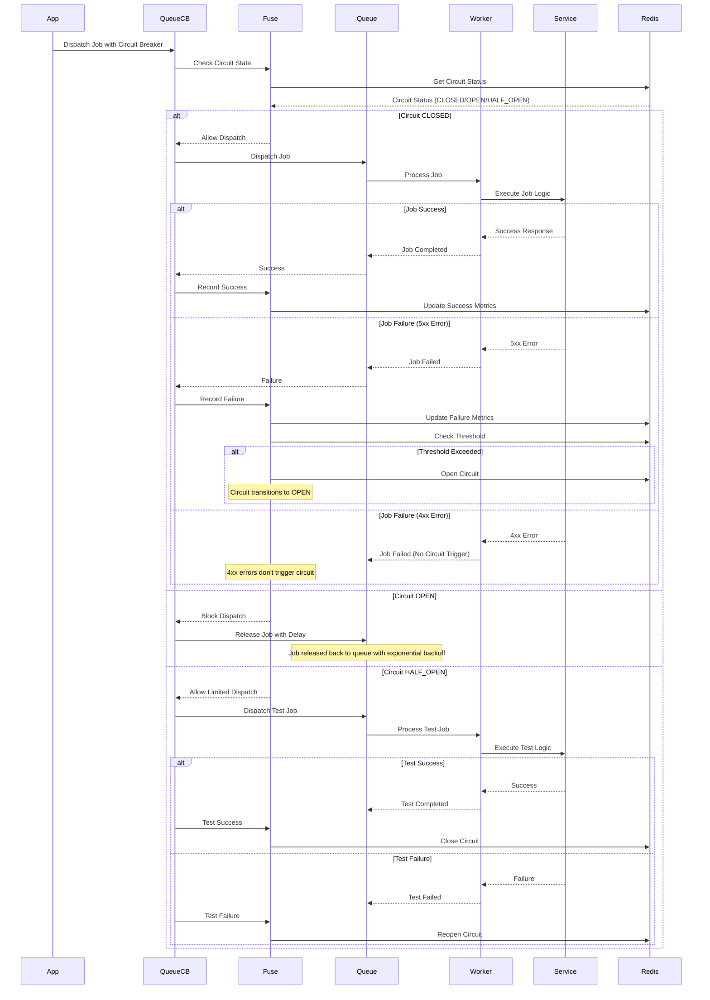
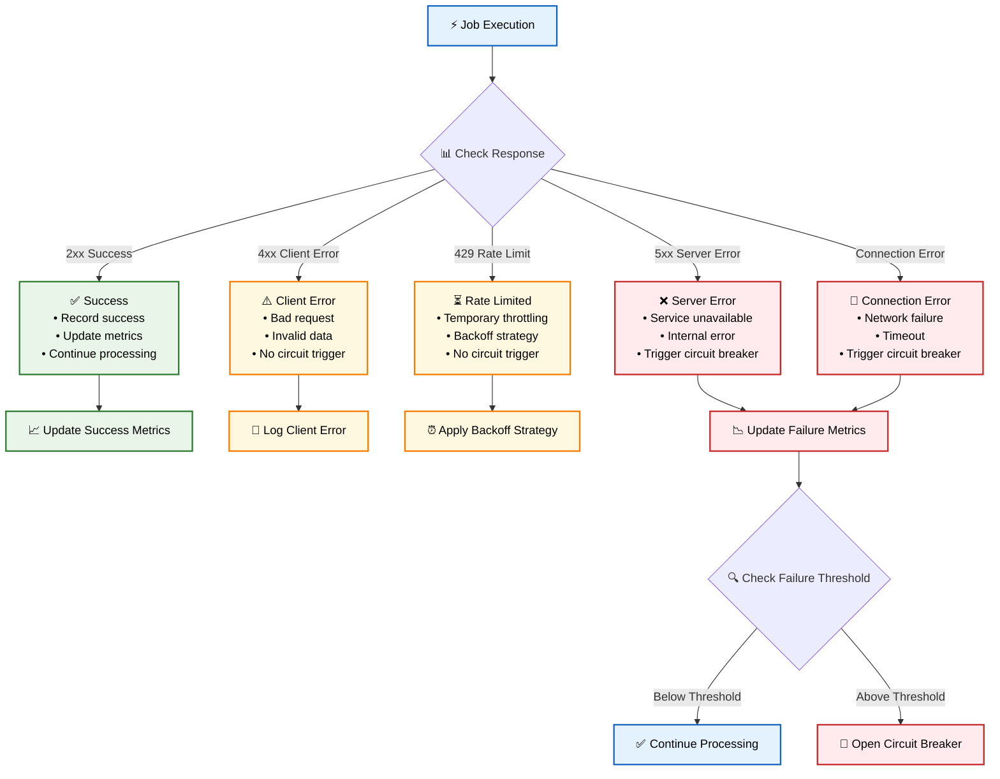
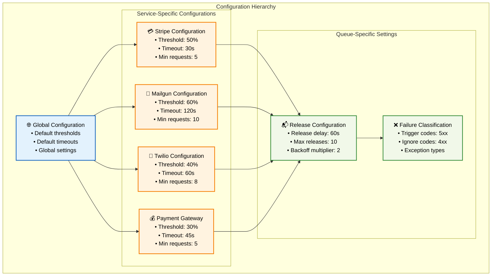
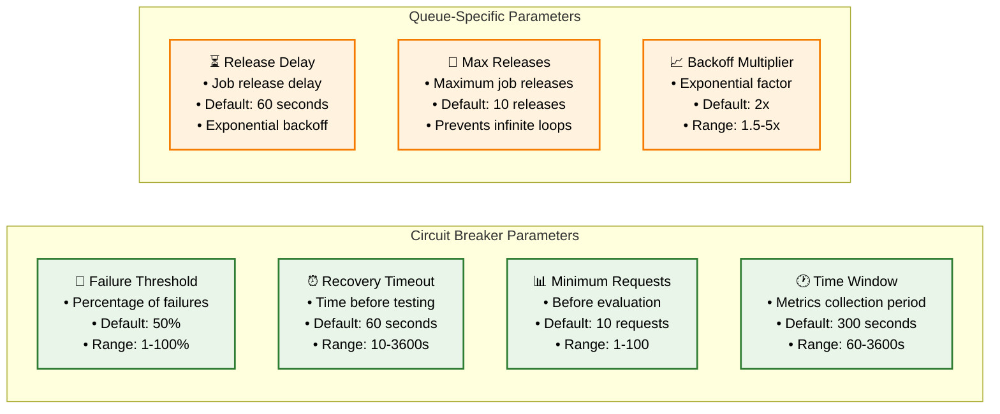
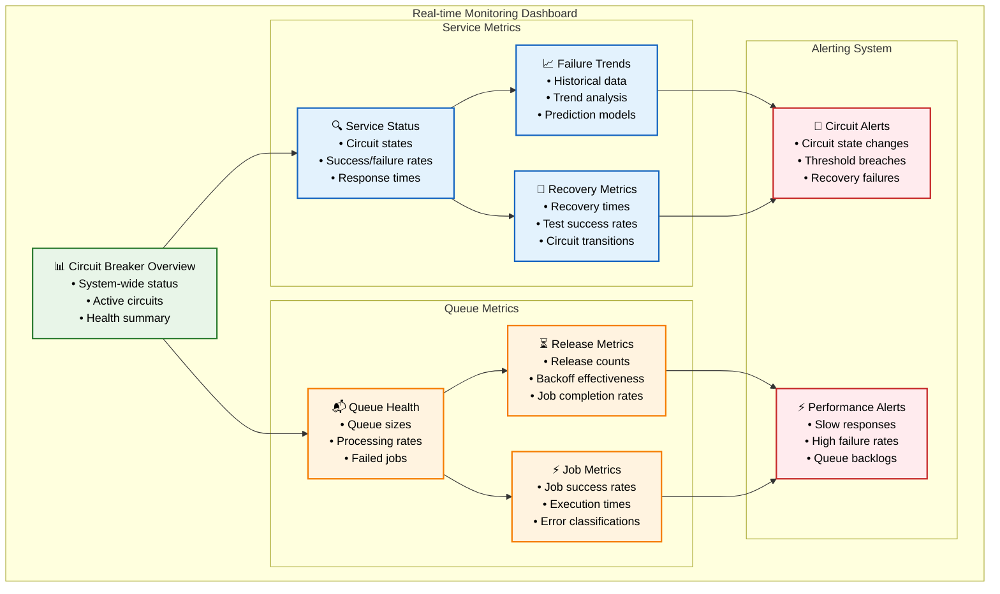
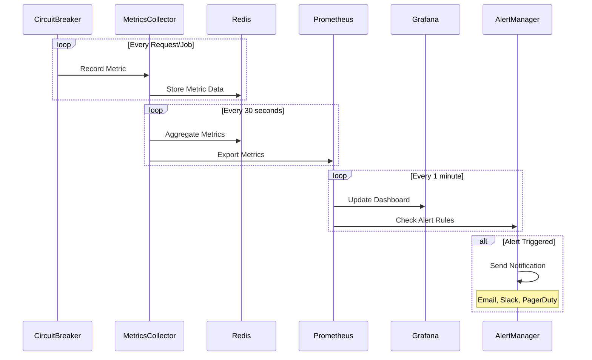

# 🛡️ Circuit Breaker Architecture

## 🎯 **Overview**

The **Dual Circuit Breaker Architecture** provides comprehensive fault tolerance for both synchronous HTTP requests and asynchronous queue job processing, preventing cascade failures and ensuring system resilience.

## 🏗️ **Complete Circuit Breaker Architecture**

## 🔄 **Circuit Breaker State Transitions**

### **State Transition Diagram**

### **Detailed State Behavior**

## ⚡ **Laravel Fuse Queue Circuit Breaker**

### **Queue Job Protection Flow**

### **Failure Classification Logic**

## 🔧 **Configuration Management**

### **Circuit Breaker Configuration Structure**

### **Configuration Parameters**

## 📊 **Monitoring & Metrics**

### **Circuit Breaker Metrics Dashboard**

### **Metrics Collection Flow**

## 🎯 **Key Benefits**

### **🛡️ Comprehensive Fault Tolerance**
- **Dual Protection** for both sync and async operations
- **Intelligent Failure Classification** (5xx triggers, 4xx ignored)
- **Automatic Recovery Testing** with gradual restoration
- **Cascade Failure Prevention** across service boundaries

### **⚡ Performance Optimization**
- **Fail Fast Responses** during service outages
- **Resource Conservation** by avoiding doomed requests
- **Queue Protection** with intelligent job release strategies
- **Exponential Backoff** to prevent service overload

### **🔍 Advanced Monitoring**
- **Real-time Circuit State Visibility** across all services
- **Comprehensive Metrics Collection** with historical trends
- **Proactive Alerting** for threshold breaches and failures
- **Performance Analytics** for optimization insights

### **🔧 Flexible Configuration**
- **Service-Specific Tuning** for optimal protection
- **Dynamic Configuration** without service restarts
- **Environment-Specific Settings** for different deployment stages
- **Granular Control** over failure thresholds and timeouts

This dual circuit breaker architecture provides enterprise-grade fault tolerance with comprehensive protection for both synchronous and asynchronous operations, ensuring system resilience and optimal performance under various failure conditions.

