# 🔄 Data Flow Diagram (DFD) - Reverse Tender Platform

```mermaid
graph TD
    %% External Entities
    CUSTOMER[👤 Customer]
    MERCHANT[🏪 Merchant]
    ADMIN[👨‍💼 Admin]
    ZATCA[🏛️ ZATCA System]
    SMS_PROVIDER[📱 SMS Provider]
    EMAIL_PROVIDER[📧 Email Provider]
    
    %% Level 0 - Context Diagram
    SYSTEM[🎯 Reverse Tender Platform<br/>Complete System]
    
    %% Level 1 - Major Processes
    P1[1.0<br/>🔐 User Management<br/>Registration, Login, Profiles]
    P2[2.0<br/>📋 Order Management<br/>Create, Publish, Track Orders]
    P3[3.0<br/>🎯 Bidding System<br/>Submit, Manage, Award Bids]
    P4[4.0<br/>💳 Payment Processing<br/>Payments, Invoicing, ZATCA]
    P5[5.0<br/>📢 Notification System<br/>Multi-channel Notifications]
    P6[6.0<br/>📊 Analytics & Reporting<br/>Business Intelligence]
    P7[7.0<br/>🔍 VIN OCR Processing<br/>Vehicle Recognition]
    
    %% Data Stores
    DS1[(D1: Users<br/>User accounts, profiles, auth)]
    DS2[(D2: Orders<br/>Part requests, status, history)]
    DS3[(D3: Bids<br/>Bid data, messages, awards)]
    DS4[(D4: Payments<br/>Transactions, invoices)]
    DS5[(D5: Notifications<br/>Messages, preferences)]
    DS6[(D6: Analytics<br/>Metrics, reports, logs)]
    DS7[(D7: Vehicles<br/>Vehicle data, VIN records)]
    DS8[(D8: System Config<br/>Settings, templates)]
    
    %% External Entity to System
    CUSTOMER --> SYSTEM
    MERCHANT --> SYSTEM
    ADMIN --> SYSTEM
    SYSTEM --> ZATCA
    SYSTEM --> SMS_PROVIDER
    SYSTEM --> EMAIL_PROVIDER
    
    %% System to Processes
    SYSTEM --> P1
    SYSTEM --> P2
    SYSTEM --> P3
    SYSTEM --> P4
    SYSTEM --> P5
    SYSTEM --> P6
    SYSTEM --> P7
    
    %% Process to Data Store Relationships
    P1 --> DS1
    P1 --> DS7
    P2 --> DS2
    P2 --> DS1
    P3 --> DS3
    P3 --> DS2
    P4 --> DS4
    P4 --> DS3
    P5 --> DS5
    P5 --> DS1
    P6 --> DS6
    P6 --> DS1
    P6 --> DS2
    P6 --> DS3
    P7 --> DS7
    P7 --> DS2
    
    %% Data Store to Process (Read operations)
    DS1 --> P2
    DS1 --> P3
    DS1 --> P4
    DS1 --> P5
    DS2 --> P3
    DS2 --> P4
    DS2 --> P6
    DS3 --> P4
    DS3 --> P6
    DS7 --> P2
    DS8 --> P1
    DS8 --> P2
    DS8 --> P3
    DS8 --> P4
    DS8 --> P5
    
    %% Styling
    classDef entity fill:#e1f5fe,stroke:#01579b,stroke-width:2px
    classDef process fill:#e8f5e8,stroke:#1b5e20,stroke-width:2px
    classDef datastore fill:#fff3e0,stroke:#e65100,stroke-width:2px
    classDef system fill:#f3e5f5,stroke:#4a148c,stroke-width:3px
    
    class CUSTOMER,MERCHANT,ADMIN,ZATCA,SMS_PROVIDER,EMAIL_PROVIDER entity
    class P1,P2,P3,P4,P5,P6,P7 process
    class DS1,DS2,DS3,DS4,DS5,DS6,DS7,DS8 datastore
    class SYSTEM system
```

## 📊 Detailed Process Flows

### **1.0 User Management Process**

### **2.0 Order Management Process**

### **3.0 Bidding System Process**

### **4.0 Payment Processing**

## 🔄 Data Flow Characteristics

### **1. Real-time Data Flows**
- **Bidding Updates**: Instant bid notifications via WebSocket
- **Order Status**: Real-time order tracking updates
- **Payment Status**: Immediate payment confirmations
- **Chat Messages**: Live communication between users

### **2. Batch Data Flows**
- **Analytics Processing**: Hourly/daily metric calculations
- **Report Generation**: Weekly/monthly business reports
- **Email Campaigns**: Scheduled promotional emails
- **Data Backups**: Daily database backups

### **3. Event-Driven Flows**
- **Order Events**: Creation, publishing, completion
- **Bid Events**: Submission, updates, awards
- **Payment Events**: Processing, confirmation, refunds
- **User Events**: Registration, verification, profile updates

### **4. External Integration Flows**
- **ZATCA API**: E-invoice submission and validation
- **SMS Providers**: OTP and notification delivery
- **Email Services**: Transactional and marketing emails
- **Payment Gateways**: Transaction processing

## 📈 Performance Considerations

### **High-Volume Data Flows**
- **User Analytics**: Millions of events per day
- **Notification Delivery**: Thousands of notifications per minute
- **Bid Updates**: Real-time updates during peak hours
- **Payment Processing**: Concurrent transaction handling

### **Optimization Strategies**
- **Caching**: Redis for frequently accessed data
- **Queue Processing**: Asynchronous job processing
- **Database Optimization**: Proper indexing and query optimization
- **CDN Integration**: Static asset delivery optimization

### **Scalability Patterns**
- **Horizontal Scaling**: Multiple service instances
- **Load Balancing**: Traffic distribution across services
- **Database Sharding**: Data distribution strategies
- **Message Queue Scaling**: Redis cluster for high throughput

This data flow architecture ensures efficient, scalable, and reliable data processing across all components of the Reverse Tender Platform.

