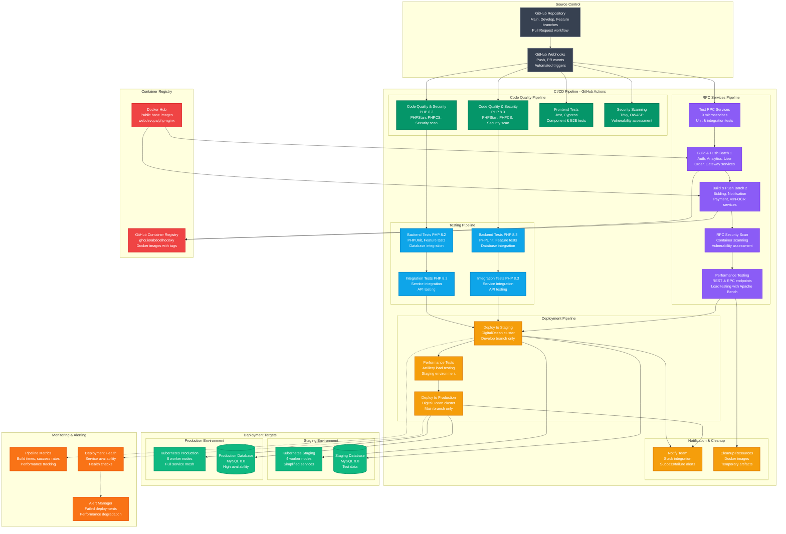

# 🚀 Deployment Architecture - Multi-Cloud Infrastructure with Gateway API

This document outlines the comprehensive deployment architecture for the Reverse Tender Platform, featuring multi-cloud infrastructure, Kubernetes Gateway API implementation, high availability, disaster recovery, and advanced CI/CD pipelines with Laravel 12 support.

## 📋 Overview

The deployment architecture leverages modern cloud-native technologies with Kubernetes Gateway API, multi-cloud redundancy, and comprehensive CI/CD pipelines supporting both REST and RPC services.

## 🏗️ Multi-Cloud Infrastructure Overview

```mermaid
graph TB
    subgraph "Global DNS & CDN"
        CLOUDFLARE[Cloudflare CDN<br/>Global Edge Locations<br/>DDoS Protection]
        DNS[DNS Management<br/>Geo-routing<br/>Health Checks]
    end

    subgraph "Primary Cloud - DigitalOcean"
        subgraph "DO Production Cluster"
            DO_LB[DigitalOcean Load Balancer<br/>High Availability<br/>SSL Termination]
            
            subgraph "DO Kubernetes Cluster"
                DO_MASTER[Control Plane<br/>3 Master Nodes<br/>Managed Service]
                
                subgraph "DO Worker Nodes"
                    DO_WORKER_1[Worker Node 1<br/>8 CPU, 32GB RAM<br/>Gateway API Controller]
                    DO_WORKER_2[Worker Node 2<br/>8 CPU, 32GB RAM<br/>REST Services]
                    DO_WORKER_3[Worker Node 3<br/>8 CPU, 32GB RAM<br/>RPC Services]
                    DO_WORKER_4[Worker Node 4<br/>4 CPU, 16GB RAM<br/>Specialized Services]
                end
            end
            
            subgraph "DO Data Layer"
                DO_DB_PRIMARY[(MySQL Primary<br/>16 CPU, 64GB RAM<br/>SSD Storage)]
                DO_DB_REPLICA[(MySQL Replica<br/>8 CPU, 32GB RAM<br/>Read Queries)]
                DO_REDIS[Redis Cluster<br/>6 Nodes<br/>32GB Memory]
            end
        end
        
        subgraph "DO Staging Environment"
            DO_STAGING[Staging Cluster<br/>4 Worker Nodes<br/>Simplified Setup]
        end
    end

    subgraph "Secondary Cloud - Linode"
        subgraph "Linode DR Cluster"
            LINODE_LB[Linode Load Balancer<br/>Disaster Recovery<br/>Standby Mode]
            
            subgraph "Linode Kubernetes Cluster"
                LINODE_MASTER[Control Plane<br/>3 Master Nodes<br/>LKE Service]
                
                subgraph "Linode Worker Nodes"
                    LINODE_WORKER_1[Worker Node 1<br/>8 CPU, 32GB RAM<br/>Gateway Services]
                    LINODE_WORKER_2[Worker Node 2<br/>8 CPU, 32GB RAM<br/>Core Services]
                    LINODE_WORKER_3[Worker Node 3<br/>4 CPU, 16GB RAM<br/>Support Services]
                end
            end
            
            subgraph "Linode Data Layer"
                LINODE_DB[(MySQL Standby<br/>16 CPU, 64GB RAM<br/>Async Replication)]
                LINODE_REDIS[Redis Standby<br/>3 Nodes<br/>16GB Memory]
            end
        end
    end

    subgraph "Monitoring & Observability"
        PROMETHEUS[Prometheus<br/>Multi-cluster<br/>Federation]
        GRAFANA[Grafana<br/>Unified Dashboards<br/>Alerting]
        JAEGER[Jaeger<br/>Distributed Tracing<br/>Cross-cluster]
        LOKI[Loki<br/>Log Aggregation<br/>Multi-tenant]
    end

    %% Traffic flow
    CLOUDFLARE --> DNS
    DNS --> DO_LB
    DNS -.-> LINODE_LB
    
    DO_LB --> DO_MASTER
    DO_MASTER --> DO_WORKER_1
    DO_MASTER --> DO_WORKER_2
    DO_MASTER --> DO_WORKER_3
    DO_MASTER --> DO_WORKER_4
    
    LINODE_LB -.-> LINODE_MASTER
    LINODE_MASTER -.-> LINODE_WORKER_1
    LINODE_MASTER -.-> LINODE_WORKER_2
    LINODE_MASTER -.-> LINODE_WORKER_3
    
    %% Data replication
    DO_DB_PRIMARY --> DO_DB_REPLICA
    DO_DB_PRIMARY -.-> LINODE_DB
    DO_REDIS -.-> LINODE_REDIS
    
    %% Monitoring connections
    PROMETHEUS --> DO_WORKER_1
    PROMETHEUS --> LINODE_WORKER_1
    GRAFANA --> PROMETHEUS
    JAEGER --> DO_WORKER_2
    JAEGER --> LINODE_WORKER_2
    LOKI --> DO_WORKER_3
    LOKI --> LINODE_WORKER_3

    %% Styling
    classDef primary fill:#0ea5e9,stroke:#0284c7,stroke-width:3px,color:#ffffff
    classDef secondary fill:#8b5cf6,stroke:#7c3aed,stroke-width:2px,color:#ffffff
    classDef data fill:#f59e0b,stroke:#d97706,stroke-width:2px,color:#ffffff
    classDef monitor fill:#10b981,stroke:#059669,stroke-width:2px,color:#ffffff
    classDef global fill:#ef4444,stroke:#dc2626,stroke-width:3px,color:#ffffff
    
    class DO_LB,DO_MASTER,DO_WORKER_1,DO_WORKER_2,DO_WORKER_3,DO_WORKER_4,DO_STAGING primary
    class LINODE_LB,LINODE_MASTER,LINODE_WORKER_1,LINODE_WORKER_2,LINODE_WORKER_3 secondary
    class DO_DB_PRIMARY,DO_DB_REPLICA,DO_REDIS,LINODE_DB,LINODE_REDIS data
    class PROMETHEUS,GRAFANA,JAEGER,LOKI monitor
    class CLOUDFLARE,DNS global
```

## 🔄 CI/CD Pipeline Architecture

## 🛡️ Security & Compliance Architecture

## 📊 Monitoring & Observability Stack

```mermaid
graph TB
    subgraph "Data Collection Layer"
        subgraph "Metrics Collection"
            PROM_GATEWAY[Prometheus<br/>Gateway API metrics<br/>Request rate, latency, errors]
            PROM_SERVICES[Prometheus<br/>Service metrics<br/>CPU, memory, custom metrics]
            PROM_INFRA[Prometheus<br/>Infrastructure metrics<br/>Node, cluster, storage]
        end
        
        subgraph "Log Collection"
            FLUENTD[Fluentd<br/>Log aggregation<br/>Multi-format parsing]
            LOKI[Loki<br/>Log storage<br/>Label-based indexing]
            FILEBEAT[Filebeat<br/>Log shipping<br/>Lightweight collector]
        end
        
        subgraph "Trace Collection"
            JAEGER_AGENT[Jaeger Agent<br/>Trace collection<br/>Sampling strategies]
            JAEGER_COLLECTOR[Jaeger Collector<br/>Trace processing<br/>Storage backend]
            OTEL_COLLECTOR[OpenTelemetry<br/>Unified collection<br/>Multi-vendor support]
        end
    end

    subgraph "Storage Layer"
        subgraph "Time Series Storage"
            PROM_STORAGE[Prometheus Storage<br/>Local TSDB<br/>15 days retention]
            THANOS[Thanos<br/>Long-term storage<br/>Object storage backend]
            VICTORIA_METRICS[VictoriaMetrics<br/>High-performance TSDB<br/>Prometheus compatible]
        end
        
        subgraph "Log Storage"
            LOKI_STORAGE[Loki Storage<br/>Object storage<br/>Compressed chunks]
            ELASTICSEARCH[Elasticsearch<br/>Full-text search<br/>Log analytics]
        end
        
        subgraph "Trace Storage"
            JAEGER_STORAGE[Jaeger Storage<br/>Elasticsearch backend<br/>Trace analytics]
            CASSANDRA[Cassandra<br/>Distributed storage<br/>High availability]
        end
    end

    subgraph "Visualization & Analysis"
        subgraph "Dashboards"
            GRAFANA_MAIN[Grafana<br/>Main dashboards<br/>Business metrics]
            GRAFANA_INFRA[Grafana<br/>Infrastructure dashboards<br/>System metrics]
            GRAFANA_APP[Grafana<br/>Application dashboards<br/>Service metrics]
        end
        
        subgraph "Analysis Tools"
            KIBANA[Kibana<br/>Log analysis<br/>Search & visualization]
            JAEGER_UI[Jaeger UI<br/>Trace analysis<br/>Performance debugging]
            PROMETHEUS_UI[Prometheus UI<br/>Query interface<br/>Metric exploration]
        end
    end

    subgraph "Alerting & Notification"
        subgraph "Alert Management"
            ALERT_MANAGER[AlertManager<br/>Alert routing<br/>Deduplication]
            ALERT_RULES[Alert Rules<br/>Threshold-based<br/>Anomaly detection]
            ESCALATION[Escalation Policies<br/>Multi-level alerts<br/>On-call rotation]
        end
        
        subgraph "Notification Channels"
            SLACK_ALERTS[Slack<br/>Team notifications<br/>Channel routing]
            EMAIL_ALERTS[Email<br/>Critical alerts<br/>Management notifications]
            PAGERDUTY[PagerDuty<br/>Incident management<br/>On-call alerts]
            WEBHOOK_ALERTS[Webhooks<br/>Custom integrations<br/>External systems]
        end
    end

    subgraph "Health Checks & SLOs"
        subgraph "Health Monitoring"
            HEALTH_CHECKS[Health Checks<br/>Service availability<br/>Dependency checks]
            SYNTHETIC_MONITORING[Synthetic Monitoring<br/>End-to-end tests<br/>User journey simulation]
            UPTIME_MONITORING[Uptime Monitoring<br/>External monitoring<br/>Global checks]
        end
        
        subgraph "SLO Management"
            SLO_DEFINITION[SLO Definition<br/>Availability targets<br/>Performance targets]
            ERROR_BUDGET[Error Budget<br/>SLO tracking<br/>Budget alerts]
            SLI_MONITORING[SLI Monitoring<br/>Service level indicators<br/>Real-time tracking]
        end
    end

    %% Data flow connections
    PROM_GATEWAY --> PROM_STORAGE
    PROM_SERVICES --> PROM_STORAGE
    PROM_INFRA --> PROM_STORAGE
    PROM_STORAGE --> THANOS
    PROM_STORAGE --> VICTORIA_METRICS
    
    FLUENTD --> LOKI
    LOKI --> LOKI_STORAGE
    FILEBEAT --> ELASTICSEARCH
    
    JAEGER_AGENT --> JAEGER_COLLECTOR
    JAEGER_COLLECTOR --> JAEGER_STORAGE
    OTEL_COLLECTOR --> JAEGER_COLLECTOR
    JAEGER_STORAGE --> CASSANDRA
    
    %% Visualization connections
    PROM_STORAGE --> GRAFANA_MAIN
    PROM_STORAGE --> GRAFANA_INFRA
    PROM_STORAGE --> GRAFANA_APP
    ELASTICSEARCH --> KIBANA
    JAEGER_STORAGE --> JAEGER_UI
    PROM_STORAGE --> PROMETHEUS_UI
    
    %% Alerting connections
    PROM_STORAGE --> ALERT_RULES
    ALERT_RULES --> ALERT_MANAGER
    ALERT_MANAGER --> ESCALATION
    ESCALATION --> SLACK_ALERTS
    ESCALATION --> EMAIL_ALERTS
    ESCALATION --> PAGERDUTY
    ESCALATION --> WEBHOOK_ALERTS
    
    %% Health and SLO connections
    HEALTH_CHECKS --> SYNTHETIC_MONITORING
    SYNTHETIC_MONITORING --> UPTIME_MONITORING
    SLO_DEFINITION --> ERROR_BUDGET
    ERROR_BUDGET --> SLI_MONITORING
    SLI_MONITORING --> ALERT_RULES

    %% Styling
    classDef collection fill:#059669,stroke:#047857,stroke-width:2px,color:#ffffff
    classDef storage fill:#dc2626,stroke:#b91c1c,stroke-width:2px,color:#ffffff
    classDef visualization fill:#0ea5e9,stroke:#0284c7,stroke-width:2px,color:#ffffff
    classDef alerting fill:#f59e0b,stroke:#d97706,stroke-width:2px,color:#ffffff
    classDef health fill:#8b5cf6,stroke:#7c3aed,stroke-width:2px,color:#ffffff
    
    class PROM_GATEWAY,PROM_SERVICES,PROM_INFRA,FLUENTD,LOKI,FILEBEAT,JAEGER_AGENT,JAEGER_COLLECTOR,OTEL_COLLECTOR collection
    class PROM_STORAGE,THANOS,VICTORIA_METRICS,LOKI_STORAGE,ELASTICSEARCH,JAEGER_STORAGE,CASSANDRA storage
    class GRAFANA_MAIN,GRAFANA_INFRA,GRAFANA_APP,KIBANA,JAEGER_UI,PROMETHEUS_UI visualization
    class ALERT_MANAGER,ALERT_RULES,ESCALATION,SLACK_ALERTS,EMAIL_ALERTS,PAGERDUTY,WEBHOOK_ALERTS alerting
    class HEALTH_CHECKS,SYNTHETIC_MONITORING,UPTIME_MONITORING,SLO_DEFINITION,ERROR_BUDGET,SLI_MONITORING health
```

## 🚀 Key Features & Benefits

### **🌟 Multi-Cloud Advantages**
- **High Availability**: 99.99% uptime with multi-cloud redundancy
- **Disaster Recovery**: Automated failover between DigitalOcean and Linode
- **Geographic Distribution**: Global edge locations with Cloudflare CDN
- **Cost Optimization**: Resource optimization across cloud providers
- **Vendor Independence**: No single cloud provider lock-in

### **🔄 CI/CD Pipeline Benefits**
- **Automated Testing**: Comprehensive test coverage for PHP 8.2/8.3
- **Security Integration**: Built-in security scanning and vulnerability assessment
- **Performance Validation**: Automated performance testing with Apache Bench
- **Branch-based Deployment**: Secure deployment workflow with branch protection
- **Container Security**: Image scanning and secure base images

### **🛡️ Security Features**
- **Zero Trust Architecture**: Network policies and service mesh security
- **Compliance Ready**: GDPR, SOC 2, ISO 27001 compliance frameworks
- **Encryption Everywhere**: Data encryption at rest and in transit
- **Identity Management**: JWT, OAuth, and RBAC integration
- **Continuous Monitoring**: Real-time security monitoring and alerting

### **📊 Observability Benefits**
- **Full Stack Monitoring**: Infrastructure, application, and business metrics
- **Distributed Tracing**: End-to-end request tracing across services
- **Centralized Logging**: Structured logging with powerful search capabilities
- **Proactive Alerting**: SLO-based alerting with escalation policies
- **Performance Insights**: Real-time performance monitoring and optimization

## 🔗 Related Documentation

- **[Gateway API Architecture](./gateway-api-architecture.md)**: Kubernetes Gateway API implementation
- **[Microservices Architecture](./microservices-architecture.md)**: Service design and communication
- **[RPC Architecture Overview](./rpc-architecture-overview.md)**: RPC service implementation
- **[RPC Deployment Pipeline](./rpc-deployment-pipeline.md)**: RPC-specific deployment processes

---

**📝 Note**: This deployment architecture represents a production-ready, enterprise-grade infrastructure designed for scalability, security, and reliability of the Reverse Tender Platform.

