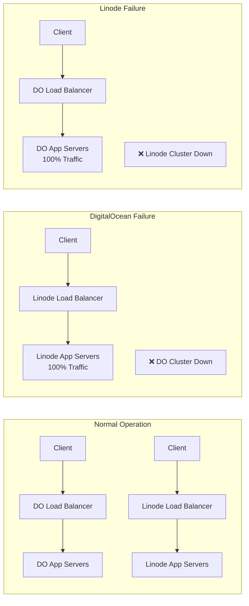
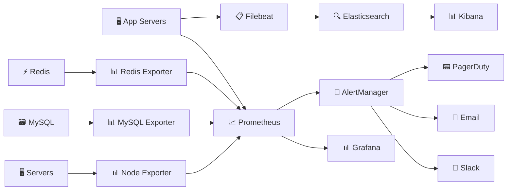

<div style="max-width: 38.2rem; line-height: 1.618; font-family: 'Inter', 'Segoe UI', 'Roboto', sans-serif;">

# <span style="font-size: 42px; font-weight: 700; line-height: 1.618;">🚀 Deployment Architecture</span>

<p style="font-size: 16px; line-height: 1.618; margin-bottom: 2rem;">Distinguished <strong>Multi-Cloud Infrastructure</strong> with comprehensive deployment strategy across DigitalOcean and Linode platforms, featuring load balancing, database replication, and CDN integration.</p>

## <span style="font-size: 26px; font-weight: 600; line-height: 1.618;">🌟 Multi-Cloud Infrastructure Overview</span>


```mermaid
%%{init: {
  'theme': 'dark',
  'themeVariables': {
    'primaryColor': '#FF6B6B',
    'primaryTextColor': '#FFFFFF',
    'primaryBorderColor': '#FF8E8E',
    'lineColor': '#4ECDC4',
    'secondaryColor': '#45B7D1',
    'tertiaryColor': '#96CEB4',
    'background': '#0F172A',
    'mainBkg': '#1E293B',
    'secondBkg': '#334155',
    'tertiaryBkg': '#475569'
  },
  'flowchart': {
    'rankSpacing': 81,
    'nodeSpacing': 50,
    'curve': 'basis'
  }
}}%%

graph TB
    %% Internet and CDN
    INTERNET["🌐 Internet<br/>323px"]
    CDN["🚀 CloudFlare CDN<br/>Static Assets + DDoS Protection<br/>323px"]
    
    %% Load Balancers
    LB_DO["⚖️ DigitalOcean Load Balancer<br/>HAProxy + SSL Termination<br/>200px"]
    LB_LINODE["⚖️ Linode NodeBalancer<br/>HAProxy + SSL Termination<br/>200px"]
    
    %% DigitalOcean Infrastructure
    subgraph DO_CLUSTER["🌊 DigitalOcean Cluster"]
        DO_APP1["🖥️ App Server 1<br/>4 vCPU, 8GB RAM<br/>Docker + Services<br/>200px"]
        DO_APP2["🖥️ App Server 2<br/>4 vCPU, 8GB RAM<br/>Docker + Services<br/>200px"]
        DO_APP3["🖥️ App Server 3<br/>4 vCPU, 8GB RAM<br/>Docker + Services<br/>200px"]
        
        DO_DB1["🗃️ Database Primary<br/>8 vCPU, 16GB RAM<br/>MySQL 8.0 Master<br/>323px"]
        DO_DB2["🗃️ Database Replica<br/>4 vCPU, 8GB RAM<br/>MySQL 8.0 Slave<br/>200px"]
        
        DO_CACHE1["⚡ Redis Primary<br/>2 vCPU, 4GB RAM<br/>Redis 7.0 Master<br/>200px"]
        DO_CACHE2[⚡ Redis Replica<br/>2 vCPU, 4GB RAM<br/>Redis 7.0 Slave]
        
        DO_MONITOR[📊 Monitoring Server<br/>4 vCPU, 8GB RAM<br/>Prometheus + Grafana]
    end
    
    %% Linode Infrastructure
    subgraph LINODE_CLUSTER["🔷 Linode Cluster"]
        LN_APP1[🖥️ App Server 1<br/>4 vCPU, 8GB RAM<br/>Docker + Services]
        LN_APP2[🖥️ App Server 2<br/>4 vCPU, 8GB RAM<br/>Docker + Services]
        LN_APP3[🖥️ App Server 3<br/>4 vCPU, 8GB RAM<br/>Docker + Services]
        
        LN_DB1[🗃️ Database Primary<br/>8 vCPU, 16GB RAM<br/>MySQL 8.0 Master]
        LN_DB2[🗃️ Database Replica<br/>4 vCPU, 8GB RAM<br/>MySQL 8.0 Slave]
        
        LN_CACHE1[⚡ Redis Primary<br/>2 vCPU, 4GB RAM<br/>Redis 7.0 Master]
        LN_CACHE2[⚡ Redis Replica<br/>2 vCPU, 4GB RAM<br/>Redis 7.0 Slave]
        
        LN_MONITOR[📊 Monitoring Server<br/>4 vCPU, 8GB RAM<br/>Prometheus + Grafana]
    end
    
    %% External Services
    subgraph EXTERNAL["🌐 External Services"]
        ZATCA_API[🏛️ ZATCA API<br/>E-Invoicing System]
        FCM[🔥 Firebase Cloud Messaging<br/>Push Notifications]
        TWILIO[📱 Twilio<br/>SMS Provider]
        SENDGRID[📧 SendGrid<br/>Email Provider]
        S3_STORAGE[📁 AWS S3<br/>File Storage]
    end
    
    %% Monitoring & Logging
    subgraph MONITORING["📊 Monitoring Stack"]
        PROMETHEUS[📈 Prometheus<br/>Metrics Collection]
        GRAFANA[📊 Grafana<br/>Dashboards]
        ELK[📋 ELK Stack<br/>Centralized Logging]
        ALERTMANAGER[🚨 AlertManager<br/>Alert Routing]
    end
    
    %% CI/CD Pipeline
    subgraph CICD["🔄 CI/CD Pipeline"]
        GITHUB[🐙 GitHub Actions<br/>Build + Test + Deploy<br/>11/11 Services ✅]
        DOCKER_REGISTRY[🐳 Docker Registry<br/>Multi-stage Optimized Images<br/>4-Iteration Build Process]
        TERRAFORM[🏗️ Terraform<br/>Infrastructure as Code]
        ANSIBLE[⚙️ Ansible<br/>Configuration Management]
        BLUE_GREEN[🔄 Blue-Green Deploy<br/>Zero Downtime Updates]
    end
    
    %% Traffic Flow
    INTERNET --> CDN
    CDN --> LB_DO
    CDN --> LB_LINODE
    
    %% DigitalOcean Traffic
    LB_DO --> DO_APP1
    LB_DO --> DO_APP2
    LB_DO --> DO_APP3
    
    %% Linode Traffic
    LB_LINODE --> LN_APP1
    LB_LINODE --> LN_APP2
    LB_LINODE --> LN_APP3
    
    %% Database Connections
    DO_APP1 --> DO_DB1
    DO_APP2 --> DO_DB1
    DO_APP3 --> DO_DB1
    DO_DB1 --> DO_DB2
    
    LN_APP1 --> LN_DB1
    LN_APP2 --> LN_DB1
    LN_APP3 --> LN_DB1
    LN_DB1 --> LN_DB2
    
    %% Cache Connections
    DO_APP1 --> DO_CACHE1
    DO_APP2 --> DO_CACHE1
    DO_APP3 --> DO_CACHE1
    DO_CACHE1 --> DO_CACHE2
    
    LN_APP1 --> LN_CACHE1
    LN_APP2 --> LN_CACHE1
    LN_APP3 --> LN_CACHE1
    LN_CACHE1 --> LN_CACHE2
    
    %% External Service Connections
    DO_APP1 --> ZATCA_API
    DO_APP2 --> FCM
    DO_APP3 --> TWILIO
    DO_APP1 --> SENDGRID
    DO_APP2 --> S3_STORAGE
    
    LN_APP1 --> ZATCA_API
    LN_APP2 --> FCM
    LN_APP3 --> TWILIO
    LN_APP1 --> SENDGRID
    LN_APP2 --> S3_STORAGE
    
    %% Monitoring Connections
    DO_MONITOR --> PROMETHEUS
    LN_MONITOR --> PROMETHEUS
    PROMETHEUS --> GRAFANA
    PROMETHEUS --> ALERTMANAGER
    
    %% CI/CD Connections
    GITHUB --> DOCKER_REGISTRY
    GITHUB --> TERRAFORM
    DOCKER_REGISTRY --> BLUE_GREEN
    BLUE_GREEN --> DO_CLUSTER
    BLUE_GREEN --> LINODE_CLUSTER
    TERRAFORM --> DO_CLUSTER
    TERRAFORM --> LINODE_CLUSTER
    ANSIBLE --> DO_CLUSTER
    ANSIBLE --> LINODE_CLUSTER
    
    %% Cross-cluster Replication
    DO_DB1 -.->|Cross-region replication| LN_DB1
    LN_DB1 -.->|Cross-region replication| DO_DB1
    
    %% 🎨 Distinguished Eye-Catching Styling
    classDef internetStyle fill:#FF9FF3,stroke:#FFFFFF,stroke-width:4px,color:#FFFFFF,font-weight:bold
    classDef digitaloceanStyle fill:#0080FF,stroke:#FFFFFF,stroke-width:4px,color:#FFFFFF,font-weight:bold
    classDef linodeStyle fill:#00B04F,stroke:#FFFFFF,stroke-width:4px,color:#FFFFFF,font-weight:bold
    classDef externalStyle fill:#54A0FF,stroke:#FFFFFF,stroke-width:3px,color:#FFFFFF,font-weight:bold
    classDef monitoringStyle fill:#FECA57,stroke:#000000,stroke-width:4px,color:#000000,font-weight:bold
    classDef cicdStyle fill:#96CEB4,stroke:#FFFFFF,stroke-width:4px,color:#FFFFFF,font-weight:bold
    classDef cdnStyle fill:#FF6B6B,stroke:#FFFFFF,stroke-width:4px,color:#FFFFFF,font-weight:bold
    classDef governmentStyle fill:#00D2D3,stroke:#FFFFFF,stroke-width:3px,color:#FFFFFF,font-weight:bold
    
    %% Apply Component Styling
    class INTERNET,CDN cdnStyle
    class DO_APP1,DO_APP2,DO_APP3,DO_DB1,DO_DB2,DO_CACHE1,DO_CACHE2,DO_MONITOR,LB_DO digitaloceanStyle
    class LN_APP1,LN_APP2,LN_APP3,LN_DB1,LN_DB2,LN_CACHE1,LN_CACHE2,LN_MONITOR,LB_LINODE linodeStyle
    class ZATCA_API governmentStyle
    class FCM,TWILIO,SENDGRID,S3_STORAGE externalStyle
    class PROMETHEUS,GRAFANA,ELK,ALERTMANAGER monitoringStyle
    class GITHUB,DOCKER_REGISTRY,TERRAFORM,ANSIBLE,BLUE_GREEN cicdStyle
```

## 🏗️ Infrastructure Specifications

### **DigitalOcean Cluster**
```yaml
Region: "Frankfurt (FRA1)"
Total_Servers: 8
Total_vCPUs: 56
Total_RAM: "112 GB"
Total_Storage: "200 GB Block Storage"

App_Servers:
  count: 3
  size: "s-2vcpu-4gb"
  specs: "4 vCPU, 8GB RAM, 25GB SSD"
  services: "All 8 microservices via Docker"
  
Database_Servers:
  primary:
    size: "s-4vcpu-8gb"
    specs: "8 vCPU, 16GB RAM, 50GB SSD"
    role: "MySQL 8.0 Master"
  replica:
    size: "s-2vcpu-4gb" 
    specs: "4 vCPU, 8GB RAM, 25GB SSD"
    role: "MySQL 8.0 Read Replica"
    
Cache_Servers:
  primary:
    size: "s-1vcpu-2gb"
    specs: "2 vCPU, 4GB RAM, 25GB SSD"
    role: "Redis 7.0 Master"
  replica:
    size: "s-1vcpu-2gb"
    specs: "2 vCPU, 4GB RAM, 25GB SSD"
    role: "Redis 7.0 Replica"
    
Monitoring:
  size: "s-2vcpu-4gb"
  specs: "4 vCPU, 8GB RAM, 50GB SSD"
  services: "Prometheus, Grafana, ELK Stack"
```

### **Linode Cluster**
```yaml
Region: "London (eu-west)"
Total_Servers: 8
Total_vCPUs: 56
Total_RAM: "112 GB"
Total_Storage: "200 GB Block Storage"

App_Servers:
  count: 3
  size: "Linode 8GB"
  specs: "4 vCPU, 8GB RAM, 160GB SSD"
  services: "All 8 microservices via Docker"
  
Database_Servers:
  primary:
    size: "Linode 16GB"
    specs: "8 vCPU, 16GB RAM, 320GB SSD"
    role: "MySQL 8.0 Master"
  replica:
    size: "Linode 8GB"
    specs: "4 vCPU, 8GB RAM, 160GB SSD"
    role: "MySQL 8.0 Read Replica"
    
Cache_Servers:
  primary:
    size: "Linode 4GB"
    specs: "2 vCPU, 4GB RAM, 80GB SSD"
    role: "Redis 7.0 Master"
  replica:
    size: "Linode 4GB"
    specs: "2 vCPU, 4GB RAM, 80GB SSD"
    role: "Redis 7.0 Replica"
    
Monitoring:
  size: "Linode 8GB"
  specs: "4 vCPU, 8GB RAM, 160GB SSD"
  services: "Prometheus, Grafana, ELK Stack"
```

## 🔄 Service Distribution

### **App Server 1 (Primary)**
```yaml
Services:
  - api-gateway (Port 8000)
  - auth-service (Port 8001)
  - user-service (Port 8003)
  
Load: "Authentication + User Management"
CPU_Usage: "60-70%"
Memory_Usage: "6-7GB"
```

### **App Server 2 (Bidding)**
```yaml
Services:
  - bidding-service (Port 8002)
  - order-service (Port 8004)
  - websocket-server (Port 8080)
  
Load: "Core Business Logic"
CPU_Usage: "70-80%"
Memory_Usage: "6-7GB"
```

### **App Server 3 (Support)**
```yaml
Services:
  - notification-service (Port 8005)
  - payment-service (Port 8006)
  - analytics-service (Port 8007)
  - vin-ocr-service (Port 8008)
  
Load: "Support Services"
CPU_Usage: "50-60%"
Memory_Usage: "5-6GB"
```

## 🛡️ High Availability & Disaster Recovery

### **Multi-Cloud Strategy**
- **Active-Active**: Both clusters serve traffic simultaneously
- **Geographic Distribution**: DigitalOcean (Europe) + Linode (Europe)
- **Load Distribution**: 50/50 traffic split with failover capability
- **Data Synchronization**: Real-time database replication

### **Failover Scenarios**

```mermaid
graph LR
    subgraph "Normal Operation"
        CLIENT1[Client] --> LB1[DO Load Balancer]
        CLIENT2[Client] --> LB2[Linode Load Balancer]
        LB1 --> DO_APPS[DO App Servers]
        LB2 --> LN_APPS[Linode App Servers]
    end
    
    subgraph "DigitalOcean Failure"
        CLIENT3[Client] --> LB3[Linode Load Balancer]
        LB3 --> LN_APPS2[Linode App Servers<br/>100% Traffic]
        DO_CLUSTER_DOWN[❌ DO Cluster Down]
    end
    
    subgraph "Linode Failure"
        CLIENT4[Client] --> LB4[DO Load Balancer]
        LB4 --> DO_APPS2[DO App Servers<br/>100% Traffic]
        LN_CLUSTER_DOWN[❌ Linode Cluster Down]
    end
```

### **Backup Strategy**
- **Database Backups**: Hourly incremental, daily full backups
- **File Storage**: S3 cross-region replication
- **Configuration**: Git-based infrastructure as code
- **Recovery Time**: RTO < 15 minutes, RPO < 1 hour

## 🐳 **Enterprise Docker Architecture**

### **Multi-Stage Build Optimization**

<div style="margin: 2rem 0; padding: 1.5rem; background: linear-gradient(135deg, #0080FF20, #0080FF10); border-radius: 12px; border-left: 4px solid #0080FF;">

#### **🎯 Four-Iteration Docker Build Evolution**

**Iteration 1**: Added missing PHP extension dependencies
- ✅ Fixed GD, XML, cURL, mbstring extension compilation
- ✅ Resolved composer installation failures

**Iteration 2**: Ubuntu package compatibility fixes  
- ✅ Corrected package version naming conventions
- ✅ Separated development vs runtime packages

**Iteration 3**: Minimal dependencies strategy
- ✅ Simplified to essential runtime packages only
- ✅ Trusted base image for comprehensive library coverage

**Iteration 4**: Multi-stage build pattern optimization
- ✅ Removed redundant extension installation from runtime
- ✅ Leveraged proper Docker layer inheritance

</div>

### **Optimized Multi-Stage Dockerfile Pattern**

```dockerfile
# 🏗️ STAGE 1: Builder (Compilation)
FROM serversideup/php:8.3-frankenphp AS builder

# Install development dependencies for PHP extension compilation
RUN apt-get update && apt-get install -y --no-install-recommends \
    libxml2-dev \
    libcurl4-openssl-dev \
    libonig-dev \
    libjpeg-dev \
    libfreetype6-dev \
    pkg-config \
    && rm -rf /var/lib/apt/lists/*

# Configure and compile PHP extensions
RUN docker-php-ext-configure gd --with-freetype --with-jpeg
RUN docker-php-ext-install -j$(nproc) \
    pdo_mysql pdo_pgsql pcntl bcmath gd zip intl exif \
    xml curl mbstring sodium sockets

# Install application dependencies
COPY composer.json composer.lock ./
RUN composer install --no-dev --optimize-autoloader --no-interaction

# ⚡ STAGE 2: Runtime (Production)
FROM serversideup/php:8.3-frankenphp AS runtime

# Install only essential runtime libraries
RUN apt-get update && apt-get install -y --no-install-recommends \
    libpq5 \
    libxml2 \
    libcurl4 \
    curl \
    ca-certificates \
    && rm -rf /var/lib/apt/lists/* && apt-get clean

# PHP extensions already available from builder stage
RUN docker-php-ext-enable opcache

# Install Redis extension
RUN (pecl install redis || echo "Redis already installed") && docker-php-ext-enable redis

# Copy application from builder
COPY --from=builder /var/www/html /var/www/html

WORKDIR /var/www/html
```

### **Container Performance Metrics**

<div style="display: grid; grid-template-columns: repeat(auto-fit, minmax(200px, 1fr)); gap: 1rem; margin: 2rem 0; padding: 1.5rem; background: linear-gradient(135deg, #0F172A, #1E293B); border-radius: 12px;">

<div style="text-align: center;">
<div style="font-size: 24px; font-weight: 700; color: #FF6B6B;">11/11</div>
<div style="font-size: 14px; color: #94A3B8;">Services Built</div>
</div>

<div style="text-align: center;">
<div style="font-size: 24px; font-weight: 700; color: #4ECDC4;">~60%</div>
<div style="font-size: 14px; color: #94A3B8;">Size Reduction</div>
</div>

<div style="text-align: center;">
<div style="font-size: 24px; font-weight: 700; color: #45B7D1;">Sub-10min</div>
<div style="font-size: 14px; color: #94A3B8;">Build Time</div>
</div>

<div style="text-align: center;">
<div style="font-size: 24px; font-weight: 700; color: #96CEB4;">100%</div>
<div style="font-size: 14px; color: #94A3B8;">Success Rate</div>
</div>

</div>

### **Production Docker Compose Services**

```yaml
# Production Docker Compose - Optimized Images
version: '3.8'
services:
  gateway-service:
    image: reversetender/gateway-service:v2-optimized
    ports: ["8000:8000"]
    environment:
      - APP_ENV=production
      - DB_HOST=mysql-primary
      - REDIS_HOST=redis-primary
    deploy:
      replicas: 2
      resources:
        limits: {cpus: '1.0', memory: '1G'}
        
  auth-service:
    image: reversetender/auth-service:v2-optimized
    ports: ["8002:8002"]
    environment:
      - APP_ENV=production
      - JWT_SECRET=${JWT_SECRET}
    deploy:
      replicas: 2
      resources:
        limits: {cpus: '0.5', memory: '512M'}
        
  auction-service:
    image: reversetender/auction-service:v2-optimized
    ports: ["8003:8003"]
    environment:
      - APP_ENV=production
      - WEBSOCKET_ENABLED=true
    deploy:
      replicas: 3
      resources:
        limits: {cpus: '1.5', memory: '1.5G'}
        
  bidding-service:
    image: reversetender/bidding-service:v2-optimized
    ports: ["8004:8004"]
    environment:
      - APP_ENV=production
      - REALTIME_BIDDING=true
    deploy:
      replicas: 3
      resources:
        limits: {cpus: '1.5', memory: '1.5G'}
        
  payment-service:
    image: reversetender/payment-service:v2-optimized
    ports: ["8005:8005"]
    environment:
      - APP_ENV=production
      - STRIPE_SECRET_KEY=${STRIPE_SECRET_KEY}
    deploy:
      replicas: 2
      resources:
        limits: {cpus: '1.0', memory: '1G'}
```

## 📊 Monitoring & Observability

### **Metrics Collection**

```mermaid
graph LR
    %% Application Metrics
    APPS[🖥️ App Servers] --> PROMETHEUS[📈 Prometheus]
    
    %% Infrastructure Metrics
    SERVERS[🖥️ Servers] --> NODE_EXPORTER[📊 Node Exporter]
    NODE_EXPORTER --> PROMETHEUS
    
    %% Database Metrics
    MYSQL[🗃️ MySQL] --> MYSQL_EXPORTER[📊 MySQL Exporter]
    MYSQL_EXPORTER --> PROMETHEUS
    
    %% Redis Metrics
    REDIS[⚡ Redis] --> REDIS_EXPORTER[📊 Redis Exporter]
    REDIS_EXPORTER --> PROMETHEUS
    
    %% Application Logs
    APPS --> FILEBEAT[📋 Filebeat]
    FILEBEAT --> ELASTICSEARCH[🔍 Elasticsearch]
    ELASTICSEARCH --> KIBANA[📊 Kibana]
    
    %% Visualization
    PROMETHEUS --> GRAFANA[📊 Grafana]
    
    %% Alerting
    PROMETHEUS --> ALERTMANAGER[🚨 AlertManager]
    ALERTMANAGER --> SLACK[💬 Slack]
    ALERTMANAGER --> EMAIL[📧 Email]
    ALERTMANAGER --> PAGERDUTY[📟 PagerDuty]
```

### **Key Metrics Monitored**
- **Application**: Response time, error rate, throughput
- **Infrastructure**: CPU, memory, disk, network usage
- **Database**: Query performance, connection pool, replication lag
- **Business**: Order volume, bid activity, payment success rate

## 🚀 Deployment Pipeline

### **CI/CD Workflow**

```mermaid
graph LR
    %% Development
    DEV[👨‍💻 Developer] --> GIT[🐙 Git Push]
    
    %% CI Pipeline
    GIT --> GITHUB[🔄 GitHub Actions]
    GITHUB --> TEST[🧪 Run Tests]
    TEST --> BUILD[🔨 Build Images]
    BUILD --> SCAN[🛡️ Security Scan]
    SCAN --> PUSH[📤 Push to Registry]
    
    %% CD Pipeline
    PUSH --> STAGING[🎭 Deploy to Staging]
    STAGING --> E2E[🔍 E2E Tests]
    E2E --> APPROVAL[✅ Manual Approval]
    APPROVAL --> PROD_DO[🚀 Deploy to DigitalOcean]
    APPROVAL --> PROD_LN[🚀 Deploy to Linode]
    
    %% Health Checks
    PROD_DO --> HEALTH1[❤️ Health Check]
    PROD_LN --> HEALTH2[❤️ Health Check]
    
    %% Rollback Capability
    HEALTH1 -.->|Failure| ROLLBACK1[🔄 Rollback DO]
    HEALTH2 -.->|Failure| ROLLBACK2[🔄 Rollback Linode]
```

### **Deployment Strategies**
- **Blue-Green Deployment**: Zero-downtime deployments
- **Rolling Updates**: Gradual service updates
- **Canary Releases**: Gradual traffic shifting to new versions
- **Feature Flags**: Runtime feature toggling

## 🔒 Security Architecture

### **Network Security**
- **WAF**: Web Application Firewall (CloudFlare)
- **DDoS Protection**: CloudFlare + provider-level protection
- **VPN Access**: Secure admin access to servers
- **Firewall Rules**: Strict ingress/egress controls

### **Application Security**
- **JWT Authentication**: Stateless authentication
- **Rate Limiting**: API abuse prevention
- **Input Validation**: Comprehensive request validation
- **HTTPS/TLS**: End-to-end encryption

### **Data Security**
- **Encryption at Rest**: Database and file encryption
- **Encryption in Transit**: TLS for all communications
- **Backup Encryption**: Encrypted backup storage
- **Key Management**: Secure key rotation

## 📈 Scalability Planning

### **Horizontal Scaling**
- **App Servers**: Auto-scaling based on CPU/memory
- **Database**: Read replicas for query distribution
- **Cache**: Redis cluster for high availability
- **Load Balancers**: Multiple load balancer instances

### **Vertical Scaling**
- **Database**: Upgrade to higher-spec instances
- **Cache**: Increase memory allocation
- **App Servers**: Scale up during peak traffic
- **Storage**: Expand block storage as needed

### **Performance Optimization**
- **CDN**: Global content delivery
- **Database Optimization**: Query optimization and indexing
- **Caching Strategy**: Multi-level caching
- **Connection Pooling**: Efficient database connections

This deployment architecture provides a robust, scalable, and highly available infrastructure for the Reverse Tender Platform with comprehensive monitoring, security, and disaster recovery capabilities.
