# 🚀 Deployment Architecture Diagram


## 🏗️ Infrastructure Specifications

### **DigitalOcean Cluster**
```yaml
Region: "Frankfurt (FRA1)"
Total_Servers: 8
Total_vCPUs: 56
Total_RAM: "112 GB"
Total_Storage: "200 GB Block Storage"

App_Servers:
  count: 3
  size: "s-2vcpu-4gb"
  specs: "4 vCPU, 8GB RAM, 25GB SSD"
  services: "All 8 microservices via Docker"
  
Database_Servers:
  primary:
    size: "s-4vcpu-8gb"
    specs: "8 vCPU, 16GB RAM, 50GB SSD"
    role: "MySQL 8.0 Master"
  replica:
    size: "s-2vcpu-4gb" 
    specs: "4 vCPU, 8GB RAM, 25GB SSD"
    role: "MySQL 8.0 Read Replica"
    
Cache_Servers:
  primary:
    size: "s-1vcpu-2gb"
    specs: "2 vCPU, 4GB RAM, 25GB SSD"
    role: "Redis 7.0 Master"
  replica:
    size: "s-1vcpu-2gb"
    specs: "2 vCPU, 4GB RAM, 25GB SSD"
    role: "Redis 7.0 Replica"
    
Monitoring:
  size: "s-2vcpu-4gb"
  specs: "4 vCPU, 8GB RAM, 50GB SSD"
  services: "Prometheus, Grafana, ELK Stack"
```

### **Linode Cluster**
```yaml
Region: "London (eu-west)"
Total_Servers: 8
Total_vCPUs: 56
Total_RAM: "112 GB"
Total_Storage: "200 GB Block Storage"

App_Servers:
  count: 3
  size: "Linode 8GB"
  specs: "4 vCPU, 8GB RAM, 160GB SSD"
  services: "All 8 microservices via Docker"
  
Database_Servers:
  primary:
    size: "Linode 16GB"
    specs: "8 vCPU, 16GB RAM, 320GB SSD"
    role: "MySQL 8.0 Master"
  replica:
    size: "Linode 8GB"
    specs: "4 vCPU, 8GB RAM, 160GB SSD"
    role: "MySQL 8.0 Read Replica"
    
Cache_Servers:
  primary:
    size: "Linode 4GB"
    specs: "2 vCPU, 4GB RAM, 80GB SSD"
    role: "Redis 7.0 Master"
  replica:
    size: "Linode 4GB"
    specs: "2 vCPU, 4GB RAM, 80GB SSD"
    role: "Redis 7.0 Replica"
    
Monitoring:
  size: "Linode 8GB"
  specs: "4 vCPU, 8GB RAM, 160GB SSD"
  services: "Prometheus, Grafana, ELK Stack"
```

## 🔄 Service Distribution

### **App Server 1 (Primary)**
```yaml
Services:
  - api-gateway (Port 8000)
  - auth-service (Port 8001)
  - user-service (Port 8003)
  
Load: "Authentication + User Management"
CPU_Usage: "60-70%"
Memory_Usage: "6-7GB"
```

### **App Server 2 (Bidding)**
```yaml
Services:
  - bidding-service (Port 8002)
  - order-service (Port 8004)
  - websocket-server (Port 8080)
  
Load: "Core Business Logic"
CPU_Usage: "70-80%"
Memory_Usage: "6-7GB"
```

### **App Server 3 (Support)**
```yaml
Services:
  - notification-service (Port 8005)
  - payment-service (Port 8006)
  - analytics-service (Port 8007)
  - vin-ocr-service (Port 8008)
  
Load: "Support Services"
CPU_Usage: "50-60%"
Memory_Usage: "5-6GB"
```

## 🛡️ High Availability & Disaster Recovery

### **Multi-Cloud Strategy**
- **Active-Active**: Both clusters serve traffic simultaneously
- **Geographic Distribution**: DigitalOcean (Europe) + Linode (Europe)
- **Load Distribution**: 50/50 traffic split with failover capability
- **Data Synchronization**: Real-time database replication

### **Failover Scenarios**

```mermaid
graph LR
    subgraph "Normal Operation"
        CLIENT1[Client] --> LB1[DO Load Balancer]
        CLIENT2[Client] --> LB2[Linode Load Balancer]
        LB1 --> DO_APPS[DO App Servers]
        LB2 --> LN_APPS[Linode App Servers]
    end
    
    subgraph "DigitalOcean Failure"
        CLIENT3[Client] --> LB3[Linode Load Balancer]
        LB3 --> LN_APPS2[Linode App Servers<br/>100% Traffic]
        DO_CLUSTER_DOWN[❌ DO Cluster Down]
    end
    
    subgraph "Linode Failure"
        CLIENT4[Client] --> LB4[DO Load Balancer]
        LB4 --> DO_APPS2[DO App Servers<br/>100% Traffic]
        LN_CLUSTER_DOWN[❌ Linode Cluster Down]
    end
```


### **Backup Strategy**
- **Database Backups**: Hourly incremental, daily full backups
- **File Storage**: S3 cross-region replication
- **Configuration**: Git-based infrastructure as code
- **Recovery Time**: RTO < 15 minutes, RPO < 1 hour

## 🔧 Container Orchestration

### **Docker Compose Services**
```yaml
# Production Docker Compose
version: '3.8'
services:
  api-gateway:
    image: reversetender/api-gateway:latest
    ports: ["8000:8000"]
    environment:
      - APP_ENV=production
      - DB_HOST=mysql-primary
      - REDIS_HOST=redis-primary
    deploy:
      replicas: 2
      resources:
        limits: {cpus: '1.0', memory: '1G'}
        
  auth-service:
    image: reversetender/auth-service:latest
    ports: ["8001:8001"]
    environment:
      - APP_ENV=production
      - JWT_SECRET=${JWT_SECRET}
    deploy:
      replicas: 2
      resources:
        limits: {cpus: '0.5', memory: '512M'}
        
  bidding-service:
    image: reversetender/bidding-service:latest
    ports: ["8002:8002"]
    environment:
      - APP_ENV=production
      - WEBSOCKET_ENABLED=true
    deploy:
      replicas: 3
      resources:
        limits: {cpus: '1.5', memory: '1.5G'}
```

## 📊 Monitoring & Observability

### **Metrics Collection**

```mermaid
graph LR
    %% Application Metrics
    APPS[🖥️ App Servers] --> PROMETHEUS[📈 Prometheus]
    
    %% Infrastructure Metrics
    SERVERS[🖥️ Servers] --> NODE_EXPORTER[📊 Node Exporter]
    NODE_EXPORTER --> PROMETHEUS
    
    %% Database Metrics
    MYSQL[🗃️ MySQL] --> MYSQL_EXPORTER[📊 MySQL Exporter]
    MYSQL_EXPORTER --> PROMETHEUS
    
    %% Redis Metrics
    REDIS[⚡ Redis] --> REDIS_EXPORTER[📊 Redis Exporter]
    REDIS_EXPORTER --> PROMETHEUS
    
    %% Application Logs
    APPS --> FILEBEAT[📋 Filebeat]
    FILEBEAT --> ELASTICSEARCH[🔍 Elasticsearch]
    ELASTICSEARCH --> KIBANA[📊 Kibana]
    
    %% Visualization
    PROMETHEUS --> GRAFANA[📊 Grafana]
    
    %% Alerting
    PROMETHEUS --> ALERTMANAGER[🚨 AlertManager]
    ALERTMANAGER --> SLACK[💬 Slack]
    ALERTMANAGER --> EMAIL[📧 Email]
    ALERTMANAGER --> PAGERDUTY[📟 PagerDuty]
```


### **Key Metrics Monitored**
- **Application**: Response time, error rate, throughput
- **Infrastructure**: CPU, memory, disk, network usage
- **Database**: Query performance, connection pool, replication lag
- **Business**: Order volume, bid activity, payment success rate

## 🚀 Deployment Pipeline

### **CI/CD Workflow**

```mermaid
graph LR
    %% Development
    DEV[👨‍💻 Developer] --> GIT[🐙 Git Push]
    
    %% CI Pipeline
    GIT --> GITHUB[🔄 GitHub Actions]
    GITHUB --> TEST[🧪 Run Tests]
    TEST --> BUILD[🔨 Build Images]
    BUILD --> SCAN[🛡️ Security Scan]
    SCAN --> PUSH[📤 Push to Registry]
    
    %% CD Pipeline
    PUSH --> STAGING[🎭 Deploy to Staging]
    STAGING --> E2E[🔍 E2E Tests]
    E2E --> APPROVAL[✅ Manual Approval]
    APPROVAL --> PROD_DO[🚀 Deploy to DigitalOcean]
    APPROVAL --> PROD_LN[🚀 Deploy to Linode]
    
    %% Health Checks
    PROD_DO --> HEALTH1[❤️ Health Check]
    PROD_LN --> HEALTH2[❤️ Health Check]
    
    %% Rollback Capability
    HEALTH1 -.->|Failure| ROLLBACK1[🔄 Rollback DO]
    HEALTH2 -.->|Failure| ROLLBACK2[🔄 Rollback Linode]
```


### **Deployment Strategies**
- **Blue-Green Deployment**: Zero-downtime deployments
- **Rolling Updates**: Gradual service updates
- **Canary Releases**: Gradual traffic shifting to new versions
- **Feature Flags**: Runtime feature toggling

## 🔒 Security Architecture

### **Network Security**
- **WAF**: Web Application Firewall (CloudFlare)
- **DDoS Protection**: CloudFlare + provider-level protection
- **VPN Access**: Secure admin access to servers
- **Firewall Rules**: Strict ingress/egress controls

### **Application Security**
- **JWT Authentication**: Stateless authentication
- **Rate Limiting**: API abuse prevention
- **Input Validation**: Comprehensive request validation
- **HTTPS/TLS**: End-to-end encryption

### **Data Security**
- **Encryption at Rest**: Database and file encryption
- **Encryption in Transit**: TLS for all communications
- **Backup Encryption**: Encrypted backup storage
- **Key Management**: Secure key rotation

## 📈 Scalability Planning

### **Horizontal Scaling**
- **App Servers**: Auto-scaling based on CPU/memory
- **Database**: Read replicas for query distribution
- **Cache**: Redis cluster for high availability
- **Load Balancers**: Multiple load balancer instances

### **Vertical Scaling**
- **Database**: Upgrade to higher-spec instances
- **Cache**: Increase memory allocation
- **App Servers**: Scale up during peak traffic
- **Storage**: Expand block storage as needed

### **Performance Optimization**
- **CDN**: Global content delivery
- **Database Optimization**: Query optimization and indexing
- **Caching Strategy**: Multi-level caching
- **Connection Pooling**: Efficient database connections

This deployment architecture provides a robust, scalable, and highly available infrastructure for the Reverse Tender Platform with comprehensive monitoring, security, and disaster recovery capabilities.

