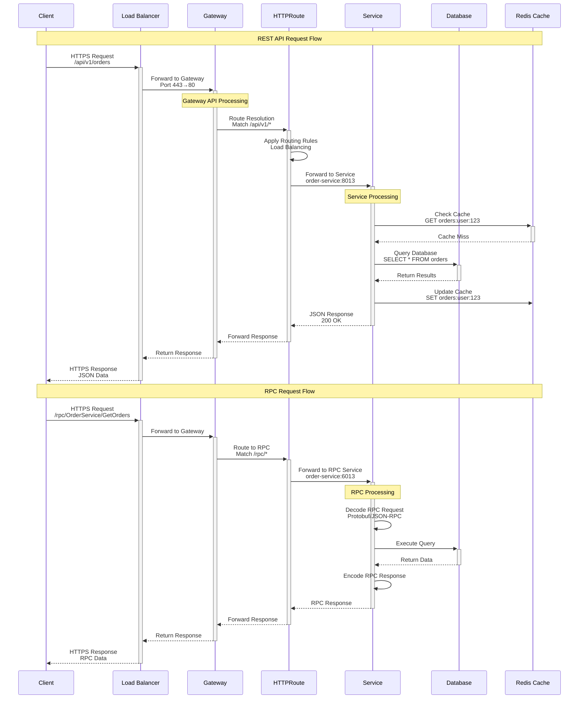
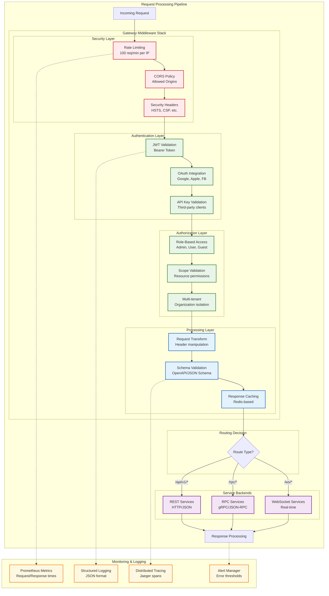

# 🌐 Gateway API Architecture - Kubernetes Gateway API Implementation

This document provides comprehensive diagrams for the Kubernetes Gateway API implementation in the Reverse Tender Platform, showcasing the modern API gateway architecture with RPC and REST service integration.

## 📋 Overview

The Gateway API implementation provides a unified entry point for all client requests, supporting both REST and RPC protocols with advanced routing, load balancing, and security features.

## 🏗️ Gateway API Architecture Overview

```mermaid
graph TB
    subgraph "Client Layer"
        WEB[Web Application<br/>React/Next.js]
        MOBILE[Mobile Apps<br/>iOS/Android]
        API_CLIENT[API Clients<br/>Third-party]
        ADMIN[Admin Dashboard<br/>Vue.js]
    end

    subgraph "Load Balancer Layer"
        LB[DigitalOcean Load Balancer<br/>:443 HTTPS]
        LB_BACKUP[Linode Load Balancer<br/>:443 HTTPS<br/>Backup]
    end

    subgraph "Kubernetes Gateway API Layer"
        subgraph "Gateway Class"
            GC[Gateway Class<br/>nginx-gateway]
        end
        
        subgraph "Gateway Resources"
            GATEWAY[Gateway<br/>reverse-tender-gateway<br/>:80, :443]
        end
        
        subgraph "HTTP Routes"
            HR_API[HTTPRoute: api-routes<br/>/api/v1/*]
            HR_RPC[HTTPRoute: rpc-routes<br/>/rpc/*]
            HR_WS[HTTPRoute: websocket-routes<br/>/ws/*]
            HR_ADMIN[HTTPRoute: admin-routes<br/>/admin/*]
        end
    end

    subgraph "Service Mesh Layer"
        subgraph "REST Services"
            GW_REST[Gateway Service REST<br/>:8010]
            AUTH_REST[Auth Service REST<br/>:8011]
            USER_REST[User Service REST<br/>:8012]
            ORDER_REST[Order Service REST<br/>:8013]
        end
        
        subgraph "RPC Services"
            GW_RPC[Gateway Service RPC<br/>:6010]
            AUTH_RPC[Auth Service RPC<br/>:6011]
            USER_RPC[User Service RPC<br/>:6012]
            ORDER_RPC[Order Service RPC<br/>:6013]
        end
        
        subgraph "Specialized Services"
            ANALYTICS[Analytics Service<br/>:8014/:6014]
            PAYMENT[Payment Service<br/>:8015/:6015]
            NOTIFICATION[Notification Service<br/>:8016/:6016]
            VIN_OCR[VIN OCR Service<br/>:8017/:6017]
            BIDDING[Bidding Service<br/>:8018/:6018]
        end
    end

    subgraph "Data Layer"
        subgraph "Primary Database"
            MYSQL_PRIMARY[(MySQL Primary<br/>:3306)]
        end
        
        subgraph "Cache Layer"
            REDIS_PRIMARY[(Redis Primary<br/>:6379)]
            REDIS_REPLICA[(Redis Replica<br/>:6380)]
        end
        
        subgraph "Message Queue"
            RABBITMQ[RabbitMQ<br/>:5672]
        end
    end

    subgraph "Monitoring & Observability"
        PROMETHEUS[Prometheus<br/>:9090]
        GRAFANA[Grafana<br/>:3000]
        JAEGER[Jaeger<br/>:16686]
        LOKI[Loki<br/>:3100]
    end

    %% Client connections
    WEB --> LB
    MOBILE --> LB
    API_CLIENT --> LB
    ADMIN --> LB
    
    %% Load balancer connections
    LB --> GATEWAY
    LB_BACKUP -.-> GATEWAY
    
    %% Gateway API routing
    GATEWAY --> HR_API
    GATEWAY --> HR_RPC
    GATEWAY --> HR_WS
    GATEWAY --> HR_ADMIN
    
    %% HTTP Route to Service connections
    HR_API --> GW_REST
    HR_API --> AUTH_REST
    HR_API --> USER_REST
    HR_API --> ORDER_REST
    
    HR_RPC --> GW_RPC
    HR_RPC --> AUTH_RPC
    HR_RPC --> USER_RPC
    HR_RPC --> ORDER_RPC
    
    HR_WS --> BIDDING
    HR_WS --> NOTIFICATION
    
    HR_ADMIN --> GW_REST
    HR_ADMIN --> ANALYTICS
    
    %% Service to data layer connections
    GW_REST --> MYSQL_PRIMARY
    GW_REST --> REDIS_PRIMARY
    AUTH_REST --> MYSQL_PRIMARY
    AUTH_REST --> REDIS_PRIMARY
    USER_REST --> MYSQL_PRIMARY
    ORDER_REST --> MYSQL_PRIMARY
    
    GW_RPC --> MYSQL_PRIMARY
    GW_RPC --> REDIS_PRIMARY
    AUTH_RPC --> MYSQL_PRIMARY
    AUTH_RPC --> REDIS_PRIMARY
    
    ANALYTICS --> MYSQL_PRIMARY
    PAYMENT --> MYSQL_PRIMARY
    NOTIFICATION --> RABBITMQ
    BIDDING --> REDIS_PRIMARY
    
    %% Monitoring connections
    PROMETHEUS --> GW_REST
    PROMETHEUS --> AUTH_REST
    PROMETHEUS --> GW_RPC
    PROMETHEUS --> AUTH_RPC
    GRAFANA --> PROMETHEUS
    JAEGER --> GW_REST
    JAEGER --> GW_RPC
    
    %% Styling
    classDef client fill:#e1f5fe,stroke:#01579b,stroke-width:2px
    classDef gateway fill:#f3e5f5,stroke:#4a148c,stroke-width:2px
    classDef service fill:#e8f5e8,stroke:#1b5e20,stroke-width:2px
    classDef data fill:#fff3e0,stroke:#e65100,stroke-width:2px
    classDef monitor fill:#fce4ec,stroke:#880e4f,stroke-width:2px
    
    class WEB,MOBILE,API_CLIENT,ADMIN client
    class GC,GATEWAY,HR_API,HR_RPC,HR_WS,HR_ADMIN gateway
    class GW_REST,AUTH_REST,USER_REST,ORDER_REST,GW_RPC,AUTH_RPC,USER_RPC,ORDER_RPC,ANALYTICS,PAYMENT,NOTIFICATION,VIN_OCR,BIDDING service
    class MYSQL_PRIMARY,REDIS_PRIMARY,REDIS_REPLICA,RABBITMQ data
    class PROMETHEUS,GRAFANA,JAEGER,LOKI monitor
```



## 🔄 Gateway API Request Flow



## 🛡️ Gateway API Security & Middleware Stack



## 🔧 Gateway API Configuration

```mermaid
graph TB
    subgraph "Gateway API Resources"
        subgraph "Gateway Class Configuration"
            GC_CONFIG[Gateway Class: nginx-gateway<br/>---<br/>controllerName: nginx.org/nginx-gateway<br/>parametersRef: nginx-params]
        end
        
        subgraph "Gateway Configuration"
            GW_CONFIG[Gateway: reverse-tender-gateway<br/>---<br/>gatewayClassName: nginx-gateway<br/>listeners:<br/>- name: http (port 80)<br/>- name: https (port 443)<br/>addresses: [LoadBalancer IP]]
        end
        
        subgraph "HTTPRoute Configurations"
            subgraph "API Routes"
                API_ROUTE[HTTPRoute: api-routes<br/>---<br/>parentRefs: reverse-tender-gateway<br/>hostnames: [api.reversetender.com]<br/>rules:<br/>- matches: [{path: /api/v1/}]<br/>- backendRefs: [rest-services]]
            end
            
            subgraph "RPC Routes"
                RPC_ROUTE[HTTPRoute: rpc-routes<br/>---<br/>parentRefs: reverse-tender-gateway<br/>hostnames: [rpc.reversetender.com]<br/>rules:<br/>- matches: [{path: /rpc/}]<br/>- backendRefs: [rpc-services]]
            end
            
            subgraph "WebSocket Routes"
                WS_ROUTE[HTTPRoute: websocket-routes<br/>---<br/>parentRefs: reverse-tender-gateway<br/>hostnames: [ws.reversetender.com]<br/>rules:<br/>- matches: [{path: /ws/}]<br/>- backendRefs: [websocket-services]]
            end
        end
        
        subgraph "Backend Services"
            subgraph "REST Service Group"
                REST_SVC[Service: gateway-service-rest<br/>Service: auth-service-rest<br/>Service: user-service-rest<br/>Service: order-service-rest<br/>---<br/>type: ClusterIP<br/>ports: [8010, 8011, 8012, 8013]]
            end
            
            subgraph "RPC Service Group"
                RPC_SVC[Service: gateway-service-rpc<br/>Service: auth-service-rpc<br/>Service: user-service-rpc<br/>Service: order-service-rpc<br/>---<br/>type: ClusterIP<br/>ports: [6010, 6011, 6012, 6013]]
            end
            
            subgraph "WebSocket Service Group"
                WS_SVC[Service: bidding-service<br/>Service: notification-service<br/>---<br/>type: ClusterIP<br/>ports: [8018, 8016]]
            end
        end
    end

    subgraph "Policy Configurations"
        subgraph "Rate Limiting Policy"
            RATE_POLICY[RateLimitPolicy<br/>---<br/>targetRef: reverse-tender-gateway<br/>limits:<br/>- requests: 100<br/>- window: 1m<br/>- per: IP]
        end
        
        subgraph "TLS Policy"
            TLS_POLICY[TLSPolicy<br/>---<br/>targetRef: reverse-tender-gateway<br/>tls:<br/>- certificateRefs: [tls-cert]<br/>- mode: Terminate]
        end
        
        subgraph "Security Policy"
            SEC_POLICY[SecurityPolicy<br/>---<br/>targetRef: reverse-tender-gateway<br/>cors:<br/>- allowOrigins: [*.reversetender.com]<br/>- allowMethods: [GET, POST, PUT, DELETE]<br/>authentication:<br/>- jwt: {issuer: auth.reversetender.com}]
        end
    end

    %% Configuration relationships
    GC_CONFIG --> GW_CONFIG
    GW_CONFIG --> API_ROUTE
    GW_CONFIG --> RPC_ROUTE
    GW_CONFIG --> WS_ROUTE
    
    API_ROUTE --> REST_SVC
    RPC_ROUTE --> RPC_SVC
    WS_ROUTE --> WS_SVC
    
    GW_CONFIG -.-> RATE_POLICY
    GW_CONFIG -.-> TLS_POLICY
    GW_CONFIG -.-> SEC_POLICY

    %% Styling
    classDef config fill:#e8f5e8,stroke:#2e7d32,stroke-width:2px
    classDef route fill:#e3f2fd,stroke:#1565c0,stroke-width:2px
    classDef service fill:#f3e5f5,stroke:#7b1fa2,stroke-width:2px
    classDef policy fill:#fff3e0,stroke:#ef6c00,stroke-width:2px
    
    class GC_CONFIG,GW_CONFIG config
    class API_ROUTE,RPC_ROUTE,WS_ROUTE route
    class REST_SVC,RPC_SVC,WS_SVC service
    class RATE_POLICY,TLS_POLICY,SEC_POLICY policy
```

## 🚀 Performance & Scaling Architecture

```mermaid
graph TB
    subgraph "Traffic Distribution"
        subgraph "Global Load Balancing"
            DNS[DNS Resolution<br/>reversetender.com]
            GEO[GeoDNS Routing<br/>Latency-based]
        end
        
        subgraph "Regional Load Balancers"
            LB_PRIMARY[DigitalOcean LB<br/>Primary Region<br/>Auto-scaling]
            LB_SECONDARY[Linode LB<br/>Secondary Region<br/>Failover]
        end
    end

    subgraph "Gateway API Scaling"
        subgraph "Gateway Controllers"
            GW_CTRL_1[Gateway Controller 1<br/>nginx-gateway<br/>Active]
            GW_CTRL_2[Gateway Controller 2<br/>nginx-gateway<br/>Standby]
        end
        
        subgraph "Gateway Instances"
            GW_INST_1[Gateway Instance 1<br/>Pod: gateway-1<br/>CPU: 2 cores, RAM: 4GB]
            GW_INST_2[Gateway Instance 2<br/>Pod: gateway-2<br/>CPU: 2 cores, RAM: 4GB]
            GW_INST_3[Gateway Instance 3<br/>Pod: gateway-3<br/>CPU: 2 cores, RAM: 4GB]
        end
    end

    subgraph "Service Scaling"
        subgraph "REST Service Scaling"
            REST_HPA[HPA: REST Services<br/>Min: 2, Max: 10<br/>CPU: 70%, Memory: 80%]
            REST_PODS[REST Service Pods<br/>gateway-rest: 3 replicas<br/>auth-rest: 2 replicas<br/>user-rest: 2 replicas]
        end
        
        subgraph "RPC Service Scaling"
            RPC_HPA[HPA: RPC Services<br/>Min: 2, Max: 8<br/>CPU: 70%, Memory: 80%]
            RPC_PODS[RPC Service Pods<br/>gateway-rpc: 2 replicas<br/>auth-rpc: 2 replicas<br/>user-rpc: 2 replicas]
        end
        
        subgraph "Specialized Service Scaling"
            SPEC_HPA[HPA: Specialized Services<br/>Min: 1, Max: 5<br/>Custom metrics]
            SPEC_PODS[Specialized Pods<br/>bidding: 3 replicas<br/>notification: 2 replicas<br/>analytics: 1 replica]
        end
    end

    subgraph "Data Layer Scaling"
        subgraph "Database Scaling"
            DB_PRIMARY[MySQL Primary<br/>8 cores, 32GB RAM<br/>SSD storage]
            DB_REPLICA_1[MySQL Replica 1<br/>Read queries<br/>4 cores, 16GB RAM]
            DB_REPLICA_2[MySQL Replica 2<br/>Analytics queries<br/>4 cores, 16GB RAM]
        end
        
        subgraph "Cache Scaling"
            REDIS_CLUSTER[Redis Cluster<br/>6 nodes (3 master, 3 replica)<br/>Memory: 16GB per node]
            REDIS_SENTINEL[Redis Sentinel<br/>3 instances<br/>High availability]
        end
    end

    subgraph "Performance Monitoring"
        subgraph "Metrics Collection"
            PROM_GATEWAY[Prometheus<br/>Gateway metrics<br/>Request rate, latency]
            PROM_SERVICES[Prometheus<br/>Service metrics<br/>CPU, memory, custom]
        end
        
        subgraph "Auto-scaling Triggers"
            SCALING_RULES[Scaling Rules<br/>---<br/>Gateway: >1000 RPS<br/>Services: >70% CPU<br/>Database: >80% connections<br/>Cache: >90% memory]
        end
    end

    %% Traffic flow
    DNS --> GEO
    GEO --> LB_PRIMARY
    GEO -.-> LB_SECONDARY
    
    LB_PRIMARY --> GW_INST_1
    LB_PRIMARY --> GW_INST_2
    LB_PRIMARY --> GW_INST_3
    
    %% Gateway control
    GW_CTRL_1 --> GW_INST_1
    GW_CTRL_1 --> GW_INST_2
    GW_CTRL_2 -.-> GW_INST_3
    
    %% Service scaling
    GW_INST_1 --> REST_PODS
    GW_INST_2 --> RPC_PODS
    GW_INST_3 --> SPEC_PODS
    
    REST_HPA --> REST_PODS
    RPC_HPA --> RPC_PODS
    SPEC_HPA --> SPEC_PODS
    
    %% Data connections
    REST_PODS --> DB_PRIMARY
    REST_PODS --> DB_REPLICA_1
    RPC_PODS --> DB_PRIMARY
    RPC_PODS --> DB_REPLICA_2
    
    REST_PODS --> REDIS_CLUSTER
    RPC_PODS --> REDIS_CLUSTER
    REDIS_SENTINEL --> REDIS_CLUSTER
    
    %% Monitoring
    PROM_GATEWAY --> GW_INST_1
    PROM_GATEWAY --> GW_INST_2
    PROM_SERVICES --> REST_PODS
    PROM_SERVICES --> RPC_PODS
    
    SCALING_RULES --> REST_HPA
    SCALING_RULES --> RPC_HPA
    SCALING_RULES --> SPEC_HPA

    %% Styling
    classDef traffic fill:#e1f5fe,stroke:#01579b,stroke-width:2px
    classDef gateway fill:#f3e5f5,stroke:#4a148c,stroke-width:2px
    classDef scaling fill:#e8f5e8,stroke:#1b5e20,stroke-width:2px
    classDef data fill:#fff3e0,stroke:#e65100,stroke-width:2px
    classDef monitor fill:#fce4ec,stroke:#880e4f,stroke-width:2px
    
    class DNS,GEO,LB_PRIMARY,LB_SECONDARY traffic
    class GW_CTRL_1,GW_CTRL_2,GW_INST_1,GW_INST_2,GW_INST_3 gateway
    class REST_HPA,RPC_HPA,SPEC_HPA,REST_PODS,RPC_PODS,SPEC_PODS scaling
    class DB_PRIMARY,DB_REPLICA_1,DB_REPLICA_2,REDIS_CLUSTER,REDIS_SENTINEL data
    class PROM_GATEWAY,PROM_SERVICES,SCALING_RULES monitor
```

## 📊 Key Features & Benefits

### **🌟 Gateway API Advantages**
- **Kubernetes Native**: Built-in Kubernetes resource types
- **Vendor Neutral**: Works with multiple ingress controllers
- **Role-Based**: Separate concerns for platform and application teams
- **Extensible**: Custom policies and middleware support
- **Type Safe**: Strong typing with CRDs and validation

### **🚀 Performance Features**
- **Load Balancing**: Intelligent traffic distribution
- **Auto Scaling**: HPA-based scaling for all components
- **Caching**: Multi-layer caching strategy
- **Connection Pooling**: Efficient database connections
- **Circuit Breakers**: Fault tolerance and resilience

### **🛡️ Security Features**
- **TLS Termination**: Automatic certificate management
- **Authentication**: JWT, OAuth, API key support
- **Authorization**: RBAC and scope-based access
- **Rate Limiting**: Per-IP and per-user limits
- **CORS**: Configurable cross-origin policies

### **📈 Observability Features**
- **Metrics**: Prometheus-based monitoring
- **Logging**: Structured JSON logging
- **Tracing**: Distributed tracing with Jaeger
- **Alerting**: Proactive issue detection
- **Dashboards**: Grafana visualization

## 🔗 Related Documentation

- **[RPC Architecture Overview](./rpc-architecture-overview.md)**: RPC service implementation
- **[Deployment Architecture](./deployment-architecture.md)**: Infrastructure setup
- **[Microservices Architecture](./microservices-architecture.md)**: Overall system design
- **[RPC Performance Comparison](./rpc-performance-comparison.md)**: Performance analysis

---

**📝 Note**: This Gateway API implementation represents a modern, cloud-native approach to API gateway architecture, providing scalability, security, and observability for the Reverse Tender Platform.

