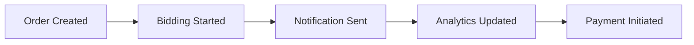
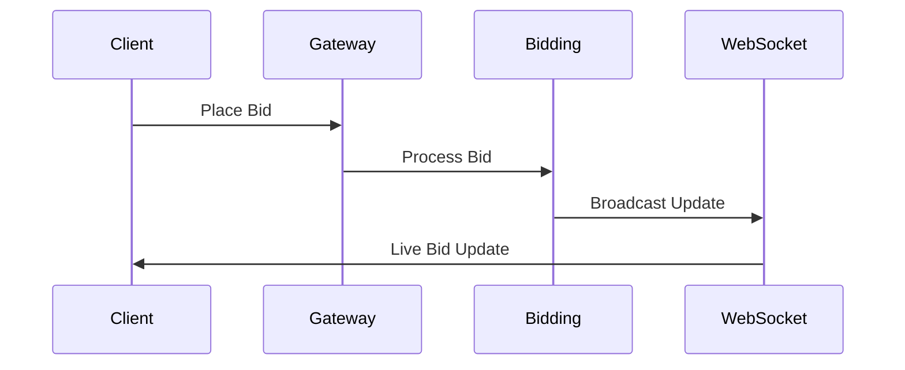

# 🏗️ Reverse Tender Platform - Modern Microservices Architecture

> **🚀 Laravel 12+ Ready Architecture** | **🔥 Domain-Driven Design** | **⚡ High Performance**

## 🎯 Architecture Overview

This diagram showcases our modernized microservices architecture implementing **Domain-Driven Design (DDD)**, **Hexagonal Architecture**, and **CQRS patterns** with Laravel 12+ structure.

```mermaid
%%{init: {
  'theme': 'dark',
  'themeVariables': {
    'primaryColor': '#ff6b6b',
    'primaryTextColor': '#ffffff',
    'primaryBorderColor': '#ff6b6b',
    'lineColor': '#4ecdc4',
    'secondaryColor': '#4ecdc4',
    'tertiaryColor': '#45b7d1',
    'background': '#1a1a2e',
    'mainBkg': '#16213e',
    'secondBkg': '#0f3460',
    'tertiaryBkg': '#533483'
  }
}}%%

graph TB
    %% 🌐 Client Layer - Modern Frontend Applications
    subgraph "🌐 CLIENT LAYER"
        PWA["🚀 PWA Client<br/>⚡ Vue.js 3 + Composition API<br/>🔥 Vite + TypeScript<br/>📱 Progressive Web App"]
        ADMIN["🎛️ Admin Dashboard<br/>⚡ Vue.js 3 + Quasar<br/>📊 Real-time Analytics<br/>🔐 Role-based Access"]
        MOBILE["📱 Mobile Apps<br/>⚡ React Native + Expo<br/>🔔 Push Notifications<br/>📍 Geolocation"]
    end
    
    %% 🔀 Infrastructure Layer
    subgraph "🔀 INFRASTRUCTURE LAYER"
        LB["⚖️ Load Balancer<br/>🚀 Nginx + HAProxy<br/>🛡️ SSL Termination<br/>📈 Auto-scaling"]
        GATEWAY["🚪 API Gateway<br/>🔥 Laravel 12+ Gateway<br/>🛡️ Rate Limiting + Auth<br/>📊 Request Analytics<br/>🌐 Port: 8000"]
    end
    
    %% 🎯 Core Business Services - Domain-Driven Design
    subgraph "🎯 CORE BUSINESS SERVICES"
        AUTH["🔐 Auth Service<br/>🔥 Laravel 12+ DDD<br/>🛡️ JWT + OAuth2 + OTP<br/>🏗️ Hexagonal Architecture<br/>🌐 Port: 8001"]
        USER["👥 User Service<br/>🔥 Laravel 12+ DDD<br/>👤 Profiles + KYC + Verification<br/>🎭 Role-based Permissions<br/>🌐 Port: 8003"]
        ORDER["📋 Order Service<br/>🔥 Laravel 12+ DDD<br/>📝 Request Management + Workflow<br/>🔄 Event Sourcing + CQRS<br/>🌐 Port: 8004"]
        BIDDING["🎯 Bidding Service<br/>🔥 Laravel 12+ DDD<br/>⚡ Real-time Auctions + WebSockets<br/>🏆 Smart Matching Algorithm<br/>🌐 Port: 8002"]
    end
    
    %% 🔧 Supporting Services
    subgraph "🔧 SUPPORTING SERVICES"
        NOTIFICATION["📢 Notification Service<br/>🔥 Laravel 12+ DDD<br/>📱 Push + SMS + Email + WhatsApp<br/>🎯 Smart Targeting + Templates<br/>🌐 Port: 8005"]
        PAYMENT["💳 Payment Service<br/>🔥 Laravel 12+ DDD<br/>💰 Multi-gateway + ZATCA Integration<br/>🔒 PCI DSS Compliant<br/>🌐 Port: 8006"]
        ANALYTICS["📊 Analytics Service<br/>🔥 Laravel 12+ DDD<br/>📈 BI + Real-time Reporting<br/>🤖 ML-powered Insights<br/>🌐 Port: 8007"]
        VIN_OCR["🔍 VIN OCR Service<br/>🔥 Laravel 12+ DDD<br/>🚗 AI Vehicle Recognition<br/>📸 Computer Vision + OCR<br/>🌐 Port: 8008"]
    end
    
    %% 💾 Data & Storage Layer
    subgraph "💾 DATA & STORAGE LAYER"
        MYSQL["🗃️ MySQL 8.0<br/>📊 Primary Database<br/>🔄 Master-Slave Replication<br/>⚡ Query Optimization"]
        REDIS["⚡ Redis 7.0<br/>🚀 Cache + Sessions + Pub/Sub<br/>🔄 Cluster Mode<br/>💾 Persistent Storage"]
        MINIO["📁 MinIO S3<br/>☁️ Object Storage<br/>🖼️ Images + Documents<br/>🔄 Multi-region Sync"]
    end
    
    %% 📨 Message & Event Layer
    subgraph "📨 MESSAGE & EVENT LAYER"
        QUEUE["📨 Event Bus<br/>⚡ Redis Pub/Sub + Laravel Horizon<br/>🔄 Event Sourcing<br/>📊 Dead Letter Queue"]
        WEBSOCKET["🔌 WebSocket Server<br/>⚡ Real-time Communication<br/>🎯 Bidding Updates<br/>📱 Live Notifications"]
    end
    
    %% 🌐 External Integrations
    subgraph "🌐 EXTERNAL INTEGRATIONS"
        ZATCA["🏛️ ZATCA API<br/>📄 E-Invoicing Compliance<br/>🇸🇦 Saudi Arabia Tax Authority<br/>🔐 Digital Signatures"]
        SMS_PROVIDER["📱 SMS Gateway<br/>🚀 Twilio + AWS SNS<br/>🌍 Global Coverage<br/>📊 Delivery Analytics"]
        EMAIL_PROVIDER["📧 Email Service<br/>🚀 SendGrid + AWS SES<br/>📬 Transactional + Marketing<br/>📊 Open/Click Tracking"]
        PUSH_PROVIDER["🔔 Push Notifications<br/>🚀 FCM + APNS<br/>📱 iOS + Android<br/>🎯 Targeted Campaigns"]
    end
    
    %% 🌐 Client Layer Connections
    PWA -.->|"🔒 HTTPS/WSS"| LB
    ADMIN -.->|"🔒 HTTPS/WSS"| LB
    MOBILE -.->|"🔒 HTTPS/WSS"| LB
    
    %% 🔀 Infrastructure Flow
    LB ==>|"⚖️ Load Balanced"| GATEWAY
    
    %% 🚪 Gateway to Core Services
    GATEWAY ==>|"🔐 Authenticated"| AUTH
    GATEWAY ==>|"👥 User Context"| USER
    GATEWAY ==>|"📋 Business Logic"| ORDER
    GATEWAY ==>|"🎯 Real-time"| BIDDING
    GATEWAY ==>|"📢 Async"| NOTIFICATION
    GATEWAY ==>|"💳 Secure"| PAYMENT
    GATEWAY ==>|"📊 Analytics"| ANALYTICS
    GATEWAY ==>|"🔍 AI/ML"| VIN_OCR
    
    %% 🔄 Inter-Service Communication (Domain Events)
    AUTH -.->|"🔐 User Authenticated"| USER
    USER -.->|"👤 Profile Updated"| ORDER
    ORDER -.->|"📋 Order Created"| BIDDING
    BIDDING -.->|"🎯 Bid Placed"| NOTIFICATION
    ORDER -.->|"💰 Payment Required"| PAYMENT
    PAYMENT -.->|"🏛️ Tax Compliance"| ZATCA
    
    %% 💾 Data Persistence Layer
    AUTH ==>|"🔐 User Data"| MYSQL
    USER ==>|"👤 Profiles"| MYSQL
    ORDER ==>|"📋 Orders"| MYSQL
    BIDDING ==>|"🎯 Bids"| MYSQL
    NOTIFICATION ==>|"📢 Messages"| MYSQL
    PAYMENT ==>|"💳 Transactions"| MYSQL
    ANALYTICS ==>|"📊 Metrics"| MYSQL
    VIN_OCR ==>|"🔍 OCR Results"| MYSQL
    
    %% ⚡ Caching Layer
    AUTH ==>|"🎫 Sessions"| REDIS
    USER ==>|"👤 Cache"| REDIS
    ORDER ==>|"📋 Cache"| REDIS
    BIDDING ==>|"⚡ Real-time"| REDIS
    GATEWAY ==>|"🚪 Rate Limits"| REDIS
    
    %% 📁 File Storage
    USER ==>|"🖼️ Avatars"| MINIO
    ORDER ==>|"📄 Documents"| MINIO
    VIN_OCR ==>|"📸 Images"| MINIO
    
    %% 📨 Event-Driven Architecture
    BIDDING ==>|"🎯 Bid Events"| QUEUE
    NOTIFICATION ==>|"📢 Send Queue"| QUEUE
    ORDER ==>|"📋 Order Events"| QUEUE
    BIDDING -.->|"⚡ Live Updates"| WEBSOCKET
    
    %% 🌐 External Integrations
    NOTIFICATION ==>|"📱 SMS"| SMS_PROVIDER
    NOTIFICATION ==>|"📧 Email"| EMAIL_PROVIDER
    NOTIFICATION ==>|"🔔 Push"| PUSH_PROVIDER
    PAYMENT ==>|"🏛️ E-Invoice"| ZATCA
    
    %% 🎨 Modern Styling with Dark Theme
    classDef clientStyle fill:#ff6b6b,stroke:#ffffff,stroke-width:3px,color:#ffffff
    classDef infraStyle fill:#4ecdc4,stroke:#ffffff,stroke-width:3px,color:#ffffff
    classDef coreStyle fill:#45b7d1,stroke:#ffffff,stroke-width:3px,color:#ffffff
    classDef supportStyle fill:#96ceb4,stroke:#ffffff,stroke-width:3px,color:#ffffff
    classDef dataStyle fill:#feca57,stroke:#ffffff,stroke-width:3px,color:#000000
    classDef messageStyle fill:#ff9ff3,stroke:#ffffff,stroke-width:3px,color:#ffffff
    classDef externalStyle fill:#54a0ff,stroke:#ffffff,stroke-width:3px,color:#ffffff
    
    class PWA,ADMIN,MOBILE clientStyle
    class LB,GATEWAY infraStyle
    class AUTH,USER,ORDER,BIDDING coreStyle
    class NOTIFICATION,PAYMENT,ANALYTICS,VIN_OCR supportStyle
    class MYSQL,REDIS,MINIO dataStyle
    class QUEUE,WEBSOCKET messageStyle
    class ZATCA,SMS_PROVIDER,EMAIL_PROVIDER,PUSH_PROVIDER externalStyle
```



## 🏗️ Modern Architecture Principles

### 🎯 **Domain-Driven Design (DDD)**
- **Domain Layer**: Core business logic and entities
- **Application Layer**: Use cases and application services
- **Infrastructure Layer**: External concerns (database, APIs, etc.)
- **Interface Layer**: Controllers, DTOs, and external interfaces

### 🔄 **Event-Driven Architecture**
- **Event Sourcing**: Complete audit trail of all business events
- **CQRS**: Separate read and write models for optimal performance
- **Domain Events**: Loose coupling between bounded contexts
- **Saga Pattern**: Distributed transaction management

### 🏛️ **Hexagonal Architecture**
- **Ports**: Interfaces defining how the application communicates
- **Adapters**: Implementations of ports for specific technologies
- **Core**: Business logic independent of external concerns
- **Dependency Inversion**: Core depends on abstractions, not concretions

---

## 🚀 Service Specifications

### **🚪 API Gateway (Port 8000)**
```yaml
🔥 Laravel 12+ Features:
  - Modern Routing with Route Model Binding
  - Advanced Middleware Pipeline
  - Request/Response Transformation
  - OpenAPI 3.0 Documentation

🛡️ Security Features:
  - JWT Token Validation
  - Rate Limiting (Redis-based)
  - CORS Management
  - Request Sanitization

📊 Monitoring:
  - Request/Response Logging
  - Performance Metrics
  - Error Tracking
  - Health Checks
```

### **🔐 Auth Service (Port 8001)**
```yaml
🏗️ DDD Structure:
  Domain/Auth/
    ├── Models/User.php (Domain Entity)
    ├── ValueObjects/UserId.php, Email.php
    ├── Repositories/UserRepositoryInterface.php
    └── Events/UserAuthenticated.php

🔐 Security Features:
  - JWT with RS256 Algorithm
  - OAuth2 (Google, Apple, Microsoft)
  - Multi-factor Authentication (TOTP, SMS)
  - Biometric Authentication Support

🎯 Modern Patterns:
  - Repository Pattern
  - Value Objects
  - Domain Events
  - Command/Query Separation
```

### **👥 User Service (Port 8003)**
```yaml
🏗️ DDD Structure:
  Domain/User/
    ├── Models/Profile.php, Verification.php
    ├── ValueObjects/PhoneNumber.php, Address.php
    ├── Services/KYCService.php
    └── Events/ProfileUpdated.php

🔍 KYC Features:
  - Document Verification (AI-powered)
  - Identity Verification
  - Address Verification
  - Business License Validation

📱 Profile Management:
  - Multi-language Support
  - Preference Management
  - Privacy Controls
  - Data Export (GDPR)
```

### **📋 Order Service (Port 8004)**
```yaml
🏗️ DDD Structure:
  Domain/Order/
    ├── Models/Order.php, OrderItem.php
    ├── ValueObjects/OrderId.php, Money.php
    ├── Services/OrderWorkflowService.php
    └── Events/OrderCreated.php, OrderStatusChanged.php

🔄 Workflow Engine:
  - State Machine Pattern
  - Business Rules Engine
  - Approval Workflows
  - Automated Processing

📊 Analytics:
  - Order Tracking
  - Performance Metrics
  - Demand Forecasting
  - Supplier Analytics
```

### **🎯 Bidding Service (Port 8002)**
```yaml
🏗️ DDD Structure:
  Domain/Bidding/
    ├── Models/Auction.php, Bid.php
    ├── ValueObjects/BidAmount.php, AuctionId.php
    ├── Services/AuctionEngine.php
    └── Events/BidPlaced.php, AuctionEnded.php

⚡ Real-time Features:
  - WebSocket Connections
  - Live Bid Updates
  - Auto-bidding Algorithms
  - Bid Validation Rules

🤖 Smart Features:
  - ML-powered Price Suggestions
  - Fraud Detection
  - Market Analysis
  - Automated Matching
```

### **📢 Notification Service (Port 8005)**
```yaml
🏗️ DDD Structure:
  Domain/Notification/
    ├── Models/Notification.php, Template.php
    ├── ValueObjects/NotificationId.php, Channel.php
    ├── Services/NotificationDispatcher.php
    └── Events/NotificationSent.php

📱 Multi-channel Support:
  - Push Notifications (FCM, APNS)
  - SMS (Twilio, AWS SNS)
  - Email (SendGrid, SES)
  - WhatsApp Business API

🎯 Smart Features:
  - Personalization Engine
  - A/B Testing
  - Delivery Optimization
  - Analytics & Tracking
```

### **💳 Payment Service (Port 8006)**
```yaml
🏗️ DDD Structure:
  Domain/Payment/
    ├── Models/Payment.php, Transaction.php
    ├── ValueObjects/Amount.php, Currency.php
    ├── Services/PaymentProcessor.php
    └── Events/PaymentProcessed.php

💰 Payment Gateways:
  - Stripe, PayPal, Square
  - Local Saudi Gateways
  - Cryptocurrency Support
  - Buy Now Pay Later (BNPL)

🏛️ Compliance:
  - ZATCA E-Invoicing
  - PCI DSS Level 1
  - Anti-Money Laundering (AML)
  - Know Your Customer (KYC)
```

### **📊 Analytics Service (Port 8007)**
```yaml
🏗️ DDD Structure:
  Domain/Analytics/
    ├── Models/Metric.php, Report.php
    ├── ValueObjects/MetricId.php, TimeRange.php
    ├── Services/ReportGenerator.php
    └── Events/MetricRecorded.php

📈 Analytics Features:
  - Real-time Dashboards
  - Custom Report Builder
  - Data Visualization
  - Predictive Analytics

🤖 AI/ML Features:
  - Demand Forecasting
  - Price Optimization
  - Customer Segmentation
  - Anomaly Detection
```

### **🔍 VIN OCR Service (Port 8008)**
```yaml
🏗️ DDD Structure:
  Domain/VIN/
    ├── Models/VehicleInfo.php, OCRResult.php
    ├── ValueObjects/VIN.php, Confidence.php
    ├── Services/OCRProcessor.php
    └── Events/VINProcessed.php

🤖 AI/ML Features:
  - Computer Vision (OpenCV)
  - OCR Engine (Tesseract)
  - Vehicle Database Integration
  - Confidence Scoring

🚗 Vehicle Data:
  - Make, Model, Year Detection
  - Specifications Lookup
  - Market Value Estimation
  - Parts Compatibility
```

---

## 🔧 Infrastructure Components

### **💾 Data Layer**
- **MySQL 8.0**: ACID compliance, JSON support, performance optimization
- **Redis 7.0**: Caching, sessions, pub/sub, clustering
- **MinIO**: S3-compatible object storage, multi-region replication

### **📨 Message Layer**
- **Laravel Horizon**: Queue management and monitoring
- **Redis Pub/Sub**: Real-time event distribution
- **WebSocket Server**: Live bidding and notifications

### **🌐 External Integrations**
- **ZATCA API**: Saudi Arabia tax compliance
- **Payment Gateways**: Multi-provider support
- **Communication APIs**: SMS, Email, Push notifications

---

## 🎯 Key Benefits

### **🚀 Performance**
- **Horizontal Scaling**: Independent service scaling
- **Caching Strategy**: Multi-layer caching (Redis, CDN)
- **Database Optimization**: Read replicas, query optimization
- **Async Processing**: Event-driven, non-blocking operations

### **🛡️ Security**
- **Zero Trust Architecture**: Every request authenticated
- **Data Encryption**: At rest and in transit
- **Compliance**: GDPR, PCI DSS, ZATCA
- **Audit Trail**: Complete event sourcing

### **🔧 Maintainability**
- **Domain-Driven Design**: Clear business boundaries
- **Hexagonal Architecture**: Testable, flexible design
- **Modern Laravel**: Latest framework features
- **Comprehensive Testing**: Unit, integration, E2E tests

---

## 🔄 Communication Patterns

### **🔄 Event-Driven Communication**


### **⚡ Real-time Communication**


### **🛡️ Security & Resilience**
- **Circuit Breaker Pattern**: Prevent cascade failures
- **Retry Logic**: Exponential backoff with jitter
- **Health Checks**: Comprehensive service monitoring
- **Rate Limiting**: Redis-based throttling
- **Graceful Degradation**: Fallback mechanisms

### **📈 Performance & Scalability**
- **Horizontal Scaling**: Kubernetes auto-scaling
- **Database Optimization**: Read replicas, query optimization
- **Caching Strategy**: Multi-layer (Redis, CDN, Application)
- **CDN Integration**: Global content delivery
