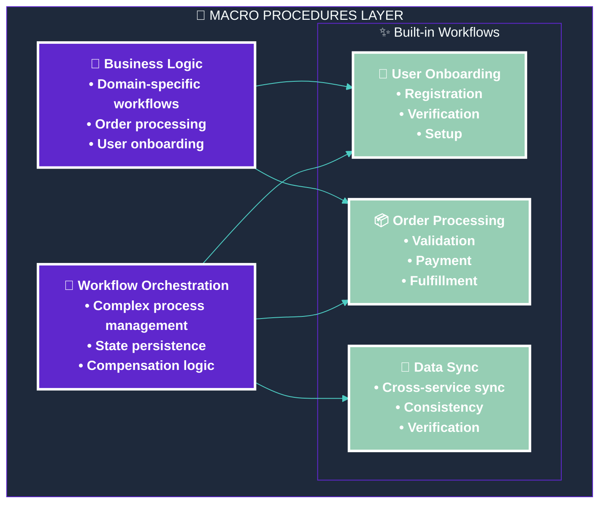
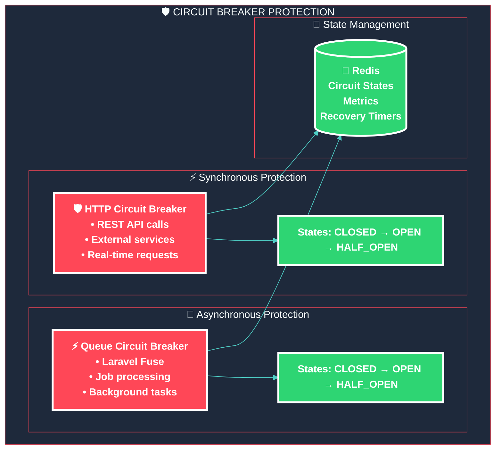
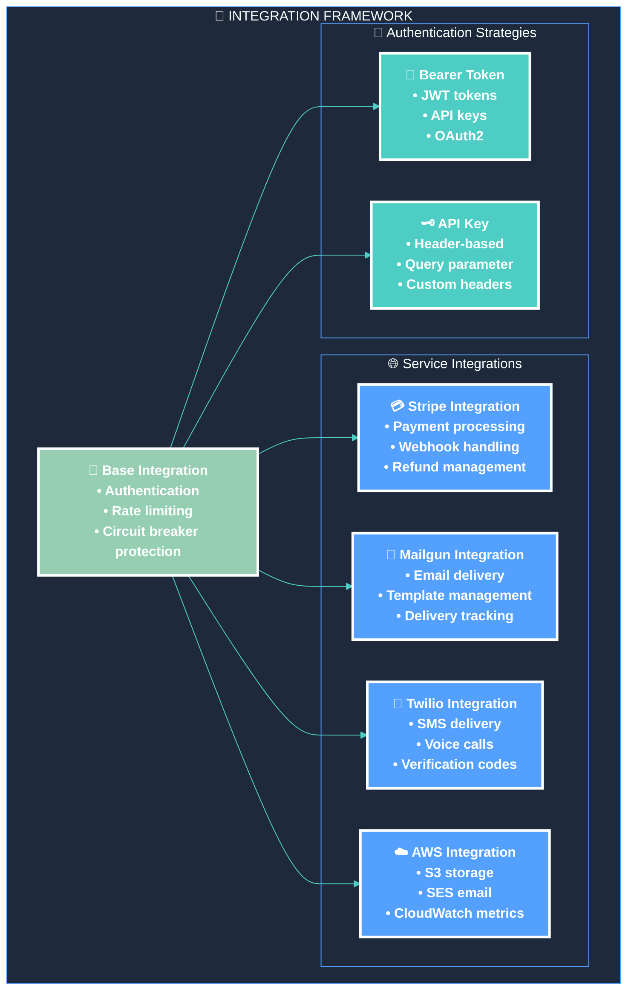
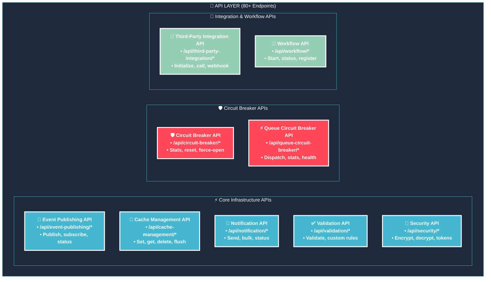
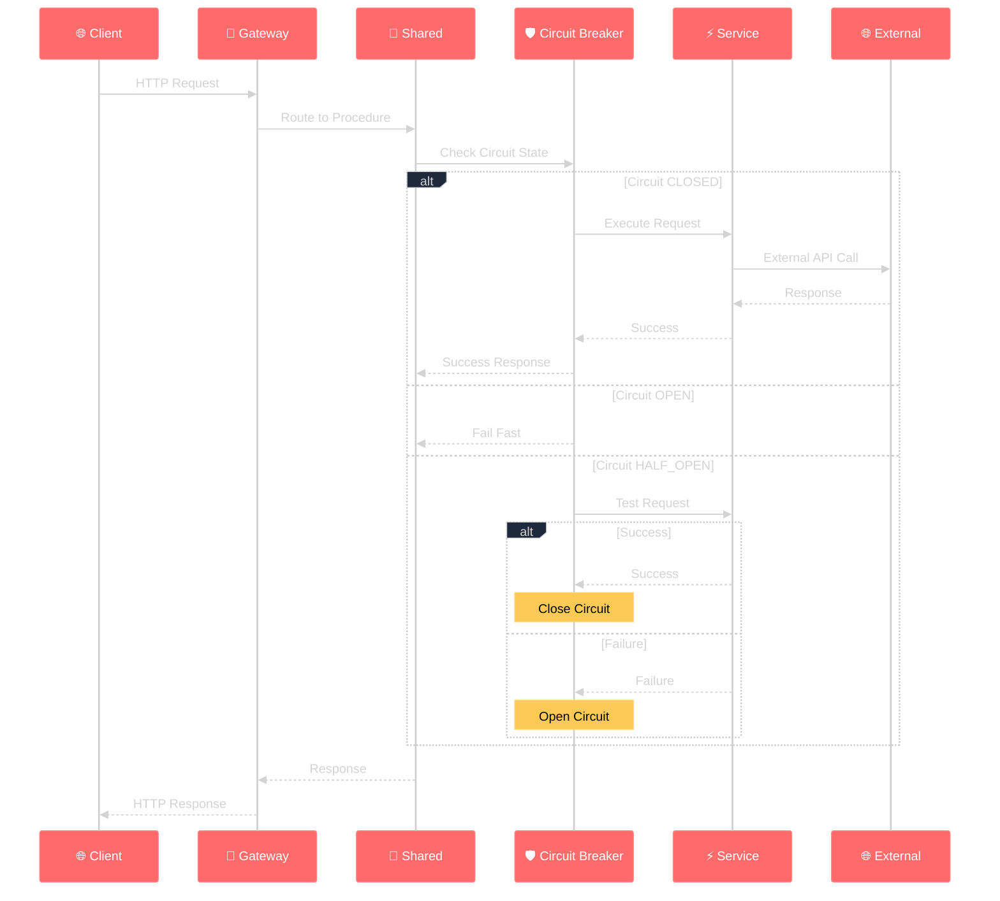
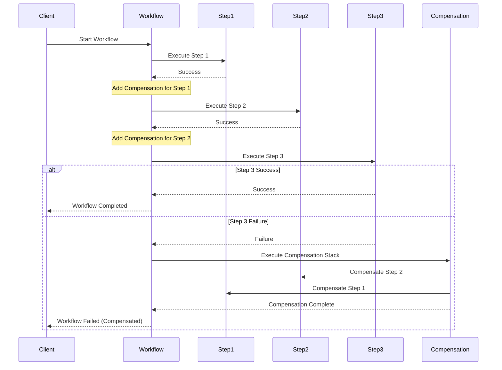

# 🏗️ Enhanced Microservices Architecture

## 🎯 **Enterprise Architecture Overview**

The Laravel Reverse Tender Platform features an **enterprise-grade microservices architecture** with advanced **workflow orchestration**, **dual circuit breaker patterns**, and **third-party integration capabilities**.

## 📊 **Complete System Architecture**

```mermaid
%%{init: {
  'theme': 'base',
  'themeVariables': {
    'darkMode': true,
    'primaryColor': '#FF6B6B',
    'primaryTextColor': '#FFFFFF',
    'primaryBorderColor': '#FF8E8E',
    'lineColor': '#4ECDC4',
    'secondaryColor': '#45B7D1',
    'tertiaryColor': '#96CEB4',
    'background': '#0F172A',
    'mainBkg': '#1E293B',
    'secondBkg': '#334155',
    'tertiaryBkg': '#475569',
    'clusterBkg': '#1E293B',
    'clusterBorder': '#4ECDC4',
    'edgeLabelBackground': '#334155',
    'nodeTextColor': '#FFFFFF',
    'edgeColor': '#4ECDC4',
    'fontFamily': 'Inter, Segoe UI, Roboto, sans-serif',
    'fontSize': '14px',
    'fontWeight': 'bold'
  }
}}%%

graph TB
    subgraph "🌐 CLIENT LAYER"
        WEB[🌐 Web Application<br/>React/Vue Frontend]
        MOBILE[📱 Mobile App<br/>React Native/Flutter]
        API_CLIENT[🔌 API Clients<br/>Third-party Integrations]
    end

    subgraph "🚪 GATEWAY LAYER"
        GATEWAY[🚪 Gateway Service<br/>Port: 8000<br/>Routing & Load Balancing]
    end

    subgraph "🎯 CROSS-SERVICE INFRASTRUCTURE HUB"
        SHARED[🎯 Shared Service<br/>Port: 8001<br/>Orchestration Hub]
        
        subgraph "⚡ Micro Procedures (8 Total)"
            EVENT[📡 Event Publishing<br/>Async Messaging]
            CACHE[💾 Cache Management<br/>Redis Operations]
            NOTIFY[📢 Notification<br/>Multi-channel]
            VALID[✅ Validation<br/>Data Validation]
            SEC[🔐 Security<br/>Auth & Encryption]
            CB[🛡️ Circuit Breaker<br/>Sync Protection]
            QCB[⚡ Queue Circuit Breaker<br/>Async Protection]
            TPI[🔌 Third-Party Integration<br/>External Services]
        end
        
        subgraph "🔄 Macro Procedures (2 Types)"
            WF[🔄 Workflow Orchestration<br/>Complex Processes]
            BL[🎯 Business Logic<br/>Domain Workflows]
        end
    end

    subgraph "⚡ CORE MICROSERVICES (8 Total)"
        AUTH[🔑 Auth Service<br/>Port: 8002<br/>Authentication]
        TENDER[📋 Tender Service<br/>Port: 8003<br/>Tender Management]
        BID[💰 Bidding Service<br/>Port: 8004<br/>Bid Processing]
        PAY[💳 Payment Service<br/>Port: 8005<br/>Payment Processing]
        NOTIF_SVC[📨 Notification Service<br/>Port: 8006<br/>Message Delivery]
        ANALYTICS[📊 Analytics Service<br/>Port: 8007<br/>Data Analytics]
        USER[👤 User Service<br/>Port: 8008<br/>User Management]
        ADMIN[⚙️ Admin Service<br/>Port: 8009<br/>Administration]
    end

    subgraph "🌐 EXTERNAL SERVICES"
        STRIPE[💳 Stripe API<br/>Payment Processing]
        MAILGUN[📧 Mailgun API<br/>Email Service]
        TWILIO[📱 Twilio API<br/>SMS Service]
        AWS[☁️ AWS Services<br/>Cloud Infrastructure]
        GOOGLE[🔍 Google APIs<br/>OAuth & Maps]
    end

    subgraph "💾 DATA LAYER"
        REDIS[(🔴 Redis Cluster<br/>Cache & Circuit State<br/>Session Management)]
        DB[(🗄️ MySQL/PostgreSQL<br/>Primary Database<br/>ACID Transactions)]
        QUEUE[(📬 Queue System<br/>Job Processing<br/>Laravel Queues)]
        SEARCH[(🔍 Elasticsearch<br/>Search & Analytics<br/>Full-text Search)]
    end

    %% Client connections
    WEB --> GATEWAY
    MOBILE --> GATEWAY
    API_CLIENT --> GATEWAY

    %% Gateway to Shared Hub
    GATEWAY --> SHARED

    %% Shared Hub to Core Services
    SHARED --> AUTH
    SHARED --> TENDER
    SHARED --> BID
    SHARED --> PAY
    SHARED --> NOTIF_SVC
    SHARED --> ANALYTICS
    SHARED --> USER
    SHARED --> ADMIN

    %% Third-Party Integrations
    TPI --> STRIPE
    TPI --> MAILGUN
    TPI --> TWILIO
    TPI --> AWS
    TPI --> GOOGLE

    %% Data Layer Connections
    SHARED --> REDIS
    SHARED --> DB
    SHARED --> QUEUE
    SHARED --> SEARCH
    
    AUTH --> DB
    TENDER --> DB
    BID --> DB
    PAY --> DB
    NOTIF_SVC --> DB
    ANALYTICS --> DB
    USER --> DB
    ADMIN --> DB

    %% Queue Connections
    QCB --> QUEUE
    NOTIF_SVC --> QUEUE
    PAY --> QUEUE
    ANALYTICS --> QUEUE

    %% Cache Connections
    CACHE --> REDIS
    AUTH --> REDIS
    TENDER --> REDIS
    BID --> REDIS

    %% Search Connections
    TENDER --> SEARCH
    BID --> SEARCH
    ANALYTICS --> SEARCH

    %% 🎨 Distinguished Eye-Catching Styling with Enhanced Visual Effects
    classDef clientStyle fill:#FF9FF3,stroke:#FFFFFF,stroke-width:4px,color:#FFFFFF,font-weight:bold,font-size:14px,rx:12,ry:12
    classDef gatewayStyle fill:#FF6B6B,stroke:#FF8E8E,stroke-width:4px,color:#FFFFFF,font-weight:bold,font-size:16px,rx:15,ry:15
    classDef sharedStyle fill:#96CEB4,stroke:#B2D8C4,stroke-width:4px,color:#FFFFFF,font-weight:bold,font-size:15px,rx:12,ry:12
    classDef microStyle fill:#4ECDC4,stroke:#7ED6D1,stroke-width:3px,color:#FFFFFF,font-weight:bold,font-size:13px,rx:10,ry:10
    classDef macroStyle fill:#5F27CD,stroke:#7B4AE0,stroke-width:4px,color:#FFFFFF,font-weight:bold,font-size:14px,rx:12,ry:12
    classDef serviceStyle fill:#45B7D1,stroke:#6BC5D8,stroke-width:4px,color:#FFFFFF,font-weight:bold,font-size:14px,rx:12,ry:12
    classDef externalStyle fill:#54A0FF,stroke:#7BB3FF,stroke-width:3px,color:#FFFFFF,font-weight:bold,font-size:13px,rx:8,ry:8
    classDef dataStyle fill:#FECA57,stroke:#FED876,stroke-width:4px,color:#000000,font-weight:bold,font-size:14px,rx:10,ry:10

    class WEB,MOBILE,API_CLIENT clientStyle
    class GATEWAY gatewayStyle
    class SHARED sharedStyle
    class EVENT,CACHE,NOTIFY,VALID,SEC,CB,QCB,TPI microStyle
    class WF,BL macroStyle
    class AUTH,TENDER,BID,PAY,NOTIF_SVC,ANALYTICS,USER,ADMIN serviceStyle
    class STRIPE,MAILGUN,TWILIO,AWS,GOOGLE externalStyle
    class REDIS,DB,QUEUE,SEARCH dataStyle
```

## 🔄 **Cross-Service Infrastructure Details**

### **Micro Procedures (8 Total)**

```mermaid
%%{init: {
  'theme': 'base',
  'themeVariables': {
    'darkMode': true,
    'primaryColor': '#4ECDC4',
    'primaryTextColor': '#FFFFFF',
    'primaryBorderColor': '#7ED6D1',
    'lineColor': '#4ECDC4',
    'background': '#0F172A',
    'mainBkg': '#1E293B',
    'clusterBkg': '#1E293B',
    'clusterBorder': '#4ECDC4',
    'nodeTextColor': '#FFFFFF',
    'fontFamily': 'Inter, Segoe UI, Roboto, sans-serif',
    'fontSize': '14px',
    'fontWeight': 'bold'
  }
}}%%

graph LR
    subgraph "⚡ MICRO PROCEDURES LAYER"
        EVENT[📡 Event Publishing<br/>• Async messaging<br/>• Event routing<br/>• Service decoupling]
        CACHE[💾 Cache Management<br/>• Redis operations<br/>• TTL management<br/>• Cache invalidation]
        NOTIFY[📢 Notification<br/>• Multi-channel delivery<br/>• Template management<br/>• Delivery tracking]
        VALID[✅ Validation<br/>• Data validation<br/>• Business rules<br/>• Input sanitization]
        SEC[🔐 Security<br/>• Authentication<br/>• Authorization<br/>• Encryption/Decryption]
        CB[🛡️ Circuit Breaker<br/>• Sync protection<br/>• HTTP requests<br/>• Auto recovery]
        QCB[⚡ Queue Circuit Breaker<br/>• Async protection<br/>• Job processing<br/>• Laravel Fuse]
        TPI[🔌 Third-Party Integration<br/>• External APIs<br/>• Authentication<br/>• Webhook handling]
    end

    classDef microStyle fill:#4ECDC4,stroke:#7ED6D1,stroke-width:4px,color:#FFFFFF,font-weight:bold,font-size:14px,rx:12,ry:12
    class EVENT,CACHE,NOTIFY,VALID,SEC,CB,QCB,TPI microStyle
```

### **Macro Procedures (2 Types)**

```mermaid
%%{init: {
  'theme': 'dark',
  'themeVariables': {
    'primaryColor': '#5F27CD',
    'primaryTextColor': '#FFFFFF',
    'primaryBorderColor': '#7B4AE0',
    'lineColor': '#4ECDC4',
    'background': '#0F172A',
    'mainBkg': '#1E293B',
    'clusterBkg': '#1E293B',
    'clusterBorder': '#5F27CD',
    'nodeTextColor': '#FFFFFF',
    'edgeColor': '#4ECDC4'
  }
}}%%

graph TB
    subgraph "🔄 MACRO PROCEDURES LAYER"
        WF[🔄 Workflow Orchestration<br/>• Complex process management<br/>• State persistence<br/>• Compensation logic]
        BL[🎯 Business Logic<br/>• Domain-specific workflows<br/>• Order processing<br/>• User onboarding]
        
        subgraph "✨ Built-in Workflows"
            USER_WF[👤 User Onboarding<br/>• Registration<br/>• Verification<br/>• Setup]
            ORDER_WF[📦 Order Processing<br/>• Validation<br/>• Payment<br/>• Fulfillment]
            DATA_WF[🔄 Data Sync<br/>• Cross-service sync<br/>• Consistency<br/>• Verification]
        end
    end

    WF --> USER_WF
    WF --> ORDER_WF
    WF --> DATA_WF
    BL --> USER_WF
    BL --> ORDER_WF

    classDef macroStyle fill:#5F27CD,stroke:#FFFFFF,stroke-width:3px,color:#FFFFFF,font-weight:bold
    classDef workflowStyle fill:#96CEB4,stroke:#FFFFFF,stroke-width:3px,color:#FFFFFF,font-weight:bold
    
    class WF,BL macroStyle
    class USER_WF,ORDER_WF,DATA_WF workflowStyle
```

## 🛡️ **Dual Circuit Breaker Architecture**

```mermaid
%%{init: {
  'theme': 'dark',
  'themeVariables': {
    'primaryColor': '#FF4757',
    'primaryTextColor': '#FFFFFF',
    'primaryBorderColor': '#FF6B7A',
    'lineColor': '#4ECDC4',
    'background': '#0F172A',
    'mainBkg': '#1E293B',
    'clusterBkg': '#1E293B',
    'clusterBorder': '#FF4757',
    'nodeTextColor': '#FFFFFF',
    'edgeColor': '#4ECDC4'
  }
}}%%

graph TB
    subgraph "🛡️ CIRCUIT BREAKER PROTECTION"
        subgraph "⚡ Synchronous Protection"
            SYNC_CB[🛡️ HTTP Circuit Breaker<br/>• REST API calls<br/>• External services<br/>• Real-time requests]
            SYNC_STATES[States: CLOSED → OPEN → HALF_OPEN]
        end
        
        subgraph "🔄 Asynchronous Protection"
            ASYNC_CB[⚡ Queue Circuit Breaker<br/>• Laravel Fuse<br/>• Job processing<br/>• Background tasks]
            ASYNC_STATES[States: CLOSED → OPEN → HALF_OPEN]
        end
        
        subgraph "💾 State Management"
            REDIS_STATE[(🔴 Redis<br/>Circuit States<br/>Metrics<br/>Recovery Timers)]
        end
    end

    SYNC_CB --> REDIS_STATE
    ASYNC_CB --> REDIS_STATE
    SYNC_CB --> SYNC_STATES
    ASYNC_CB --> ASYNC_STATES

    classDef cbStyle fill:#FF4757,stroke:#FFFFFF,stroke-width:3px,color:#FFFFFF,font-weight:bold
    classDef stateStyle fill:#2ED573,stroke:#FFFFFF,stroke-width:3px,color:#FFFFFF,font-weight:bold
    
    class SYNC_CB,ASYNC_CB cbStyle
    class SYNC_STATES,ASYNC_STATES,REDIS_STATE stateStyle
```

## 🔌 **Third-Party Integration Framework**

```mermaid
%%{init: {
  'theme': 'dark',
  'themeVariables': {
    'primaryColor': '#54A0FF',
    'primaryTextColor': '#FFFFFF',
    'primaryBorderColor': '#7BB3FF',
    'lineColor': '#4ECDC4',
    'background': '#0F172A',
    'mainBkg': '#1E293B',
    'clusterBkg': '#1E293B',
    'clusterBorder': '#54A0FF',
    'nodeTextColor': '#FFFFFF',
    'edgeColor': '#4ECDC4'
  }
}}%%

graph TB
    subgraph "🔌 INTEGRATION FRAMEWORK"
        BASE_INT[🔌 Base Integration<br/>• Authentication<br/>• Rate limiting<br/>• Circuit breaker protection]
        
        subgraph "🌐 Service Integrations"
            STRIPE_INT[💳 Stripe Integration<br/>• Payment processing<br/>• Webhook handling<br/>• Refund management]
            MAILGUN_INT[📧 Mailgun Integration<br/>• Email delivery<br/>• Template management<br/>• Delivery tracking]
            TWILIO_INT[📱 Twilio Integration<br/>• SMS delivery<br/>• Voice calls<br/>• Verification codes]
            AWS_INT[☁️ AWS Integration<br/>• S3 storage<br/>• SES email<br/>• CloudWatch metrics]
        end
        
        subgraph "🔐 Authentication Strategies"
            BEARER[🔑 Bearer Token<br/>• JWT tokens<br/>• API keys<br/>• OAuth2]
            API_KEY[🗝️ API Key<br/>• Header-based<br/>• Query parameter<br/>• Custom headers]
        end
    end

    BASE_INT --> STRIPE_INT
    BASE_INT --> MAILGUN_INT
    BASE_INT --> TWILIO_INT
    BASE_INT --> AWS_INT
    
    BASE_INT --> BEARER
    BASE_INT --> API_KEY

    classDef integrationStyle fill:#96CEB4,stroke:#FFFFFF,stroke-width:3px,color:#FFFFFF,font-weight:bold
    classDef serviceStyle fill:#54A0FF,stroke:#FFFFFF,stroke-width:3px,color:#FFFFFF,font-weight:bold
    classDef authStyle fill:#4ECDC4,stroke:#FFFFFF,stroke-width:3px,color:#FFFFFF,font-weight:bold
    
    class BASE_INT integrationStyle
    class STRIPE_INT,MAILGUN_INT,TWILIO_INT,AWS_INT serviceStyle
    class BEARER,API_KEY authStyle
```

## 📡 **API Architecture Overview**

```mermaid
%%{init: {
  'theme': 'dark',
  'themeVariables': {
    'primaryColor': '#45B7D1',
    'primaryTextColor': '#FFFFFF',
    'primaryBorderColor': '#6BC5D8',
    'lineColor': '#4ECDC4',
    'background': '#0F172A',
    'mainBkg': '#1E293B',
    'clusterBkg': '#1E293B',
    'clusterBorder': '#45B7D1',
    'nodeTextColor': '#FFFFFF'
  }
}}%%

graph TB
    subgraph "📡 API LAYER (80+ Endpoints)"
        subgraph "⚡ Core Infrastructure APIs"
            EVENT_API[📡 Event Publishing API<br/>• /api/event-publishing/*<br/>• Publish, subscribe, status]
            CACHE_API[💾 Cache Management API<br/>• /api/cache-management/*<br/>• Set, get, delete, flush]
            NOTIFY_API[📢 Notification API<br/>• /api/notification/*<br/>• Send, bulk, status]
            VALID_API[✅ Validation API<br/>• /api/validation/*<br/>• Validate, custom rules]
            SEC_API[🔐 Security API<br/>• /api/security/*<br/>• Encrypt, decrypt, tokens]
        end
        
        subgraph "🛡️ Circuit Breaker APIs"
            CB_API[🛡️ Circuit Breaker API<br/>• /api/circuit-breaker/*<br/>• Stats, reset, force-open]
            QCB_API[⚡ Queue Circuit Breaker API<br/>• /api/queue-circuit-breaker/*<br/>• Dispatch, stats, health]
        end
        
        subgraph "🔌 Integration & Workflow APIs"
            TPI_API[🔌 Third-Party Integration API<br/>• /api/third-party-integration/*<br/>• Initialize, call, webhook]
            WF_API[🔄 Workflow API<br/>• /api/workflow/*<br/>• Start, status, register]
        end
    end

    classDef apiStyle fill:#45B7D1,stroke:#FFFFFF,stroke-width:3px,color:#FFFFFF,font-weight:bold
    classDef cbApiStyle fill:#FF4757,stroke:#FFFFFF,stroke-width:3px,color:#FFFFFF,font-weight:bold
    classDef intApiStyle fill:#96CEB4,stroke:#FFFFFF,stroke-width:3px,color:#FFFFFF,font-weight:bold
    
    class EVENT_API,CACHE_API,NOTIFY_API,VALID_API,SEC_API apiStyle
    class CB_API,QCB_API cbApiStyle
    class TPI_API,WF_API intApiStyle
```

## 🔄 **Service Communication Patterns**

### **Request Flow with Circuit Breaker Protection**

```mermaid
%%{init: {
  'theme': 'dark',
  'themeVariables': {
    'actorBkg': '#FF6B6B',
    'actorBorder': '#FF8E8E',
    'actorTextColor': '#FFFFFF',
    'activationBkgColor': '#4ECDC4',
    'activationBorderColor': '#7ED6D1',
    'noteBkgColor': '#FECA57',
    'noteTextColor': '#000000',
    'noteBorderColor': '#FED876',
    'background': '#0F172A',
    'mainBkg': '#1E293B',
    'primaryTextColor': '#FFFFFF'
  }
}}%%

sequenceDiagram
    participant Client as 🌐 Client
    participant Gateway as 🚪 Gateway
    participant Shared as 🎯 Shared
    participant CircuitBreaker as 🛡️ Circuit Breaker
    participant Service as ⚡ Service
    participant External as 🌐 External

    Client->>Gateway: HTTP Request
    Gateway->>Shared: Route to Procedure
    Shared->>CircuitBreaker: Check Circuit State
    
    alt Circuit CLOSED
        CircuitBreaker->>Service: Execute Request
        Service->>External: External API Call
        External-->>Service: Response
        Service-->>CircuitBreaker: Success
        CircuitBreaker-->>Shared: Success Response
    else Circuit OPEN
        CircuitBreaker-->>Shared: Fail Fast
    else Circuit HALF_OPEN
        CircuitBreaker->>Service: Test Request
        alt Success
            Service-->>CircuitBreaker: Success
            Note over CircuitBreaker: Close Circuit
        else Failure
            Service-->>CircuitBreaker: Failure
            Note over CircuitBreaker: Open Circuit
        end
    end
    
    Shared-->>Gateway: Response
    Gateway-->>Client: HTTP Response
```

### **Workflow Execution Flow**

```mermaid
sequenceDiagram
    participant Client
    participant Workflow
    participant Step1
    participant Step2
    participant Step3
    participant Compensation

    Client->>Workflow: Start Workflow
    Workflow->>Step1: Execute Step 1
    Step1-->>Workflow: Success
    Note over Workflow: Add Compensation for Step 1
    
    Workflow->>Step2: Execute Step 2
    Step2-->>Workflow: Success
    Note over Workflow: Add Compensation for Step 2
    
    Workflow->>Step3: Execute Step 3
    alt Step 3 Success
        Step3-->>Workflow: Success
        Workflow-->>Client: Workflow Completed
    else Step 3 Failure
        Step3-->>Workflow: Failure
        Workflow->>Compensation: Execute Compensation Stack
        Compensation->>Step2: Compensate Step 2
        Compensation->>Step1: Compensate Step 1
        Compensation-->>Workflow: Compensation Complete
        Workflow-->>Client: Workflow Failed (Compensated)
    end
```

## 📊 **Technology Stack**

### **Backend Technologies**
- **Framework**: Laravel 10+ with PHP 8.1+
- **Database**: MySQL 8.0 / PostgreSQL 14+
- **Cache**: Redis 7.0+ (Circuit breaker state, sessions, cache)
- **Queue**: Laravel Queues with Redis driver
- **Search**: Elasticsearch 8.0+ (Full-text search, analytics)

### **Circuit Breaker Technologies**
- **Sync Circuit Breaker**: Custom implementation with Redis state
- **Async Circuit Breaker**: Laravel Fuse package
- **State Management**: Redis with TTL and atomic operations
- **Monitoring**: Custom metrics with Prometheus integration

### **Integration Technologies**
- **HTTP Client**: Laravel HTTP Client with Guzzle
- **Authentication**: JWT, OAuth2, API Keys
- **Webhooks**: Signature verification, event processing
- **Rate Limiting**: Redis-based sliding window

### **Deployment Technologies**
- **Containerization**: Docker with multi-stage builds
- **Orchestration**: Kubernetes with Helm charts
- **Load Balancing**: Nginx with upstream configuration
- **Monitoring**: Prometheus, Grafana, ELK Stack

## 🎯 **Key Architecture Benefits**

### **🛡️ Fault Tolerance**
- **Dual Circuit Breaker Protection** prevents cascade failures
- **Intelligent Failure Classification** (5xx triggers, 4xx ignored)
- **Automatic Recovery Testing** and service restoration
- **Exponential Backoff** with configurable limits

### **🔄 Workflow Orchestration**
- **State-Managed Workflows** with persistence and recovery
- **Compensation Mechanisms** for automatic rollback
- **Parallel and Sequential Execution** for performance
- **Conditional Branching** for dynamic business logic

### **🔌 Integration Capabilities**
- **Standardized Integration Patterns** for external services
- **Multiple Authentication Strategies** (Bearer, API Key, OAuth2)
- **Rate Limiting and Retry Logic** for reliability
- **Webhook Security** with signature verification

### **📈 Scalability**
- **Horizontal Scaling** with stateless services
- **Load Balancing** across multiple instances
- **Queue-Based Processing** for async operations
- **Caching Strategies** for performance optimization

### **🔍 Observability**
- **Comprehensive Logging** with correlation IDs
- **Circuit Breaker Metrics** and health monitoring
- **Workflow Progress Tracking** and state visibility
- **Performance Monitoring** with execution time tracking

This enhanced microservices architecture provides enterprise-grade capabilities with advanced workflow orchestration, comprehensive fault tolerance, and secure third-party integration capabilities.
