# 🏗️ Microservices Architecture Diagram

```mermaid
graph TB
    %% External Clients
    PWA[📱 PWA Client<br/>Vue.js + PWA]
    ADMIN[🖥️ Admin Dashboard<br/>Vue.js + Admin UI]
    MOBILE[📱 Mobile Apps<br/>React Native]
    
    %% Load Balancer
    LB[⚖️ Load Balancer<br/>HAProxy/Nginx]
    
    %% API Gateway
    GATEWAY[🚪 API Gateway<br/>Laravel + Rate Limiting<br/>Port: 8000]
    
    %% Core Services
    AUTH[🔐 Auth Service<br/>JWT + OAuth + OTP<br/>Port: 8001]
    USER[👥 User Service<br/>Profiles + Verification<br/>Port: 8003]
    ORDER[📋 Order Service<br/>Request Management<br/>Port: 8004]
    BIDDING[🎯 Bidding Service<br/>Real-time Auctions<br/>Port: 8002]
    NOTIFICATION[📢 Notification Service<br/>Push + SMS + Email<br/>Port: 8005]
    PAYMENT[💳 Payment Service<br/>ZATCA + Gateways<br/>Port: 8006]
    ANALYTICS[📊 Analytics Service<br/>BI + Reporting<br/>Port: 8007]
    
    %% VIN OCR Service
    VIN_OCR[🔍 VIN OCR Service<br/>Vehicle Recognition<br/>Port: 8008]
    
    %% Data Layer
    MYSQL[(🗃️ MySQL 8.0<br/>Primary Database)]
    REDIS[(⚡ Redis 7.0<br/>Cache + Sessions)]
    MINIO[(📁 MinIO S3<br/>File Storage)]
    
    %% Message Queue
    QUEUE[📨 Message Queue<br/>Redis Pub/Sub]
    
    %% External Services
    ZATCA[🏛️ ZATCA API<br/>E-Invoicing]
    SMS_PROVIDER[📱 SMS Provider<br/>Twilio/AWS SNS]
    EMAIL_PROVIDER[📧 Email Provider<br/>SendGrid/SES]
    PUSH_PROVIDER[🔔 Push Provider<br/>FCM/APNS]
    
    %% Client Connections
    PWA --> LB
    ADMIN --> LB
    MOBILE --> LB
    
    %% Load Balancer to Gateway
    LB --> GATEWAY
    
    %% Gateway to Services
    GATEWAY --> AUTH
    GATEWAY --> USER
    GATEWAY --> ORDER
    GATEWAY --> BIDDING
    GATEWAY --> NOTIFICATION
    GATEWAY --> PAYMENT
    GATEWAY --> ANALYTICS
    GATEWAY --> VIN_OCR
    
    %% Service Interconnections
    AUTH --> USER
    USER --> ORDER
    ORDER --> BIDDING
    BIDDING --> NOTIFICATION
    ORDER --> PAYMENT
    PAYMENT --> ZATCA
    
    %% Data Layer Connections
    AUTH --> MYSQL
    USER --> MYSQL
    ORDER --> MYSQL
    BIDDING --> MYSQL
    NOTIFICATION --> MYSQL
    PAYMENT --> MYSQL
    ANALYTICS --> MYSQL
    VIN_OCR --> MYSQL
    
    %% Cache Connections
    AUTH --> REDIS
    USER --> REDIS
    ORDER --> REDIS
    BIDDING --> REDIS
    GATEWAY --> REDIS
    
    %% File Storage
    USER --> MINIO
    ORDER --> MINIO
    VIN_OCR --> MINIO
    
    %% Message Queue
    BIDDING --> QUEUE
    NOTIFICATION --> QUEUE
    ORDER --> QUEUE
    
    %% External Service Connections
    NOTIFICATION --> SMS_PROVIDER
    NOTIFICATION --> EMAIL_PROVIDER
    NOTIFICATION --> PUSH_PROVIDER
    PAYMENT --> ZATCA
    
    %% Styling
    classDef client fill:#e1f5fe,stroke:#01579b,stroke-width:2px
    classDef gateway fill:#f3e5f5,stroke:#4a148c,stroke-width:2px
    classDef service fill:#e8f5e8,stroke:#1b5e20,stroke-width:2px
    classDef database fill:#fff3e0,stroke:#e65100,stroke-width:2px
    classDef external fill:#fce4ec,stroke:#880e4f,stroke-width:2px
    
    class PWA,ADMIN,MOBILE client
    class GATEWAY gateway
    class AUTH,USER,ORDER,BIDDING,NOTIFICATION,PAYMENT,ANALYTICS,VIN_OCR service
    class MYSQL,REDIS,MINIO,QUEUE database
    class ZATCA,SMS_PROVIDER,EMAIL_PROVIDER,PUSH_PROVIDER external
```

## 📋 Service Details

### **🚪 API Gateway (Port 8000)**
- **Purpose**: Central entry point for all client requests
- **Features**: Rate limiting, authentication, request routing, load balancing
- **Technology**: Laravel with custom middleware
- **Responsibilities**:
  - Route requests to appropriate microservices
  - Handle authentication and authorization
  - Implement rate limiting and throttling
  - Aggregate responses from multiple services
  - Provide unified API documentation

### **🔐 Auth Service (Port 8001)**
- **Purpose**: Authentication and authorization management
- **Features**: JWT tokens, OAuth integration, OTP verification
- **Technology**: Laravel with Passport/Sanctum
- **Responsibilities**:
  - User registration and login
  - JWT token generation and validation
  - OAuth integration (Google, Apple, etc.)
  - OTP verification via SMS/Email
  - Password reset and recovery

### **👥 User Service (Port 8003)**
- **Purpose**: User profile and account management
- **Features**: Customer/merchant profiles, verification, preferences
- **Technology**: Laravel with file upload handling
- **Responsibilities**:
  - Customer profile management
  - Merchant profile and verification
  - Document upload and verification
  - User preferences and settings
  - Profile photo and document storage

### **📋 Order Service (Port 8004)**
- **Purpose**: Part request and order management
- **Features**: Request creation, status tracking, order lifecycle
- **Technology**: Laravel with state machine
- **Responsibilities**:
  - Part request creation and management
  - Order status tracking
  - Request categorization and tagging
  - Order history and analytics
  - Integration with bidding system

### **🎯 Bidding Service (Port 8002)**
- **Purpose**: Real-time auction and bidding system
- **Features**: Live bidding, WebSocket connections, bid validation
- **Technology**: Laravel with WebSocket (Pusher/Socket.io)
- **Responsibilities**:
  - Real-time bid management
  - Auction lifecycle management
  - Bid validation and ranking
  - Live notifications to participants
  - Automatic bid closing and winner selection

### **📢 Notification Service (Port 8005)**
- **Purpose**: Multi-channel notification system
- **Features**: Push notifications, SMS, email, in-app notifications
- **Technology**: Laravel with queue system
- **Responsibilities**:
  - Push notification delivery (FCM/APNS)
  - SMS notifications (Twilio/AWS SNS)
  - Email notifications (SendGrid/SES)
  - In-app notification management
  - Notification preferences and templates

### **💳 Payment Service (Port 8006)**
- **Purpose**: Payment processing and ZATCA integration
- **Features**: Payment gateways, ZATCA e-invoicing, transaction management
- **Technology**: Laravel with payment gateway SDKs
- **Responsibilities**:
  - Payment gateway integration
  - ZATCA e-invoicing compliance
  - Transaction processing and tracking
  - Payment method management
  - Refund and dispute handling

### **📊 Analytics Service (Port 8007)**
- **Purpose**: Business intelligence and reporting
- **Features**: Data aggregation, reporting, dashboard metrics
- **Technology**: Laravel with data processing
- **Responsibilities**:
  - User behavior analytics
  - Business performance metrics
  - Custom report generation
  - Data visualization support
  - Real-time dashboard data

### **🔍 VIN OCR Service (Port 8008)**
- **Purpose**: Vehicle identification number extraction
- **Features**: OCR processing, VIN validation, vehicle data enrichment
- **Technology**: Laravel with OCR libraries (Tesseract/Cloud Vision)
- **Responsibilities**:
  - VIN extraction from images
  - VIN validation and verification
  - Vehicle data enrichment
  - OCR confidence scoring
  - Image preprocessing and optimization

## 🔄 Communication Patterns

### **Synchronous Communication**
- **API Gateway ↔ Services**: HTTP/REST APIs
- **Service ↔ Service**: HTTP/REST APIs for immediate responses
- **Client ↔ Gateway**: HTTP/REST APIs

### **Asynchronous Communication**
- **Message Queue**: Redis Pub/Sub for event-driven communication
- **WebSocket**: Real-time bidding and notifications
- **Event Sourcing**: Order status changes, bid updates

### **Data Consistency**
- **Database per Service**: Each service owns its data
- **Eventual Consistency**: Cross-service data synchronization
- **Saga Pattern**: Distributed transaction management

## 🛡️ Security & Resilience

### **Security Measures**
- **JWT Authentication**: Stateless authentication across services
- **Rate Limiting**: Protection against abuse and DDoS
- **Input Validation**: Comprehensive request validation
- **HTTPS/TLS**: Encrypted communication
- **API Key Management**: Service-to-service authentication

### **Resilience Patterns**
- **Circuit Breaker**: Prevent cascade failures
- **Retry Logic**: Automatic retry with exponential backoff
- **Health Checks**: Service availability monitoring
- **Load Balancing**: Traffic distribution across instances
- **Graceful Degradation**: Fallback mechanisms

## 📈 Scalability

### **Horizontal Scaling**
- **Stateless Services**: Easy horizontal scaling
- **Load Balancing**: Traffic distribution
- **Database Sharding**: Data distribution strategies
- **Caching**: Redis for performance optimization

### **Performance Optimization**
- **Database Indexing**: Optimized query performance
- **Connection Pooling**: Efficient database connections
- **Caching Strategy**: Multi-level caching
- **CDN Integration**: Static asset delivery

