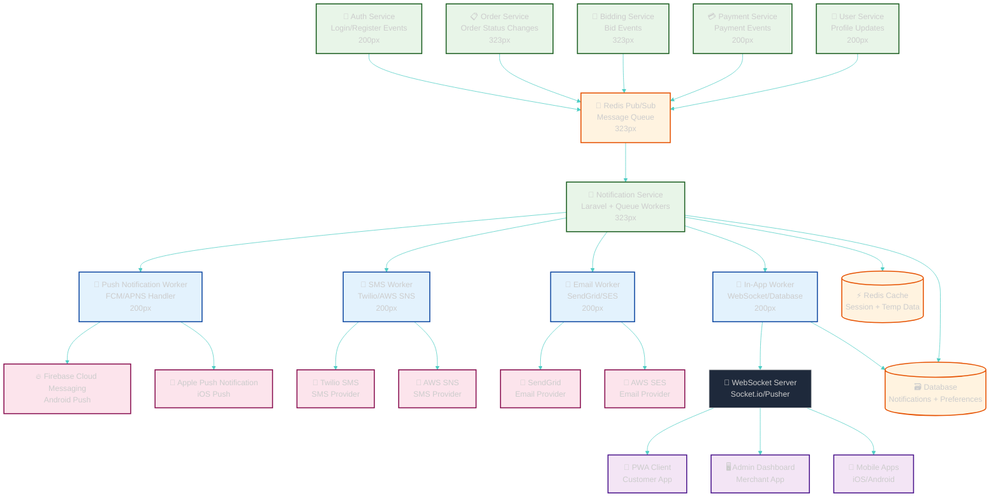
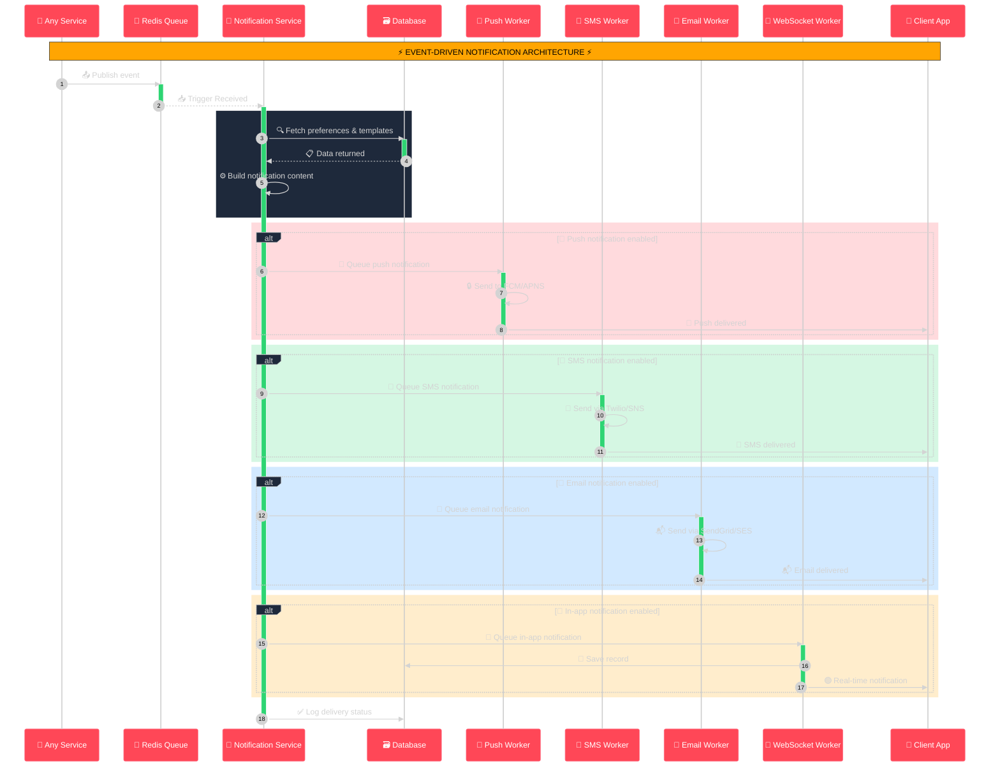

<div style="max-width: 38.2rem; line-height: 1.618; font-family: 'Inter', 'Segoe UI', 'Roboto', sans-serif;">

# <span style="font-size: 42px; font-weight: 700; line-height: 1.618;">📢 Notification Architecture</span>

<p style="font-size: 16px; line-height: 1.618; margin-bottom: 2rem;">Distinguished <strong>Multi-Channel Notification System</strong> with real-time event processing, queue-based workers, and comprehensive delivery channels including push notifications, SMS, email, and in-app messaging.</p>

## <span style="font-size: 26px; font-weight: 600; line-height: 1.618;">🌟 Real-Time Notification System</span>


```mermaid
%%{init: {
  'theme': 'dark',
  'themeVariables': {
    'primaryColor': '#FF6B6B',
    'primaryTextColor': '#FFFFFF',
    'primaryBorderColor': '#FF8E8E',
    'lineColor': '#4ECDC4',
    'secondaryColor': '#45B7D1',
    'tertiaryColor': '#96CEB4',
    'background': '#0F172A',
    'mainBkg': '#1E293B',
    'secondBkg': '#334155',
    'tertiaryBkg': '#475569'
  },
  'flowchart': {
    'rankSpacing': 81,
    'nodeSpacing': 50,
    'curve': 'basis'
  }
}}%%

graph TB
    %% Event Sources
    AUTH["🔐 Auth Service<br/>Login/Register Events<br/>200px"]
    ORDER["📋 Order Service<br/>Order Status Changes<br/>323px"]
    BIDDING["🎯 Bidding Service<br/>Bid Events<br/>323px"]
    PAYMENT["💳 Payment Service<br/>Payment Events<br/>200px"]
    USER["👥 User Service<br/>Profile Updates<br/>200px"]
    
    %% Message Queue System
    REDIS_QUEUE["📨 Redis Pub/Sub<br/>Message Queue<br/>323px"]
    
    %% Notification Service Core
    NOTIFICATION["📢 Notification Service<br/>Laravel + Queue Workers<br/>323px"]
    
    %% Notification Channels
    PUSH_WORKER["🔔 Push Notification Worker<br/>FCM/APNS Handler<br/>200px"]
    SMS_WORKER["📱 SMS Worker<br/>Twilio/AWS SNS<br/>200px"]
    EMAIL_WORKER["📧 Email Worker<br/>SendGrid/SES<br/>200px"]
    INAPP_WORKER["📱 In-App Worker<br/>WebSocket/Database<br/>200px"]
    
    %% External Providers
    FCM[🔥 Firebase Cloud Messaging<br/>Android Push]
    APNS[🍎 Apple Push Notification<br/>iOS Push]
    TWILIO[📱 Twilio SMS<br/>SMS Provider]
    AWS_SNS[📱 AWS SNS<br/>SMS Provider]
    SENDGRID[📧 SendGrid<br/>Email Provider]
    AWS_SES[📧 AWS SES<br/>Email Provider]
    
    %% WebSocket for Real-time
    WEBSOCKET[🔄 WebSocket Server<br/>Socket.io/Pusher]
    
    %% Client Applications
    PWA_CLIENT[📱 PWA Client<br/>Customer App]
    ADMIN_CLIENT[🖥️ Admin Dashboard<br/>Merchant App]
    MOBILE_CLIENT[📱 Mobile Apps<br/>iOS/Android]
    
    %% Database
    DB[(🗃️ Database<br/>Notifications + Preferences)]
    REDIS_CACHE[(⚡ Redis Cache<br/>Session + Temp Data)]
    
    %% Event Flow
    AUTH --> REDIS_QUEUE
    ORDER --> REDIS_QUEUE
    BIDDING --> REDIS_QUEUE
    PAYMENT --> REDIS_QUEUE
    USER --> REDIS_QUEUE
    
    %% Queue to Notification Service
    REDIS_QUEUE --> NOTIFICATION
    
    %% Notification Service to Workers
    NOTIFICATION --> PUSH_WORKER
    NOTIFICATION --> SMS_WORKER
    NOTIFICATION --> EMAIL_WORKER
    NOTIFICATION --> INAPP_WORKER
    
    %% Workers to External Providers
    PUSH_WORKER --> FCM
    PUSH_WORKER --> APNS
    SMS_WORKER --> TWILIO
    SMS_WORKER --> AWS_SNS
    EMAIL_WORKER --> SENDGRID
    EMAIL_WORKER --> AWS_SES
    
    %% In-App Notifications
    INAPP_WORKER --> WEBSOCKET
    INAPP_WORKER --> DB
    
    %% WebSocket to Clients
    WEBSOCKET --> PWA_CLIENT
    WEBSOCKET --> ADMIN_CLIENT
    WEBSOCKET --> MOBILE_CLIENT
    
    %% Database Connections
    NOTIFICATION --> DB
    NOTIFICATION --> REDIS_CACHE
    
    %% Styling
    classDef service fill:#e8f5e8,stroke:#1b5e20,stroke-width:2px
    classDef worker fill:#e3f2fd,stroke:#0d47a1,stroke-width:2px
    classDef external fill:#fce4ec,stroke:#880e4f,stroke-width:2px
    classDef client fill:#f3e5f5,stroke:#4a148c,stroke-width:2px
    classDef database fill:#fff3e0,stroke:#e65100,stroke-width:2px
    
    class AUTH,ORDER,BIDDING,PAYMENT,USER,NOTIFICATION service
    class PUSH_WORKER,SMS_WORKER,EMAIL_WORKER,INAPP_WORKER worker
    class FCM,APNS,TWILIO,AWS_SNS,SENDGRID,AWS_SES external
    class PWA_CLIENT,ADMIN_CLIENT,MOBILE_CLIENT client
    class DB,REDIS_CACHE,REDIS_QUEUE database
```

## 📢 Notification Event Flow


```mermaid
%%{init: {
  'theme': 'dark',
  'themeVariables': {
    'primaryColor': '#FF4757',
    'primaryTextColor': '#FFFFFF',
    'primaryBorderColor': '#FF6B81',
    'lineColor': '#2ED573',
    'secondaryColor': '#1E90FF',
    'tertiaryColor': '#FFA502',
    'background': '#0F172A',
    'mainBkg': '#1E293B',
    'secondBkg': '#334155',
    'tertiaryBkg': '#1E293B',
    'actorBkg': '#FF4757',
    'actorBorder': '#FF6B81',
    'actorTextColor': '#FFFFFF',
    'activationBkgColor': '#2ED573',
    'activationBorderColor': '#FFFFFF',
    'noteBkgColor': '#FFA502',
    'noteTextColor': '#000000'
  }
}}%%

sequenceDiagram
    autonumber
    participant Service as 🔧 Any Service
    participant Queue as 📨 Redis Queue
    participant NS as 📢 Notification Service
    participant DB as 🗃️ Database
    participant Push as 🔔 Push Worker
    participant SMS as 📱 SMS Worker
    participant Email as 📧 Email Worker
    participant WS as 🔄 WebSocket Worker
    participant Client as 📱 Client App
    
    Note over Service,Client: ⚡ EVENT-DRIVEN NOTIFICATION ARCHITECTURE ⚡
    
    Service->>Queue: 📤 Publish event
    activate Queue
    Queue-->>NS: 📥 Trigger Received
    deactivate Queue
    
    activate NS
    rect rgb(30, 41, 59)
    NS->>DB: 🔍 Fetch preferences & templates
    activate DB
    DB-->>NS: 📋 Data returned
    deactivate DB
    NS->>NS: ⚙️ Build notification content
    end
    
    rect rgba(255, 71, 87, 0.2)
    alt 🔔 Push notification enabled
        NS->>Push: 🚀 Queue push notification
        activate Push
        Push->>Push: 🔒 Send to FCM/APNS
        Push->>Client: 📲 Push delivered
        deactivate Push
    end
    end
    
    rect rgba(46, 213, 115, 0.2)
    alt 📱 SMS notification enabled
        NS->>SMS: 🚀 Queue SMS notification
        activate SMS
        SMS->>SMS: 💬 Send via Twilio/SNS
        SMS->>Client: 💬 SMS delivered
        deactivate SMS
    end
    end
    
    rect rgba(30, 144, 255, 0.2)
    alt 📧 Email notification enabled
        NS->>Email: 🚀 Queue email notification
        activate Email
        Email->>Email: 📬 Send via SendGrid/SES
        Email->>Client: 📬 Email delivered
        deactivate Email
    end
    end
    
    rect rgba(255, 165, 2, 0.2)
    alt 🔄 In-app notification enabled
        NS->>WS: 🚀 Queue in-app notification
        activate WS
        WS->>DB: 💾 Save record
        WS->>Client: 🟢 Real-time notification
        deactivate WS
    end
    end
    
    NS->>DB: ✅ Log delivery status
    deactivate NS
```

## 🔔 Notification Types & Templates

### **1. Authentication Events**
```yaml
user_registered:
  title: "Welcome to Reverse Tender! 🎉"
  message: "Your account has been created successfully. Please verify your phone number."
  channels: [sms, email, push]
  
user_verified:
  title: "Account Verified ✅"
  message: "Your account is now verified and ready to use!"
  channels: [push, email]
  
login_success:
  title: "Login Successful 🔐"
  message: "You have successfully logged in from {device} at {time}"
  channels: [push]
  
suspicious_login:
  title: "Suspicious Login Detected ⚠️"
  message: "A login attempt was made from {location}. If this wasn't you, please secure your account."
  channels: [sms, email, push]
```

### **2. Order Management Events**
```yaml
order_created:
  title: "Order Created 📋"
  message: "Your part request '{order_title}' has been created successfully."
  channels: [push, email]
  
order_published:
  title: "Order Published 🚀"
  message: "Your order is now live! Merchants will start bidding soon."
  channels: [push, sms]
  
order_expired:
  title: "Order Expired ⏰"
  message: "Your order '{order_title}' has expired. You can republish it anytime."
  channels: [push, email]
```

### **3. Bidding Events**
```yaml
bid_received:
  title: "New Bid Received! 🎯"
  message: "{merchant_name} placed a bid of {amount} SAR on your order."
  channels: [push, sms]
  
bid_updated:
  title: "Bid Updated 📈"
  message: "{merchant_name} updated their bid to {amount} SAR."
  channels: [push]
  
bid_awarded:
  title: "Congratulations! You Won! 🏆"
  message: "Your bid of {amount} SAR has been selected for '{order_title}'"
  channels: [push, sms, email]
  
bid_rejected:
  title: "Bid Not Selected 😔"
  message: "Your bid for '{order_title}' was not selected. Keep trying!"
  channels: [push]
```

### **4. Payment Events**
```yaml
payment_due:
  title: "Payment Due 💳"
  message: "Payment of {amount} SAR is due for order '{order_title}'"
  channels: [push, sms, email]
  
payment_completed:
  title: "Payment Successful ✅"
  message: "Payment of {amount} SAR has been processed successfully."
  channels: [push, email]
  
invoice_generated:
  title: "ZATCA Invoice Generated 🧾"
  message: "Your ZATCA-compliant invoice is ready for download."
  channels: [email]
```

## 🛠️ Technical Implementation

### **1. Queue Workers**
```php
// Push Notification Worker
class PushNotificationWorker
{
    public function handle(PushNotificationJob $job)
    {
        $notification = $job->notification;
        $user = $job->user;
        
        // Get user's device tokens
        $tokens = $user->deviceTokens()->active()->pluck('token');
        
        foreach ($tokens as $token) {
            if ($user->platform === 'ios') {
                $this->sendAPNS($token, $notification);
            } else {
                $this->sendFCM($token, $notification);
            }
        }
        
        // Log delivery status
        $this->logDeliveryStatus($notification, $tokens);
    }
}

// SMS Worker
class SMSWorker
{
    public function handle(SMSNotificationJob $job)
    {
        $notification = $job->notification;
        $user = $job->user;
        
        // Choose provider based on configuration
        $provider = config('notifications.sms.provider'); // twilio or aws_sns
        
        if ($provider === 'twilio') {
            $this->sendTwilioSMS($user->phone, $notification->message);
        } else {
            $this->sendAWSSNS($user->phone, $notification->message);
        }
        
        // Log delivery
        $this->logSMSDelivery($notification, $user);
    }
}
```

### **2. WebSocket Integration**
```javascript
// Client-side WebSocket connection
const socket = io('wss://api.reversetender.com', {
    auth: {
        token: localStorage.getItem('jwt_token')
    }
});

// Listen for real-time notifications
socket.on('notification', (data) => {
    showInAppNotification(data);
    updateNotificationBadge();
});

// Listen for bid updates
socket.on('bid_update', (data) => {
    updateBidList(data);
    showBidAlert(data);
});

// Listen for order updates
socket.on('order_update', (data) => {
    updateOrderStatus(data);
    refreshOrderDetails();
});
```

### **3. Notification Preferences**
```php
// User notification preferences
class NotificationPreference extends Model
{
    protected $fillable = [
        'user_id',
        'notification_type',
        'push_enabled',
        'sms_enabled', 
        'email_enabled',
        'schedule_settings'
    ];
    
    protected $casts = [
        'schedule_settings' => 'array',
        'push_enabled' => 'boolean',
        'sms_enabled' => 'boolean',
        'email_enabled' => 'boolean'
    ];
}

// Schedule settings example
{
    "quiet_hours": {
        "enabled": true,
        "start": "22:00",
        "end": "08:00",
        "timezone": "Asia/Riyadh"
    },
    "weekend_notifications": false,
    "urgent_only": false
}
```

## 📱 Multi-Platform Support

### **Push Notifications**
- **iOS**: Apple Push Notification Service (APNS)
- **Android**: Firebase Cloud Messaging (FCM)
- **Web**: Web Push API with service workers
- **Desktop**: Electron app notifications

### **SMS Integration**
- **Primary**: Twilio for international SMS
- **Backup**: AWS SNS for reliability
- **Local Providers**: Saudi-specific SMS providers
- **Delivery Tracking**: Read receipts and delivery confirmations

### **Email Notifications**
- **Transactional**: SendGrid for system emails
- **Marketing**: Mailchimp for promotional emails
- **Templates**: Responsive HTML email templates
- **Tracking**: Open rates, click tracking, unsubscribe management

## 🎯 Notification Strategies

### **Immediate Notifications**
- New bid received (< 30 seconds)
- Order status changes (< 1 minute)
- Payment confirmations (< 30 seconds)
- Security alerts (< 15 seconds)

### **Batched Notifications**
- Daily order summaries
- Weekly performance reports
- Monthly analytics reports
- Promotional campaigns

### **Smart Delivery**
- **Quiet Hours**: Respect user sleep schedules
- **Frequency Limits**: Prevent notification spam
- **Priority Levels**: Critical vs. informational
- **Delivery Optimization**: Best channel selection

This notification architecture ensures users stay informed about all important events while respecting their preferences and providing a seamless real-time experience.
