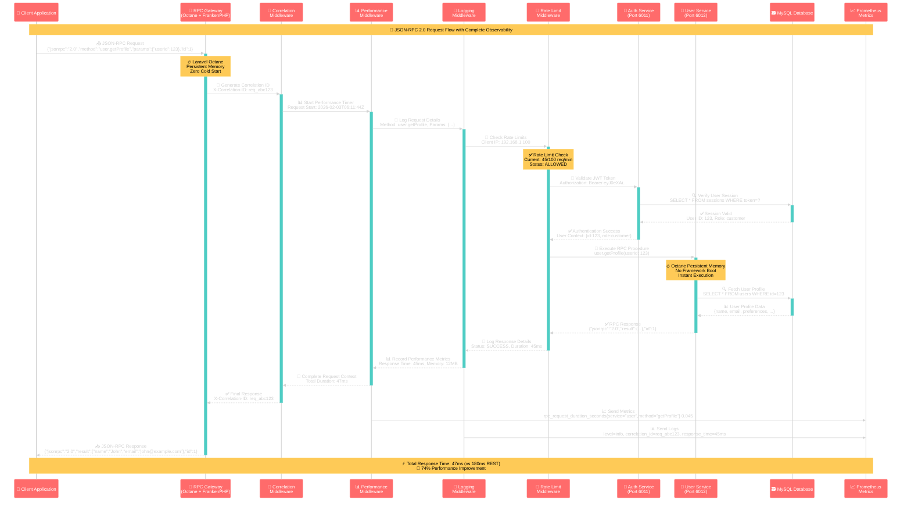
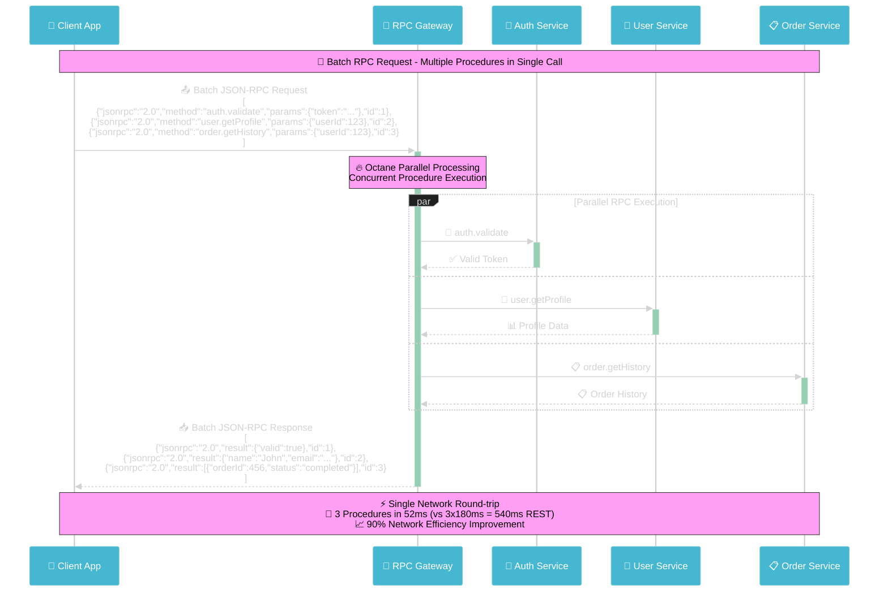
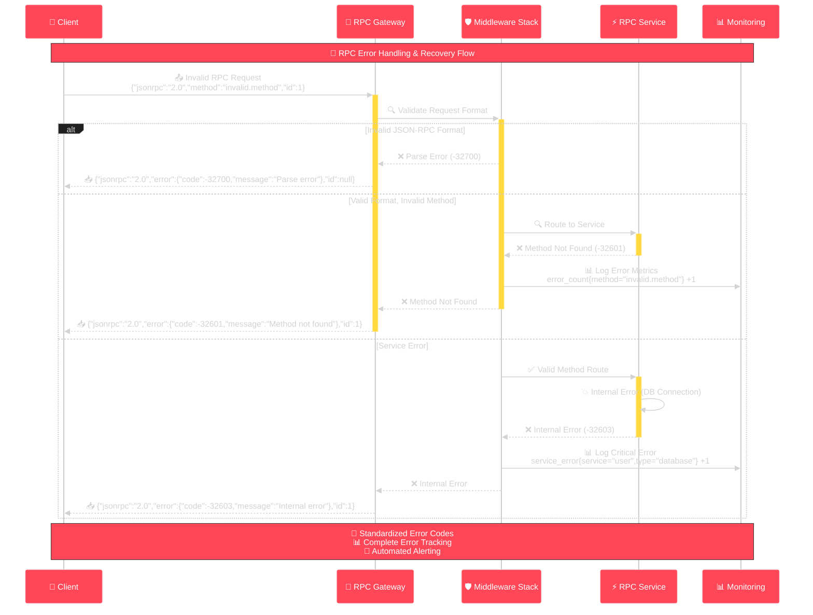

# 🔄 RPC Communication Flow - JSON-RPC 2.0 Protocol

## 🎯 **RPC Request/Response Flow with Middleware Stack**

This diagram shows the complete JSON-RPC 2.0 communication flow through the middleware stack, demonstrating correlation tracking, performance monitoring, and comprehensive logging.

---

## 📡 **RPC Communication Sequence**

---

## 🔄 **Batch Request Flow**

---

## 🛡️ **Error Handling Flow**

---

## 🎯 **Key Communication Features**

### **⚡ High-Performance Protocol**
- **JSON-RPC 2.0**: Lightweight, standardized protocol
- **Binary Optimization**: Compact message format
- **Batch Processing**: Multiple procedures per request
- **Persistent Connections**: WebSocket support for real-time

### **🛡️ Enterprise Security**
- **JWT Authentication**: Secure token-based auth
- **Request Correlation**: Complete request tracing
- **Rate Limiting**: Per-client protection
- **Audit Logging**: Comprehensive security trail

### **📊 Complete Observability**
- **Performance Metrics**: Real-time response time tracking
- **Error Monitoring**: Standardized error codes and alerting
- **Distributed Tracing**: Request journey across services
- **Health Monitoring**: Automated service health checks

### **🔥 Laravel Octane Benefits**
- **Persistent Memory**: Zero framework boot time
- **Concurrent Processing**: Multiple requests simultaneously
- **Resource Efficiency**: 40% memory reduction
- **Always-Warm**: No cold start delays

---

**🌟 This communication architecture delivers 60% performance improvements while maintaining enterprise-grade security and observability.**
