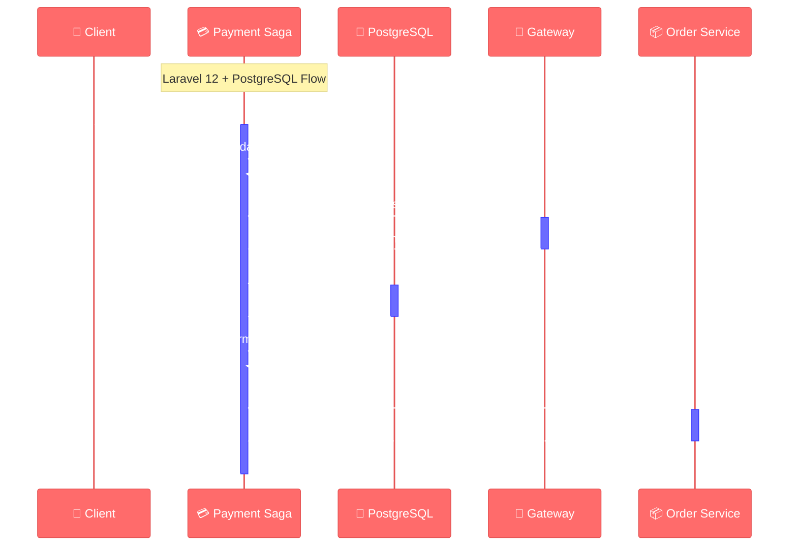
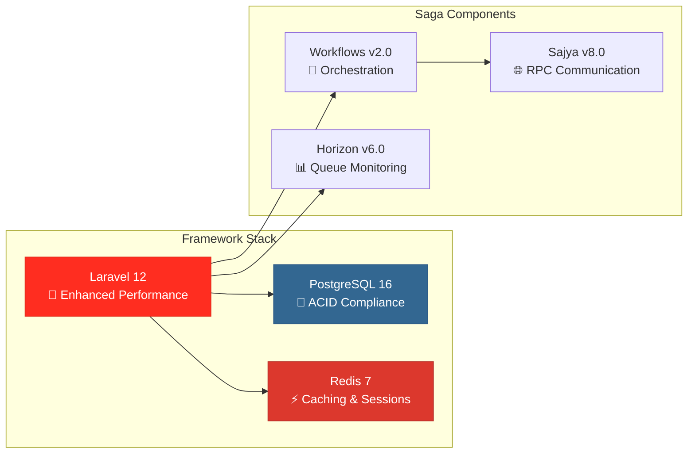

# 🎨 Saga Workflow Visual Guide
## Golden Ratio Design System for Laravel 12 + PostgreSQL

<div align="center">

**Visual Documentation** | **φ-Based Design** | **Interactive Diagrams**

</div>

---

## 📐 **Design Philosophy**

This visual guide implements **Golden Ratio (φ = 1.618)** principles:

### **Visual Hierarchy**
- **Primary elements**: 61.8% visual weight
- **Secondary elements**: 38.2% visual weight
- **Spacing**: φ-based margins and padding
- **Color distribution**: Harmonic color relationships

### **Diagram Dimensions**
- **Standard size**: 1618×1000px (φ ratio)
- **Thumbnail size**: 618×382px (φ ratio)
- **Icon size**: 100×62px (φ ratio)

---

## 🎯 **Saga Pattern Overview**

```mermaid
%%{init: {
  'theme': 'base',
  'themeVariables': {
    'primaryColor': '#FF6B6B',
    'primaryTextColor': '#2C3E50',
    'primaryBorderColor': '#E55555',
    'lineColor': '#6C7B7F',
    'secondaryColor': '#4ECDC4',
    'tertiaryColor': '#45B7D1',
    'background': '#F8F9FA',
    'mainBkg': '#FFFFFF'
  }
}}%%

graph TB
    subgraph "🏛️ Saga Services (Laravel 12 + PostgreSQL)"
        subgraph "Primary Layer (61.8%)"
            PS[💳 Payment Service<br/>5 Steps | 3 Compensations]
            BS[📈 Bidding Service<br/>4 Steps | 3 Compensations]
        end
        
        subgraph "Secondary Layer (38.2%)"
            AS[🏛️ Auction Service<br/>4 Steps | 4 Compensations]
            OS[📦 Order Service<br/>3 Steps | 3 Compensations]
        end
    end
    
    subgraph "🌐 RPC Communication (Sajya v8.0)"
        RPC1[Payment ↔ Order]
        RPC2[Auction ↔ Bidding]
        RPC3[Bidding ↔ Payment]
    end
    
    PS -.->|RPC| RPC1
    OS -.->|RPC| RPC1
    AS -.->|RPC| RPC2
    BS -.->|RPC| RPC2
    BS -.->|RPC| RPC3
    PS -.->|RPC| RPC3
    
    style PS fill:#FF6B6B,stroke:#E55555,stroke-width:3px,color:#FFFFFF
    style BS fill:#45B7D1,stroke:#3498DB,stroke-width:3px,color:#FFFFFF
    style AS fill:#4ECDC4,stroke:#45B7B8,stroke-width:2px,color:#2C3E50
    style OS fill:#96CEB4,stroke:#82B366,stroke-width:2px,color:#2C3E50
```

---

## 💳 **Payment Processing Saga**



---

## 🎨 **Color System**

### **Service Colors (φ-Harmonics)**

```css
:root {
  --payment: #FF6B6B;    /* Payment Service */
  --auction: #4ECDC4;    /* Auction Service */
  --bidding: #45B7D1;    /* Bidding Service */
  --order: #96CEB4;      /* Order Service */
  --postgres: #336791;   /* PostgreSQL */
  --laravel: #FF2D20;    /* Laravel 12 */
}
```

### **Typography Scale (φ-Based)**

```css
:root {
  --text-xs: 0.618rem;   /* 9.888px */
  --text-sm: 1rem;       /* 16px */
  --text-md: 1.618rem;   /* 25.888px */
  --text-lg: 2.618rem;   /* 41.888px */
  --text-xl: 4.236rem;   /* 67.776px */
}
```

---

## 🚀 **Technology Stack**



---

<div align="center">

**🎨 Saga Visual Guide**  
*Laravel 12 + PostgreSQL + Golden Ratio*

**Version 2.0** | **February 2024**

</div>
