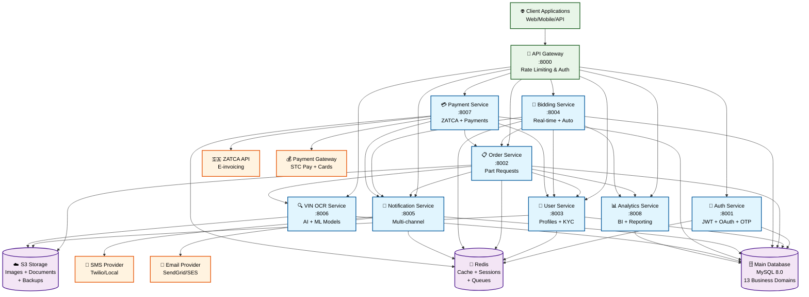
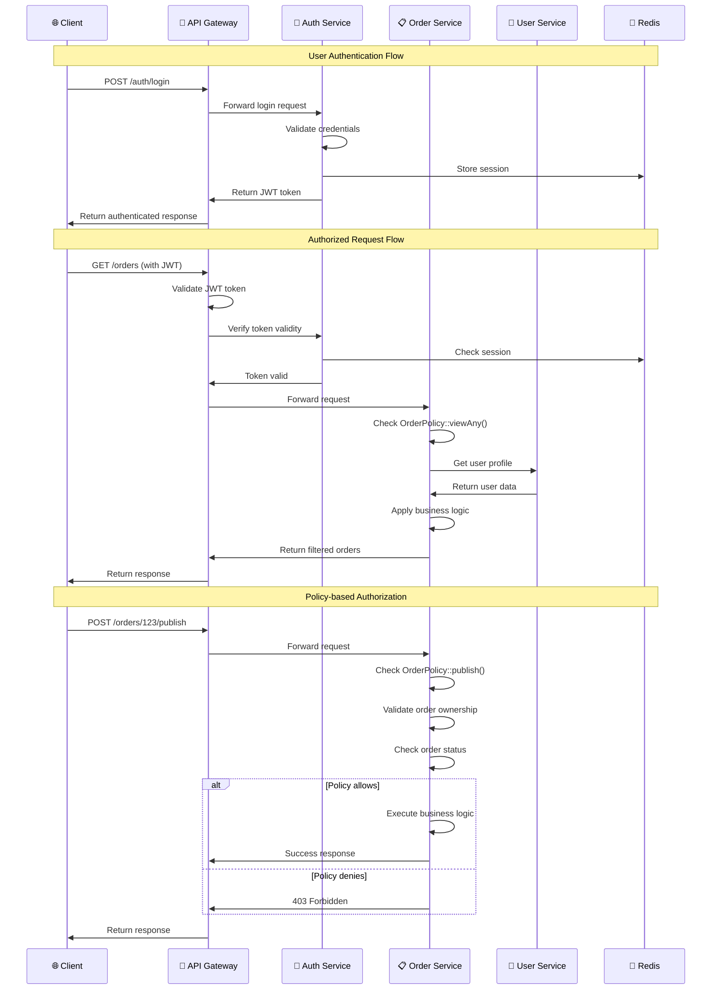
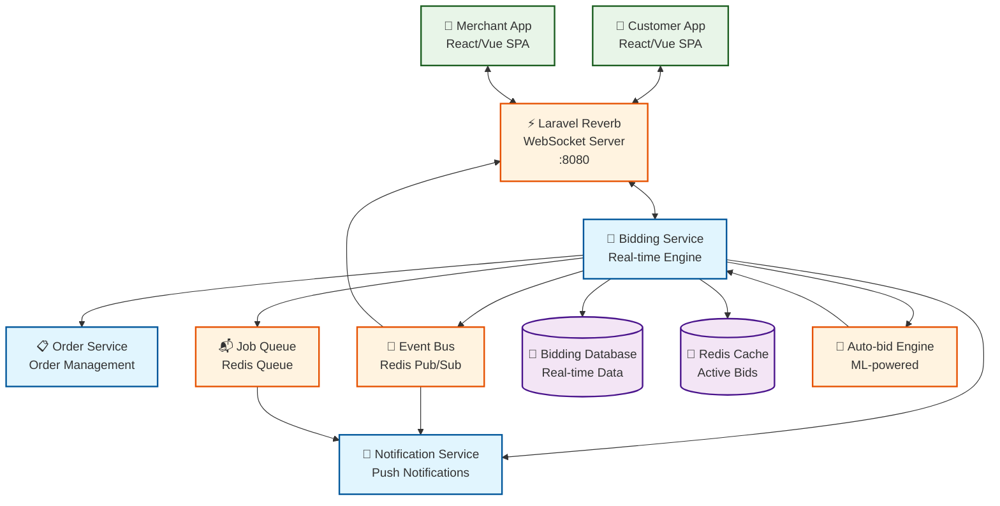
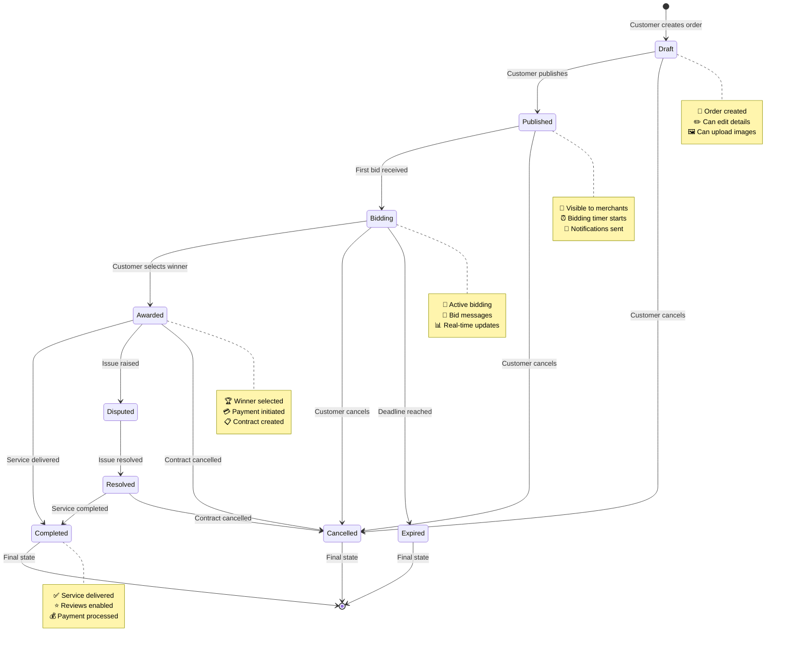
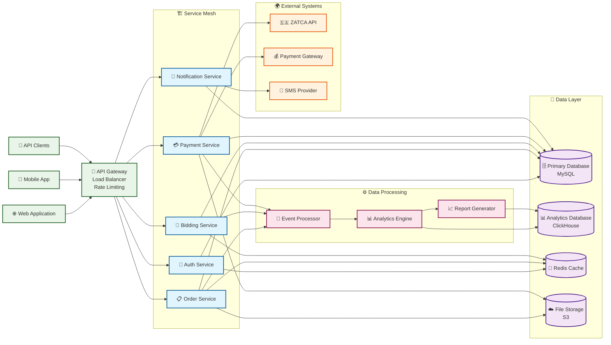
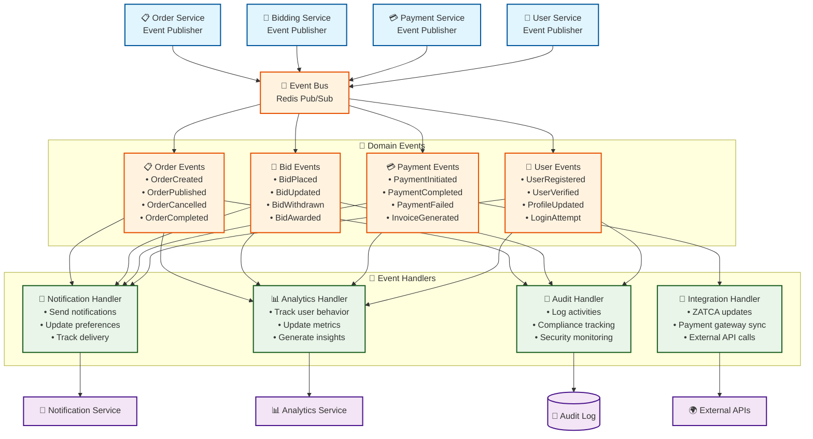

# 🏗️ Service Architecture Diagrams

## 🔄 Service Dependency Architecture



## 🔐 Authentication & Authorization Flow



## 🎯 Real-time Bidding Architecture



## 🔄 Order Lifecycle State Machine



## 🛡️ Security & Middleware Architecture

```mermaid
graph TB
    %% Request Flow
    Request[🌐 Incoming Request]
    
    %% Middleware Stack
    RateLimit[🚦 Rate Limiting<br/>Throttle Middleware]
    Auth[🔐 Authentication<br/>Sanctum Middleware]
    CORS[🌍 CORS<br/>Cross-Origin]
    Validation[✅ Input Validation<br/>Form Requests]
    
    %% Authorization Layer
    Gates[🚪 Gates<br/>System-wide Permissions]
    Policies[📋 Policies<br/>Resource-specific Rules]
    
    %% Service Layer
    Controller[🎮 Controller<br/>HTTP Layer]
    Service[⚙️ Service Layer<br/>Business Logic]
    
    %% Security Components
    JWT[🎫 JWT Tokens<br/>Stateless Auth]
    Session[🔒 Session Store<br/>Redis-based]
    Encryption[🔐 Encryption<br/>Laravel Crypt]
    
    %% Request flow
    Request --> RateLimit
    RateLimit --> Auth
    Auth --> CORS
    CORS --> Validation
    Validation --> Gates
    Gates --> Policies
    Policies --> Controller
    Controller --> Service
    
    %% Security integrations
    Auth --> JWT
    Auth --> Session
    Service --> Encryption
    
    %% Policy examples
    OrderPolicy[📋 OrderPolicy<br/>• viewAny()<br/>• view()<br/>• create()<br/>• update()<br/>• publish()<br/>• cancel()]
    UserPolicy[👥 UserPolicy<br/>• view()<br/>• update()<br/>• delete()<br/>• verify()]
    
    Policies --> OrderPolicy
    Policies --> UserPolicy
    
    %% Gate examples
    AdminGate[🔑 Admin Gate<br/>• admin-access<br/>• system-config<br/>• user-management]
    MerchantGate[🏪 Merchant Gate<br/>• merchant-verified<br/>• can-bid<br/>• view-analytics]
    
    Gates --> AdminGate
    Gates --> MerchantGate
    
    %% Styling
    classDef middlewareBox fill:#fff3e0,stroke:#e65100,stroke-width:2px
    classDef authBox fill:#e8f5e8,stroke:#1b5e20,stroke-width:2px
    classDef serviceBox fill:#e1f5fe,stroke:#01579b,stroke-width:2px
    classDef securityBox fill:#f3e5f5,stroke:#4a148c,stroke-width:2px
    
    class RateLimit,Auth,CORS,Validation middlewareBox
    class Gates,Policies,OrderPolicy,UserPolicy,AdminGate,MerchantGate authBox
    class Controller,Service serviceBox
    class JWT,Session,Encryption securityBox
```

## 📊 Data Flow Architecture



## 🔄 Event-Driven Architecture


