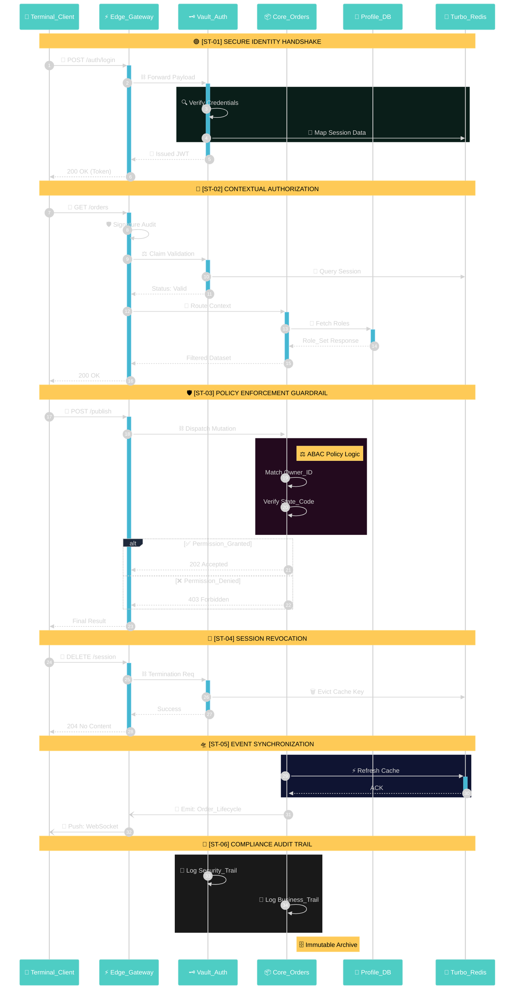
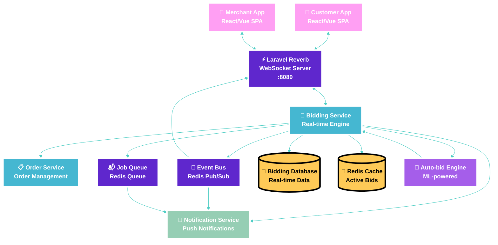
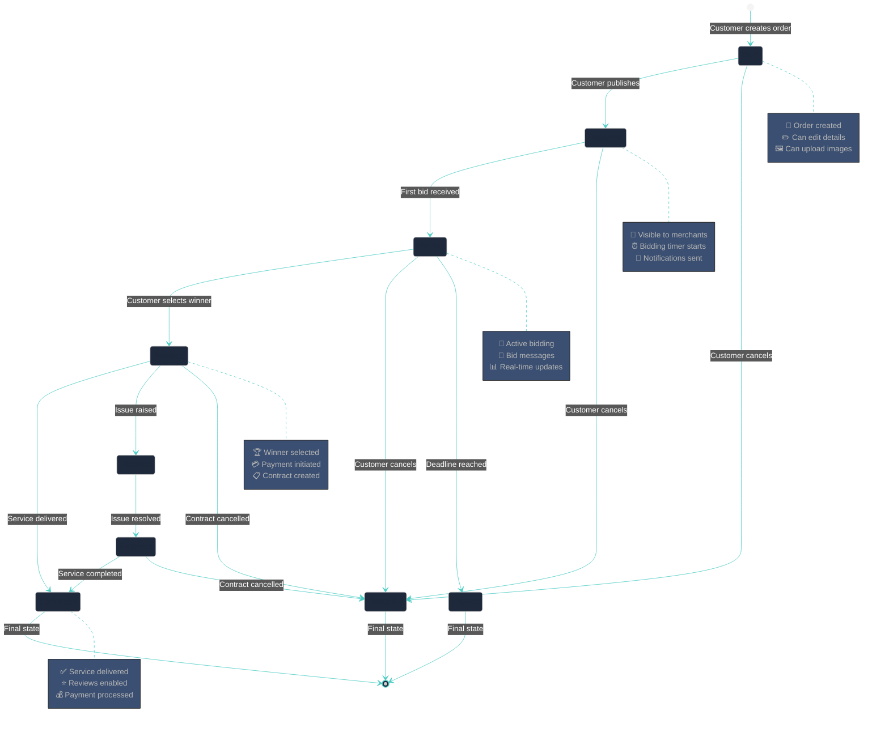
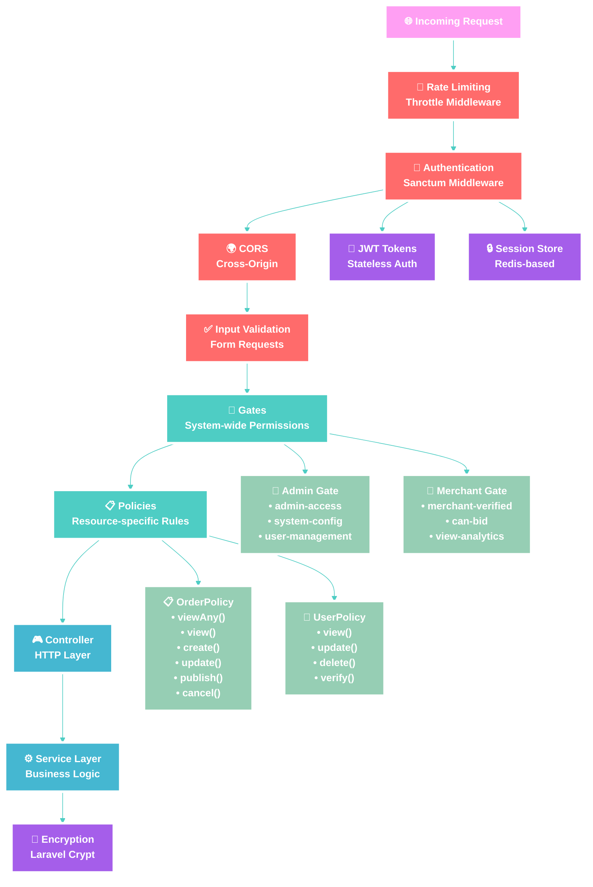
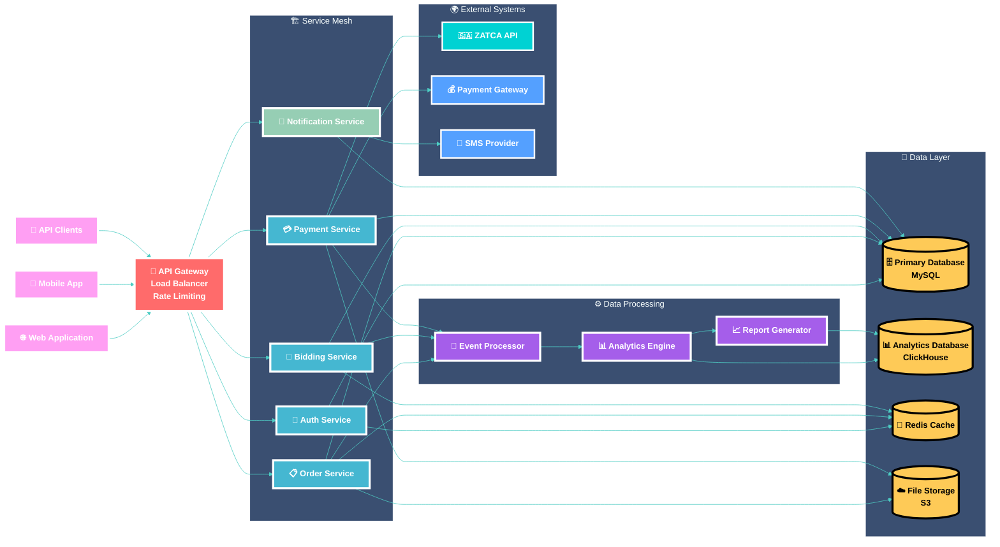
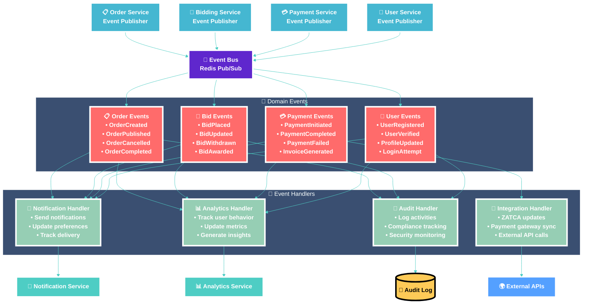

# 🏗️ Service Architecture Diagrams

## 🔄 Service Dependency Architecture

## 🌟 Distinguished Service Dependencies with Eye-Catching Styling

```mermaid
%%{init: {
  'theme': 'dark',
  'themeVariables': {
    'primaryColor': '#FF6B6B',
    'primaryTextColor': '#FFFFFF',
    'primaryBorderColor': '#FF8E8E',
    'lineColor': '#4ECDC4',
    'secondaryColor': '#45B7D1',
    'tertiaryColor': '#96CEB4',
    'background': '#0F172A',
    'mainBkg': '#1E293B',
    'secondBkg': '#334155',
    'tertiaryBkg': '#475569'
  }
}}%%

graph TB
    %% External Systems
    Client[🌐 Client Applications<br/>Web/Mobile/API]
    Gateway[🚪 API Gateway<br/>:8000<br/>Rate Limiting & Auth]
    
    %% Core Services
    AuthSvc[🔐 Auth Service<br/>:8001<br/>JWT + OAuth + OTP]
    UserSvc[👥 User Service<br/>:8003<br/>Profiles + KYC]
    OrderSvc[📋 Order Service<br/>:8002<br/>Part Requests]
    BiddingSvc[🎯 Bidding Service<br/>:8004<br/>Real-time + Auto]
    NotificationSvc[📢 Notification Service<br/>:8005<br/>Multi-channel]
    PaymentSvc[💳 Payment Service<br/>:8007<br/>ZATCA + Payments]
    VinOcrSvc[🔍 VIN OCR Service<br/>:8006<br/>AI + ML Models]
    AnalyticsSvc[📊 Analytics Service<br/>:8008<br/>BI + Reporting]
    
    %% Data Layer
    MainDB[(🗄️ Main Database<br/>MySQL 8.0<br/>13 Business Domains)]
    Redis[(🔴 Redis<br/>Cache + Sessions<br/>+ Queues)]
    S3[(☁️ S3 Storage<br/>Images + Documents<br/>+ Backups)]
    
    %% External APIs
    ZATCA[🇸🇦 ZATCA API<br/>E-invoicing]
    PaymentGW[💰 Payment Gateway<br/>STC Pay + Cards]
    SMSProvider[📱 SMS Provider<br/>Twilio/Local]
    EmailProvider[📧 Email Provider<br/>SendGrid/SES]
    
    %% Client connections
    Client --> Gateway
    
    %% Gateway to services
    Gateway --> AuthSvc
    Gateway --> UserSvc
    Gateway --> OrderSvc
    Gateway --> BiddingSvc
    Gateway --> NotificationSvc
    Gateway --> PaymentSvc
    Gateway --> VinOcrSvc
    Gateway --> AnalyticsSvc
    
    %% Service dependencies
    OrderSvc --> UserSvc
    OrderSvc --> VinOcrSvc
    OrderSvc --> NotificationSvc
    OrderSvc --> AnalyticsSvc
    
    BiddingSvc --> OrderSvc
    BiddingSvc --> UserSvc
    BiddingSvc --> NotificationSvc
    BiddingSvc --> AnalyticsSvc
    
    PaymentSvc --> OrderSvc
    PaymentSvc --> UserSvc
    PaymentSvc --> NotificationSvc
    PaymentSvc --> ZATCA
    PaymentSvc --> PaymentGW
    
    NotificationSvc --> SMSProvider
    NotificationSvc --> EmailProvider
    
    %% All services connect to data layer
    AuthSvc --> MainDB
    UserSvc --> MainDB
    OrderSvc --> MainDB
    BiddingSvc --> MainDB
    NotificationSvc --> MainDB
    PaymentSvc --> MainDB
    VinOcrSvc --> MainDB
    AnalyticsSvc --> MainDB
    
    %% Redis connections
    AuthSvc --> Redis
    UserSvc --> Redis
    OrderSvc --> Redis
    BiddingSvc --> Redis
    NotificationSvc --> Redis
    PaymentSvc --> Redis
    
    %% S3 connections
    OrderSvc --> S3
    UserSvc --> S3
    VinOcrSvc --> S3
    
    %% 🎨 Distinguished Eye-Catching Styling
    classDef clientStyle fill:#FF9FF3,stroke:#FFFFFF,stroke-width:4px,color:#FFFFFF,font-weight:bold
    classDef gatewayStyle fill:#FF6B6B,stroke:#FFFFFF,stroke-width:4px,color:#FFFFFF,font-weight:bold
    classDef authStyle fill:#4ECDC4,stroke:#FFFFFF,stroke-width:4px,color:#FFFFFF,font-weight:bold
    classDef coreServiceStyle fill:#45B7D1,stroke:#FFFFFF,stroke-width:4px,color:#FFFFFF,font-weight:bold
    classDef supportServiceStyle fill:#96CEB4,stroke:#FFFFFF,stroke-width:4px,color:#FFFFFF,font-weight:bold
    classDef dataStyle fill:#FECA57,stroke:#000000,stroke-width:4px,color:#000000,font-weight:bold
    classDef externalStyle fill:#54A0FF,stroke:#FFFFFF,stroke-width:3px,color:#FFFFFF,font-weight:bold
    classDef governmentStyle fill:#00D2D3,stroke:#FFFFFF,stroke-width:3px,color:#FFFFFF,font-weight:bold
    classDef aiStyle fill:#A55EEA,stroke:#FFFFFF,stroke-width:4px,color:#FFFFFF,font-weight:bold
    
    %% Apply Component Styling
    class Client clientStyle
    class Gateway gatewayStyle
    class AuthSvc authStyle
    class UserSvc,OrderSvc,BiddingSvc,PaymentSvc coreServiceStyle
    class NotificationSvc,AnalyticsSvc supportServiceStyle
    class VinOcrSvc aiStyle
    class MainDB,Redis,S3 dataStyle
    class ZATCA governmentStyle
    class PaymentGW,SMSProvider,EmailProvider externalStyle
```

## 🔐 Authentication & Authorization Flow

## 🌟 Distinguished Security Flow with Eye-Catching Styling

```mermaid
%%{init: {
  'theme': 'dark',
  'themeVariables': {
    'primaryColor': '#FF6B6B',
    'primaryTextColor': '#FFFFFF',
    'primaryBorderColor': '#FF8E8E',
    'lineColor': '#4ECDC4',
    'secondaryColor': '#45B7D1',
    'tertiaryColor': '#96CEB4',
    'background': '#0F172A',
    'mainBkg': '#1E293B',
    'secondBkg': '#334155',
    'tertiaryBkg': '#475569',
    'actorBkg': '#4ECDC4',
    'actorBorder': '#7ED6D1',
    'actorTextColor': '#FFFFFF',
    'activationBkgColor': '#45B7D1',
    'activationBorderColor': '#6BC5E8',
    'noteBkgColor': '#FECA57',
    'noteTextColor': '#000000',
    'noteBorderColor': '#FED876',
    'sequenceNumberColor': '#FFFFFF'
  }
}}%%

sequenceDiagram
    autonumber
    participant C as 💎 Terminal_Client
    participant G as ⚡ Edge_Gateway
    participant A as 🗝️ Vault_Auth
    participant O as 📦 Core_Orders
    participant U as 👥 Profile_DB
    participant R as 🔋 Turbo_Redis

    Note over C,R: 🟢 [ST-01] SECURE IDENTITY HANDSHAKE

    C->>+G: 📨 POST /auth/login
    G->>+A: ⛓️ Forward Payload
    rect rgb(10, 30, 25)
        A->>A: 🔍 Verify Credentials
        A->>R: 💾 Map Session Data
    end
    A-->>-G: 🎫 Issued JWT
    G-->>-C: 200 OK (Token)

    Note over C,R: 🔵 [ST-02] CONTEXTUAL AUTHORIZATION

    C->>+G: 📨 GET /orders
    G->>G: 🛡️ Signature Audit
    G->>+A: ⚖️ Claim Validation
    A->>R: 🔎 Query Session
    A-->>-G: Status: Valid
    G->>+O: 🚀 Route Context
    O->>+U: 👥 Fetch Roles
    U-->>-O: Role_Set Response
    O-->>-G: Filtered Dataset
    G-->>-C: 200 OK

    Note over C,R: 🛡️ [ST-03] POLICY ENFORCEMENT GUARDRAIL

    C->>+G: 📨 POST /publish
    G->>+O: ⛓️ Dispatch Mutation
    rect rgb(35, 10, 30)
        Note right of O: ⚖️ ABAC Policy Logic
        O->>O: Match Owner_ID
        O->>O: Verify State_Code
    end
    
    alt ✅ Permission_Granted
        O-->>G: 202 Accepted
    else ❌ Permission_Denied
        O-->>G: 403 Forbidden
    end
    G-->>-C: Final Result

    Note over C,R: 🌋 [ST-04] SESSION REVOCATION

    C->>+G: 📨 DELETE /session
    G->>+A: ⛓️ Termination Req
    A->>R: 🗑️ Evict Cache Key
    A-->>-G: Success
    G-->>-C: 204 No Content

    Note over C,R: 🛸 [ST-05] EVENT SYNCHRONIZATION

    rect rgb(15, 20, 50)
        O->>+R: ⚡ Refresh Cache
        R-->>-O: ACK
    end
    O-)G: 📡 Emit: Order_Lifecycle
    G-)C: 🔔 Push: WebSocket

    Note over C,R: 📜 [ST-06] COMPLIANCE AUDIT TRAIL

    rect rgb(25, 25, 25)
        A->>A: 📓 Log Security_Trail
        O->>O: 📓 Log Business_Trail
    end
    Note right of O: 🗄️ Immutable Archive
```

## 🎯 Real-time Bidding Architecture

## 🌟 Distinguished Real-time System with Eye-Catching Styling

```mermaid
%%{init: {
  'theme': 'dark',
  'themeVariables': {
    'primaryColor': '#FF6B6B',
    'primaryTextColor': '#FFFFFF',
    'primaryBorderColor': '#FF8E8E',
    'lineColor': '#4ECDC4',
    'secondaryColor': '#45B7D1',
    'tertiaryColor': '#96CEB4',
    'background': '#0F172A',
    'mainBkg': '#1E293B',
    'secondBkg': '#334155',
    'tertiaryBkg': '#475569'
  }
}}%%

graph TB
    %% Client Layer
    CustomerApp[👤 Customer App<br/>React/Vue SPA]
    MerchantApp[🏪 Merchant App<br/>React/Vue SPA]
    
    %% WebSocket Layer
    Reverb[⚡ Laravel Reverb<br/>WebSocket Server<br/>:8080]
    
    %% Service Layer
    BiddingSvc[🎯 Bidding Service<br/>Real-time Engine]
    OrderSvc[📋 Order Service<br/>Order Management]
    NotificationSvc[📢 Notification Service<br/>Push Notifications]
    
    %% Event System
    EventBus[🔄 Event Bus<br/>Redis Pub/Sub]
    Queue[📬 Job Queue<br/>Redis Queue]
    
    %% Data Layer
    BidDB[(💾 Bidding Database<br/>Real-time Data)]
    Cache[(🔴 Redis Cache<br/>Active Bids)]
    
    %% Real-time Flow
    CustomerApp <--> Reverb
    MerchantApp <--> Reverb
    
    Reverb <--> BiddingSvc
    BiddingSvc --> OrderSvc
    BiddingSvc --> NotificationSvc
    
    %% Event-driven updates
    BiddingSvc --> EventBus
    EventBus --> Reverb
    EventBus --> NotificationSvc
    
    %% Async processing
    BiddingSvc --> Queue
    Queue --> NotificationSvc
    
    %% Data persistence
    BiddingSvc --> BidDB
    BiddingSvc --> Cache
    
    %% Auto-bidding flow
    AutoBidEngine[🤖 Auto-bid Engine<br/>ML-powered]
    BiddingSvc --> AutoBidEngine
    AutoBidEngine --> BiddingSvc
    
    %% 🎨 Distinguished Eye-Catching Styling
    classDef clientStyle fill:#FF9FF3,stroke:#FFFFFF,stroke-width:4px,color:#FFFFFF,font-weight:bold
    classDef coreServiceStyle fill:#45B7D1,stroke:#FFFFFF,stroke-width:4px,color:#FFFFFF,font-weight:bold
    classDef supportServiceStyle fill:#96CEB4,stroke:#FFFFFF,stroke-width:4px,color:#FFFFFF,font-weight:bold
    classDef dataStyle fill:#FECA57,stroke:#000000,stroke-width:4px,color:#000000,font-weight:bold
    classDef realtimeStyle fill:#5F27CD,stroke:#FFFFFF,stroke-width:4px,color:#FFFFFF,font-weight:bold
    classDef aiStyle fill:#A55EEA,stroke:#FFFFFF,stroke-width:4px,color:#FFFFFF,font-weight:bold
    
    %% Apply Component Styling
    class CustomerApp,MerchantApp clientStyle
    class BiddingSvc,OrderSvc coreServiceStyle
    class NotificationSvc supportServiceStyle
    class BidDB,Cache dataStyle
    class Reverb,EventBus,Queue realtimeStyle
    class AutoBidEngine aiStyle
```

## 🔄 Order Lifecycle State Machine

## 🌟 Distinguished State Management with Eye-Catching Styling

```mermaid
%%{init: {
  'theme': 'dark',
  'themeVariables': {
    'primaryColor': '#FF6B6B',
    'primaryTextColor': '#FFFFFF',
    'primaryBorderColor': '#FF8E8E',
    'lineColor': '#4ECDC4',
    'secondaryColor': '#45B7D1',
    'tertiaryColor': '#96CEB4',
    'background': '#0F172A',
    'mainBkg': '#1E293B',
    'secondBkg': '#334155',
    'tertiaryBkg': '#475569',
    'stateBkg': '#1E293B',
    'stateBorder': '#4ECDC4',
    'stateTextColor': '#FFFFFF',
    'transitionColor': '#4ECDC4',
    'transitionLabelColor': '#FFFFFF'
  }
}}%%

stateDiagram-v2
    [*] --> Draft: Customer creates order
    
    Draft --> Published: Customer publishes
    Draft --> Cancelled: Customer cancels
    
    Published --> Bidding: First bid received
    Published --> Cancelled: Customer cancels
    
    Bidding --> Awarded: Customer selects winner
    Bidding --> Cancelled: Customer cancels
    Bidding --> Expired: Deadline reached
    
    Awarded --> Completed: Service delivered
    Awarded --> Disputed: Issue raised
    Awarded --> Cancelled: Contract cancelled
    
    Completed --> [*]: Final state
    Cancelled --> [*]: Final state
    Expired --> [*]: Final state
    Disputed --> Resolved: Issue resolved
    Resolved --> Completed: Service completed
    Resolved --> Cancelled: Contract cancelled
    
    note right of Draft
        📝 Order created
        ✏️ Can edit details
        🖼️ Can upload images
    end note
    
    note right of Published
        📢 Visible to merchants
        ⏰ Bidding timer starts
        🔔 Notifications sent
    end note
    
    note right of Bidding
        🎯 Active bidding
        💬 Bid messages
        📊 Real-time updates
    end note
    
    note right of Awarded
        🏆 Winner selected
        💳 Payment initiated
        📋 Contract created
    end note
    
    note right of Completed
        ✅ Service delivered
        ⭐ Reviews enabled
        💰 Payment processed
    end note
```

## 🛡️ Security & Middleware Architecture

## 🌟 Distinguished Security Stack with Eye-Catching Styling

```mermaid
%%{init: {
  'theme': 'dark',
  'themeVariables': {
    'primaryColor': '#FF6B6B',
    'primaryTextColor': '#FFFFFF',
    'primaryBorderColor': '#FF8E8E',
    'lineColor': '#4ECDC4',
    'secondaryColor': '#45B7D1',
    'tertiaryColor': '#96CEB4',
    'background': '#0F172A',
    'mainBkg': '#1E293B',
    'secondBkg': '#334155',
    'tertiaryBkg': '#475569'
  }
}}%%

graph TB
    %% Request Flow
    Request["🌐 Incoming Request"]
    
    %% Middleware Stack
    RateLimit["🚦 Rate Limiting<br/>Throttle Middleware"]
    Auth["🔐 Authentication<br/>Sanctum Middleware"]
    CORS["🌍 CORS<br/>Cross-Origin"]
    Validation["✅ Input Validation<br/>Form Requests"]
    
    %% Authorization Layer
    Gates["🚪 Gates<br/>System-wide Permissions"]
    Policies["📋 Policies<br/>Resource-specific Rules"]
    
    %% Service Layer
    Controller["🎮 Controller<br/>HTTP Layer"]
    Service["⚙️ Service Layer<br/>Business Logic"]
    
    %% Security Components
    JWT["🎫 JWT Tokens<br/>Stateless Auth"]
    Session["🔒 Session Store<br/>Redis-based"]
    Encryption["🔐 Encryption<br/>Laravel Crypt"]
    
    %% Policy Examples
    OrderPolicy["📋 OrderPolicy<br/>• viewAny()<br/>• view()<br/>• create()<br/>• update()<br/>• publish()<br/>• cancel()"]
    UserPolicy["👥 UserPolicy<br/>• view()<br/>• update()<br/>• delete()<br/>• verify()"]
    
    %% Gate Examples
    AdminGate["🔑 Admin Gate<br/>• admin-access<br/>• system-config<br/>• user-management"]
    MerchantGate["🏪 Merchant Gate<br/>• merchant-verified<br/>• can-bid<br/>• view-analytics"]
    
    %% Main Request Flow
    Request --> RateLimit
    RateLimit --> Auth
    Auth --> CORS
    CORS --> Validation
    Validation --> Gates
    Gates --> Policies
    Policies --> Controller
    Controller --> Service
    
    %% Security Integrations
    Auth --> JWT
    Auth --> Session
    Service --> Encryption
    
    %% Policy & Gate Connections
    Policies --> OrderPolicy
    Policies --> UserPolicy
    Gates --> AdminGate
    Gates --> MerchantGate
    
    %% Styling Definitions
    classDef requestStyle fill:#FF9FF3,stroke:#FFFFFF,stroke-width:4px,color:#FFFFFF,font-weight:bold
    classDef middlewareStyle fill:#FF6B6B,stroke:#FFFFFF,stroke-width:4px,color:#FFFFFF,font-weight:bold
    classDef authStyle fill:#4ECDC4,stroke:#FFFFFF,stroke-width:4px,color:#FFFFFF,font-weight:bold
    classDef serviceStyle fill:#45B7D1,stroke:#FFFFFF,stroke-width:4px,color:#FFFFFF,font-weight:bold
    classDef securityStyle fill:#A55EEA,stroke:#FFFFFF,stroke-width:4px,color:#FFFFFF,font-weight:bold
    classDef policyStyle fill:#96CEB4,stroke:#FFFFFF,stroke-width:4px,color:#FFFFFF,font-weight:bold
    
    %% Apply Styling
    class Request requestStyle
    class RateLimit,Auth,CORS,Validation middlewareStyle
    class Gates,Policies authStyle
    class Controller,Service serviceStyle
    class JWT,Session,Encryption securityStyle
    class OrderPolicy,UserPolicy,AdminGate,MerchantGate policyStyle
```

## 📊 Data Flow Architecture

## 🌟 Distinguished Data Processing with Eye-Catching Styling

```mermaid
%%{init: {
  'theme': 'dark',
  'themeVariables': {
    'primaryColor': '#FF6B6B',
    'primaryTextColor': '#FFFFFF',
    'primaryBorderColor': '#FF8E8E',
    'lineColor': '#4ECDC4',
    'secondaryColor': '#45B7D1',
    'tertiaryColor': '#96CEB4',
    'background': '#0F172A',
    'mainBkg': '#1E293B',
    'secondBkg': '#334155',
    'tertiaryBkg': '#475569'
  }
}}%%

graph LR
    %% Input Sources
    WebApp[🌐 Web Application]
    MobileApp[📱 Mobile App]
    API[🔌 API Clients]
    
    %% API Gateway
    Gateway[🚪 API Gateway<br/>Load Balancer<br/>Rate Limiting]
    
    %% Service Mesh
    subgraph "🏗️ Service Mesh"
        AuthSvc[🔐 Auth Service]
        OrderSvc[📋 Order Service]
        BiddingSvc[🎯 Bidding Service]
        PaymentSvc[💳 Payment Service]
        NotificationSvc[📢 Notification Service]
    end
    
    %% Data Processing
    subgraph "⚙️ Data Processing"
        EventProcessor[🔄 Event Processor]
        AnalyticsEngine[📊 Analytics Engine]
        ReportGenerator[📈 Report Generator]
    end
    
    %% Data Storage
    subgraph "💾 Data Layer"
        PrimaryDB[(🗄️ Primary Database<br/>MySQL)]
        AnalyticsDB[(📊 Analytics Database<br/>ClickHouse)]
        CacheLayer[(🔴 Redis Cache)]
        FileStorage[(☁️ File Storage<br/>S3)]
    end
    
    %% External Systems
    subgraph "🌍 External Systems"
        ZATCA[🇸🇦 ZATCA API]
        PaymentGW[💰 Payment Gateway]
        SMSProvider[📱 SMS Provider]
    end
    
    %% Data Flow
    WebApp --> Gateway
    MobileApp --> Gateway
    API --> Gateway
    
    Gateway --> AuthSvc
    Gateway --> OrderSvc
    Gateway --> BiddingSvc
    Gateway --> PaymentSvc
    Gateway --> NotificationSvc
    
    %% Service interactions
    OrderSvc --> EventProcessor
    BiddingSvc --> EventProcessor
    PaymentSvc --> EventProcessor
    
    EventProcessor --> AnalyticsEngine
    AnalyticsEngine --> ReportGenerator
    
    %% Data persistence
    AuthSvc --> PrimaryDB
    OrderSvc --> PrimaryDB
    BiddingSvc --> PrimaryDB
    PaymentSvc --> PrimaryDB
    NotificationSvc --> PrimaryDB
    
    AnalyticsEngine --> AnalyticsDB
    ReportGenerator --> AnalyticsDB
    
    %% Caching
    AuthSvc --> CacheLayer
    OrderSvc --> CacheLayer
    BiddingSvc --> CacheLayer
    
    %% File storage
    OrderSvc --> FileStorage
    PaymentSvc --> FileStorage
    
    %% External integrations
    PaymentSvc --> ZATCA
    PaymentSvc --> PaymentGW
    NotificationSvc --> SMSProvider
    
    %% 🎨 Distinguished Eye-Catching Styling
    classDef clientStyle fill:#FF9FF3,stroke:#FFFFFF,stroke-width:4px,color:#FFFFFF,font-weight:bold
    classDef gatewayStyle fill:#FF6B6B,stroke:#FFFFFF,stroke-width:4px,color:#FFFFFF,font-weight:bold
    classDef coreServiceStyle fill:#45B7D1,stroke:#FFFFFF,stroke-width:4px,color:#FFFFFF,font-weight:bold
    classDef supportServiceStyle fill:#96CEB4,stroke:#FFFFFF,stroke-width:4px,color:#FFFFFF,font-weight:bold
    classDef dataStyle fill:#FECA57,stroke:#000000,stroke-width:4px,color:#000000,font-weight:bold
    classDef externalStyle fill:#54A0FF,stroke:#FFFFFF,stroke-width:3px,color:#FFFFFF,font-weight:bold
    classDef governmentStyle fill:#00D2D3,stroke:#FFFFFF,stroke-width:3px,color:#FFFFFF,font-weight:bold
    classDef processingStyle fill:#A55EEA,stroke:#FFFFFF,stroke-width:4px,color:#FFFFFF,font-weight:bold
    
    %% Apply Component Styling
    class WebApp,MobileApp,API clientStyle
    class Gateway gatewayStyle
    class AuthSvc,OrderSvc,BiddingSvc,PaymentSvc coreServiceStyle
    class NotificationSvc supportServiceStyle
    class PrimaryDB,AnalyticsDB,CacheLayer,FileStorage dataStyle
    class ZATCA governmentStyle
    class PaymentGW,SMSProvider externalStyle
    class EventProcessor,AnalyticsEngine,ReportGenerator processingStyle
```

## 🔄 Event-Driven Architecture

## 🌟 Distinguished Event System with Eye-Catching Styling

```mermaid
%%{init: {
  'theme': 'dark',
  'themeVariables': {
    'primaryColor': '#FF6B6B',
    'primaryTextColor': '#FFFFFF',
    'primaryBorderColor': '#FF8E8E',
    'lineColor': '#4ECDC4',
    'secondaryColor': '#45B7D1',
    'tertiaryColor': '#96CEB4',
    'background': '#0F172A',
    'mainBkg': '#1E293B',
    'secondBkg': '#334155',
    'tertiaryBkg': '#475569'
  }
}}%%

graph TB
    %% Event Sources
    OrderSvc[📋 Order Service<br/>Event Publisher]
    BiddingSvc[🎯 Bidding Service<br/>Event Publisher]
    PaymentSvc[💳 Payment Service<br/>Event Publisher]
    UserSvc[👥 User Service<br/>Event Publisher]
    
    %% Event Bus
    EventBus[🔄 Event Bus<br/>Redis Pub/Sub]
    
    %% Event Types
    subgraph "📨 Domain Events"
        OrderEvents[📋 Order Events<br/>• OrderCreated<br/>• OrderPublished<br/>• OrderCancelled<br/>• OrderCompleted]
        BidEvents[🎯 Bid Events<br/>• BidPlaced<br/>• BidUpdated<br/>• BidWithdrawn<br/>• BidAwarded]
        PaymentEvents[💳 Payment Events<br/>• PaymentInitiated<br/>• PaymentCompleted<br/>• PaymentFailed<br/>• InvoiceGenerated]
        UserEvents[👥 User Events<br/>• UserRegistered<br/>• UserVerified<br/>• ProfileUpdated<br/>• LoginAttempt]
    end
    
    %% Event Handlers
    subgraph "🎯 Event Handlers"
        NotificationHandler[📢 Notification Handler<br/>• Send notifications<br/>• Update preferences<br/>• Track delivery]
        AnalyticsHandler[📊 Analytics Handler<br/>• Track user behavior<br/>• Update metrics<br/>• Generate insights]
        AuditHandler[📝 Audit Handler<br/>• Log activities<br/>• Compliance tracking<br/>• Security monitoring]
        IntegrationHandler[🔗 Integration Handler<br/>• ZATCA updates<br/>• Payment gateway sync<br/>• External API calls]
    end
    
    %% Event Flow
    OrderSvc --> EventBus
    BiddingSvc --> EventBus
    PaymentSvc --> EventBus
    UserSvc --> EventBus
    
    EventBus --> OrderEvents
    EventBus --> BidEvents
    EventBus --> PaymentEvents
    EventBus --> UserEvents
    
    OrderEvents --> NotificationHandler
    OrderEvents --> AnalyticsHandler
    OrderEvents --> AuditHandler
    
    BidEvents --> NotificationHandler
    BidEvents --> AnalyticsHandler
    BidEvents --> AuditHandler
    
    PaymentEvents --> NotificationHandler
    PaymentEvents --> AnalyticsHandler
    PaymentEvents --> IntegrationHandler
    
    UserEvents --> NotificationHandler
    UserEvents --> AnalyticsHandler
    UserEvents --> AuditHandler
    
    %% Output Systems
    NotificationHandler --> NotificationSvc[📢 Notification Service]
    AnalyticsHandler --> AnalyticsSvc[📊 Analytics Service]
    AuditHandler --> AuditLog[(📝 Audit Log)]
    IntegrationHandler --> ExternalAPIs[🌍 External APIs]
    
    %% 🎨 Distinguished Eye-Catching Styling
    classDef coreServiceStyle fill:#45B7D1,stroke:#FFFFFF,stroke-width:4px,color:#FFFFFF,font-weight:bold
    classDef eventBusStyle fill:#5F27CD,stroke:#FFFFFF,stroke-width:4px,color:#FFFFFF,font-weight:bold
    classDef eventStyle fill:#FF6B6B,stroke:#FFFFFF,stroke-width:4px,color:#FFFFFF,font-weight:bold
    classDef handlerStyle fill:#96CEB4,stroke:#FFFFFF,stroke-width:4px,color:#FFFFFF,font-weight:bold
    classDef outputServiceStyle fill:#4ECDC4,stroke:#FFFFFF,stroke-width:4px,color:#FFFFFF,font-weight:bold
    classDef dataStyle fill:#FECA57,stroke:#000000,stroke-width:4px,color:#000000,font-weight:bold
    classDef externalStyle fill:#54A0FF,stroke:#FFFFFF,stroke-width:3px,color:#FFFFFF,font-weight:bold
    
    %% Apply Component Styling
    class OrderSvc,BiddingSvc,PaymentSvc,UserSvc coreServiceStyle
    class EventBus eventBusStyle
    class OrderEvents,BidEvents,PaymentEvents,UserEvents eventStyle
    class NotificationHandler,AnalyticsHandler,AuditHandler,IntegrationHandler handlerStyle
    class NotificationSvc,AnalyticsSvc outputServiceStyle
    class AuditLog dataStyle
    class ExternalAPIs externalStyle
```
