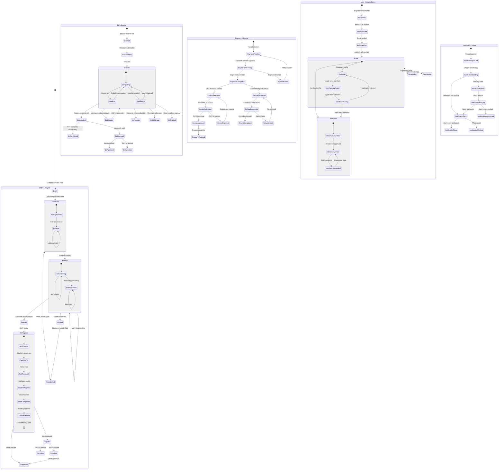

# 🔄 System State Diagram - Order & Bidding Lifecycle

## 🔄 State Transition Rules

### **Order State Transitions**

| From State | To State | Trigger | Conditions |
|------------|----------|---------|------------|
| Draft | Published | Customer action | Order details complete |
| Published | Bidding | System | First bid received |
| Bidding | Awarded | Customer action | Customer selects bid |
| Bidding | Expired | System | Deadline reached |
| Awarded | InProgress | Merchant action | Merchant accepts award |
| InProgress | Completed | Customer action | Customer approves work |
| InProgress | Disputed | Either party | Issue reported |
| Disputed | Resolved | Admin action | Issue mediated |
| Expired | Republished | Customer action | Customer republishes |

### **Bid State Transitions**

| From State | To State | Trigger | Conditions |
|------------|----------|---------|------------|
| Draft | Submitted | Merchant action | Bid details complete |
| Submitted | Active | System | Validation passed |
| Active | Updated | Merchant action | New amount provided |
| Active | Awarded | Customer action | Customer selects bid |
| Active | Rejected | Customer action | Customer selects other bid |
| Active | Withdrawn | Merchant action | Merchant withdraws |
| Active | Expired | System | Order deadline reached |
| Awarded | Completed | System | Order completed |
| Awarded | Disputed | Either party | Issue with work |

### **Payment State Transitions**

| From State | To State | Trigger | Conditions |
|------------|----------|---------|------------|
| Pending | Processing | Customer action | Payment initiated |
| Processing | Completed | Gateway | Payment successful |
| Processing | Failed | Gateway | Payment declined |
| Completed | InvoiceGenerated | System | ZATCA invoice created |
| InvoiceGenerated | InvoiceSubmitted | System | Submitted to ZATCA |
| InvoiceSubmitted | InvoiceApproved | ZATCA | ZATCA validates invoice |
| Completed | RefundRequested | Customer action | Refund requested |
| RefundRequested | RefundProcessing | Admin action | Refund approved |

## 🎯 Business Rules

### **Order Management Rules**
- Orders can only be published if all required fields are complete
- Orders automatically expire after the specified deadline
- Customers can republish expired orders with updated details
- Only verified customers can create orders

### **Bidding Rules**
- Only verified merchants can submit bids
- Bids must meet minimum amount requirements
- Merchants cannot bid on their own orders
- Auto-bidding has maximum limits to prevent runaway bidding
- Bids can be withdrawn before award (with time restrictions)

### **Payment Rules**
- Payment is required within 24 hours of award
- ZATCA invoices are mandatory for Saudi customers
- Refunds require admin approval
- Disputed payments are held in escrow

### **User Account Rules**
- Phone verification is mandatory for all users
- Email verification is required for password reset
- Merchants must provide business documentation
- Suspended users cannot create orders or bids

## 📊 State Monitoring

### **Real-time Dashboards**
- **Order Status Distribution**: Live count of orders in each state
- **Bid Activity**: Active bidding sessions and competition levels
- **Payment Processing**: Transaction success rates and processing times
- **User Activity**: Registration, verification, and engagement metrics

### **Automated Alerts**
- **Stuck Orders**: Orders in same state too long
- **Failed Payments**: Payment processing issues
- **High Dispute Rate**: Quality issues requiring attention
- **System Bottlenecks**: Performance degradation alerts

This state management system ensures proper workflow control, business rule enforcement, and comprehensive monitoring across the entire Reverse Tender Platform.

