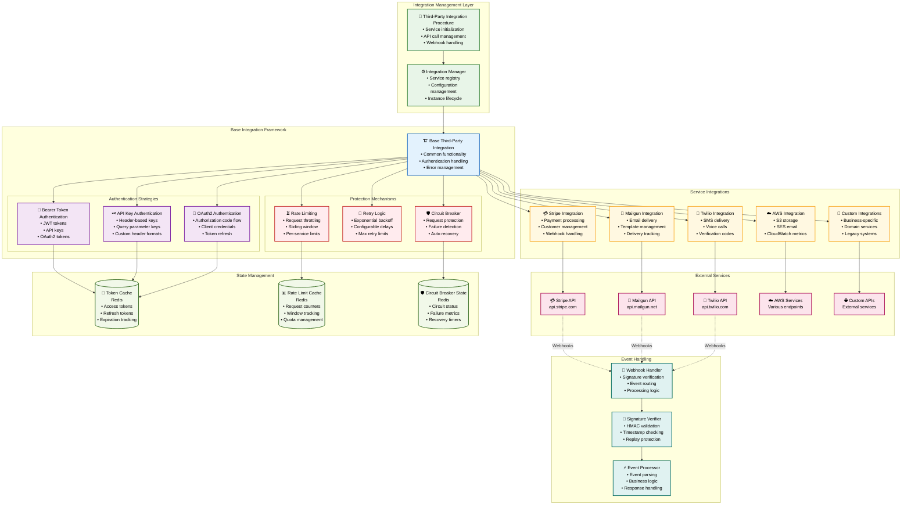
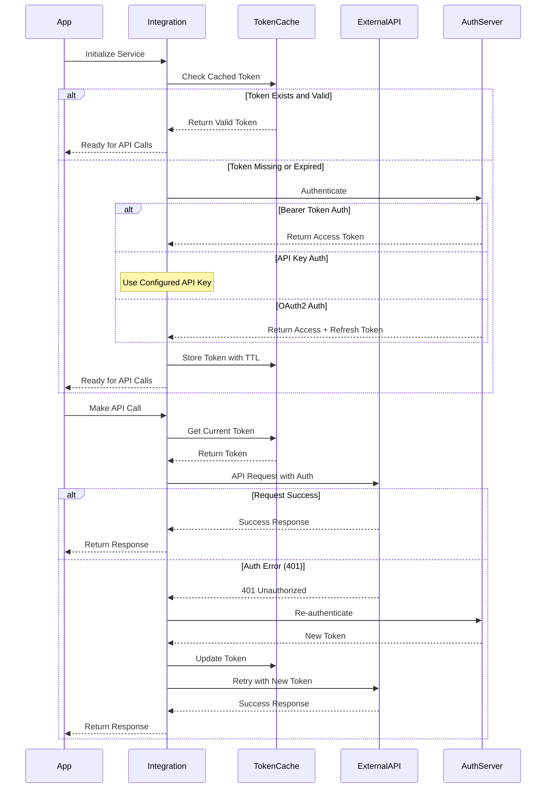
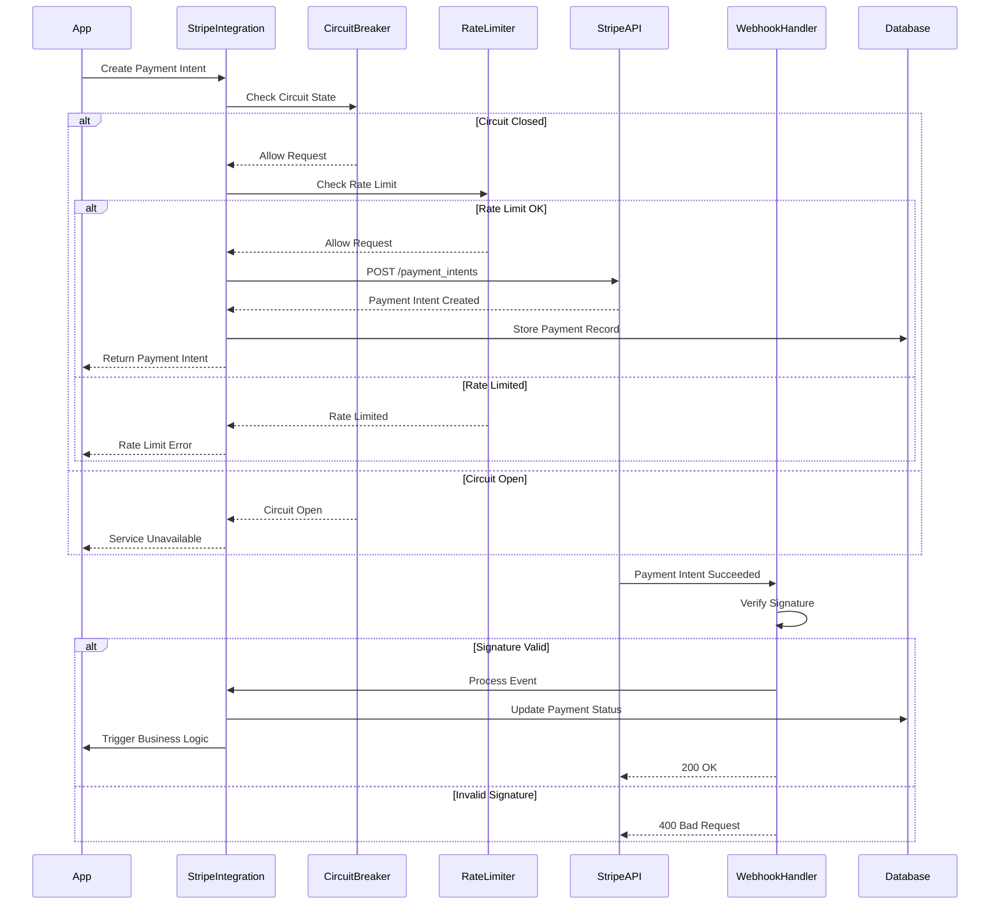
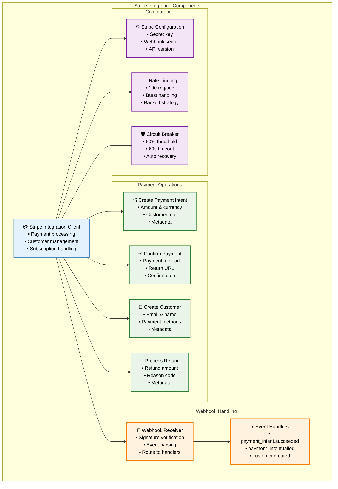
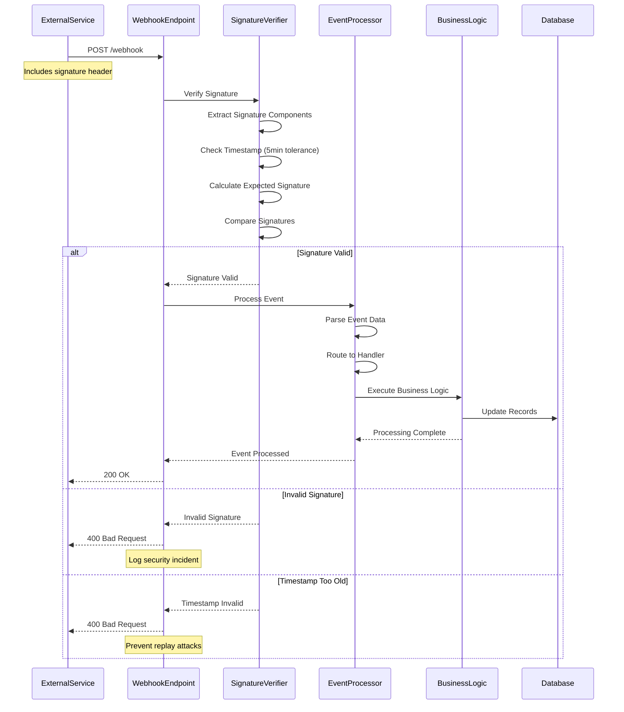
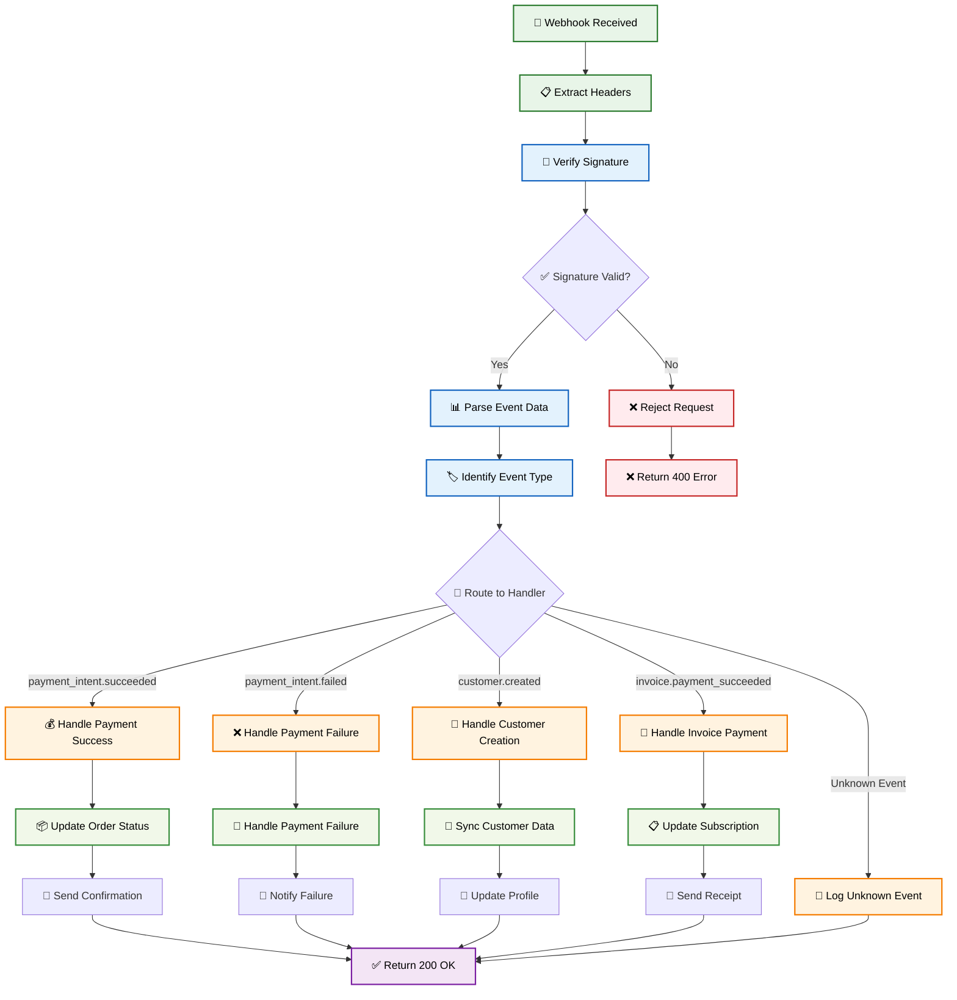
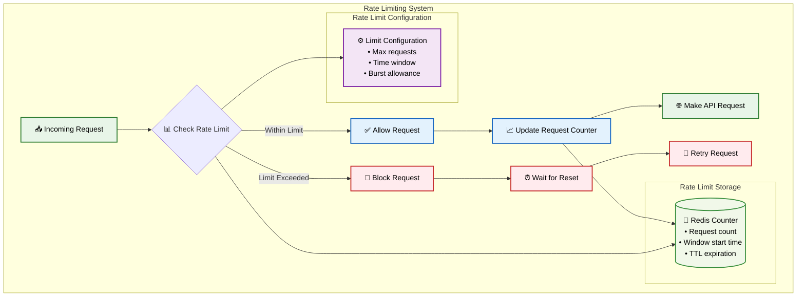
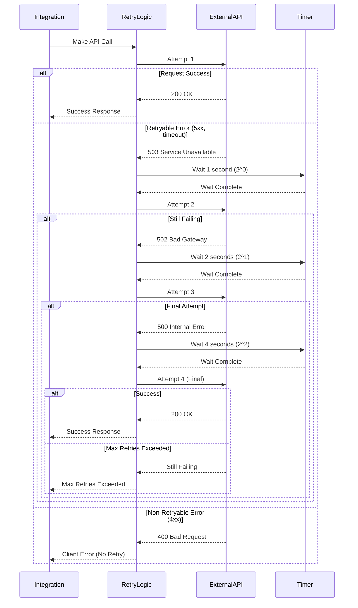
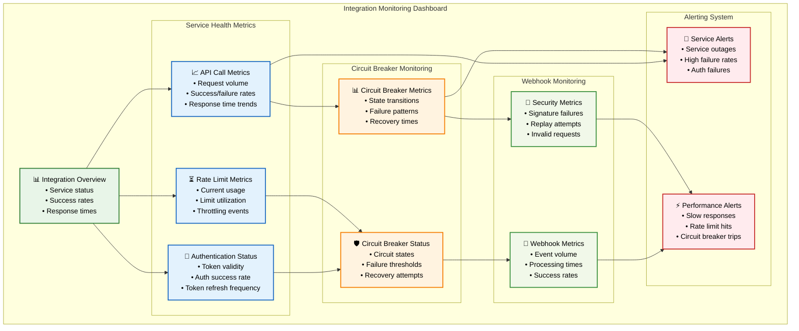

# 🔌 Third-Party Integration Framework

## 🎯 **Overview**

The **Third-Party Integration Framework** provides standardized patterns for connecting with external services, featuring authentication strategies, rate limiting, circuit breaker protection, and secure webhook handling.

## 🏗️ **Complete Integration Architecture**

## 🔐 **Authentication Strategies**

### **Authentication Flow Diagram**

### **Authentication Strategy Details**

```mermaid
graph TB
    subgraph "Bearer Token Authentication"
        BEARER_START[🔑 Bearer Token Strategy]
        BEARER_CONFIG[📋 Configuration<br/>• Token endpoint<br/>• Client credentials<br/>• Scope requirements]
        BEARER_REQUEST[📤 Token Request<br/>• POST to auth endpoint<br/>• Client credentials<br/>• Grant type]
        BEARER_RESPONSE[📥 Token Response<br/>• Access token<br/>• Token type<br/>• Expires in]
        BEARER_USAGE[🔗 Token Usage<br/>• Authorization header<br/>• Bearer prefix<br/>• Request signing]
    end
    
    subgraph "API Key Authentication"
        API_KEY_START[🗝️ API Key Strategy]
        API_KEY_CONFIG[📋 Configuration<br/>• API key value<br/>• Header name<br/>• Key format]
        API_KEY_STORAGE[💾 Secure Storage<br/>• Environment variables<br/>• Encrypted config<br/>• Key rotation]
        API_KEY_USAGE[🔗 Key Usage<br/>• Custom headers<br/>• Query parameters<br/>• Request signing]
    end
    
    subgraph "OAuth2 Authentication"
        OAUTH_START[🔐 OAuth2 Strategy]
        OAUTH_CONFIG[📋 Configuration<br/>• Client ID/Secret<br/>• Authorization URL<br/>• Token URL<br/>• Scopes]
        OAUTH_FLOW[🔄 Authorization Flow<br/>• Authorization code<br/>• Client credentials<br/>• Refresh token]
        OAUTH_TOKENS[🎫 Token Management<br/>• Access token<br/>• Refresh token<br/>• Auto refresh]
    end

    BEARER_START --> BEARER_CONFIG
    BEARER_CONFIG --> BEARER_REQUEST
    BEARER_REQUEST --> BEARER_RESPONSE
    BEARER_RESPONSE --> BEARER_USAGE

    API_KEY_START --> API_KEY_CONFIG
    API_KEY_CONFIG --> API_KEY_STORAGE
    API_KEY_STORAGE --> API_KEY_USAGE

    OAUTH_START --> OAUTH_CONFIG
    OAUTH_CONFIG --> OAUTH_FLOW
    OAUTH_FLOW --> OAUTH_TOKENS

    classDef bearerStyle fill:#e3f2fd,stroke:#1565c0,stroke-width:2px,color:#000
    classDef apiKeyStyle fill:#f3e5f5,stroke:#7b1fa2,stroke-width:2px,color:#000
    classDef oauthStyle fill:#e8f5e8,stroke:#2e7d32,stroke-width:2px,color:#000

    class BEARER_START,BEARER_CONFIG,BEARER_REQUEST,BEARER_RESPONSE,BEARER_USAGE bearerStyle
    class API_KEY_START,API_KEY_CONFIG,API_KEY_STORAGE,API_KEY_USAGE apiKeyStyle
    class OAUTH_START,OAUTH_CONFIG,OAUTH_FLOW,OAUTH_TOKENS oauthStyle
```

## 💳 **Stripe Integration Example**

### **Complete Stripe Integration Flow**

### **Stripe Service Integration Details**

## 🎣 **Webhook Security & Processing**

### **Webhook Security Flow**

### **Webhook Event Processing**

## ⏳ **Rate Limiting & Retry Logic**

### **Rate Limiting Implementation**

### **Retry Logic with Exponential Backoff**

## 📊 **Integration Monitoring**

### **Integration Health Dashboard**

## 🎯 **Key Benefits**

### **🔌 Standardized Integration Patterns**
- **Consistent API** for all external service integrations
- **Pluggable Authentication** strategies for different services
- **Unified Error Handling** across all integrations
- **Common Configuration** patterns and management

### **🛡️ Comprehensive Protection**
- **Circuit Breaker Protection** for external service failures
- **Rate Limiting** to respect service quotas and limits
- **Retry Logic** with intelligent exponential backoff
- **Authentication Management** with automatic token refresh

### **🔐 Security & Reliability**
- **Webhook Signature Verification** for secure event handling
- **Replay Attack Prevention** with timestamp validation
- **Secure Token Storage** with encryption and TTL management
- **Comprehensive Logging** for security audit trails

### **📈 Monitoring & Observability**
- **Real-time Integration Health** monitoring and alerting
- **Performance Metrics** for optimization and troubleshooting
- **Security Metrics** for threat detection and prevention
- **Historical Analytics** for capacity planning and optimization

This third-party integration framework provides enterprise-grade capabilities for secure, reliable, and scalable external service connectivity with comprehensive monitoring and fault tolerance.

