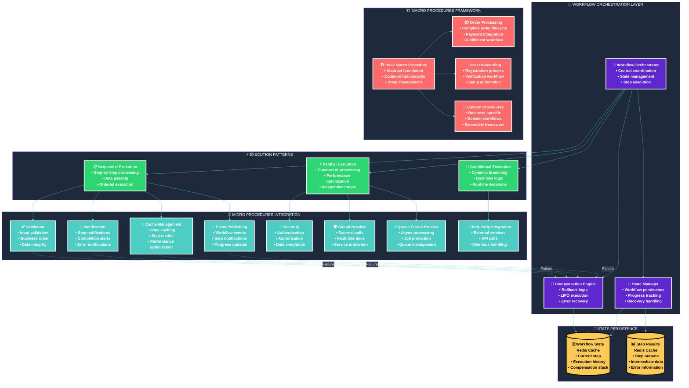
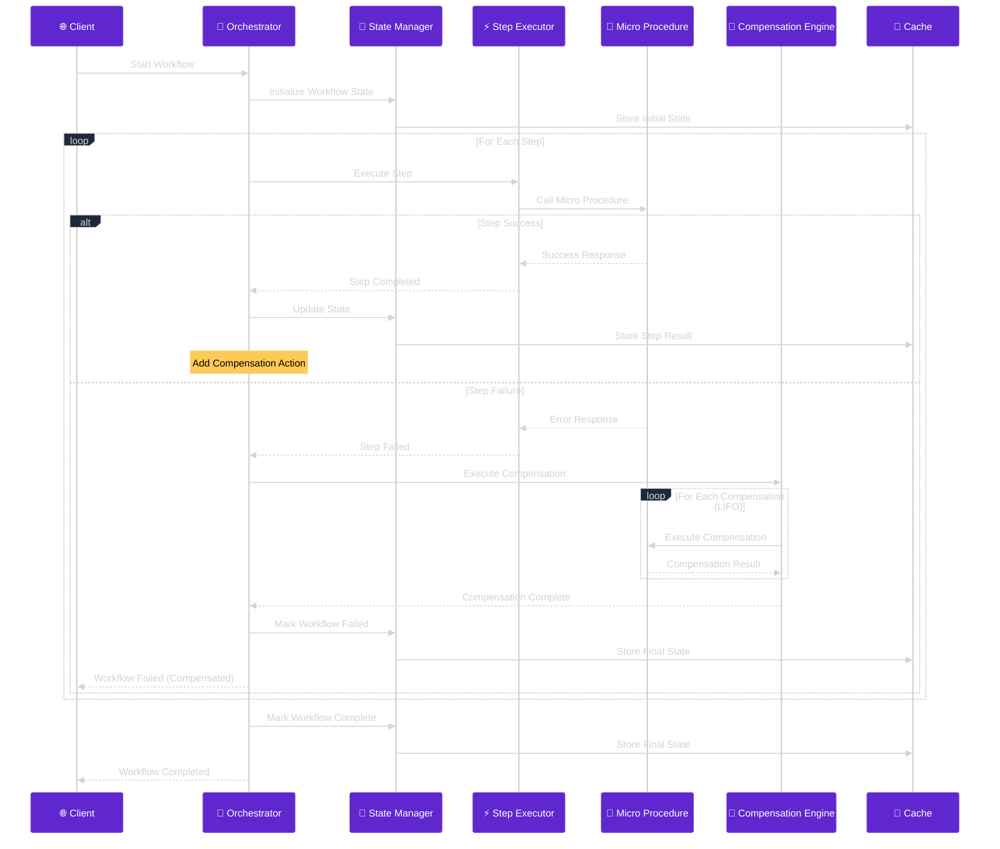
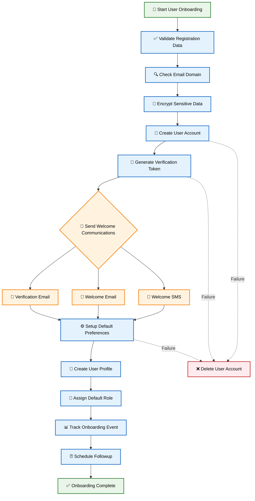
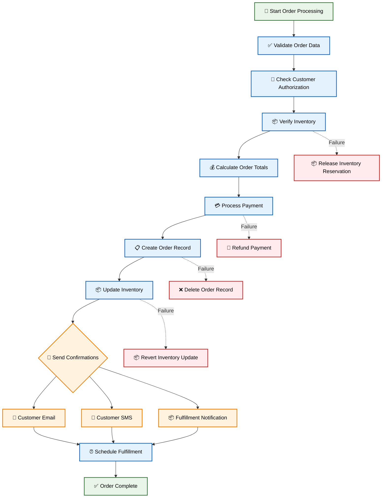
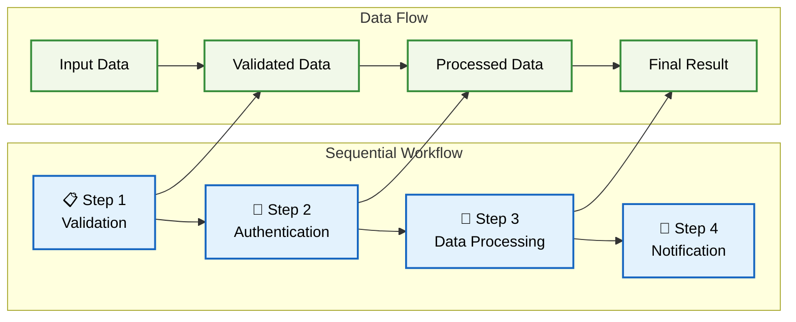
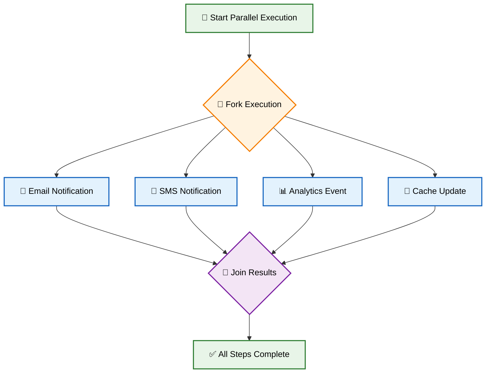
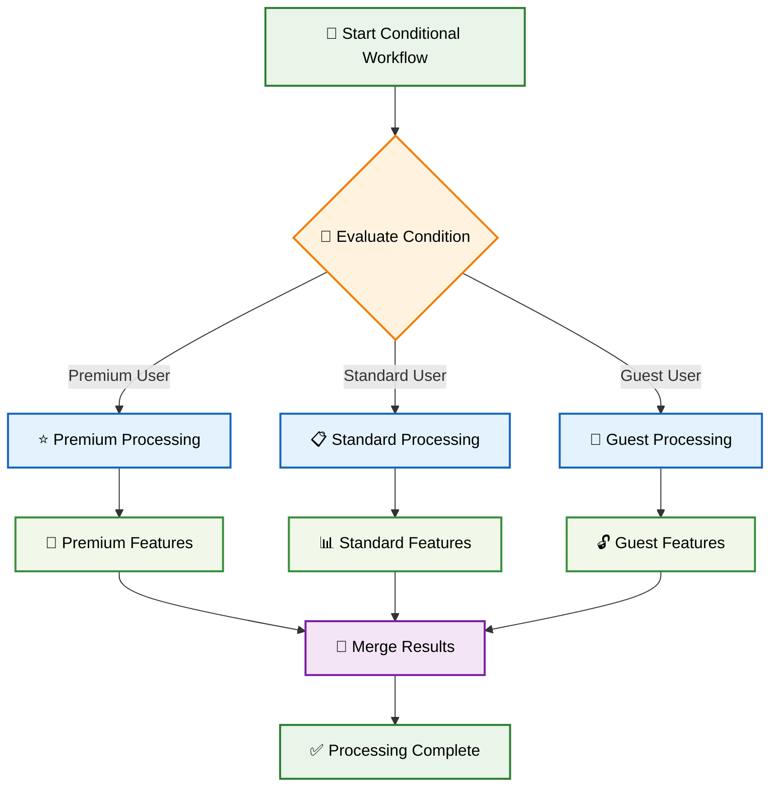
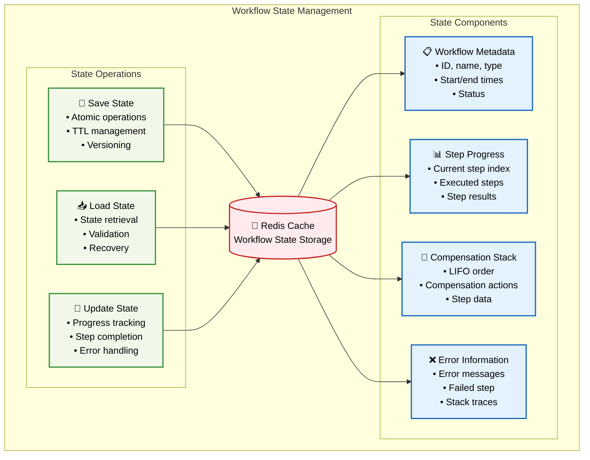
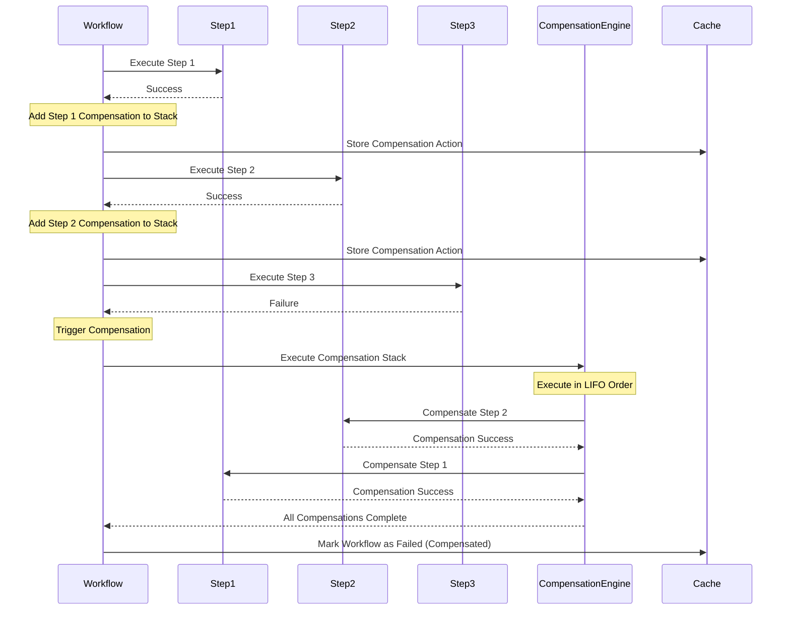
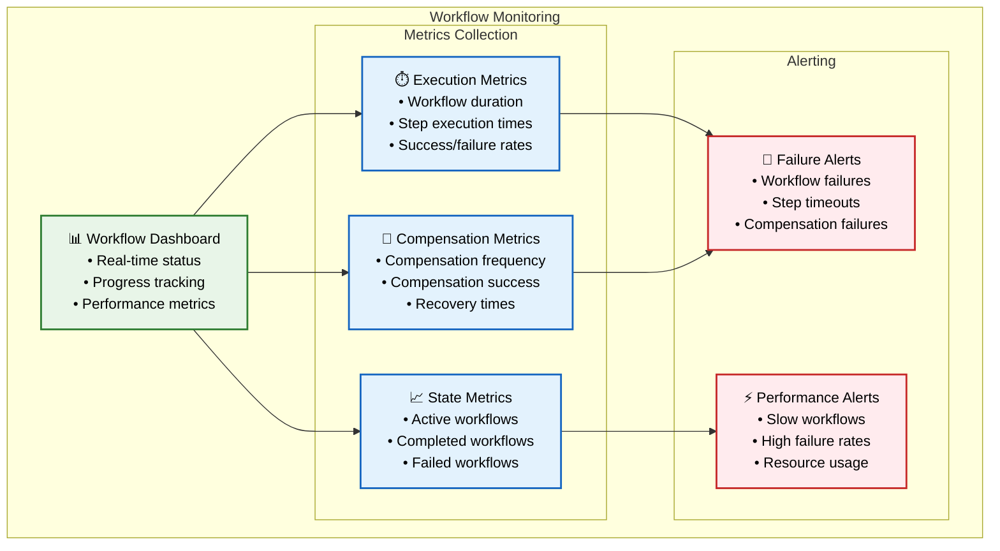

# 🔄 Workflow Orchestration Architecture

## 🎯 **Overview**

The **Workflow Orchestration Framework** provides enterprise-grade capabilities for managing complex, multi-step business processes with state management, compensation mechanisms, and fault tolerance.

## 🏗️ **Complete Workflow Architecture**

## 🔄 **Workflow Execution Flow**

### **Complete Workflow Lifecycle**

## 📋 **Built-in Workflow Definitions**

### **User Onboarding Workflow**

### **Order Processing Workflow**

## 🔀 **Execution Patterns**

### **Sequential Execution Pattern**

### **Parallel Execution Pattern**

### **Conditional Execution Pattern**

## 💾 **State Management Architecture**

### **Workflow State Structure**

## 🔄 **Compensation Mechanism**

### **Compensation Execution Flow**

## 📊 **Workflow Monitoring & Metrics**

### **Monitoring Dashboard Structure**

## 🎯 **Key Benefits**

### **🔄 Business Process Automation**
- **Complex Workflow Management** with state persistence
- **Automatic Compensation** for failed processes
- **Parallel Processing** for performance optimization
- **Conditional Logic** for dynamic business rules

### **🛡️ Fault Tolerance**
- **State Recovery** from failures and interruptions
- **Compensation Mechanisms** for automatic rollback
- **Circuit Breaker Integration** for external service protection
- **Error Handling** with comprehensive logging

### **📈 Scalability & Performance**
- **Parallel Execution** for independent steps
- **State Caching** for performance optimization
- **Asynchronous Processing** for long-running workflows
- **Resource Management** with configurable timeouts

### **🔍 Observability**
- **Real-time Progress Tracking** with detailed metrics
- **Comprehensive Logging** with correlation IDs
- **Performance Monitoring** with execution time tracking
- **Error Tracking** with detailed failure information

This workflow orchestration architecture provides enterprise-grade capabilities for managing complex business processes with comprehensive fault tolerance, state management, and monitoring capabilities.
