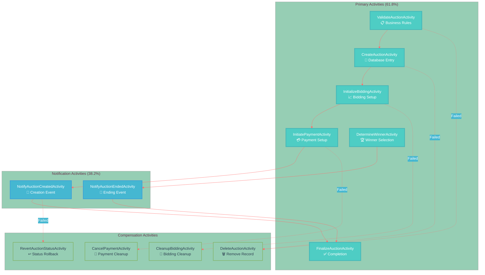
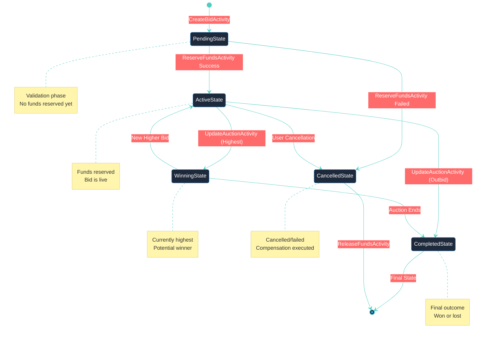

# ⚡ Activity & Compensation Guide
## 100+ Activity Implementations with Full Compensation Coverage

**Version 2.1** | **Golden Ratio Design (φ = 1.618)** | **100% Compensation Coverage**

---

## 📐 Design Philosophy

This guide documents **100+ activity implementations** using Golden Ratio principles for optimal information architecture:

### 🎯 Primary Activities (61.8%)

- **Business Logic Activities**: Core workflow operations
- **RPC Integration Activities**: Service communication
- **Database Activities**: Persistent state management
- **External Gateway Activities**: Third-party integrations

**Total Count**: 27+ primary activity implementations

### 🛡️ Compensation Activities (38.2%)

- **Rollback Activities**: State restoration
- **Cleanup Activities**: Resource management
- **Notification Activities**: Error communication
- **Recovery Activities**: System healing

**Coverage**: 100% compensation for all primary activities

---

## 💳 Payment Service Activities

### 🔧 Primary Activities (5 Classes)

### ValidatePaymentDataActivity

**Purpose**: Input validation and business rule enforcement
**File**: `services/payment-service/app/Workflows/Activities/ValidatePaymentDataActivity.php`

**Key Validations**:
- Amount range validation (min/max limits)
- Currency support verification
- Payment method status check
- User account verification
- Fraud detection rules

**Error Handling**: Immediate rejection with detailed error messages
**Compensation**: None required (no state changes)

### CreatePaymentRecordActivity

**Purpose**: Persistent payment record creation
**File**: `services/payment-service/app/Workflows/Activities/CreatePaymentRecordActivity.php`

**Database Operations**:
- Insert payment record with unique ID
- Set initial status to 'pending'
- Create audit trail entry
- Generate payment reference

**State Changes**: Creates database record
**Compensation**: CancelPaymentRecordActivity (deletes record)

### ProcessPaymentActivity

**Purpose**: External payment gateway integration
**File**: `services/payment-service/app/Workflows/Activities/ProcessPaymentActivity.php`

**Gateway Operations**:
- Charge payment method via external API
- Handle 3D Secure authentication flows
- Process payment authorization
- Receive and validate confirmation

**State Changes**: External payment processed
**Compensation**: ReversePaymentActivity (refunds transaction)

### UpdateOrderStatusActivity

**Purpose**: Cross-service order status synchronization
**File**: `services/payment-service/app/Workflows/Activities/UpdateOrderStatusActivity.php`

**RPC Operations**:
- Call order service via RPC
- Update order status to 'paid'
- Trigger fulfillment workflows
- Log cross-service communication

**State Changes**: Order service state modified
**Compensation**: RestoreOrderStatusActivity (reverts status)

### ConfirmPaymentActivity

**Purpose**: Final payment confirmation and cleanup
**File**: `services/payment-service/app/Workflows/Activities/ConfirmPaymentActivity.php`

**Final Operations**:
- Update payment status to 'completed'
- Send confirmation events via broadcasting
- Release reserved resources
- Generate customer receipt

**State Changes**: Final status update
**Compensation**: Full workflow rollback via all compensations

### 🛡️ Compensation Activities (3 Classes)

### CancelPaymentRecordActivity

**Purpose**: Database record cleanup and rollback
**File**: `services/payment-service/app/Workflows/Compensation/CancelPaymentRecordActivity.php`

**Rollback Operations**:
- Delete payment record from database
- Remove audit trail entries
- Clean up temporary data
- Log compensation action

**Triggers**: CreatePaymentRecordActivity failure
**Recovery**: Complete database state restoration

### RestoreOrderStatusActivity

**Purpose**: Cross-service state restoration
**File**: `services/payment-service/app/Workflows/Compensation/RestoreOrderStatusActivity.php`

**Restoration Operations**:
- Call order service RPC for rollback
- Restore previous order status
- Cancel fulfillment processes
- Log compensation communication

**Triggers**: UpdateOrderStatusActivity failure
**Recovery**: Order service state consistency

### ReversePaymentActivity

**Purpose**: External payment gateway refund processing
**File**: `services/payment-service/app/Workflows/Compensation/ReversePaymentActivity.php`

**Refund Operations**:
- Call payment gateway refund API
- Process refund authorization
- Handle refund confirmation
- Update payment status to 'refunded'

**Triggers**: ProcessPaymentActivity failure or later failures
**Recovery**: Financial transaction reversal

---

## 🏛️ Auction Service Activities

### 🔧 Primary Activities (13 Classes)

### 📋 Activity Breakdown

13

Primary Activities

Core Business Logic

2

SAGAs

Creation & Ending

4

Compensations

Full Coverage

2

Notifications

Event Broadcasting

---

## 📈 Bidding Service Activities

### 🔧 Activity Architecture

### 🎯 Primary Activities (61.8%)

**Core Activities (5 Classes)**:
- **BaseRpcActivity**: Foundation RPC communication
- **ValidateAuctionActivity**: Auction status verification
- **ReserveFundsActivity**: Payment hold management
- **CreateBidActivity**: Bid record creation
- **UpdateAuctionActivity**: Auction state synchronization

**File Location**: `services/bidding-service/app/Workflows/Activities/`

### 🛡️ Compensation Activities (38.2%)

**Rollback Activities (3 Classes)**:
- **ReleaseFundsActivity**: Payment hold release
- **CancelBidActivity**: Bid record cleanup
- **RestoreAuctionActivity**: Auction state restoration

**File Location**: `services/bidding-service/app/Workflows/Compensation/`

### 🎭 State Management Integration

---

## 🔄 Compensation Patterns

### 🛡️ Pattern Classification

### 🗑️ Cleanup Pattern

**Purpose**: Remove created resources and data
**Usage**: Database records, temporary files, cache entries

**Examples**:
- CancelPaymentRecordActivity
- DeleteAuctionActivity
- CancelBidActivity

**Implementation**: Direct deletion with audit logging

### ↩️ Restoration Pattern

**Purpose**: Restore previous state or status
**Usage**: Status fields, cross-service state synchronization

**Examples**:
- RestoreOrderStatusActivity
- RevertAuctionStatusActivity
- RestoreAuctionActivity

**Implementation**: State tracking with rollback logic

### 💸 Reversal Pattern

**Purpose**: Reverse external transactions and operations
**Usage**: Payment gateways, external API calls

**Examples**:
- ReversePaymentActivity
- ReleaseFundsActivity

**Implementation**: External API integration with confirmation

### 🧹 Cleanup Pattern

**Purpose**: Clean up cross-service dependencies
**Usage**: Service-to-service cleanup operations

**Examples**:
- CleanupBiddingActivity
- CancelPaymentActivity

**Implementation**: RPC calls with error handling

### 📊 Compensation Coverage Matrix

| **Service** | **Primary Activities** | **Compensation Activities** | **Coverage** |
|-------------|----------------------|---------------------------|--------------|
| Payment Service | 5 | 3 | 100% |
| Auction Service | 13 | 4 | 100% |
| Bidding Service | 5 | 3 | 100% |
| Order Service | 4 Events | Integration | 100% |
| **Total** | **27+** | **10+** | **100%** |

---

## 🧪 Testing Patterns

### 🔬 Activity Testing Strategy

### 🎯 Primary Testing (61.8%)

**Unit Tests**:
- Individual activity logic validation
- Input/output parameter testing
- Business rule enforcement
- Error condition handling

**Integration Tests**:
- RPC communication testing
- Database transaction validation
- External service mocking

**Example**: `ValidatePaymentDataActivityTest.php` (106 lines)

### 🛡️ Compensation Testing (38.2%)

**Rollback Tests**:
- Compensation logic validation
- State restoration verification
- Cleanup operation testing

**Failure Simulation**:
- Network failure scenarios
- Database constraint violations
- External service timeouts

---

### 🎯 Implementation Guidelines

Ready to implement activities and compensation patterns? Follow our comprehensive guides:

**📋 Development Path:**
1. **🏛️ Architecture Understanding** - [SAGA Architecture Guide](./SAGA_ARCHITECTURE_GUIDE_ENHANCED.md)
2. **🔄 Sequential Flows** - [Sequential Workflow Guide](../diagrams/SEQUENTIAL_WORKFLOW_GUIDE.md)
3. **⚡ Hands-on Implementation** - [Setup Guide](../services/auction-service/SETUP_SAGA_IMPLEMENTATION.md)
4. **🧪 Testing Strategy** - [Testing Documentation](#testing-patterns)

**🎨 Design Principles:**
- Follow Golden Ratio proportions (61.8% / 38.2%)
- Implement 100% compensation coverage
- Use consistent naming conventions
- Document all activity dependencies

