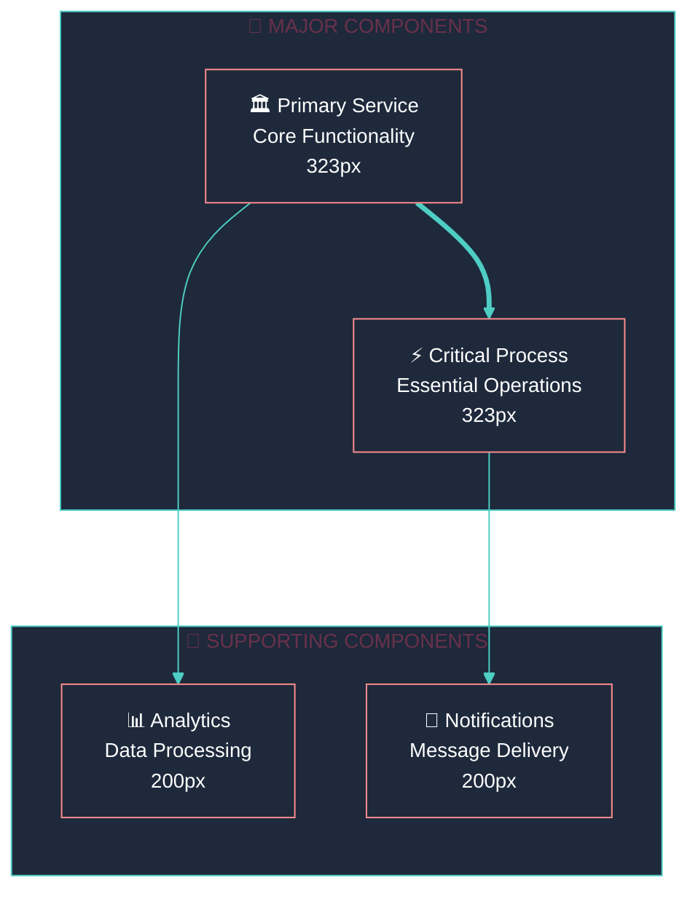

<div style="max-width: 38.2rem; line-height: 1.618; font-family: 'Inter', 'Segoe UI', 'Roboto', sans-serif;">

# <span style="font-size: 42px; font-weight: 700; line-height: 1.618;">📐 Golden Ratio Documentation Template</span>

<p style="font-size: 16px; line-height: 1.618; margin-bottom: 2rem;">A comprehensive template for applying <strong>Golden Ratio principles</strong> to documentation and diagrams, ensuring optimal readability, visual hierarchy, and information architecture.</p>

## <span style="font-size: 26px; font-weight: 600; line-height: 1.618;">🎯 Golden Ratio Framework</span>

<!-- 62% MAJOR CONCEPTS: Core Principles -->
<div style="margin-bottom: 3rem;">

### <span style="font-size: 20px; font-weight: 600; line-height: 1.618;">📏 Visual Hierarchy (62% / 38% Split)</span>
<p style="font-size: 16px; line-height: 1.618;"><strong>The Power Split:</strong> Dedicate 62% of visual weight to major concepts, 38% to supporting details. This creates natural information flow and improved comprehension.</p>

### <span style="font-size: 20px; font-weight: 600; line-height: 1.618;">📐 Typography Scale</span>
<p style="font-size: 16px; line-height: 1.618;"><strong>Golden Ratio Scaling:</strong> H1: 42px, H2: 26px, Body: 16px with 1.618 line-height for optimal reading comfort and visual harmony.</p>

### <span style="font-size: 20px; font-weight: 600; line-height: 1.618;">📊 Diagram Optimization</span>
<p style="font-size: 16px; line-height: 1.618;"><strong>Proportional Spacing:</strong> rankSpacing: 81, nodeSpacing: 50. Major nodes: 323px, Minor nodes: 200px (1.618 ratio).</p>

</div>

<!-- 38% MINOR DETAILS: Implementation Details -->
<details style="margin-bottom: 2rem;">
<summary style="font-size: 16px; font-weight: 500; cursor: pointer;">🔧 Implementation Guidelines</summary>
<div style="margin-top: 1rem; padding-left: 1rem; border-left: 3px solid #4ECDC4;">

**CSS Framework:**
```css
/* Golden Ratio Typography */
h1 { font-size: 42px; font-weight: 700; line-height: 1.618; }
h2 { font-size: 26px; font-weight: 600; line-height: 1.618; }
h3 { font-size: 20px; font-weight: 600; line-height: 1.618; }
body { font-size: 16px; line-height: 1.618; max-width: 38.2rem; }
```

**Mobile Specifications:**
- Major Box: 323px | Minor Box: 200px
- Visual Anchor: 61.8% mark placement
- Magic Number: 1.618 constant

</div>
</details>

## <span style="font-size: 26px; font-weight: 600; line-height: 1.618;">🎨 Mermaid Diagram Template</span>



## <span style="font-size: 26px; font-weight: 600; line-height: 1.618;">📋 Content Structure Template</span>

<!-- 62% MAJOR CONCEPTS: Essential Information -->
<div style="margin-bottom: 3rem;">

### <span style="font-size: 20px; font-weight: 600; line-height: 1.618;">🎯 Primary Concept</span>
<p style="font-size: 16px; line-height: 1.618;"><strong>Core Value Proposition:</strong> Lead with the most important information that users need to understand immediately.</p>

### <span style="font-size: 20px; font-weight: 600; line-height: 1.618;">⚡ Key Features</span>
<p style="font-size: 16px; line-height: 1.618;"><strong>Essential Capabilities:</strong> Highlight the main features that deliver the core value proposition.</p>

### <span style="font-size: 20px; font-weight: 600; line-height: 1.618;">🚀 Quick Start</span>
<p style="font-size: 16px; line-height: 1.618;"><strong>Immediate Action:</strong> Provide the fastest path to value for users.</p>

</div>

<!-- 38% MINOR DETAILS: Supporting Information -->
<details style="margin-bottom: 2rem;">
<summary style="font-size: 16px; font-weight: 500; cursor: pointer;">📚 Detailed Documentation</summary>
<div style="margin-top: 1rem; padding-left: 1rem; border-left: 3px solid #4ECDC4;">

**Advanced Configuration:**
- Detailed setup instructions
- Configuration options
- Troubleshooting guides

**API Reference:**
- Endpoint documentation
- Parameter specifications
- Response examples

**Additional Resources:**
- Links to related documentation
- External references
- Community resources

</div>
</details>

## <span style="font-size: 26px; font-weight: 600; line-height: 1.618;">🎯 Information Architecture Principles</span>

### <span style="font-size: 20px; font-weight: 600; line-height: 1.618;">📈 Information Spiral Pattern</span>
<p style="font-size: 16px; line-height: 1.618;">Start with <strong>dense anchors</strong> (critical information) and progressively taper into <strong>light details</strong> (supporting information). This creates natural reading flow and improved comprehension.</p>

### <span style="font-size: 20px; font-weight: 600; line-height: 1.618;">📍 Visual Anchor Points</span>
<p style="font-size: 16px; line-height: 1.618;">Place key navigation elements and critical information at the <strong>61.8% mark</strong> of the page for optimal visual impact and user engagement.</p>

### <span style="font-size: 20px; font-weight: 600; line-height: 1.618;">📱 Mobile Optimization</span>
<p style="font-size: 16px; line-height: 1.618;">Maintain <strong>323px/200px sizing ratio</strong> across responsive breakpoints while ensuring readability at <strong>38.2rem max width</strong>.</p>

## <span style="font-size: 26px; font-weight: 600; line-height: 1.618;">✅ Quality Checklist</span>

**Typography Validation:**
- [ ] H1 headers at 42px with 1.618 line-height
- [ ] H2 headers at 26px with 1.618 line-height  
- [ ] H3 headers at 20px with 1.618 line-height
- [ ] Body text at 16px with 1.618 line-height
- [ ] Maximum text width of 38.2rem

**Content Structure:**
- [ ] 62% visual weight for major concepts
- [ ] 38% visual weight for minor details
- [ ] Information spiral pattern (dense → light)
- [ ] Visual anchors at 61.8% mark

**Diagram Optimization:**
- [ ] rankSpacing: 81, nodeSpacing: 50
- [ ] Major nodes: 323px, Minor nodes: 200px
- [ ] 1.618 ratio maintained throughout
- [ ] Golden Ratio theme configuration

**Mobile Responsiveness:**
- [ ] 323px/200px sizing maintained
- [ ] Readable at all breakpoints
- [ ] Visual hierarchy preserved

---

<p style="text-align: center; font-size: 16px; line-height: 1.618; margin-top: 2rem;"><strong>Golden Ratio Template v1.0</strong> - Optimized for readability and visual harmony 📐</p>

</div>
<!-- End Golden Ratio Container -->
