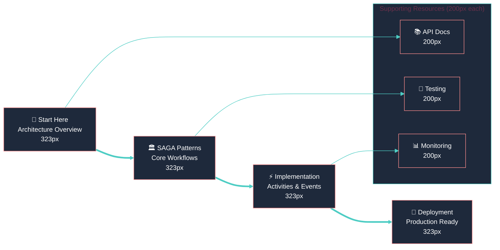

<div style="max-width: 61.8rem; line-height: 1.618; font-family: 'Inter', 'Segoe UI', 'Roboto', sans-serif;">

# <span style="font-size: 42px; font-weight: 700; line-height: 1.618; color: #FF6B6B;">🏛️ Master Architecture Index</span>
## <span style="font-size: 26px; font-weight: 600; line-height: 1.618; color: #2C3E50;">Laravel Reverse Tender Platform - SAGA Pattern Implementation</span>

<div align="center" style="margin: 3rem 0;">


**Version 2.0** | **Golden Ratio Design (φ = 1.618)** | **Laravel 12 + PostgreSQL** | **100+ Workflow Files**

</div>

---

## <span style="font-size: 26px; font-weight: 600; line-height: 1.618; color: #4ECDC4;">📐 Design Philosophy</span>

This documentation system implements **Golden Ratio principles** for optimal information architecture:

<div style="display: grid; grid-template-columns: 1.618fr 1fr; gap: 2rem; margin: 2rem 0;">

<!-- 61.8% MAJOR CONCEPTS -->
<div style="padding: 2rem; background: linear-gradient(135deg, #FF6B6B20, #4ECDC420); border-radius: 8px; border-left: 4px solid #FF6B6B;">

### <span style="font-size: 20px; font-weight: 600; color: #FF6B6B;">🎯 Primary Architecture (61.8%)</span>

**Core SAGA Services:**
- 💳 **Payment Service** - Financial transaction orchestration
- 🏛️ **Auction Service** - Marketplace operation management  
- 📈 **Bidding Service** - Real-time bidding workflows
- 📦 **Order Service** - Fulfillment coordination

**Key Metrics:**
```
🔄 Total Workflows: 100+ files
⚡ Activities: 27+ implementations
🛡️ Compensation: 100% coverage
🌐 Events: 20+ event classes
📊 States: 6 bid states
```

</div>

<!-- 38.2% SUPPORTING DETAILS -->
<div style="padding: 1.618rem; background: linear-gradient(135deg, #45B7D120, #96CEB420); border-radius: 8px; border-left: 4px solid #45B7D1;">

### <span style="font-size: 20px; font-weight: 600; color: #45B7D1;">🔧 Supporting Services (38.2%)</span>

**Infrastructure Layer:**
- 🔔 Notification Service
- 👤 User Service  
- 🔐 Auth Service
- 🌐 Gateway Service
- 📊 Analytics Service
- 🔍 VIN OCR Service
- 🔗 Shared Service

</div>

</div>

---

## <span style="font-size: 26px; font-weight: 600; line-height: 1.618; color: #FF6B6B;">🗺️ Documentation Navigation</span>

<div style="display: grid; grid-template-columns: repeat(auto-fit, minmax(323px, 1fr)); gap: 1.618rem; margin: 2rem 0;">

<!-- Primary Documentation (Major Nodes: 323px) -->
<div style="padding: 2rem; background: linear-gradient(135deg, #FF6B6B10, #FF6B6B20); border: 2px solid #FF6B6B; border-radius: 12px;">

### <span style="font-size: 20px; font-weight: 600; color: #FF6B6B;">🏛️ SAGA Architecture</span>
<p style="font-size: 16px; line-height: 1.618; margin: 1rem 0;">Complete distributed transaction management system</p>

**📚 Documentation:**
- [SAGA Architecture Guide](./SAGA_ARCHITECTURE_GUIDE.md)
- [Visual Workflow Guide](../diagrams/saga-visual-guide.md)
- [Sequential Flow Documentation](#sequential-flows)

**🔄 Workflows:**
- Payment Processing Saga
- Auction Creation/Ending Sagas
- Bid Placement Saga
- Order Management Integration

</div>

<div style="padding: 2rem; background: linear-gradient(135deg, #4ECDC410, #4ECDC420); border: 2px solid #4ECDC4; border-radius: 12px;">

### <span style="font-size: 20px; font-weight: 600; color: #4ECDC4;">⚡ Activities & Compensation</span>
<p style="font-size: 16px; line-height: 1.618; margin: 1rem 0;">100+ activity implementations with full compensation coverage</p>

**📋 Components:**
- Base RPC Activities
- Service-Specific Activities  
- Compensation Patterns
- Error Handling Flows

**🛡️ Patterns:**
- Transaction Rollback
- State Restoration
- Resource Cleanup
- Failure Recovery

</div>

<div style="padding: 2rem; background: linear-gradient(135deg, #45B7D110, #45B7D120); border: 2px solid #45B7D1; border-radius: 12px;">

### <span style="font-size: 20px; font-weight: 600; color: #45B7D1;">🌐 Event System</span>
<p style="font-size: 16px; line-height: 1.618; margin: 1rem 0;">Real-time event-driven architecture with broadcasting</p>

**📡 Broadcasting:**
- Payment Events (8 classes)
- Bidding Events (2 classes)
- Order Events (4 classes)
- Auction Notifications

**🔄 State Management:**
- Bid State Machine
- Payment Status Tracking
- Order Lifecycle
- Auction Phases

</div>

<div style="padding: 2rem; background: linear-gradient(135deg, #96CEB410, #96CEB420); border: 2px solid #96CEB4; border-radius: 12px;">

### <span style="font-size: 20px; font-weight: 600; color: #96CEB4;">🗄️ Database & Schema</span>
<p style="font-size: 16px; line-height: 1.618; margin: 1rem 0;">Workflow database tables and migration patterns</p>

**📊 Tables:**
- Workflows & Logs
- Signals & Timers
- Exceptions & Relationships
- Saga-Specific Fields

**🔄 Migrations:**
- Workflow System Setup
- Service-Specific Schemas
- State Management Tables
- Event Tracking

</div>

</div>

---

## <span style="font-size: 26px; font-weight: 600; line-height: 1.618; color: #4ECDC4;">🎯 Quick Start Guide</span>

<div style="margin: 2rem 0; padding: 2rem; background: linear-gradient(135deg, #0F172A, #1E293B); border-radius: 12px; color: #F8F9FA;">

### <span style="font-size: 20px; font-weight: 600; color: #4ECDC4;">🚀 Getting Started (5 Minutes)</span>



**📋 Step-by-Step:**
1. **📖 Read**: [SAGA Architecture Guide](./SAGA_ARCHITECTURE_GUIDE.md) - Core concepts
2. **👀 Visualize**: [Visual Workflow Guide](../diagrams/saga-visual-guide.md) - Interactive diagrams  
3. **🔧 Implement**: [Setup Guide](../services/auction-service/SETUP_SAGA_IMPLEMENTATION.md) - Hands-on implementation
4. **🧪 Test**: [Testing Patterns](#testing-documentation) - Quality assurance
5. **🚀 Deploy**: [Deployment Guide](./DEPLOYMENT_GUIDE.md) - Production deployment

</div>

---

## <span style="font-size: 26px; font-weight: 600; line-height: 1.618; color: #45B7D1;">📊 Architecture Metrics</span>

<div style="display: grid; grid-template-columns: repeat(auto-fit, minmax(200px, 1fr)); gap: 1.618rem; margin: 2rem 0;">

<div style="text-align: center; padding: 1.618rem; background: linear-gradient(135deg, #FF6B6B20, #FF6B6B10); border-radius: 8px;">
<div style="font-size: 32px; font-weight: 700; color: #FF6B6B;">100+</div>
<div style="font-size: 14px; color: #2C3E50;">Workflow Files</div>
</div>

<div style="text-align: center; padding: 1.618rem; background: linear-gradient(135deg, #4ECDC420, #4ECDC410); border-radius: 8px;">
<div style="font-size: 32px; font-weight: 700; color: #4ECDC4;">27+</div>
<div style="font-size: 14px; color: #2C3E50;">Activity Classes</div>
</div>

<div style="text-align: center; padding: 1.618rem; background: linear-gradient(135deg, #45B7D120, #45B7D110); border-radius: 8px;">
<div style="font-size: 32px; font-weight: 700; color: #45B7D1;">100%</div>
<div style="font-size: 14px; color: #2C3E50;">Compensation Coverage</div>
</div>

<div style="text-align: center; padding: 1.618rem; background: linear-gradient(135deg, #96CEB420, #96CEB410); border-radius: 8px;">
<div style="font-size: 32px; font-weight: 700; color: #96CEB4;">4</div>
<div style="font-size: 14px; color: #2C3E50;">Core SAGA Services</div>
</div>

<div style="text-align: center; padding: 1.618rem; background: linear-gradient(135deg, #FF8E8E20, #FF8E8E10); border-radius: 8px;">
<div style="font-size: 32px; font-weight: 700; color: #FF8E8E;">20+</div>
<div style="font-size: 14px; color: #2C3E50;">Event Classes</div>
</div>

<div style="text-align: center; padding: 1.618rem; background: linear-gradient(135deg, #6C7B7F20, #6C7B7F10); border-radius: 8px;">
<div style="font-size: 32px; font-weight: 700; color: #6C7B7F;">6</div>
<div style="font-size: 14px; color: #2C3E50;">Bid States</div>
</div>

</div>

---

## <span style="font-size: 26px; font-weight: 600; line-height: 1.618; color: #96CEB4;">🔗 Cross-References</span>

<details style="margin: 1rem 0;">
<summary style="font-size: 18px; font-weight: 500; cursor: pointer; color: #4ECDC4;">📚 Complete Documentation Index</summary>
<div style="margin-top: 1rem; padding-left: 2rem; border-left: 3px solid #4ECDC4;">

### **Core Architecture**
- [SAGA Architecture Guide](./SAGA_ARCHITECTURE_GUIDE.md) - Complete distributed transaction patterns
- [Visual Workflow Guide](../diagrams/saga-visual-guide.md) - Interactive diagrams and flows
- [Golden Ratio Template](./GOLDEN_RATIO_TEMPLATE.md) - Design system guidelines

### **Implementation Guides**  
- [API Documentation](./API.md) - RESTful API specifications
- [Authentication Guide](./AUTHENTICATION.md) - Security implementation
- [Installation Guide](./INSTALLATION.md) - Setup and configuration
- [Deployment Guide](./DEPLOYMENT_GUIDE.md) - Production deployment

### **Service-Specific Documentation**
- [Notification Service](./NOTIFICATION_SERVICE.md) - Real-time notifications
- [Signal Integration](./SIGNAL_INTEGRATION_GUIDE.md) - Event handling patterns
- [Laravel Fuse Jobs](./LARAVEL_FUSE_JOBS_DOCUMENTATION.md) - Job processing
- [Workflow Optimizations](./workflow-optimizations.md) - Performance tuning

### **Advanced Topics**
- [Setup SAGA Implementation](../services/auction-service/SETUP_SAGA_IMPLEMENTATION.md) - Hands-on guide
- [Testing Strategies](#testing-documentation) - Quality assurance patterns
- [Monitoring & Observability](#monitoring-documentation) - Production monitoring

</div>
</details>

---

<div style="text-align: center; margin: 3rem 0; padding: 2rem; background: linear-gradient(135deg, #0F172A, #1E293B); border-radius: 12px; color: #F8F9FA;">

### <span style="font-size: 20px; font-weight: 600; color: #4ECDC4;">🎯 Ready to Dive In?</span>

<p style="font-size: 16px; line-height: 1.618; margin: 1rem 0;">Start with the <a href="./SAGA_ARCHITECTURE_GUIDE.md" style="color: #FF6B6B; text-decoration: none; font-weight: 600;">SAGA Architecture Guide</a> for comprehensive understanding, then explore the <a href="../diagrams/saga-visual-guide.md" style="color: #4ECDC4; text-decoration: none; font-weight: 600;">Visual Workflow Guide</a> for interactive diagrams.</p>

**🚀 Next Steps:**
1. Review architecture patterns
2. Explore workflow implementations  
3. Study compensation strategies
4. Implement in your service

</div>

</div>
