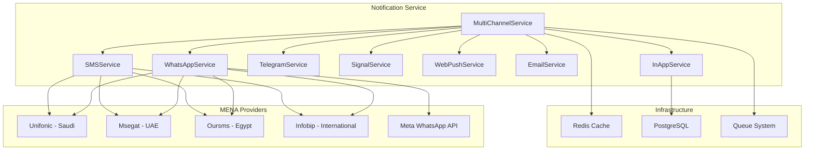
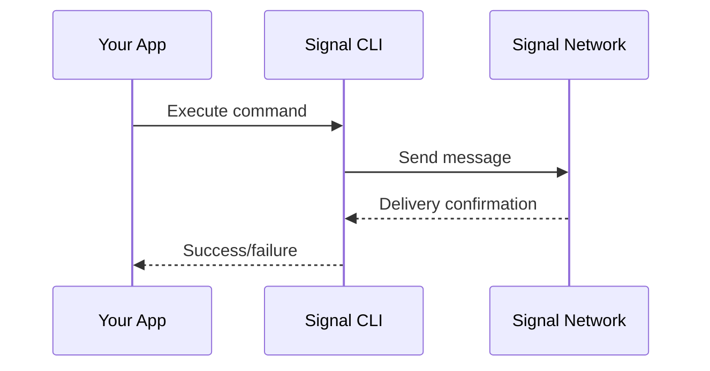
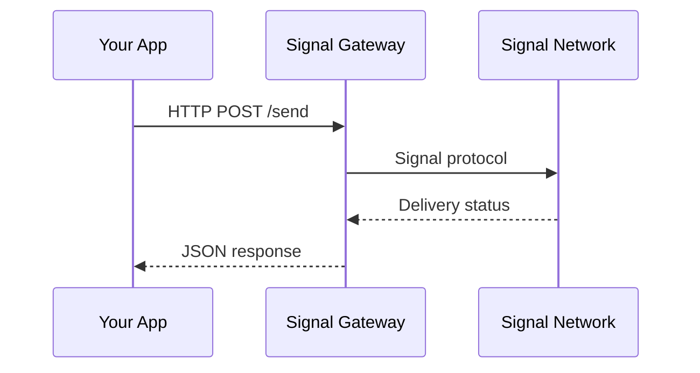
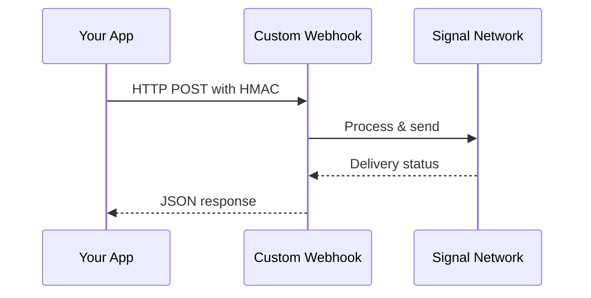

# 📱 Notification Service Documentation

## Overview

The Notification Service provides **multi-channel messaging capabilities** optimized for the MENA region, offering alternatives to Twilio with local and regional providers for better delivery rates, compliance, and cost-effectiveness.

## 🌍 **MENA-Optimized Architecture**

### Supported Channels

| Channel | Providers | Coverage | Use Cases |
|---------|-----------|----------|-----------|
| **WhatsApp** | 5 providers | Global + MENA focus | Marketing, alerts, support |
| **SMS** | 4 providers | MENA-optimized | OTP, alerts, confirmations |
| **Telegram** | Bot API | Global | Communities, notifications |
| **Signal** | 3 methods | Privacy-focused | Secure communications |
| **Email** | Laravel Mail | Global | Formal communications |
| **Web Push** | Browser API | Global | Real-time web notifications |
| **In-App** | Database + WebSocket | Platform-specific | User dashboard alerts |

## 🏗️ **Service Architecture**



## 📡 **WhatsApp Service**

### Provider Ecosystem

#### 1. **Unifonic** (Saudi-based)
- **Strengths**: Excellent GCC coverage, local compliance
- **Best for**: Saudi Arabia, Gulf states
- **API**: REST with Bearer token authentication
- **Features**: Template messaging, delivery tracking

```php
'unifonic' => [
    'api_key' => env('UNIFONIC_API_KEY'),
    'base_url' => 'https://api.unifonic.com',
    'sender_id' => env('UNIFONIC_SENDER_ID'),
]
```

#### 2. **Msegat** (UAE-based)
- **Strengths**: Strong Gulf presence, competitive pricing
- **Best for**: UAE, Gulf region
- **API**: REST with username/API key
- **Features**: UTF-8 encoding, message tracking

```php
'msegat' => [
    'username' => env('MSEGAT_USERNAME'),
    'api_key' => env('MSEGAT_API_KEY'),
    'base_url' => 'https://www.msegat.com',
    'sender' => env('MSEGAT_SENDER'),
]
```

#### 3. **Oursms** (Egypt-based)
- **Strengths**: North Africa focus, local expertise
- **Best for**: Egypt, North Africa
- **API**: REST with Bearer token
- **Features**: Regional optimization

```php
'oursms' => [
    'api_key' => env('OURSMS_API_KEY'),
    'base_url' => 'https://oursms.net',
    'from' => env('OURSMS_FROM'),
]
```

#### 4. **Infobip** (MENA-friendly)
- **Strengths**: Broad regional coverage, reliable
- **Best for**: Multi-country deployments
- **API**: REST with App authentication
- **Features**: Advanced templates, analytics

```php
'infobip' => [
    'api_key' => env('INFOBIP_API_KEY'),
    'base_url' => 'https://api.infobip.com',
    'from' => env('INFOBIP_WHATSAPP_FROM'),
]
```

#### 5. **Meta WhatsApp Business API**
- **Strengths**: Official API, global reach
- **Best for**: Worldwide coverage
- **API**: Graph API with access token
- **Features**: Rich messaging, webhooks

```php
'meta' => [
    'access_token' => env('META_WHATSAPP_ACCESS_TOKEN'),
    'base_url' => 'https://graph.facebook.com/v18.0',
    'phone_number_id' => env('META_WHATSAPP_PHONE_NUMBER_ID'),
]
```

### WhatsApp Usage Examples

```php
use App\Services\WhatsAppService;

$whatsapp = app(WhatsAppService::class);

// Send simple message
$result = $whatsapp->sendMessage('+966501234567', 'Hello from WhatsApp!');

// Send template message
$result = $whatsapp->sendTemplate(
    '+966501234567',
    'auction_won',
    ['item_name' => 'iPhone 15', 'amount' => '$999']
);

// Check delivery status
$status = $whatsapp->getDeliveryStatus($messageId);
```

### WhatsApp Features

- ✅ **Phone number normalization** for MENA region
- ✅ **Rate limiting** (10 messages/hour per number)
- ✅ **Template messaging** with parameters
- ✅ **Delivery tracking** (provider-dependent)
- ✅ **Automatic provider fallback**
- ✅ **Multi-language support**

## 📨 **Telegram Service**

### Bot API Integration

The Telegram service uses the official Bot API for reliable message delivery with rich features.

```php
use App\Services\TelegramService;

$telegram = app(TelegramService::class);

// Send text message
$result = $telegram->sendMessage('123456789', 'Hello from Telegram!', [
    'parse_mode' => 'HTML',
    'disable_preview' => true
]);

// Send with inline keyboard
$result = $telegram->sendMessageWithButtons('123456789', 'Choose an option:', [
    [
        ['text' => 'View Auction', 'url' => 'https://example.com/auction/123'],
        ['text' => 'Place Bid', 'callback_data' => 'bid_123']
    ]
]);

// Send photo
$result = $telegram->sendPhoto('123456789', 'https://example.com/image.jpg', 'Auction item');

// Broadcast to multiple chats
$result = $telegram->sendToMultipleChats(
    ['123456789', '987654321'],
    'Auction ending soon!'
);
```

### Telegram Features

- ✅ **Rich formatting** (HTML, Markdown)
- ✅ **Inline keyboards** with callbacks
- ✅ **File attachments** (photos, documents)
- ✅ **Webhook support** for real-time updates
- ✅ **Multi-chat broadcasting**
- ✅ **Rate limiting** (30 messages/minute per chat)
- ✅ **Entity parsing** (mentions, hashtags, URLs)

## 🔐 **Signal Service**

### Integration Methods

Signal doesn't have an official business API, so we support three integration methods:

#### Method 1: Signal CLI

Direct integration with Signal CLI installed on the server.



**Configuration**:
```php
'signal' => [
    'method' => 'cli',
    'cli_path' => '/usr/local/bin/signal-cli',
    'account' => '+1234567890', // Your Signal number
]
```

**Usage**:
```bash
# Install Signal CLI
wget https://github.com/AsamK/signal-cli/releases/download/v0.11.12/signal-cli-0.11.12-Linux.tar.gz
tar xf signal-cli-0.11.12-Linux.tar.gz -C /opt
ln -sf /opt/signal-cli-0.11.12/bin/signal-cli /usr/local/bin/

# Register account
signal-cli -a +1234567890 register
signal-cli -a +1234567890 verify VERIFICATION_CODE
```

#### Method 2: API Gateway

Third-party service that provides REST API for Signal messaging.



**Configuration**:
```php
'signal' => [
    'method' => 'api_gateway',
    'api_gateway' => [
        'url' => 'https://signal-gateway.example.com',
        'api_key' => 'your-gateway-api-key',
    ],
]
```

**Popular Gateway Solutions**:
- **signal-cli-rest-api**: Docker container with REST API
- **signald**: Signal daemon with JSON-RPC interface
- **Custom gateways**: Self-hosted solutions

#### Method 3: Webhook

Custom webhook endpoint for Signal message proxying.



**Configuration**:
```php
'signal' => [
    'method' => 'webhook',
    'webhook' => [
        'url' => 'https://your-webhook.com/signal/send',
        'secret' => 'webhook-secret-key',
    ],
]
```

### Signal Usage Examples

```php
use App\Services\SignalService;

$signal = app(SignalService::class);

// Send message
$result = $signal->sendMessage('+966501234567', 'Secure message via Signal');

// Send with attachment
$result = $signal->sendMessageWithAttachment(
    '+966501234567',
    'Here is your document',
    '/path/to/document.pdf'
);

// Send to multiple recipients
$result = $signal->sendToMultiple(
    ['+966501234567', '+971501234567'],
    'Broadcast message'
);

// Check CLI status
$status = $signal->getCliStatus();
```

### Signal Features

- ✅ **End-to-end encryption** (Signal protocol)
- ✅ **File attachments** with validation
- ✅ **Multi-recipient support**
- ✅ **Account registration** via CLI
- ✅ **Rate limiting** (20 messages/hour per number)
- ✅ **Three integration methods**

## 🔄 **Multi-Channel Orchestration**

### Smart Channel Selection

The `MultiChannelNotificationService` intelligently routes messages across channels based on:

- **Recipient availability** (phone, email, chat IDs)
- **Channel preferences** (user or system defined)
- **Provider reliability** (automatic fallback)
- **Regional optimization** (MENA-specific routing)

```php
use App\Services\MultiChannelNotificationService;

$service = app(MultiChannelNotificationService::class);

// Multi-channel notification
$result = $service->sendMultiChannelNotification([
    'notification_id' => 'auction_123_ended',
    'channels' => ['whatsapp', 'sms', 'telegram', 'email'],
    'recipient' => [
        'user_id' => 1,
        'phone' => '+966501234567',
        'email' => 'user@example.com',
        'telegram_chat_id' => '123456789'
    ],
    'title' => 'Auction Won!',
    'message' => 'Congratulations! You won the auction for iPhone 15 Pro.',
    'whatsapp_template' => 'auction_won',
    'template_parameters' => [
        'item_name' => 'iPhone 15 Pro',
        'amount' => '$999'
    ]
]);

// Auto-channel selection
$result = $service->sendWithAutoChannelSelection([
    'recipient' => [
        'phone' => '+966501234567',
        'email' => 'user@example.com'
    ],
    'preferred_channels' => ['whatsapp', 'sms'],
    'fallback_channels' => ['email'],
    'message' => 'Your bid has been placed successfully!'
]);
```

### Channel Availability Detection

```php
// Get available channels for recipient
$channels = $service->getAvailableChannels([
    'phone' => '+966501234567',
    'email' => 'user@example.com',
    'telegram_chat_id' => '123456789',
    'user_id' => 1
]);

// Returns: ['sms', 'whatsapp', 'signal', 'email', 'telegram', 'web_push', 'in_app']
```

## 🌍 **MENA Regional Optimization**

### Country-Specific Provider Recommendations

```php
// config/mena-services.php
'country_recommendations' => [
    'SA' => [ // Saudi Arabia
        'sms' => 'unifonic',
        'whatsapp' => 'unifonic',
        'priority' => ['whatsapp', 'sms', 'telegram', 'email']
    ],
    'AE' => [ // UAE
        'sms' => 'msegat',
        'whatsapp' => 'msegat',
        'priority' => ['whatsapp', 'sms', 'telegram', 'email']
    ],
    'EG' => [ // Egypt
        'sms' => 'oursms',
        'whatsapp' => 'oursms',
        'priority' => ['whatsapp', 'sms', 'telegram', 'email']
    ],
    // ... other countries
];
```

### Compliance Features

#### Data Residency
```php
'compliance' => [
    'data_residency' => [
        'SA' => 'local',    // Data must stay in Saudi Arabia
        'AE' => 'gcc',      // Data can be in GCC countries
        'EG' => 'local',    // Data must stay in Egypt
    ],
]
```

#### Opt-out Support
```php
'opt_out_keywords' => [
    'STOP', 'توقف',           // English & Arabic
    'UNSUBSCRIBE', 'إلغاء الاشتراك'
]
```

#### Sender ID Requirements
```php
'sender_id_requirements' => [
    'SA' => 'alphanumeric_only',      // Saudi regulations
    'AE' => 'alphanumeric_preferred', // UAE preferences
    'EG' => 'numeric_required',       // Egypt requirements
]
```

### Localization Support

```php
'localization' => [
    'default_language' => 'ar',
    'supported_languages' => ['ar', 'en', 'fr'],
    'rtl_languages' => ['ar', 'he', 'fa'],
    'country_languages' => [
        'SA' => 'ar', 'AE' => 'ar', 'EG' => 'ar',
        // ... other mappings
    ],
]
```

## ⚡ **Rate Limiting & Performance**

### Rate Limits by Channel

| Channel | Per Number/Chat | Per Account | Burst Limit |
|---------|----------------|-------------|-------------|
| WhatsApp | 10/hour | 100/minute | 5 |
| SMS | 20/hour | 200/minute | 10 |
| Telegram | 30/minute | 30/second | 20 |
| Signal | 20/hour | 50/minute | 5 |

### Caching Strategy

```php
// Rate limiting keys
"whatsapp_rate_limit:{phone_number}"
"telegram_rate_limit:{chat_id}"
"signal_rate_limit:{phone_number}"

// TTL: 1 hour for phone-based, 1 minute for chat-based
```

### Queue Processing

```php
// Asynchronous notification processing
dispatch(new SendNotificationJob([
    'channels' => ['whatsapp', 'sms'],
    'recipient' => $recipient,
    'message' => $message
]));
```

## 🔧 **Configuration Management**

### Environment Variables

```bash
# WhatsApp Providers
WHATSAPP_PROVIDER=unifonic
UNIFONIC_API_KEY=your_unifonic_key
UNIFONIC_SENDER_ID=YourBrand
MSEGAT_USERNAME=your_username
MSEGAT_API_KEY=your_msegat_key

# SMS Providers
SMS_PROVIDER=unifonic
UNIFONIC_SMS_API_KEY=your_sms_key
UNIFONIC_SMS_SENDER_ID=YourBrand

# Telegram
TELEGRAM_BOT_TOKEN=123456789:ABCdefGHIjklMNOpqrsTUVwxyz
TELEGRAM_WEBHOOK_URL=https://yourapp.com/telegram/webhook

# Signal
SIGNAL_METHOD=cli
SIGNAL_ACCOUNT=+1234567890
SIGNAL_CLI_PATH=/usr/local/bin/signal-cli
```

### Provider Fallback Configuration

```php
'fallbacks' => [
    'whatsapp' => [
        'primary' => 'unifonic',
        'secondary' => 'infobip',
        'tertiary' => 'meta',
    ],
    'sms' => [
        'primary' => 'unifonic',
        'secondary' => 'infobip',
        'tertiary' => 'msegat',
    ],
]
```

## 📊 **Monitoring & Analytics**

### Delivery Tracking

```php
// Track notification performance
$result = $service->sendMultiChannelNotification($data);

$analytics = [
    'notification_id' => $result['notification_id'],
    'total_channels' => $result['total_channels'],
    'success_count' => $result['success_count'],
    'failure_count' => $result['failure_count'],
    'delivery_rate' => $result['success_count'] / $result['total_channels'],
    'channels_used' => array_keys($result['channels']),
    'fallback_used' => $result['failure_count'] > 0
];
```

### Health Monitoring

```bash
# Service health endpoints
curl http://localhost:8005/api/health
curl http://localhost:8005/api/info

# Provider status checks
curl http://localhost:8005/api/providers/status
```

### Error Handling

```php
// Comprehensive error responses
[
    'success' => false,
    'error' => 'RATE_LIMITED',
    'message' => 'Rate limit exceeded for this number',
    'retry_after' => 3600, // seconds
    'provider' => 'unifonic'
]
```

## 🚀 **Best Practices**

### 1. Provider Selection
- Use **local providers** for better delivery rates
- Implement **fallback chains** for reliability
- Consider **cost optimization** per region

### 2. Rate Limiting
- Respect **provider limits** to avoid blocking
- Implement **exponential backoff** for retries
- Use **queue systems** for high-volume sending

### 3. Content Optimization
- Use **templates** for consistent messaging
- Support **multiple languages** for MENA region
- Implement **opt-out mechanisms** for compliance

### 4. Security
- Store **API keys securely** in environment variables
- Use **HMAC signatures** for webhook validation
- Implement **input validation** for all parameters

### 5. Monitoring
- Track **delivery rates** per provider
- Monitor **error patterns** for optimization
- Set up **alerts** for service degradation

## 🔍 **Troubleshooting**

### Common Issues

#### WhatsApp Template Errors
```php
// Ensure templates are approved by provider
$result = $whatsapp->sendTemplate($phone, 'unapproved_template', $params);
// Error: Template not found or not approved
```

#### Signal CLI Not Working
```bash
# Check CLI installation
which signal-cli
signal-cli --version

# Verify account registration
signal-cli -a +1234567890 listIdentities
```

#### Rate Limiting Issues
```php
// Check rate limit status
$canSend = $service->checkRateLimit($phone);
if (!$canSend) {
    // Wait or use different channel
}
```

### Debug Mode

```php
// Enable detailed logging
'debug' => env('NOTIFICATION_DEBUG', false),

// Log all API requests/responses
Log::debug('WhatsApp API Request', [
    'provider' => 'unifonic',
    'payload' => $payload,
    'response' => $response->json()
]);
```

## 📚 **API Reference**

### MultiChannelNotificationService

```php
// Send multi-channel notification
sendMultiChannelNotification(array $data): array

// Auto-select channels
sendWithAutoChannelSelection(array $data): array

// Get available channels
getAvailableChannels(array $recipient): array
```

### WhatsAppService

```php
// Send message
sendMessage(string $to, string $message, array $options = []): array

// Send template
sendTemplate(string $to, string $templateName, array $parameters = [], array $options = []): array

// Get delivery status
getDeliveryStatus(string $messageId): array
```

### TelegramService

```php
// Send message
sendMessage(string $chatId, string $message, array $options = []): array

// Send with buttons
sendMessageWithButtons(string $chatId, string $message, array $buttons, array $options = []): array

// Send photo
sendPhoto(string $chatId, string $photo, string $caption = '', array $options = []): array
```

### SignalService

```php
// Send message
sendMessage(string $to, string $message, array $options = []): array

// Send with attachment
sendMessageWithAttachment(string $to, string $message, string $attachmentPath, array $options = []): array

// Send to multiple
sendToMultiple(array $recipients, string $message, array $options = []): array
```

---

This notification service provides **enterprise-grade, MENA-optimized messaging** with comprehensive provider support, intelligent routing, and robust error handling for reliable communication across the region. 🌍
