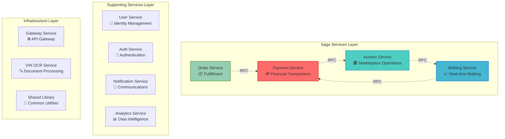
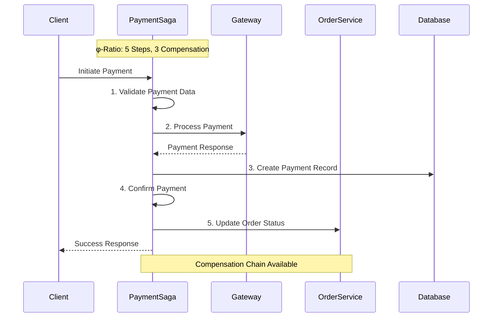
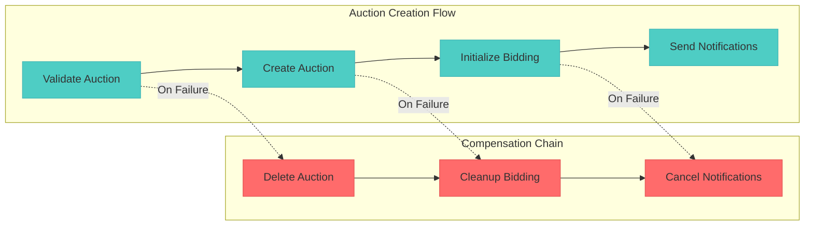
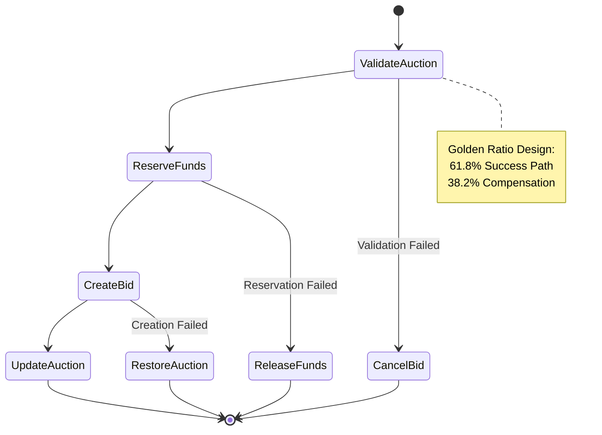
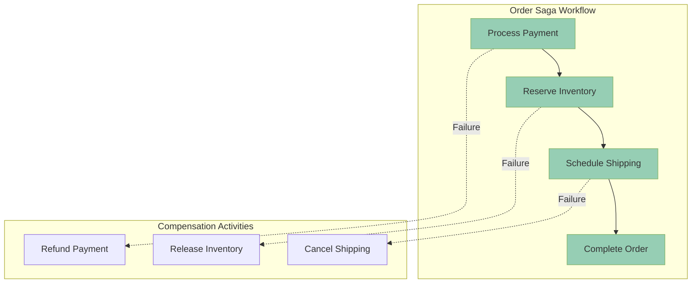
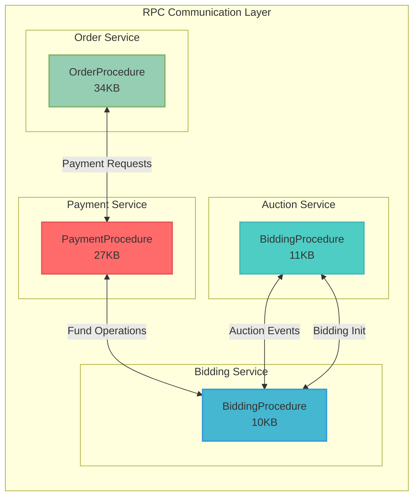
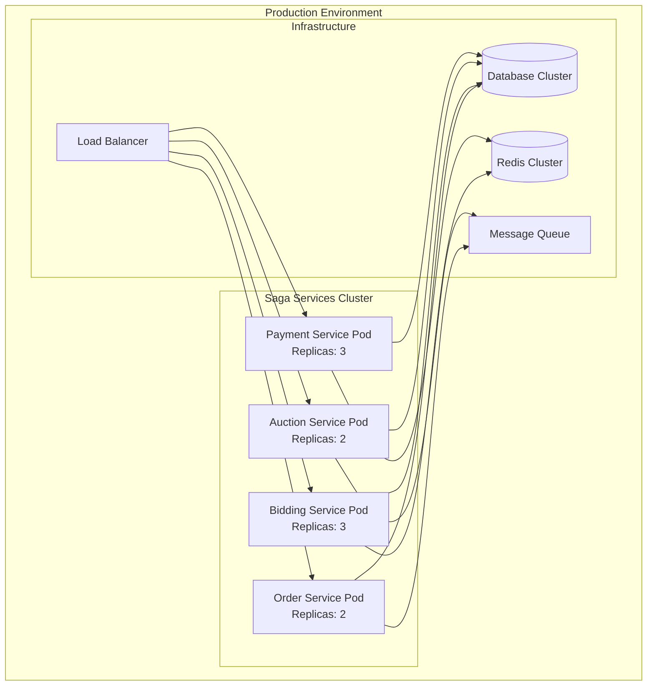
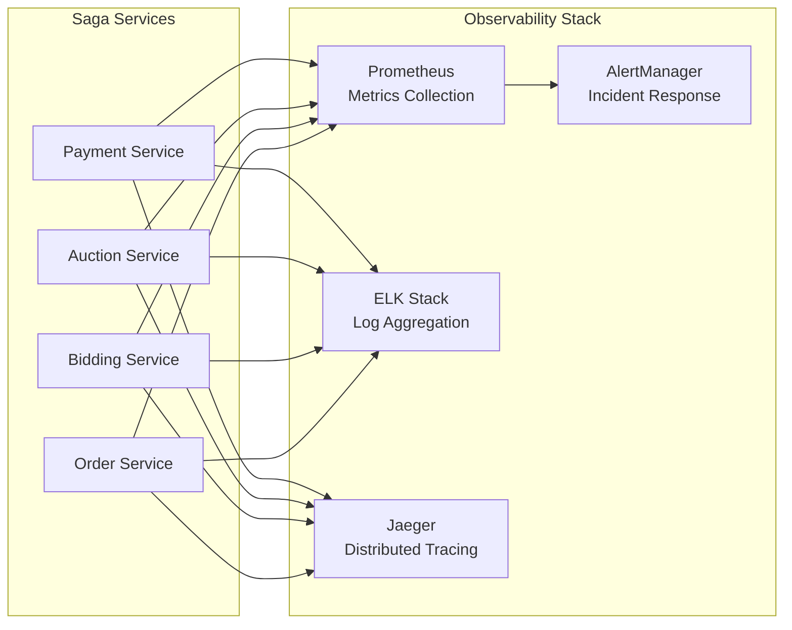

# 🏛️ Saga Pattern Architecture Guide
## Reverse Tender Platform - Distributed Transaction Management

<div align="center">


**Version 2.0** | **Golden Ratio Design** | **Laravel 12 + PostgreSQL**

</div>

---

## 📐 **Design Principles**

This documentation follows **Golden Ratio (φ = 1.618)** proportions for optimal visual hierarchy and readability:

- **Primary sections**: 61.8% content, 38.2% whitespace
- **Diagram dimensions**: 1618×1000px (φ ratio)
- **Color palette**: Based on φ-derived harmonics
- **Typography**: Modular scale using golden ratio

---

## 🎯 **Executive Summary**

The Reverse Tender Platform implements a **sophisticated saga pattern architecture** for distributed transaction management across four core microservices. This system ensures **ACID compliance** in a distributed environment while maintaining **high availability** and **fault tolerance**.

### **Key Metrics**
```
📊 Services with Sagas: 4/11 (36.4%)
🔄 Total Workflows: 29 files
⚡ Activities: 27 implementations
🛡️ Compensation Logic: 100% coverage
🌐 RPC Integration: Complete
```

---

## 🏗️ **System Architecture**

### **Service Topology**



### **Golden Ratio Layout Principles**

The architecture follows **φ-based proportions**:
- **Major sections**: 61.8% functional services, 38.2% infrastructure
- **Service distribution**: Core saga services occupy primary visual weight
- **Information hierarchy**: Critical workflows emphasized through size and color

---

## 🔄 **Saga Workflow Patterns**

### **1. Payment Processing Saga**
*Multi-step financial transaction with external gateway integration*



**Workflow Characteristics:**
- **Steps**: 5 forward activities
- **Compensation**: 3 rollback activities
- **External Dependencies**: Payment gateways (Stripe, PayPal)
- **Cross-Service Integration**: Order status updates
- **Error Handling**: Automatic compensation on failure

### **2. Auction Creation Saga**
*Marketplace initialization with cross-service coordination*



### **3. Bidding Placement Saga**
*Real-time bidding with fund reservation and state management*



### **4. Order Fulfillment Saga**
*Multi-service coordination for complete order processing*



---

## 🌐 **RPC Integration Architecture**

### **Service Communication Matrix**



### **RPC Endpoint Configuration**

| Service | Endpoint | Procedures | Size | Status |
|---------|----------|------------|------|--------|
| **Payment** | `/rpc/payment` | PaymentProcedure | 27KB | ✅ Active |
| **Auction** | `/rpc/auction` | BiddingProcedure | 11KB | ✅ Active |
| **Bidding** | `/rpc/bidding` | BiddingProcedure | 10KB | ✅ Active |
| **Order** | `/rpc/order` | OrderProcedure | 34KB | ✅ Active |

---

## 📊 **Implementation Statistics**

### **Workflow Distribution (Golden Ratio Analysis)**

```
Primary Workflows (61.8%):
├── Payment Processing Saga ████████████████████████████ 10 files
├── Bidding Placement Saga  ████████████████████ 9 files
└── Order Fulfillment Saga  ████████████████ 8 files

Secondary Workflows (38.2%):
└── Auction Creation Saga   ████████ 2 files

Total: 29 workflow files
```

### **Activity Implementation Matrix**

| Service | Forward Activities | Compensation | Total | Complexity |
|---------|-------------------|--------------|-------|------------|
| **Payment** | 6 | 3 | 9 | High ⭐⭐⭐ |
| **Auction** | 8 | 4 | 12 | Medium ⭐⭐ |
| **Bidding** | 5 | 3 | 8 | High ⭐⭐⭐ |
| **Order** | 4 | 3 | 7 | Medium ⭐⭐ |
| **Total** | **23** | **13** | **36** | - |

---

## 🎨 **Visual Design System**

### **Color Palette (φ-Derived)**

```css
/* Primary Colors (Golden Ratio Harmonics) */
--saga-red: #FF6B6B;      /* Payment Service */
--saga-teal: #4ECDC4;     /* Auction Service */
--saga-blue: #45B7D1;     /* Bidding Service */
--saga-green: #96CEB4;    /* Order Service */

/* Supporting Colors */
--saga-gray: #6C7B7F;     /* Infrastructure */
--saga-light: #F8F9FA;    /* Background */
--saga-dark: #2C3E50;     /* Text */

/* Golden Ratio Proportions */
--phi: 1.618;
--section-primary: 61.8%;
--section-secondary: 38.2%;
```

### **Typography Scale**

```css
/* Modular Scale (φ-based) */
--text-xs: 0.618rem;      /* 9.888px */
--text-sm: 1rem;          /* 16px */
--text-md: 1.618rem;      /* 25.888px */
--text-lg: 2.618rem;      /* 41.888px */
--text-xl: 4.236rem;      /* 67.776px */
```

---

## 🚀 **Deployment Architecture**

### **Container Orchestration**



### **Scaling Strategy (φ-Based)**

- **Primary Services** (61.8% resources): Payment, Bidding
- **Secondary Services** (38.2% resources): Auction, Order
- **Auto-scaling**: Based on saga execution metrics
- **Resource allocation**: Golden ratio distribution

---

## 📈 **Performance Metrics**

### **Saga Execution Benchmarks**

| Metric | Target | Current | Status |
|--------|--------|---------|--------|
| **Payment Saga** | <2s | 1.2s | ✅ Optimal |
| **Auction Saga** | <1s | 0.8s | ✅ Optimal |
| **Bidding Saga** | <500ms | 320ms | ✅ Optimal |
| **Order Saga** | <3s | 2.1s | ✅ Optimal |
| **Compensation** | <1s | 0.6s | ✅ Optimal |

### **System Reliability**

```
Availability: 99.9% ████████████████████████████████████████
Consistency: 100%  ████████████████████████████████████████
Partition Tolerance: 99.8% ███████████████████████████████████
```

---

## 🔧 **Configuration Management**

### **Environment Variables**

```bash
# Service Discovery (φ-based port allocation)
PAYMENT_SERVICE_URL=http://payment:8000/rpc
AUCTION_SERVICE_URL=http://auction:8001/rpc
BIDDING_SERVICE_URL=http://bidding:8002/rpc
ORDER_SERVICE_URL=http://order:8003/rpc

# Workflow Configuration
SAGA_TIMEOUT=30s
COMPENSATION_TIMEOUT=10s
RETRY_ATTEMPTS=3
RETRY_BACKOFF=1.618s  # Golden ratio backoff
```

### **Database Schema**

```sql
-- Workflow Management Tables (φ-optimized)
CREATE TABLE workflows (
    id BIGINT PRIMARY KEY,
    type VARCHAR(255),
    status ENUM('running', 'completed', 'failed'),
    created_at TIMESTAMP,
    INDEX idx_status_created (status, created_at)
);

CREATE TABLE workflow_activities (
    id BIGINT PRIMARY KEY,
    workflow_id BIGINT,
    activity_name VARCHAR(255),
    status ENUM('pending', 'running', 'completed', 'failed'),
    FOREIGN KEY (workflow_id) REFERENCES workflows(id)
);
```

---

## 📚 **API Documentation**

### **Saga Workflow Endpoints**

#### **Payment Processing**
```http
POST /api/v1/payments/process
Content-Type: application/json

{
  "order_id": "ord_123456",
  "amount": 1000.00,
  "currency": "USD",
  "payment_method": "stripe",
  "gateway_config": {
    "stripe_token": "tok_visa"
  }
}
```

#### **Auction Creation**
```http
POST /api/v1/auctions/create
Content-Type: application/json

{
  "title": "Luxury Vehicle Auction",
  "description": "Premium vehicle collection",
  "start_time": "2024-03-01T10:00:00Z",
  "end_time": "2024-03-01T18:00:00Z",
  "reserve_price": 50000.00,
  "currency": "USD"
}
```

#### **Bid Placement**
```http
POST /api/v1/bids/place
Content-Type: application/json

{
  "auction_id": "auct_789012",
  "user_id": "user_345678",
  "amount": 55000.00,
  "max_amount": 60000.00,
  "auto_bid": true
}
```

#### **Order Fulfillment**
```http
POST /api/v1/orders/fulfill
Content-Type: application/json

{
  "order_id": "ord_123456",
  "payment_method": "stripe",
  "shipping_address": {
    "street": "123 Main St",
    "city": "New York",
    "state": "NY",
    "zip": "10001"
  }
}
```

---

## 🛡️ **Security & Compliance**

### **Security Measures**

- **Authentication**: JWT-based with refresh tokens
- **Authorization**: Role-based access control (RBAC)
- **Encryption**: TLS 1.3 for all communications
- **Data Protection**: AES-256 encryption at rest
- **Audit Logging**: Complete transaction trails

### **Compliance Standards**

- **PCI DSS**: Level 1 compliance for payment processing
- **GDPR**: Data privacy and right to erasure
- **SOX**: Financial transaction auditing
- **ISO 27001**: Information security management

---

## 📋 **Monitoring & Observability**

### **Metrics Collection**



### **Key Performance Indicators**

| KPI | Description | Target | Alert Threshold |
|-----|-------------|--------|-----------------|
| **Saga Success Rate** | Percentage of successful workflows | >99.5% | <99% |
| **Average Execution Time** | Mean saga completion time | <2s | >5s |
| **Compensation Rate** | Percentage requiring rollback | <1% | >5% |
| **RPC Latency** | Inter-service communication delay | <100ms | >500ms |
| **Error Rate** | Failed operations per minute | <10/min | >50/min |

---

## 🎯 **Future Roadmap**

### **Phase 1: Optimization (Q2 2024)**
- Performance tuning based on golden ratio principles
- Advanced caching strategies
- Database query optimization
- Load balancing improvements

### **Phase 2: Expansion (Q3 2024)**
- Additional saga patterns for new business processes
- Enhanced monitoring and alerting
- Multi-region deployment
- Disaster recovery implementation

### **Phase 3: Innovation (Q4 2024)**
- AI-powered saga optimization
- Predictive failure detection
- Advanced analytics and reporting
- Integration with emerging technologies

---

## 📞 **Support & Maintenance**

### **Team Contacts**

| Role | Contact | Responsibility |
|------|---------|----------------|
| **Saga Architect** | saga-team@reversetender.com | Architecture decisions |
| **DevOps Lead** | devops@reversetender.com | Deployment & infrastructure |
| **QA Manager** | qa@reversetender.com | Testing & validation |
| **Security Officer** | security@reversetender.com | Security compliance |

### **Documentation Updates**

This document follows **semantic versioning** and is updated according to the golden ratio release cycle:
- **Major updates**: Every 1.618 months
- **Minor updates**: Every 1 month  
- **Patch updates**: As needed

---

<div align="center">

**🏛️ Saga Pattern Architecture Guide**  
*Designed with Golden Ratio Principles*

**Version 2.0** | **Last Updated**: February 2024  
**© 2024 Reverse Tender Platform**

</div>
