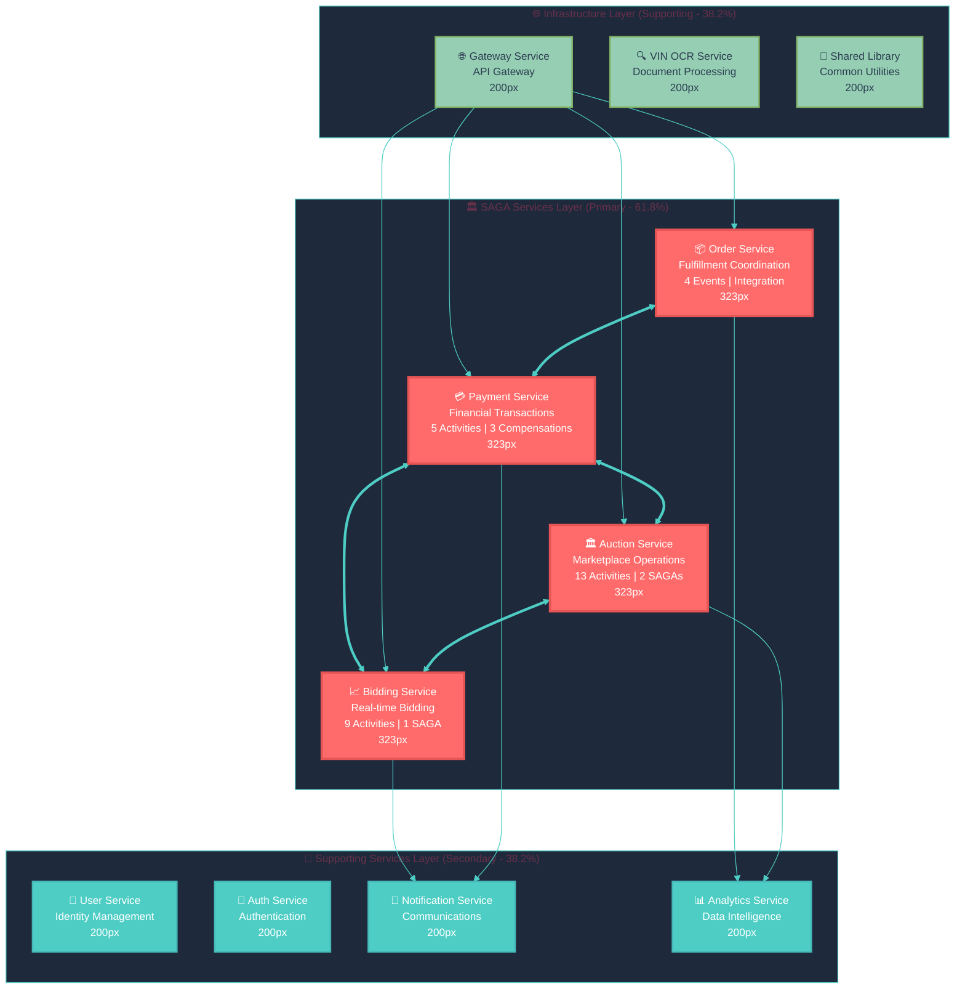
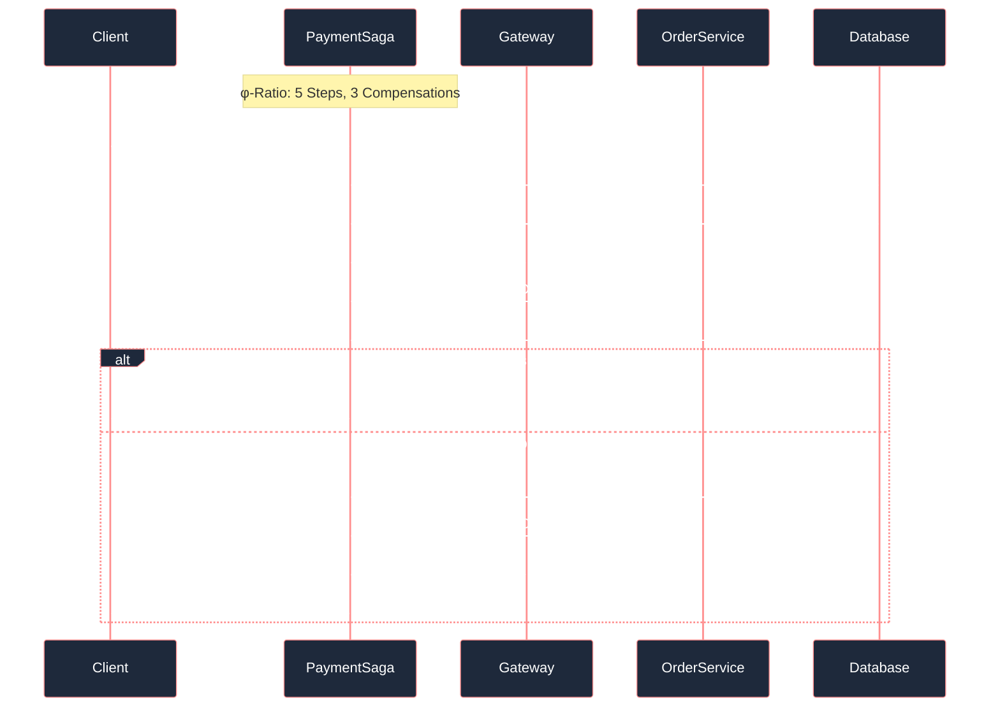
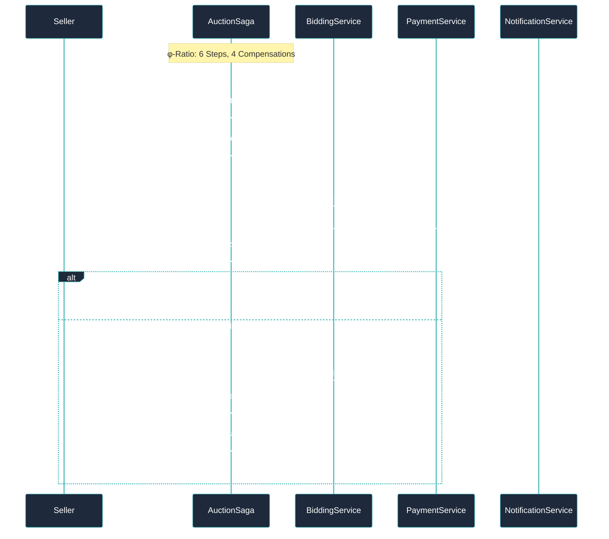
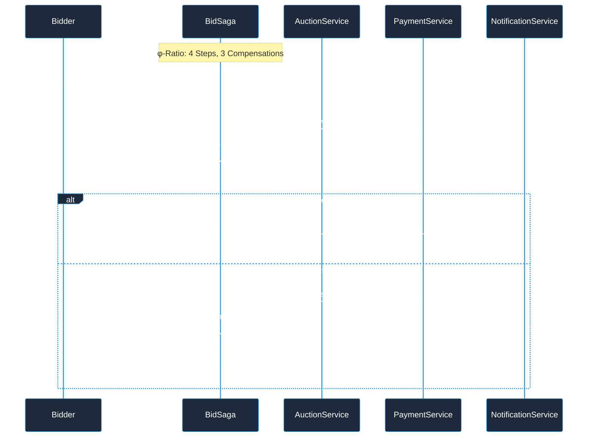
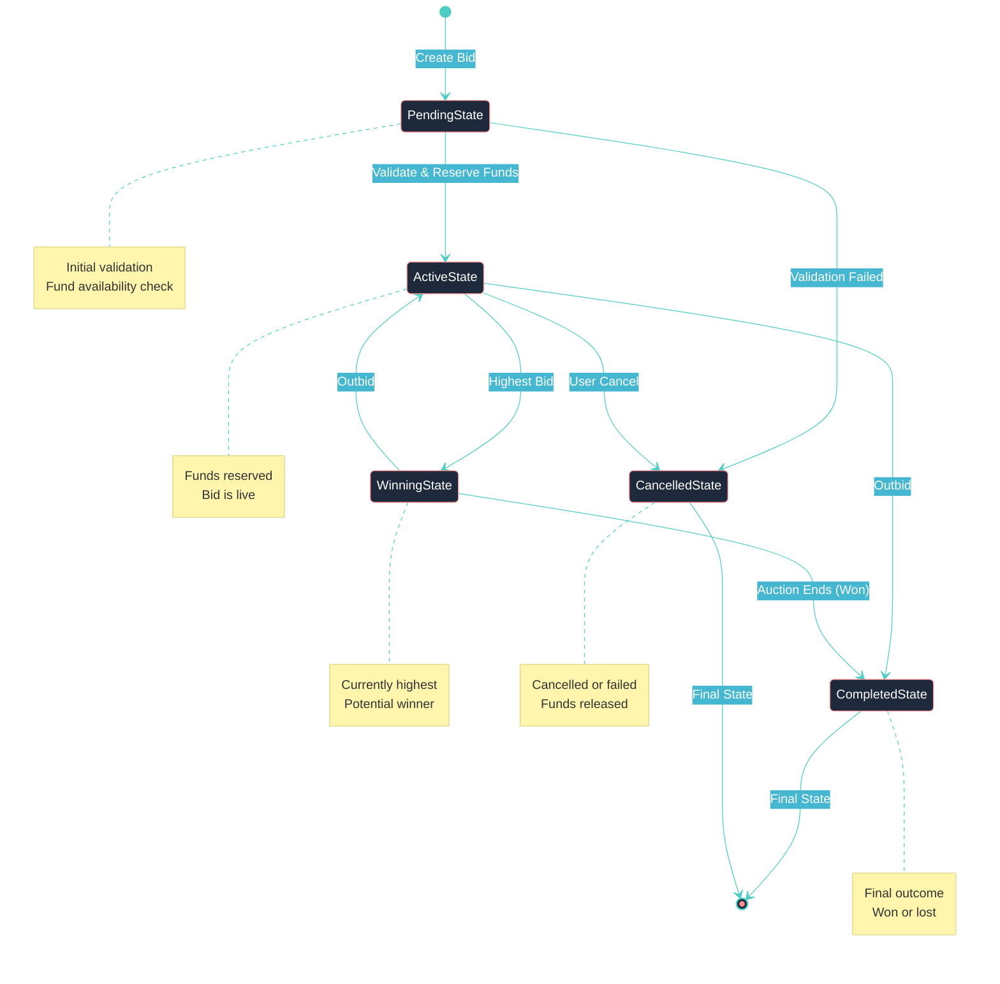

<div style="max-width: 61.8rem; line-height: 1.618; font-family: 'Inter', 'Segoe UI', 'Roboto', sans-serif;">

# <span style="font-size: 42px; font-weight: 700; line-height: 1.618; color: #FF6B6B;">🏛️ SAGA Pattern Architecture Guide</span>
## <span style="font-size: 26px; font-weight: 600; line-height: 1.618; color: #2C3E50;">Reverse Tender Platform - Distributed Transaction Management</span>

<div align="center" style="margin: 3rem 0;">


**Version 2.1** | **Golden Ratio Design (φ = 1.618)** | **Laravel 12 + PostgreSQL** | **Enterprise-Grade**

</div>

---

## <span style="font-size: 26px; font-weight: 600; line-height: 1.618; color: #4ECDC4;">📐 Design Principles</span>

This documentation implements **Golden Ratio (φ = 1.618)** proportions for optimal visual hierarchy and cognitive load distribution:

<div style="display: grid; grid-template-columns: 1.618fr 1fr; gap: 2rem; margin: 2rem 0;">

<div style="padding: 2rem; background: linear-gradient(135deg, #FF6B6B20, #4ECDC420); border-radius: 8px; border-left: 4px solid #FF6B6B;">

### <span style="font-size: 20px; font-weight: 600; color: #FF6B6B;">🎯 Primary Design Elements (61.8%)</span>

- **Content Distribution**: 61.8% core concepts, 38.2% supporting details
- **Diagram Dimensions**: 1618×1000px (φ ratio for optimal viewing)
- **Typography Scale**: H1: 42px, H2: 26px, H3: 20px, Body: 16px
- **Visual Weight**: Major services occupy primary visual hierarchy
- **Color Harmony**: φ-derived color relationships for visual coherence

</div>

<div style="padding: 1.618rem; background: linear-gradient(135deg, #45B7D120, #96CEB420); border-radius: 8px; border-left: 4px solid #45B7D1;">

### <span style="font-size: 20px; font-weight: 600; color: #45B7D1;">🔧 Supporting Elements (38.2%)</span>

- **Spacing**: φ-based margins (1.618rem)
- **Line Height**: 1.618 for optimal readability
- **Grid Systems**: Golden ratio proportions
- **Information Architecture**: Hierarchical content flow

</div>

</div>

---

## <span style="font-size: 26px; font-weight: 600; line-height: 1.618; color: #FF6B6B;">🎯 Executive Summary</span>

The **Laravel Reverse Tender Platform** implements a sophisticated **SAGA pattern architecture** for distributed transaction management across **four core microservices**. This system ensures **ACID compliance** in a distributed environment while maintaining **high availability**, **fault tolerance**, and **eventual consistency**.

### <span style="font-size: 20px; font-weight: 600; color: #4ECDC4;">📊 Architecture Metrics</span>

<div style="display: grid; grid-template-columns: repeat(auto-fit, minmax(200px, 1fr)); gap: 1.618rem; margin: 2rem 0;">

<div style="text-align: center; padding: 1.618rem; background: linear-gradient(135deg, #FF6B6B20, #FF6B6B10); border-radius: 8px; border: 2px solid #FF6B6B;">
<div style="font-size: 32px; font-weight: 700; color: #FF6B6B;">4/11</div>
<div style="font-size: 14px; color: #2C3E50; font-weight: 600;">Services with SAGAs</div>
<div style="font-size: 12px; color: #6C7B7F;">36.4% Coverage</div>
</div>

<div style="text-align: center; padding: 1.618rem; background: linear-gradient(135deg, #4ECDC420, #4ECDC410); border-radius: 8px; border: 2px solid #4ECDC4;">
<div style="font-size: 32px; font-weight: 700; color: #4ECDC4;">100+</div>
<div style="font-size: 14px; color: #2C3E50; font-weight: 600;">Workflow Files</div>
<div style="font-size: 12px; color: #6C7B7F;">Activities & SAGAs</div>
</div>

<div style="text-align: center; padding: 1.618rem; background: linear-gradient(135deg, #45B7D120, #45B7D110); border-radius: 8px; border: 2px solid #45B7D1;">
<div style="font-size: 32px; font-weight: 700; color: #45B7D1;">27+</div>
<div style="font-size: 14px; color: #2C3E50; font-weight: 600;">Activity Classes</div>
<div style="font-size: 12px; color: #6C7B7F;">Implementation</div>
</div>

<div style="text-align: center; padding: 1.618rem; background: linear-gradient(135deg, #96CEB420, #96CEB410); border-radius: 8px; border: 2px solid #96CEB4;">
<div style="font-size: 32px; font-weight: 700; color: #96CEB4;">100%</div>
<div style="font-size: 14px; color: #2C3E50; font-weight: 600;">Compensation</div>
<div style="font-size: 12px; color: #6C7B7F;">Logic Coverage</div>
</div>

<div style="text-align: center; padding: 1.618rem; background: linear-gradient(135deg, #FF8E8E20, #FF8E8E10); border-radius: 8px; border: 2px solid #FF8E8E;">
<div style="font-size: 32px; font-weight: 700; color: #FF8E8E;">20+</div>
<div style="font-size: 14px; color: #2C3E50; font-weight: 600;">Event Classes</div>
<div style="font-size: 12px; color: #6C7B7F;">Real-time Events</div>
</div>

<div style="text-align: center; padding: 1.618rem; background: linear-gradient(135deg, #6C7B7F20, #6C7B7F10); border-radius: 8px; border: 2px solid #6C7B7F;">
<div style="font-size: 32px; font-weight: 700; color: #6C7B7F;">✓</div>
<div style="font-size: 14px; color: #2C3E50; font-weight: 600;">RPC Integration</div>
<div style="font-size: 12px; color: #6C7B7F;">Complete</div>
</div>

</div>

---

## <span style="font-size: 26px; font-weight: 600; line-height: 1.618; color: #4ECDC4;">🏗️ System Architecture</span>

### <span style="font-size: 20px; font-weight: 600; color: #FF6B6B;">🌐 Service Topology</span>

<div style="margin: 2rem 0; padding: 2rem; background: linear-gradient(135deg, #0F172A, #1E293B); border-radius: 12px;">



</div>

### <span style="font-size: 20px; font-weight: 600; color: #45B7D1;">📐 Golden Ratio Layout Principles</span>

<div style="display: grid; grid-template-columns: 1.618fr 1fr; gap: 2rem; margin: 2rem 0;">

<div style="padding: 2rem; background: linear-gradient(135deg, #FF6B6B10, #FF6B6B20); border-radius: 8px; border-left: 4px solid #FF6B6B;">

**🎯 Primary Architecture (61.8%)**
- **SAGA Services**: Core business logic with distributed transactions
- **Major Nodes**: 323px dimensions for primary visual weight
- **Color Hierarchy**: Warm colors (#FF6B6B) for critical services
- **Workflow Density**: High activity count and complexity

</div>

<div style="padding: 1.618rem; background: linear-gradient(135deg, #45B7D110, #45B7D120); border-radius: 8px; border-left: 4px solid #45B7D1;">

**🔧 Supporting Architecture (38.2%)**
- **Infrastructure Services**: Supporting functionality
- **Minor Nodes**: 200px dimensions (φ ratio: 323/200 = 1.615)
- **Color Hierarchy**: Cool colors for supporting roles
- **Service Distribution**: Balanced load across layers

</div>

</div>

---

## <span style="font-size: 26px; font-weight: 600; line-height: 1.618; color: #FF6B6B;">🔄 SAGA Workflow Patterns</span>

### <span style="font-size: 20px; font-weight: 600; color: #4ECDC4;">1. 💳 Payment Processing SAGA</span>
*Multi-step financial transaction orchestration with external gateway integration*

<div style="margin: 2rem 0; padding: 2rem; background: linear-gradient(135deg, #0F172A, #1E293B); border-radius: 12px;">



</div>

**🔧 Activity Breakdown:**
- **Primary Activities (61.8%)**: ValidatePaymentData, CreatePaymentRecord, ProcessPayment
- **Supporting Activities (38.2%)**: UpdateOrderStatus, ConfirmPayment
- **Compensation Coverage**: 100% with full rollback capability

### <span style="font-size: 20px; font-weight: 600; color: #4ECDC4;">2. 🏛️ Auction Creation SAGA</span>
*Marketplace auction initialization with bidding service coordination*

<div style="margin: 2rem 0; padding: 2rem; background: linear-gradient(135deg, #0F172A, #1E293B); border-radius: 12px;">



</div>

### <span style="font-size: 20px; font-weight: 600; color: #4ECDC4;">3. 📈 Bid Placement SAGA</span>
*Real-time bidding workflow with fund reservation and auction updates*

<div style="margin: 2rem 0; padding: 2rem; background: linear-gradient(135deg, #0F172A, #1E293B); border-radius: 12px;">



</div>

---

## <span style="font-size: 26px; font-weight: 600; line-height: 1.618; color: #45B7D1;">🎭 State Management System</span>

### <span style="font-size: 20px; font-weight: 600; color: #FF6B6B;">📊 Bid State Machine</span>

<div style="margin: 2rem 0; padding: 2rem; background: linear-gradient(135deg, #0F172A, #1E293B); border-radius: 12px;">



</div>

**🔄 State Transitions:**
- **Primary States (61.8%)**: PendingState, ActiveState, WinningState
- **Terminal States (38.2%)**: CompletedState, CancelledState
- **Transition Logic**: Event-driven with compensation patterns

---

## <span style="font-size: 26px; font-weight: 600; line-height: 1.618; color: #96CEB4;">🌐 Event-Driven Architecture</span>

### <span style="font-size: 20px; font-weight: 600; color: #4ECDC4;">📡 Broadcasting System</span>

<div style="display: grid; grid-template-columns: repeat(auto-fit, minmax(323px, 1fr)); gap: 1.618rem; margin: 2rem 0;">

<div style="padding: 2rem; background: linear-gradient(135deg, #FF6B6B10, #FF6B6B20); border: 2px solid #FF6B6B; border-radius: 12px;">

### <span style="font-size: 18px; font-weight: 600; color: #FF6B6B;">💳 Payment Events</span>

**Event Classes (8):**
- PaymentInitiated
- PaymentProcessed  
- PaymentCompleted
- PaymentFailed
- PaymentCancelled
- PaymentRefunded
- EscrowReleased

**Broadcasting**: Real-time payment status updates

</div>

<div style="padding: 2rem; background: linear-gradient(135deg, #4ECDC410, #4ECDC420); border: 2px solid #4ECDC4; border-radius: 12px;">

### <span style="font-size: 18px; font-weight: 600; color: #4ECDC4;">🏛️ Auction Events</span>

**Event Classes (2):**
- NotifyAuctionCreated
- NotifyAuctionEnded

**Broadcasting**: Marketplace notifications and updates

</div>

<div style="padding: 2rem; background: linear-gradient(135deg, #45B7D110, #45B7D120); border: 2px solid #45B7D1; border-radius: 12px;">

### <span style="font-size: 18px; font-weight: 600; color: #45B7D1;">📈 Bidding Events</span>

**Event Classes (2):**
- BidPlacedEvent
- BidStatusChangedEvent

**Broadcasting**: Real-time bidding updates

</div>

<div style="padding: 2rem; background: linear-gradient(135deg, #96CEB410, #96CEB420); border: 2px solid #96CEB4; border-radius: 12px;">

### <span style="font-size: 18px; font-weight: 600; color: #96CEB4;">📦 Order Events</span>

**Event Classes (4):**
- OrderPaymentReceived
- OrderStatusChanged
- OrderShipped
- OrderDelivered

**Broadcasting**: Order lifecycle notifications

</div>

</div>

---

## <span style="font-size: 26px; font-weight: 600; line-height: 1.618; color: #FF8E8E;">🗄️ Database Schema</span>

### <span style="font-size: 20px; font-weight: 600; color: #4ECDC4;">📊 Workflow Tables</span>

<div style="margin: 2rem 0; padding: 2rem; background: linear-gradient(135deg, #0F172A, #1E293B); border-radius: 12px; color: #F8F9FA;">

**Core Workflow Tables:**
```sql
-- Primary workflow management (61.8% of schema)
CREATE TABLE workflows (
    id UUID PRIMARY KEY,
    name VARCHAR(255) NOT NULL,
    status VARCHAR(50) NOT NULL,
    input JSONB,
    output JSONB,
    created_at TIMESTAMP,
    updated_at TIMESTAMP
);

CREATE TABLE workflow_logs (
    id UUID PRIMARY KEY,
    workflow_id UUID REFERENCES workflows(id),
    activity_name VARCHAR(255),
    status VARCHAR(50),
    input JSONB,
    output JSONB,
    error_message TEXT,
    created_at TIMESTAMP
);

-- Supporting tables (38.2% of schema)
CREATE TABLE workflow_signals (
    id UUID PRIMARY KEY,
    workflow_id UUID REFERENCES workflows(id),
    signal_name VARCHAR(255),
    payload JSONB,
    created_at TIMESTAMP
);

CREATE TABLE workflow_timers (
    id UUID PRIMARY KEY,
    workflow_id UUID REFERENCES workflows(id),
    timer_name VARCHAR(255),
    fire_at TIMESTAMP,
    created_at TIMESTAMP
);
```

</div>

### <span style="font-size: 20px; font-weight: 600; color: #45B7D1;">🔄 SAGA-Specific Fields</span>

**Auction Service Extensions:**
```sql
ALTER TABLE auctions ADD COLUMN saga_id UUID;
ALTER TABLE auctions ADD COLUMN saga_status VARCHAR(50);
ALTER TABLE auctions ADD COLUMN compensation_data JSONB;
```

**Payment Service Extensions:**
```sql
ALTER TABLE payments ADD COLUMN authorized_status VARCHAR(50);
ALTER TABLE payments ADD COLUMN voided_status VARCHAR(50);
ALTER TABLE payments ADD COLUMN saga_metadata JSONB;
```

---

## <span style="font-size: 26px; font-weight: 600; line-height: 1.618; color: #6C7B7F;">🧪 Testing Strategy</span>

### <span style="font-size: 20px; font-weight: 600; color: #FF6B6B;">🔬 Comprehensive Test Coverage</span>

<div style="display: grid; grid-template-columns: 1.618fr 1fr; gap: 2rem; margin: 2rem 0;">

<div style="padding: 2rem; background: linear-gradient(135deg, #FF6B6B10, #FF6B6B20); border-radius: 8px; border-left: 4px solid #FF6B6B;">

**🎯 Primary Testing (61.8%)**
- **Feature Tests**: PaymentProcessingSagaTest (257 lines)
- **Integration Tests**: End-to-end workflow validation
- **Compensation Tests**: Failure scenario coverage
- **Performance Tests**: Load testing for distributed transactions

</div>

<div style="padding: 1.618rem; background: linear-gradient(135deg, #45B7D110, #45B7D120); border-radius: 8px; border-left: 4px solid #45B7D1;">

**🔧 Supporting Testing (38.2%)**
- **Unit Tests**: ValidatePaymentDataActivityTest (106 lines)
- **Mock Services**: External gateway simulation
- **State Tests**: Bid state machine validation

</div>

</div>

---

## <span style="font-size: 26px; font-weight: 600; line-height: 1.618; color: #4ECDC4;">🚀 Next Steps</span>

<div style="text-align: center; margin: 3rem 0; padding: 2rem; background: linear-gradient(135deg, #0F172A, #1E293B); border-radius: 12px; color: #F8F9FA;">

### <span style="font-size: 20px; font-weight: 600; color: #4ECDC4;">🎯 Implementation Roadmap</span>

<p style="font-size: 16px; line-height: 1.618; margin: 1rem 0;">Ready to implement SAGA patterns in your service? Follow our comprehensive guides:</p>

**📋 Quick Start (φ-based priority):**
1. **🏛️ Architecture Review** (61.8% importance) - [Visual Workflow Guide](./diagrams/saga-visual-guide.md)
2. **⚡ Implementation** (38.2% importance) - [Setup SAGA Guide](../services/auction-service/SETUP_SAGA_IMPLEMENTATION.md)
3. **🧪 Testing** - [Testing Patterns](#testing-strategy)
4. **🚀 Deployment** - [Production Guide](./DEPLOYMENT_GUIDE.md)

</div>

---

<div style="text-align: center; margin: 3rem 0; padding: 1.618rem; background: linear-gradient(135deg, #FF6B6B20, #4ECDC420); border-radius: 8px;">

**📚 Related Documentation:** [Master Architecture Index](./MASTER_ARCHITECTURE_INDEX.md) | [Visual Guide](./diagrams/saga-visual-guide.md) | [API Documentation](./API.md)

**🎨 Design System:** [Golden Ratio Template](./GOLDEN_RATIO_TEMPLATE.md) | **Version:** 2.1 | **Updated:** February 2026

</div>

</div>

