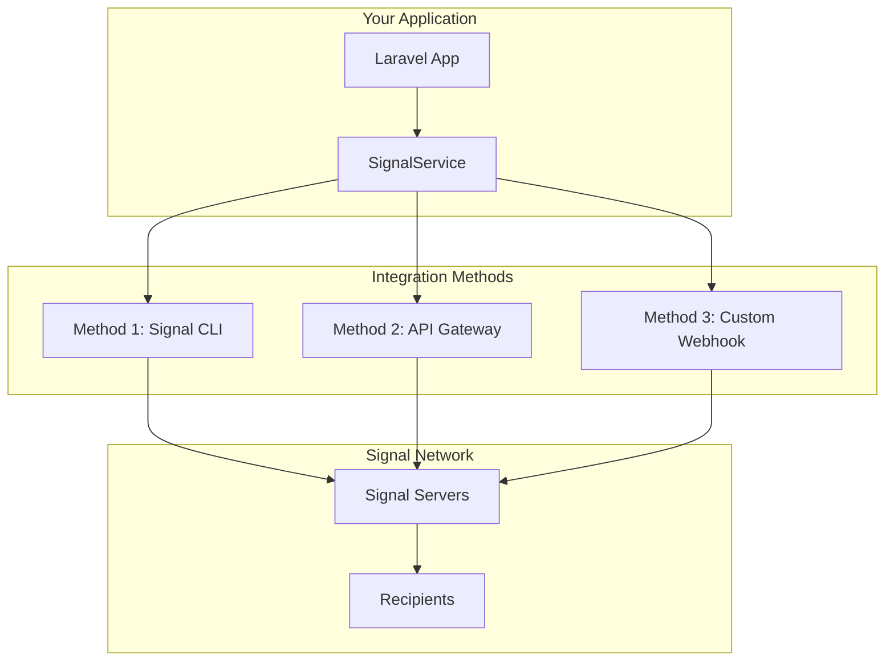
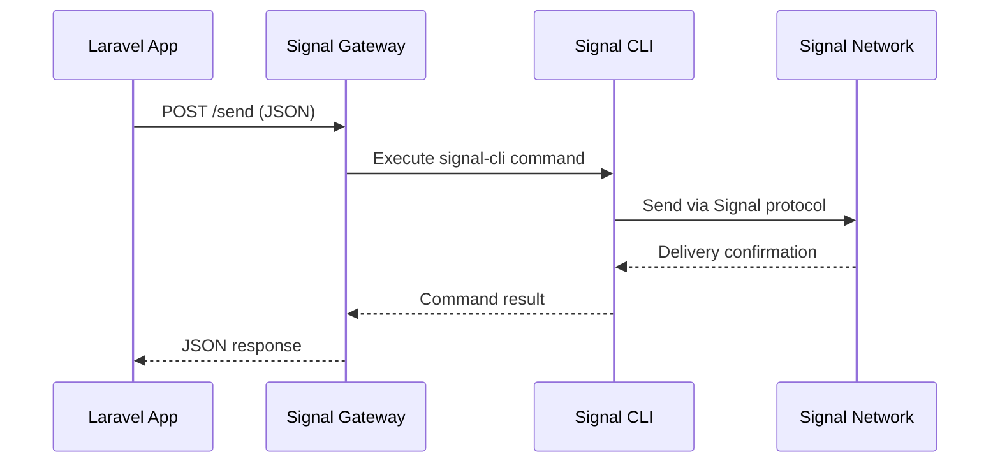
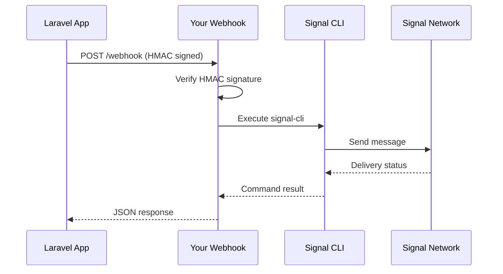

# 🔐 Signal Integration Guide

## Overview

Signal is a privacy-focused messaging platform that uses end-to-end encryption. Unlike WhatsApp or Telegram, Signal doesn't provide an official business API, so we've implemented **three different integration methods** to enable Signal messaging in your application.

## 🏗️ **Integration Architecture**



## 🔧 **Method 1: Signal CLI**

### Overview
Direct integration with the official Signal CLI tool installed on your server.

### Pros & Cons
✅ **Pros**:
- Official Signal client
- Full feature support
- No third-party dependencies
- Free to use

❌ **Cons**:
- Requires server access
- Manual account setup
- Process-based execution
- Limited scalability

### Installation

#### 1. Download Signal CLI
```bash
# Download latest release
wget https://github.com/AsamK/signal-cli/releases/download/v0.11.12/signal-cli-0.11.12-Linux.tar.gz

# Extract to /opt
sudo tar xf signal-cli-0.11.12-Linux.tar.gz -C /opt

# Create symlink
sudo ln -sf /opt/signal-cli-0.11.12/bin/signal-cli /usr/local/bin/signal-cli

# Verify installation
signal-cli --version
```

#### 2. Register Signal Account
```bash
# Start registration (replace with your phone number)
signal-cli -a +1234567890 register

# You'll receive an SMS with verification code
# Verify with the code
signal-cli -a +1234567890 verify 123456

# Test the account
signal-cli -a +1234567890 listIdentities
```

#### 3. Configure Laravel
```php
// config/services.php or config/mena-services.php
'signal' => [
    'method' => 'cli',
    'cli_path' => '/usr/local/bin/signal-cli',
    'account' => '+1234567890', // Your registered number
    'max_attachment_size' => 104857600, // 100MB
]
```

### Usage Examples

```php
use App\Services\SignalService;

$signal = app(SignalService::class);

// Send simple message
$result = $signal->sendMessage('+966501234567', 'Hello from Signal CLI!');

// Send with attachment
$result = $signal->sendMessageWithAttachment(
    '+966501234567',
    'Here is your document',
    '/path/to/document.pdf'
);

// Check CLI status
$status = $signal->getCliStatus();
if ($status['success']) {
    echo "CLI Version: " . $status['cli_version'];
    echo "Account: " . $status['account'];
}
```

### CLI Command Examples

```bash
# Send message directly via CLI
signal-cli -a +1234567890 send -m "Hello World" +966501234567

# Send with attachment
signal-cli -a +1234567890 send -m "Document attached" -a /path/to/file.pdf +966501234567

# Send to multiple recipients
signal-cli -a +1234567890 send -m "Broadcast message" +966501234567 +971501234567

# List contacts
signal-cli -a +1234567890 listContacts

# Receive messages (daemon mode)
signal-cli -a +1234567890 daemon
```

## 🌐 **Method 2: API Gateway**

### Overview
Third-party services that provide REST API interfaces for Signal messaging.

### Pros & Cons
✅ **Pros**:
- HTTP REST API
- Easy integration
- Scalable
- No server CLI setup

❌ **Cons**:
- Third-party dependency
- Potential costs
- Security considerations
- Limited providers

### Popular Gateway Solutions

#### 1. signal-cli-rest-api
Docker container that wraps Signal CLI with REST API.

```bash
# Run with Docker
docker run -d \
  --name signal-api \
  -p 8080:8080 \
  -v signal-cli-config:/home/.local/share/signal-cli \
  bbernhard/signal-cli-rest-api:latest

# Register account via API
curl -X POST "http://localhost:8080/v1/register/+1234567890"

# Verify account
curl -X POST "http://localhost:8080/v1/register/+1234567890/verify/123456"

# Send message
curl -X POST "http://localhost:8080/v2/send" \
  -H "Content-Type: application/json" \
  -d '{
    "message": "Hello from API Gateway!",
    "number": "+1234567890",
    "recipients": ["+966501234567"]
  }'
```

#### 2. signald
Signal daemon with JSON-RPC interface.

```bash
# Install signald
sudo apt install signald

# Configure and start
sudo systemctl enable signald
sudo systemctl start signald

# Connect via Unix socket
echo '{"type": "send", "username": "+1234567890", "recipientAddress": {"number": "+966501234567"}, "messageBody": "Hello!"}' | nc -U /var/run/signald/signald.sock
```

### Configuration

```php
'signal' => [
    'method' => 'api_gateway',
    'account' => '+1234567890',
    'api_gateway' => [
        'url' => 'http://localhost:8080', // Gateway URL
        'api_key' => 'your-api-key',      // If required
        'timeout' => 30,                  // Request timeout
    ],
]
```

### Usage Examples

```php
// Send via API Gateway
$result = $signal->sendMessage('+966501234567', 'Hello from Gateway!');

// Send with base64 attachment
$result = $signal->sendMessageWithAttachment(
    '+966501234567',
    'Document attached',
    '/path/to/document.pdf'
);

// The service automatically converts file to base64
```

### API Gateway Request Flow



## 🔗 **Method 3: Custom Webhook**

### Overview
Custom webhook endpoint that processes Signal messages through your own infrastructure.

### Pros & Cons
✅ **Pros**:
- Full control
- Custom logic
- Secure (HMAC signatures)
- Flexible implementation

❌ **Cons**:
- Requires custom development
- Maintenance overhead
- Complex setup

### Webhook Implementation

#### 1. Create Webhook Endpoint
```php
// routes/api.php
Route::post('/signal/webhook', [SignalWebhookController::class, 'handle']);

// app/Http/Controllers/SignalWebhookController.php
class SignalWebhookController extends Controller
{
    public function handle(Request $request)
    {
        // Verify HMAC signature
        $signature = $request->header('X-Signal-Signature');
        $payload = $request->getContent();
        $secret = config('services.signal.webhook.secret');
        
        $expectedSignature = 'sha256=' . hash_hmac('sha256', $payload, $secret);
        
        if (!hash_equals($signature, $expectedSignature)) {
            return response()->json(['error' => 'Invalid signature'], 401);
        }
        
        // Process Signal message
        $data = $request->json()->all();
        $result = $this->processSignalMessage($data);
        
        return response()->json($result);
    }
    
    private function processSignalMessage(array $data): array
    {
        // Your custom Signal processing logic
        $to = $data['to'];
        $message = $data['message'];
        
        // Execute Signal CLI or other method
        $command = [
            '/usr/local/bin/signal-cli',
            '-a', config('services.signal.account'),
            'send',
            '-m', $message,
            $to
        ];
        
        $result = Process::run(implode(' ', array_map('escapeshellarg', $command)));
        
        return [
            'success' => $result->successful(),
            'message_id' => uniqid('signal_webhook_'),
            'timestamp' => time()
        ];
    }
}
```

#### 2. Configure Webhook
```php
'signal' => [
    'method' => 'webhook',
    'account' => '+1234567890',
    'webhook' => [
        'url' => 'https://yourapp.com/api/signal/webhook',
        'secret' => 'your-webhook-secret-key',
        'timeout' => 30,
    ],
]
```

#### 3. Usage Examples
```php
// Send via webhook
$result = $signal->sendMessage('+966501234567', 'Hello from Webhook!');

// The service sends HMAC-signed request to your webhook
```

### Webhook Request Flow



## 🔄 **Method Comparison**

| Feature | CLI | API Gateway | Webhook |
|---------|-----|-------------|---------|
| **Setup Complexity** | Medium | Low | High |
| **Scalability** | Low | High | Medium |
| **Control** | High | Medium | High |
| **Dependencies** | Signal CLI | Third-party | Custom code |
| **Cost** | Free | Varies | Development time |
| **Security** | High | Medium | High |
| **Maintenance** | Low | Low | High |

## 🛠️ **Configuration Examples**

### Environment Variables
```bash
# Signal Configuration
SIGNAL_METHOD=cli                           # cli, api_gateway, webhook
SIGNAL_ACCOUNT=+1234567890                 # Your Signal number
SIGNAL_CLI_PATH=/usr/local/bin/signal-cli  # CLI path

# API Gateway (if using)
SIGNAL_API_GATEWAY_URL=http://localhost:8080
SIGNAL_API_GATEWAY_KEY=your-api-key

# Webhook (if using)
SIGNAL_WEBHOOK_URL=https://yourapp.com/api/signal/webhook
SIGNAL_WEBHOOK_SECRET=your-webhook-secret

# General Settings
SIGNAL_MAX_ATTACHMENT_SIZE=104857600       # 100MB
```

### Complete Configuration
```php
// config/mena-services.php
'signal' => [
    'method' => env('SIGNAL_METHOD', 'cli'),
    'account' => env('SIGNAL_ACCOUNT'),
    'cli_path' => env('SIGNAL_CLI_PATH', '/usr/local/bin/signal-cli'),
    'max_attachment_size' => env('SIGNAL_MAX_ATTACHMENT_SIZE', 104857600),
    
    // API Gateway configuration
    'api_gateway' => [
        'url' => env('SIGNAL_API_GATEWAY_URL'),
        'api_key' => env('SIGNAL_API_GATEWAY_KEY'),
        'timeout' => 30,
    ],
    
    // Webhook configuration
    'webhook' => [
        'url' => env('SIGNAL_WEBHOOK_URL'),
        'secret' => env('SIGNAL_WEBHOOK_SECRET'),
        'timeout' => 30,
    ],
],
```

## 📊 **Usage Statistics & Monitoring**

### Service Health Check
```php
// Check Signal service status
$status = $signal->getCliStatus();

if ($status['success']) {
    echo "✅ Signal CLI is working";
    echo "Version: " . $status['cli_version'];
    echo "Account: " . $status['account'];
} else {
    echo "❌ Signal CLI issue: " . $status['message'];
}
```

### Rate Limiting
```php
// Signal has stricter rate limits
'rate_limits' => [
    'signal' => [
        'per_number_per_hour' => 20,    // Conservative limit
        'per_account_per_minute' => 50, // Account-wide limit
        'burst_limit' => 5,             // Burst protection
    ],
]
```

### Error Handling
```php
// Common Signal errors and handling
$result = $signal->sendMessage($phone, $message);

if (!$result['success']) {
    switch ($result['error']) {
        case 'CLI_NOT_AVAILABLE':
            // Signal CLI not installed or not in PATH
            Log::error('Signal CLI not found');
            break;
            
        case 'ACCOUNT_NOT_CONFIGURED':
            // Signal account not registered
            Log::error('Signal account not registered');
            break;
            
        case 'RATE_LIMITED':
            // Too many messages sent
            Log::warning('Signal rate limit exceeded');
            break;
            
        case 'ATTACHMENT_TOO_LARGE':
            // File size exceeds limit
            Log::warning('Signal attachment too large');
            break;
    }
}
```

## 🔍 **Troubleshooting**

### Common Issues

#### 1. CLI Not Found
```bash
# Check if Signal CLI is installed
which signal-cli
# Should return: /usr/local/bin/signal-cli

# If not found, reinstall
wget https://github.com/AsamK/signal-cli/releases/latest/download/signal-cli-*-Linux.tar.gz
```

#### 2. Account Not Registered
```bash
# Check account status
signal-cli -a +1234567890 listIdentities

# If empty, re-register
signal-cli -a +1234567890 register
signal-cli -a +1234567890 verify VERIFICATION_CODE
```

#### 3. Permission Issues
```bash
# Ensure proper permissions
sudo chown -R www-data:www-data /home/.local/share/signal-cli
sudo chmod -R 755 /home/.local/share/signal-cli
```

#### 4. API Gateway Connection
```bash
# Test gateway connectivity
curl -X GET "http://localhost:8080/v1/about"

# Check gateway logs
docker logs signal-api
```

### Debug Mode
```php
// Enable Signal debug logging
'signal' => [
    'debug' => env('SIGNAL_DEBUG', false),
    // ... other config
]

// In SignalService
if ($this->config['debug'] ?? false) {
    Log::debug('Signal CLI Command', [
        'command' => $command,
        'output' => $result->output(),
        'error' => $result->errorOutput()
    ]);
}
```

## 🚀 **Best Practices**

### 1. Security
- **Secure account registration** - Use dedicated phone number
- **Protect CLI access** - Restrict file permissions
- **HMAC webhook validation** - Always verify signatures
- **Environment variables** - Store sensitive config securely

### 2. Reliability
- **Health monitoring** - Regular CLI status checks
- **Error handling** - Graceful failure management
- **Rate limiting** - Respect Signal's limits
- **Fallback channels** - Use other channels if Signal fails

### 3. Performance
- **Async processing** - Queue Signal messages
- **Batch operations** - Group multiple recipients
- **Attachment optimization** - Compress large files
- **Connection pooling** - Reuse API gateway connections

### 4. Maintenance
- **Regular updates** - Keep Signal CLI updated
- **Log monitoring** - Track delivery rates
- **Account management** - Monitor registration status
- **Backup strategy** - Backup Signal CLI config

## 📚 **API Reference**

### SignalService Methods

```php
// Send message
sendMessage(string $to, string $message, array $options = []): array

// Send with attachment
sendMessageWithAttachment(string $to, string $message, string $attachmentPath, array $options = []): array

// Send to multiple recipients
sendToMultiple(array $recipients, string $message, array $options = []): array

// Get CLI status
getCliStatus(): array

// Register account (CLI only)
registerAccount(string $phoneNumber, array $options = []): array

// Verify registration
verifyRegistration(string $phoneNumber, string $verificationCode): array

// Validate attachment
validateAttachment(string $filePath): array

// Get supported file types
getSupportedAttachmentTypes(): array
```

### Response Format
```php
// Success response
[
    'success' => true,
    'message_id' => 'signal_abc123',
    'method' => 'cli', // or 'api_gateway', 'webhook'
    'recipient' => '+966501234567',
    'timestamp' => 1640995200
]

// Error response
[
    'success' => false,
    'error' => 'RATE_LIMITED',
    'message' => 'Rate limit exceeded for this number',
    'retry_after' => 3600
]
```

---

This comprehensive guide covers all three Signal integration methods, helping you choose and implement the best approach for your MENA-optimized notification system. 🔐
