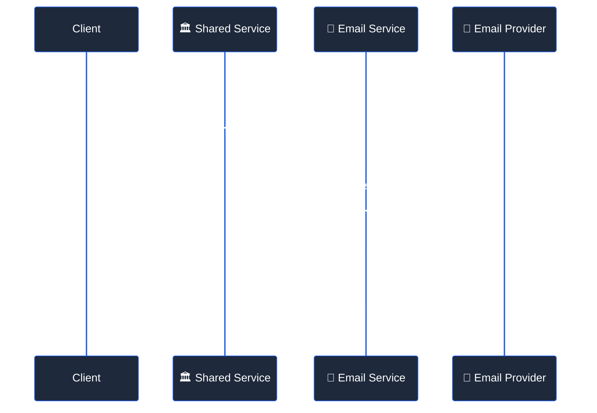
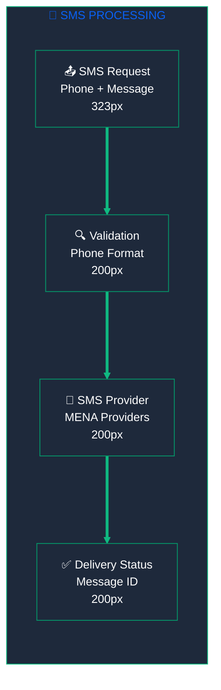
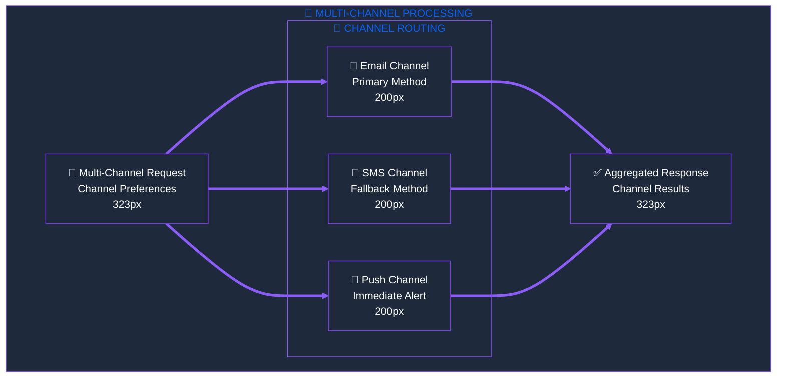

<div style="max-width: 38.2rem; line-height: 1.618; font-family: 'Inter', 'Segoe UI', 'Roboto', sans-serif;">

# <span style="font-size: 42px; font-weight: 700; line-height: 1.618;">📡 Notification Delegation Interface API</span>

<p style="font-size: 16px; line-height: 1.618; margin-bottom: 2rem;">Clean, protocol-agnostic API for notification operations, implementing a <strong>pure delegation pattern</strong> with comprehensive error handling and distributed tracing support.</p>

## <span style="font-size: 26px; font-weight: 600; line-height: 1.618;">🎯 Interface Definition</span>

<!-- 62% MAJOR CONCEPTS: Core Interface -->
<div style="margin-bottom: 3rem;">

### <span style="font-size: 20px; font-weight: 600; line-height: 1.618;">🏗️ Base Interface Pattern</span>

<p style="font-size: 16px; line-height: 1.618;"><strong>Consistent Signature:</strong> All notification methods follow a unified signature pattern for predictable integration.</p>

```php
public function methodName(array $params, array $context = []): array
```

<div style="margin-top: 1rem; padding: 1rem; background: #F0FDF4; border-left: 4px solid #10B981; border-radius: 4px;">
<p style="font-size: 16px; line-height: 1.618; margin: 0;"><strong>📋 Parameters:</strong></p>
<ul style="font-size: 16px; line-height: 1.618; margin: 0.5rem 0;">
<li><strong>$params</strong> (array): Method-specific parameters for the notification operation</li>
<li><strong>$context</strong> (array, optional): Request context including trace information and metadata</li>
</ul>
</div>

### <span style="font-size: 20px; font-weight: 600; line-height: 1.618;">📊 Response Structure</span>

<p style="font-size: 16px; line-height: 1.618;"><strong>Standardized Response:</strong> All methods return a consistent response structure for reliable error handling.</p>

```php
[
    'success' => true|false,
    'data' => [...],           // Method-specific response data
    'error' => [...],          // Error details (if success = false)
    'trace_id' => 'uuid',      // Distributed tracing identifier
    'execution_time' => 0.123  // Method execution time in seconds
]
```

</div>

## <span style="font-size: 26px; font-weight: 600; line-height: 1.618;">📧 Email Notification Methods</span>

### <span style="font-size: 20px; font-weight: 600; line-height: 1.618;">📤 sendEmail()</span>

<p style="font-size: 16px; line-height: 1.618;"><strong>Primary Method:</strong> Send individual email notifications with template support and delivery tracking.</p>



**Method Signature:**
```php
public function sendEmail(array $params, array $context = []): array
```

**Parameters:**
```php
$params = [
    'to' => 'user@example.com',              // Required: Recipient email
    'subject' => 'Welcome to our platform',  // Required: Email subject
    'template' => 'welcome',                 // Required: Template name
    'data' => [                              // Required: Template data
        'user_name' => 'John Doe',
        'activation_link' => 'https://...'
    ],
    'from' => 'noreply@example.com',         // Optional: Sender email
    'reply_to' => 'support@example.com',     // Optional: Reply-to address
    'attachments' => [                       // Optional: File attachments
        ['path' => '/path/to/file.pdf', 'name' => 'document.pdf']
    ],
    'priority' => 'normal',                  // Optional: high|normal|low
    'send_at' => '2024-01-01 12:00:00'      // Optional: Scheduled send time
];
```

<!-- 38% MINOR DETAILS: Email Implementation -->
<details style="margin-bottom: 2rem;">
<summary style="font-size: 16px; font-weight: 500; cursor: pointer;">🔧 Email Implementation Details</summary>
<div style="margin-top: 1rem; padding-left: 1rem; border-left: 3px solid #4ECDC4;">

**Response Example:**
```php
[
    'success' => true,
    'data' => [
        'message_id' => 'msg_1234567890',
        'status' => 'sent',
        'recipient' => 'user@example.com',
        'sent_at' => '2024-01-01T12:00:00Z',
        'provider' => 'mailgun'
    ],
    'trace_id' => 'trace_abc123',
    'execution_time' => 0.245
]
```

**Error Codes:**
- `EMAIL_INVALID_RECIPIENT`: Invalid email address format
- `EMAIL_TEMPLATE_NOT_FOUND`: Specified template doesn't exist
- `EMAIL_TEMPLATE_RENDER_ERROR`: Template rendering failed
- `EMAIL_PROVIDER_ERROR`: Email service provider error
- `EMAIL_RATE_LIMIT_EXCEEDED`: Rate limit exceeded for recipient

**Validation Rules:**
- Email addresses must be valid RFC 5322 format
- Template must exist in the system
- Template data must contain all required variables
- Attachments must not exceed 25MB total size
- Scheduled send time must be in the future

</div>
</details>

### <span style="font-size: 20px; font-weight: 600; line-height: 1.618;">📬 sendBulkEmail()</span>

<p style="font-size: 16px; line-height: 1.618;"><strong>Bulk Operations:</strong> Send emails to multiple recipients with batch processing and progress tracking.</p>

**Method Signature:**
```php
public function sendBulkEmail(array $params, array $context = []): array
```

**Parameters:**
```php
$params = [
    'recipients' => [                        // Required: Array of recipients
        ['email' => 'user1@example.com', 'data' => ['name' => 'John']],
        ['email' => 'user2@example.com', 'data' => ['name' => 'Jane']]
    ],
    'template' => 'newsletter',              // Required: Template name
    'subject' => 'Monthly Newsletter',       // Required: Email subject
    'from' => 'newsletter@example.com',      // Optional: Sender email
    'batch_size' => 100,                     // Optional: Batch processing size
    'delay_between_batches' => 60           // Optional: Delay in seconds
];
```

## <span style="font-size: 26px; font-weight: 600; line-height: 1.618;">📱 SMS Notification Methods</span>

### <span style="font-size: 20px; font-weight: 600; line-height: 1.618;">💬 sendSms()</span>

<p style="font-size: 16px; line-height: 1.618;"><strong>SMS Delivery:</strong> Send SMS notifications with international support and delivery confirmation.</p>



**Method Signature:**
```php
public function sendSms(array $params, array $context = []): array
```

**Parameters:**
```php
$params = [
    'to' => '+1234567890',                   // Required: Phone number (E.164 format)
    'message' => 'Your verification code: 123456', // Required: SMS content
    'from' => '+1987654321',                 // Optional: Sender phone number
    'template' => 'verification_code',       // Optional: Template name
    'data' => ['code' => '123456'],         // Optional: Template data
    'priority' => 'high',                    // Optional: high|normal|low
    'send_at' => '2024-01-01 12:00:00'      // Optional: Scheduled send time
];
```

<!-- 38% MINOR DETAILS: SMS Implementation -->
<details style="margin-bottom: 2rem;">
<summary style="font-size: 16px; font-weight: 500; cursor: pointer;">🔧 SMS Implementation Details</summary>
<div style="margin-top: 1rem; padding-left: 1rem; border-left: 3px solid #4ECDC4;">

**Response Example:**
```php
[
    'success' => true,
    'data' => [
        'message_id' => 'sms_9876543210',
        'status' => 'sent',
        'recipient' => '+1234567890',
        'sent_at' => '2024-01-01T12:00:00Z',
        'provider' => 'twilio',
        'cost' => 0.0075,
        'segments' => 1
    ],
    'trace_id' => 'trace_def456',
    'execution_time' => 0.156
]
```

**Error Codes:**
- `SMS_INVALID_PHONE_NUMBER`: Invalid phone number format
- `SMS_MESSAGE_TOO_LONG`: Message exceeds character limit
- `SMS_TEMPLATE_NOT_FOUND`: Specified template doesn't exist
- `SMS_PROVIDER_ERROR`: SMS service provider error
- `SMS_INSUFFICIENT_BALANCE`: Insufficient account balance
- `SMS_RATE_LIMIT_EXCEEDED`: Rate limit exceeded for recipient

**Validation Rules:**
- Phone numbers must be in E.164 format (+1234567890)
- Message length must not exceed 1600 characters
- Template data must contain all required variables
- Scheduled send time must be in the future

</div>
</details>

## <span style="font-size: 26px; font-weight: 600; line-height: 1.618;">🔔 Push Notification Methods</span>

### <span style="font-size: 20px; font-weight: 600; line-height: 1.618;">📲 sendPushNotification()</span>

<p style="font-size: 16px; line-height: 1.618;"><strong>Push Delivery:</strong> Send push notifications to mobile devices with platform-specific customization.</p>

**Method Signature:**
```php
public function sendPushNotification(array $params, array $context = []): array
```

**Parameters:**
```php
$params = [
    'device_tokens' => ['token1', 'token2'],  // Required: Device tokens array
    'title' => 'New Message',                // Required: Notification title
    'body' => 'You have a new message',      // Required: Notification body
    'data' => [                              // Optional: Custom data payload
        'action' => 'open_chat',
        'chat_id' => '12345'
    ],
    'badge' => 1,                            // Optional: iOS badge count
    'sound' => 'default',                    // Optional: Notification sound
    'icon' => 'notification_icon',           // Optional: Android icon
    'click_action' => 'FLUTTER_NOTIFICATION_CLICK', // Optional: Click action
    'priority' => 'high',                    // Optional: high|normal
    'ttl' => 3600                           // Optional: Time to live (seconds)
];
```

## <span style="font-size: 26px; font-weight: 600; line-height: 1.618;">💬 Multi-Channel Methods</span>

### <span style="font-size: 20px; font-weight: 600; line-height: 1.618;">🔄 sendMultiChannel()</span>

<p style="font-size: 16px; line-height: 1.618;"><strong>Cross-Channel:</strong> Send notifications across multiple channels with fallback support and preference handling.</p>



**Method Signature:**
```php
public function sendMultiChannel(array $params, array $context = []): array
```

**Parameters:**
```php
$params = [
    'user_id' => 12345,                      // Required: User identifier
    'channels' => ['email', 'sms', 'push'], // Required: Channels to use
    'message' => [                           // Required: Channel-specific messages
        'email' => [
            'subject' => 'Important Update',
            'template' => 'update_notification',
            'data' => ['update_type' => 'security']
        ],
        'sms' => [
            'message' => 'Security update available. Check your email.',
            'template' => 'security_alert'
        ],
        'push' => [
            'title' => 'Security Update',
            'body' => 'Please review the security update'
        ]
    ],
    'fallback_strategy' => 'sequential',     // Optional: sequential|parallel
    'priority' => 'high'                     // Optional: high|normal|low
];
```

## <span style="font-size: 26px; font-weight: 600; line-height: 1.618;">📋 Template Management Methods</span>

### <span style="font-size: 20px; font-weight: 600; line-height: 1.618;">📝 processTemplate()</span>

<p style="font-size: 16px; line-height: 1.618;"><strong>Template Processing:</strong> Render notification templates with data binding and localization support.</p>

**Method Signature:**
```php
public function processTemplate(array $params, array $context = []): array
```

**Parameters:**
```php
$params = [
    'template' => 'welcome_email',           // Required: Template name
    'channel' => 'email',                    // Required: Channel type
    'data' => [                              // Required: Template variables
        'user_name' => 'John Doe',
        'activation_link' => 'https://...'
    ],
    'locale' => 'en',                        // Optional: Language locale
    'format' => 'html'                       // Optional: html|text|markdown
];
```

<!-- 38% MINOR DETAILS: Template Implementation -->
<details style="margin-bottom: 2rem;">
<summary style="font-size: 16px; font-weight: 500; cursor: pointer;">🔧 Template Implementation Details</summary>
<div style="margin-top: 1rem; padding-left: 1rem; border-left: 3px solid #4ECDC4;">

**Response Example:**
```php
[
    'success' => true,
    'data' => [
        'rendered_content' => '<html>Welcome John Doe...</html>',
        'template' => 'welcome_email',
        'channel' => 'email',
        'locale' => 'en',
        'variables_used' => ['user_name', 'activation_link'],
        'render_time' => 0.023
    ],
    'trace_id' => 'trace_ghi789',
    'execution_time' => 0.045
]
```

**Template Structure:**
```
templates/
├── en/
│   ├── email/
│   │   ├── welcome.html
│   │   └── welcome.txt
│   ├── sms/
│   │   └── welcome.txt
│   └── push/
│       └── welcome.json
└── es/
    ├── email/
    │   ├── welcome.html
    │   └── welcome.txt
    └── ...
```

**Error Codes:**
- `TEMPLATE_NOT_FOUND`: Template file doesn't exist
- `TEMPLATE_RENDER_ERROR`: Template rendering failed
- `TEMPLATE_MISSING_VARIABLES`: Required variables not provided
- `TEMPLATE_INVALID_SYNTAX`: Template syntax error
- `TEMPLATE_LOCALE_NOT_SUPPORTED`: Requested locale not available

</div>
</details>

## <span style="font-size: 26px; font-weight: 600; line-height: 1.618;">📊 Analytics and Tracking Methods</span>

### <span style="font-size: 20px; font-weight: 600; line-height: 1.618;">📈 getNotificationStatus()</span>

<p style="font-size: 16px; line-height: 1.618;"><strong>Status Tracking:</strong> Retrieve delivery status and analytics for sent notifications.</p>

**Method Signature:**
```php
public function getNotificationStatus(array $params, array $context = []): array
```

**Parameters:**
```php
$params = [
    'notification_id' => 'notif_123456',     // Required: Notification ID
    'include_events' => true,                // Optional: Include event timeline
    'include_metrics' => true                // Optional: Include delivery metrics
];
```

### <span style="font-size: 20px; font-weight: 600; line-height: 1.618;">📊 getDeliveryMetrics()</span>

<p style="font-size: 16px; line-height: 1.618;"><strong>Analytics:</strong> Retrieve aggregated delivery metrics and performance statistics.</p>

**Method Signature:**
```php
public function getDeliveryMetrics(array $params, array $context = []): array
```

**Parameters:**
```php
$params = [
    'date_from' => '2024-01-01',             // Required: Start date
    'date_to' => '2024-01-31',               // Required: End date
    'channels' => ['email', 'sms'],          // Optional: Filter by channels
    'group_by' => 'day',                     // Optional: day|week|month
    'metrics' => ['sent', 'delivered', 'failed'] // Optional: Specific metrics
];
```

## <span style="font-size: 26px; font-weight: 600; line-height: 1.618;">🔧 Utility Methods</span>

### <span style="font-size: 20px; font-weight: 600; line-height: 1.618;">✅ validateNotificationData()</span>

<p style="font-size: 16px; line-height: 1.618;"><strong>Data Validation:</strong> Validate notification parameters before processing.</p>

### <span style="font-size: 20px; font-weight: 600; line-height: 1.618;">🏥 healthCheck()</span>

<p style="font-size: 16px; line-height: 1.618;"><strong>Health Monitoring:</strong> Check service health and connectivity status.</p>

**Method Signature:**
```php
public function healthCheck(array $params = [], array $context = []): array
```

**Response Example:**
```php
[
    'success' => true,
    'data' => [
        'status' => 'healthy',
        'version' => '2.1.0',
        'uptime' => 86400,
        'services' => [
            'database' => 'healthy',
            'redis' => 'healthy',
            'email_provider' => 'healthy',
            'sms_provider' => 'healthy'
        ],
        'metrics' => [
            'requests_per_minute' => 150,
            'average_response_time' => 0.245,
            'error_rate' => 0.02
        ]
    ],
    'trace_id' => 'trace_health_123',
    'execution_time' => 0.012
]
```

## <span style="font-size: 26px; font-weight: 600; line-height: 1.618;">🚨 Error Handling</span>

### <span style="font-size: 20px; font-weight: 600; line-height: 1.618;">📋 Error Response Structure</span>

<p style="font-size: 16px; line-height: 1.618;"><strong>Consistent Error Format:</strong> All errors follow a standardized structure for reliable error handling.</p>

```php
[
    'success' => false,
    'data' => null,
    'error' => [
        'code' => 'EMAIL_TEMPLATE_NOT_FOUND',
        'message' => 'The specified email template was not found',
        'details' => [
            'template' => 'welcome_email',
            'channel' => 'email',
            'available_templates' => ['welcome', 'reset_password']
        ],
        'retry_after' => null,               // Seconds to wait before retry (if applicable)
        'documentation_url' => 'https://docs.example.com/errors/EMAIL_TEMPLATE_NOT_FOUND'
    ],
    'trace_id' => 'trace_error_456',
    'execution_time' => 0.089
]
```

### <span style="font-size: 20px; font-weight: 600; line-height: 1.618;">🔍 Error Categories</span>

**Validation Errors (4xx):**
- `INVALID_PARAMETERS`: Missing or invalid parameters
- `TEMPLATE_NOT_FOUND`: Specified template doesn't exist
- `INVALID_EMAIL_ADDRESS`: Email address format invalid
- `INVALID_PHONE_NUMBER`: Phone number format invalid

**Service Errors (5xx):**
- `PROVIDER_ERROR`: External service provider error
- `RATE_LIMIT_EXCEEDED`: Rate limit exceeded
- `INSUFFICIENT_BALANCE`: Account balance insufficient
- `SERVICE_UNAVAILABLE`: Service temporarily unavailable

**System Errors (5xx):**
- `DATABASE_ERROR`: Database connection or query error
- `TEMPLATE_RENDER_ERROR`: Template rendering failed
- `INTERNAL_ERROR`: Unexpected internal error

---

<p style="text-align: center; font-size: 16px; line-height: 1.618; margin-top: 2rem;"><strong>Notification Delegation Interface API Complete</strong> - Clean, consistent, and production-ready 📡</p>

</div>
<!-- End Golden Ratio Container -->
