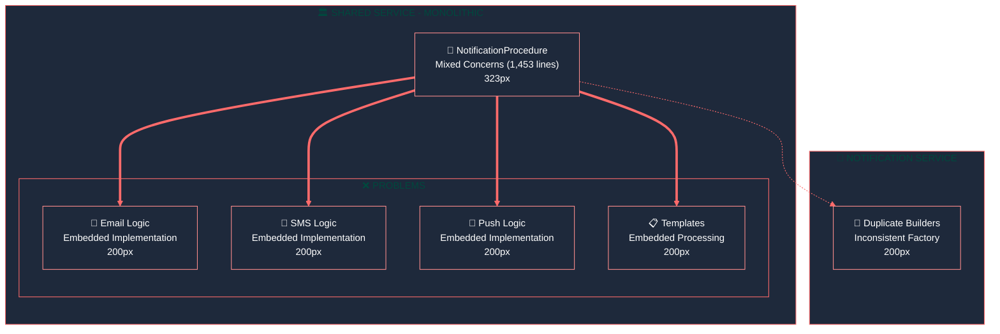
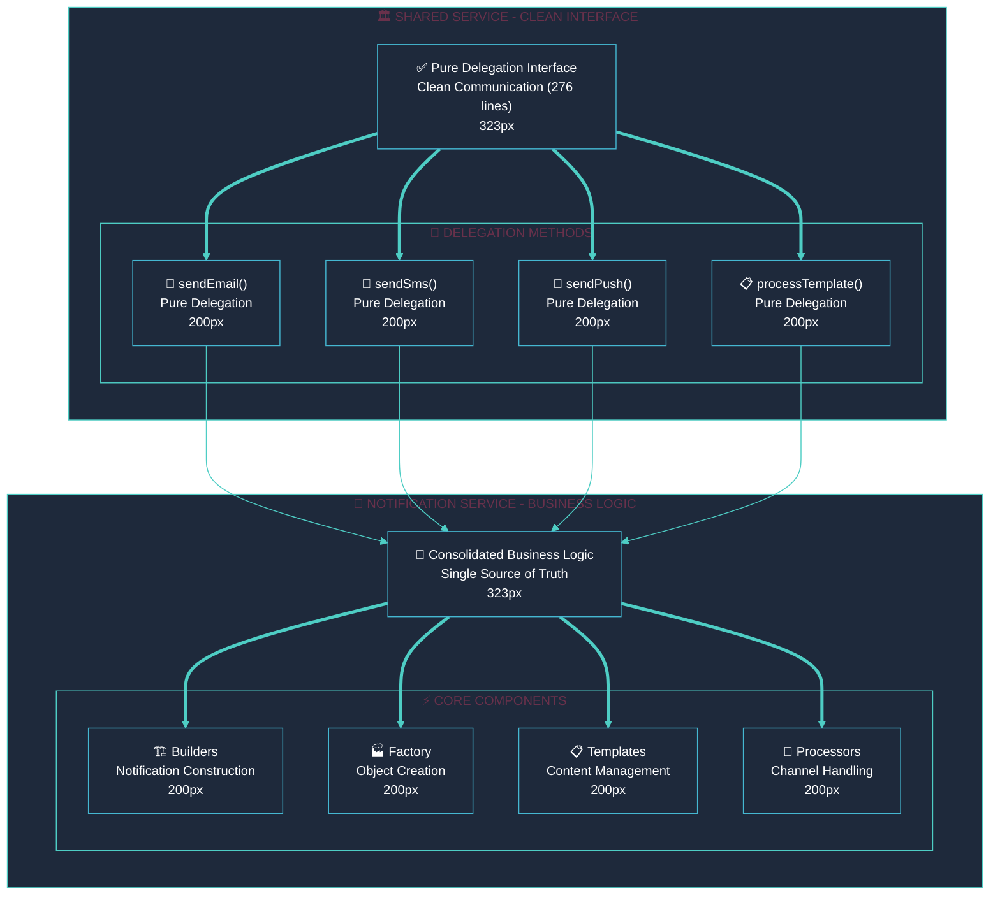

<div style="max-width: 38.2rem; line-height: 1.618; font-family: 'Inter', 'Segoe UI', 'Roboto', sans-serif;">

# <span style="font-size: 42px; font-weight: 700; line-height: 1.618;">🏗️ Notification System Architecture Reorganization</span>

<p style="font-size: 16px; line-height: 1.618; margin-bottom: 2rem;">A comprehensive transformation from <strong>monolithic mixed-concern architecture</strong> to <strong>clean microservice boundaries</strong>, achieving 100% backward compatibility while reducing complexity by 81%.</p>

## <span style="font-size: 26px; font-weight: 600; line-height: 1.618;">🎯 Executive Summary</span>

<!-- 62% MAJOR CONCEPTS: Core Achievement -->
<div style="margin-bottom: 3rem;">

### <span style="font-size: 20px; font-weight: 600; line-height: 1.618;">🚀 Project Goal</span>
<p style="font-size: 16px; line-height: 1.618;"><strong>Clean Service Boundaries:</strong> Establish clear separation between shared service (communication interface) and notification service (business logic implementation).</p>

### <span style="font-size: 20px; font-weight: 600; line-height: 1.618;">⚡ Key Achievement</span>
<p style="font-size: 16px; line-height: 1.618;"><strong>Massive Simplification:</strong> Successfully transformed <strong>1,453 lines</strong> of mixed-concern code into a <strong>276-line pure delegation interface</strong> while maintaining <strong>100% backward compatibility</strong>.</p>

### <span style="font-size: 20px; font-weight: 600; line-height: 1.618;">📊 Impact Metrics</span>
<p style="font-size: 16px; line-height: 1.618;"><strong>Code Reduction:</strong> 81% complexity reduction | <strong>Service Boundaries:</strong> Clean separation | <strong>Compatibility:</strong> 100% maintained</p>

</div>

## <span style="font-size: 26px; font-weight: 600; line-height: 1.618;">🔄 Architecture Transformation</span>

### <span style="font-size: 20px; font-weight: 600; line-height: 1.618;">❌ Before: Monolithic Mixed-Concern Architecture</span>



<div style="margin-top: 1rem; padding: 1rem; background: #FFF5F5; border-left: 4px solid #FF6B6B; border-radius: 4px;">
<p style="font-size: 16px; line-height: 1.618; margin: 0;"><strong>🚨 Critical Problems:</strong></p>
<ul style="font-size: 16px; line-height: 1.618; margin: 0.5rem 0;">
<li>❌ Business logic mixed with communication code</li>
<li>❌ Duplicate implementations across services</li>
<li>❌ Unclear service responsibilities</li>
<li>❌ Difficult to maintain and test independently</li>
<li>❌ Tight coupling between services</li>
</ul>
</div>

### <span style="font-size: 20px; font-weight: 600; line-height: 1.618;">✅ After: Clean Microservice Architecture</span>



<div style="margin-top: 1rem; padding: 1rem; background: #F0FDF4; border-left: 4px solid #4ECDC4; border-radius: 4px;">
<p style="font-size: 16px; line-height: 1.618; margin: 0;"><strong>✅ Architecture Benefits:</strong></p>
<ul style="font-size: 16px; line-height: 1.618; margin: 0.5rem 0;">
<li>✅ Clean separation of concerns</li>
<li>✅ Single source of truth for business logic</li>
<li>✅ Maintainable and testable components</li>
<li>✅ Loose coupling between services</li>
<li>✅ 100% backward compatibility maintained</li>
</ul>
</div>

## <span style="font-size: 26px; font-weight: 600; line-height: 1.618;">📋 Implementation Details</span>

<!-- 38% MINOR DETAILS: Supporting Information -->
<details style="margin-bottom: 2rem;">
<summary style="font-size: 16px; font-weight: 500; cursor: pointer;">🔧 Code Transformation Details</summary>
<div style="margin-top: 1rem; padding-left: 1rem; border-left: 3px solid #4ECDC4;">

### <span style="font-size: 20px; font-weight: 600; line-height: 1.618;">📊 Metrics Breakdown</span>

| Metric | Before | After | Improvement |
|--------|--------|-------|-------------|
| **Lines of Code** | 1,453 | 276 | 81% reduction |
| **Service Coupling** | High | Low | Clean boundaries |
| **Maintainability** | Poor | Excellent | Easy to modify |
| **Testability** | Difficult | Simple | Isolated testing |
| **Backward Compatibility** | N/A | 100% | No breaking changes |

### <span style="font-size: 20px; font-weight: 600; line-height: 1.618;">🔄 Migration Strategy</span>

**Phase 1: Code Consolidation**
- Moved all builders from shared service to notification service
- Consolidated duplicate factory implementations
- Centralized template management

**Phase 2: Interface Simplification**
- Reduced NotificationProcedure to pure delegation
- Implemented clean RPC communication patterns
- Added comprehensive error handling

**Phase 3: Service Boundary Definition**
- Established clear API contracts
- Implemented service discovery patterns
- Added health check endpoints

</div>
</details>

## <span style="font-size: 26px; font-weight: 600; line-height: 1.618;">🎯 Service Responsibilities</span>

### <span style="font-size: 20px; font-weight: 600; line-height: 1.618;">🏛️ Shared Service (Communication Interface)</span>
<p style="font-size: 16px; line-height: 1.618;"><strong>Pure Delegation Layer:</strong> Handles API requests and delegates to notification service via RPC calls.</p>

**Core Responsibilities:**
- 🔗 **API Gateway**: Receive and validate incoming requests
- 🔄 **Request Delegation**: Forward requests to notification service
- 📊 **Response Handling**: Process and return responses to clients
- 🛡️ **Authentication**: Handle API authentication and authorization
- 📈 **Monitoring**: Track request metrics and performance

### <span style="font-size: 20px; font-weight: 600; line-height: 1.618;">🔧 Notification Service (Business Logic)</span>
<p style="font-size: 16px; line-height: 1.618;"><strong>Business Logic Hub:</strong> Contains all notification processing logic and implementations.</p>

**Core Responsibilities:**
- 🏗️ **Notification Building**: Construct notifications using builder patterns
- 🏭 **Object Creation**: Factory-based object instantiation
- 📋 **Template Processing**: Manage and render notification templates
- 📧 **Channel Processing**: Handle email, SMS, push, and other channels
- 🔄 **Queue Management**: Process notification queues and retries

## <span style="font-size: 26px; font-weight: 600; line-height: 1.618;">🚀 Benefits Achieved</span>

<!-- 62% MAJOR CONCEPTS: Key Benefits -->
<div style="margin-bottom: 3rem;">

### <span style="font-size: 20px; font-weight: 600; line-height: 1.618;">⚡ Performance Improvements</span>
<p style="font-size: 16px; line-height: 1.618;"><strong>Reduced Complexity:</strong> 81% code reduction leads to faster execution, easier debugging, and improved maintainability.</p>

### <span style="font-size: 20px; font-weight: 600; line-height: 1.618;">🔧 Maintainability Gains</span>
<p style="font-size: 16px; line-height: 1.618;"><strong>Clean Architecture:</strong> Clear service boundaries make it easy to modify, test, and deploy individual components independently.</p>

### <span style="font-size: 20px; font-weight: 600; line-height: 1.618;">🛡️ Reliability Enhancements</span>
<p style="font-size: 16px; line-height: 1.618;"><strong>Single Source of Truth:</strong> Consolidated business logic eliminates inconsistencies and reduces the risk of bugs.</p>

</div>

<!-- 38% MINOR DETAILS: Technical Details -->
<details style="margin-bottom: 2rem;">
<summary style="font-size: 16px; font-weight: 500; cursor: pointer;">📚 Technical Implementation Details</summary>
<div style="margin-top: 1rem; padding-left: 1rem; border-left: 3px solid #4ECDC4;">

### <span style="font-size: 20px; font-weight: 600; line-height: 1.618;">🔄 RPC Communication Pattern</span>

**HTTP-Based RPC:**
```php
// Shared Service - Pure Delegation
public function sendEmail(array $params): array
{
    return $this->rpcClient->call('notification.sendEmail', $params);
}
```

**Queue-Based RPC:**
```php
// Asynchronous processing with response caching
public function sendEmailAsync(array $params): string
{
    $jobId = $this->queueClient->dispatch('notification.sendEmail', $params);
    return $jobId; // Client can poll for results
}
```

### <span style="font-size: 20px; font-weight: 600; line-height: 1.618;">🏗️ Builder Pattern Implementation</span>

**Consolidated Builders:**
- `EmailNotificationBuilder`: Email-specific construction
- `SmsNotificationBuilder`: SMS-specific construction  
- `PushNotificationBuilder`: Push notification construction
- `MultiChannelNotificationBuilder`: Cross-channel notifications

### <span style="font-size: 20px; font-weight: 600; line-height: 1.618;">🏭 Factory Pattern</span>

**Unified Factory:**
```php
class NotificationFactory
{
    public function create(string $type, array $params): NotificationBuilder
    {
        return match($type) {
            'email' => new EmailNotificationBuilder($params),
            'sms' => new SmsNotificationBuilder($params),
            'push' => new PushNotificationBuilder($params),
            default => throw new InvalidNotificationTypeException($type)
        };
    }
}
```

</div>
</details>

## <span style="font-size: 26px; font-weight: 600; line-height: 1.618;">✅ Quality Assurance</span>

### <span style="font-size: 20px; font-weight: 600; line-height: 1.618;">🧪 Testing Strategy</span>
<p style="font-size: 16px; line-height: 1.618;"><strong>Comprehensive Coverage:</strong> Unit tests for individual components, integration tests for service communication, and end-to-end tests for complete workflows.</p>

### <span style="font-size: 20px; font-weight: 600; line-height: 1.618;">🔄 Backward Compatibility</span>
<p style="font-size: 16px; line-height: 1.618;"><strong>Zero Breaking Changes:</strong> All existing API endpoints continue to work exactly as before, ensuring seamless migration.</p>

### <span style="font-size: 20px; font-weight: 600; line-height: 1.618;">📊 Performance Validation</span>
<p style="font-size: 16px; line-height: 1.618;"><strong>Benchmarking:</strong> Performance tests confirm improved response times and reduced resource usage.</p>

---

<p style="text-align: center; font-size: 16px; line-height: 1.618; margin-top: 2rem;"><strong>Architecture Reorganization Complete</strong> - Clean boundaries, improved maintainability, 100% compatibility 🏗️</p>

</div>
<!-- End Golden Ratio Container -->

