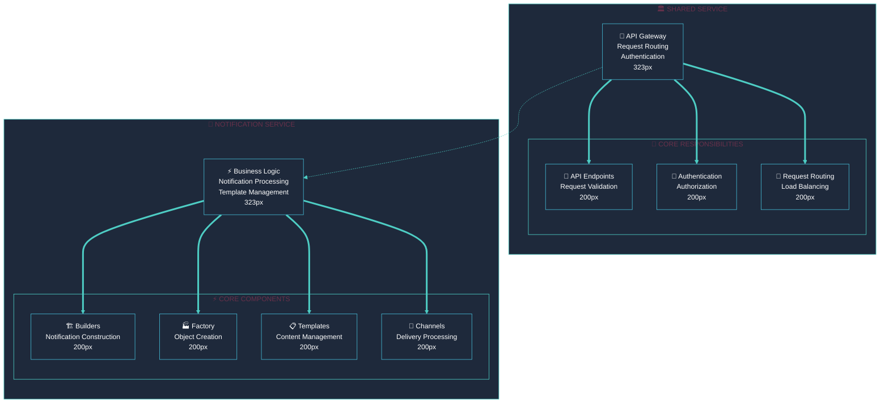
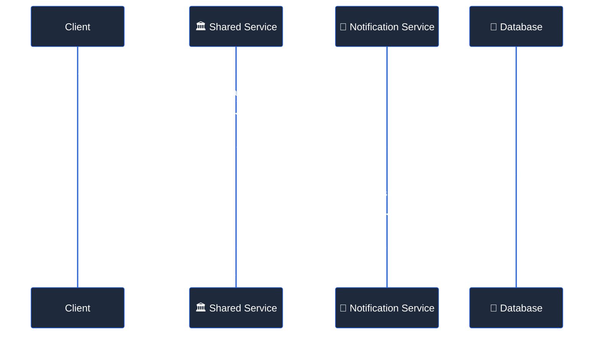
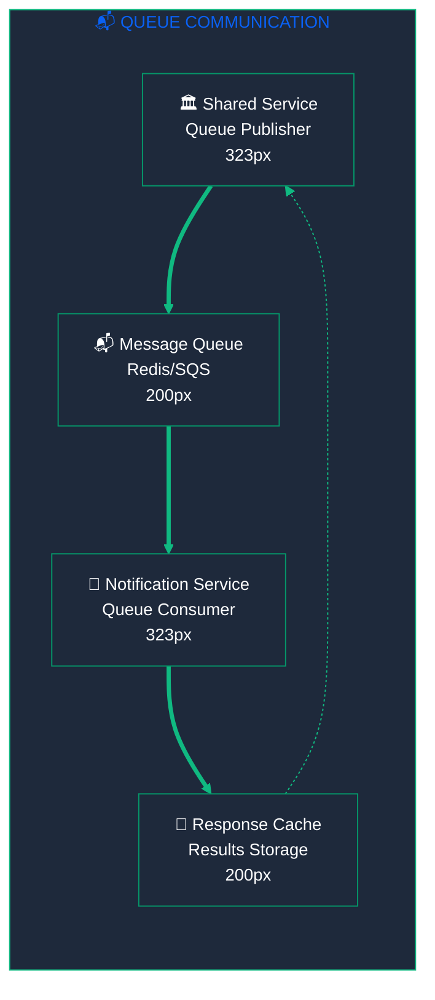
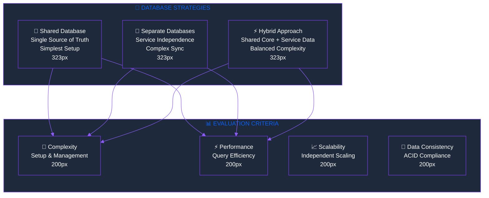
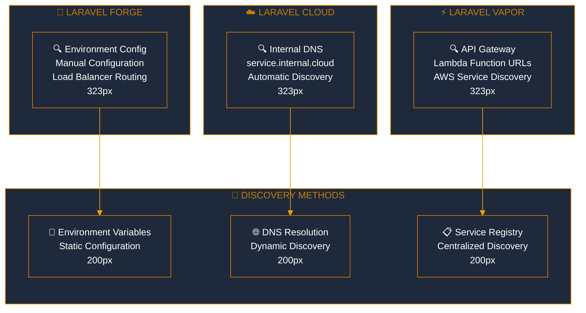

<div style="max-width: 38.2rem; line-height: 1.618; font-family: 'Inter', 'Segoe UI', 'Roboto', sans-serif;">

# <span style="font-size: 42px; font-weight: 700; line-height: 1.618;">🏗️ Multi-Service Deployment Architecture</span>

<p style="font-size: 16px; line-height: 1.618; margin-bottom: 2rem;">Platform-agnostic deployment architecture for notification system microservices, designed for <strong>Laravel Cloud, Forge, and Vapor</strong> compatibility with optimal performance and cost efficiency.</p>

## <span style="font-size: 26px; font-weight: 600; line-height: 1.618;">🎯 Architecture Principles</span>

<!-- 62% MAJOR CONCEPTS: Core Principles -->
<div style="margin-bottom: 3rem;">

### <span style="font-size: 20px; font-weight: 600; line-height: 1.618;">🚀 Core Design Principles</span>

<div style="margin-top: 1rem; padding: 1rem; background: #F0FDF4; border-left: 4px solid #10B981; border-radius: 4px;">
<p style="font-size: 16px; line-height: 1.618; margin: 0;"><strong>🎯 Foundation Principles:</strong></p>
<ul style="font-size: 16px; line-height: 1.618; margin: 0.5rem 0;">
<li><strong>Platform Agnostic:</strong> Architecture works across Cloud, Forge, and Vapor</li>
<li><strong>Service Independence:</strong> Services can be deployed and scaled independently</li>
<li><strong>Communication Flexibility:</strong> Support for HTTP, message queues, and direct database access</li>
<li><strong>Environment Parity:</strong> Consistent behavior across development, staging, and production</li>
<li><strong>Operational Simplicity:</strong> Minimize complexity while maintaining flexibility</li>
</ul>
</div>

### <span style="font-size: 20px; font-weight: 600; line-height: 1.618;">🏛️ Service Boundaries</span>



</div>

## <span style="font-size: 26px; font-weight: 600; line-height: 1.618;">🔄 Communication Patterns</span>

### <span style="font-size: 20px; font-weight: 600; line-height: 1.618;">📡 HTTP-Based RPC Communication</span>

<p style="font-size: 16px; line-height: 1.618;"><strong>Primary Pattern:</strong> Direct HTTP calls between services with comprehensive error handling and retry logic.</p>



<!-- 38% MINOR DETAILS: Implementation Details -->
<details style="margin-bottom: 2rem;">
<summary style="font-size: 16px; font-weight: 500; cursor: pointer;">🔧 HTTP RPC Implementation</summary>
<div style="margin-top: 1rem; padding-left: 1rem; border-left: 3px solid #4ECDC4;">

**Service Discovery:**
```php
// Environment-based service discovery
class ServiceDiscovery
{
    public function getNotificationServiceUrl(): string
    {
        return match(config('app.platform')) {
            'cloud' => 'https://notification-service.internal.cloud.laravel.com',
            'forge' => 'http://notification-service.local:8001',
            'vapor' => 'https://notification-api.vapor-app.com',
            default => config('services.notification.url')
        };
    }
}
```

**HTTP Client with Retry Logic:**
```php
class NotificationRpcClient
{
    public function sendNotification(array $params): array
    {
        return Http::retry(3, 1000)
            ->timeout(30)
            ->withHeaders(['Authorization' => 'Bearer ' . $this->getApiKey()])
            ->post($this->getServiceUrl() . '/internal/send', $params)
            ->throw()
            ->json();
    }
}
```

**Error Handling:**
- Circuit breaker pattern for service failures
- Exponential backoff for retries
- Fallback mechanisms for critical operations
- Comprehensive logging and monitoring

</div>
</details>

### <span style="font-size: 20px; font-weight: 600; line-height: 1.618;">📬 Queue-Based Async Communication</span>

<p style="font-size: 16px; line-height: 1.618;"><strong>Async Pattern:</strong> Message queue communication for non-blocking operations with response caching.</p>



<!-- 38% MINOR DETAILS: Queue Implementation -->
<details style="margin-bottom: 2rem;">
<summary style="font-size: 16px; font-weight: 500; cursor: pointer;">🔧 Queue Implementation Details</summary>
<div style="margin-top: 1rem; padding-left: 1rem; border-left: 3px solid #4ECDC4;">

**Queue Job Structure:**
```php
class NotificationJob implements ShouldQueue
{
    public function __construct(
        private string $jobId,
        private string $method,
        private array $params
    ) {}
    
    public function handle(): void
    {
        $result = $this->notificationService->{$this->method}($this->params);
        
        // Cache result for retrieval
        Cache::put("job_result:{$this->jobId}", $result, 3600);
    }
}
```

**Response Retrieval:**
```php
public function getJobResult(string $jobId): ?array
{
    return Cache::get("job_result:{$jobId}");
}
```

**Platform-Specific Queue Configuration:**
- **Laravel Cloud**: Built-in Redis queues
- **Laravel Forge**: Redis or database queues
- **Laravel Vapor**: SQS queues with Lambda triggers

</div>
</details>

## <span style="font-size: 26px; font-weight: 600; line-height: 1.618;">💾 Database Strategies</span>

### <span style="font-size: 20px; font-weight: 600; line-height: 1.618;">🎯 Strategy Comparison</span>



### <span style="font-size: 20px; font-weight: 600; line-height: 1.618;">🔗 Strategy 1: Shared Database (Recommended)</span>

<div style="margin-top: 1rem; padding: 1rem; background: #F0FDF4; border-left: 4px solid #10B981; border-radius: 4px;">
<p style="font-size: 16px; line-height: 1.618; margin: 0;"><strong>✅ Best for Most Cases:</strong></p>
<ul style="font-size: 16px; line-height: 1.618; margin: 0.5rem 0;">
<li><strong>Simplicity:</strong> Single database to manage and maintain</li>
<li><strong>Consistency:</strong> ACID transactions across all data</li>
<li><strong>Performance:</strong> No cross-service data synchronization</li>
<li><strong>Cost:</strong> Lower infrastructure costs</li>
</ul>
</div>

<!-- 38% MINOR DETAILS: Database Implementation -->
<details style="margin-bottom: 2rem;">
<summary style="font-size: 16px; font-weight: 500; cursor: pointer;">🔧 Shared Database Implementation</summary>
<div style="margin-top: 1rem; padding-left: 1rem; border-left: 3px solid #4ECDC4;">

**Database Schema Design:**
```sql
-- Core tables accessible by both services
CREATE TABLE users (
    id BIGINT PRIMARY KEY,
    email VARCHAR(255) UNIQUE,
    created_at TIMESTAMP
);

CREATE TABLE notification_templates (
    id BIGINT PRIMARY KEY,
    name VARCHAR(255),
    channel ENUM('email', 'sms', 'push'),
    template TEXT,
    created_at TIMESTAMP
);

CREATE TABLE notification_logs (
    id BIGINT PRIMARY KEY,
    user_id BIGINT,
    template_id BIGINT,
    channel VARCHAR(50),
    status ENUM('pending', 'sent', 'failed'),
    sent_at TIMESTAMP,
    FOREIGN KEY (user_id) REFERENCES users(id),
    FOREIGN KEY (template_id) REFERENCES notification_templates(id)
);
```

**Connection Configuration:**
```php
// Both services use same database connection
'mysql' => [
    'driver' => 'mysql',
    'host' => env('DB_HOST', '127.0.0.1'),
    'database' => env('DB_DATABASE', 'notifications'),
    'username' => env('DB_USERNAME', 'forge'),
    'password' => env('DB_PASSWORD', ''),
]
```

**Migration Strategy:**
- Single migration repository
- Both services run same migrations
- Database versioning for compatibility

</div>
</details>

### <span style="font-size: 20px; font-weight: 600; line-height: 1.618;">🔄 Strategy 2: Separate Databases</span>

<div style="margin-top: 1rem; padding: 1rem; background: #FFF7ED; border-left: 4px solid #F59E0B; border-radius: 4px;">
<p style="font-size: 16px; line-height: 1.618; margin: 0;"><strong>⚠️ For Advanced Use Cases:</strong></p>
<ul style="font-size: 16px; line-height: 1.618; margin: 0.5rem 0;">
<li><strong>Independence:</strong> Services can scale databases independently</li>
<li><strong>Isolation:</strong> Database failures don't affect other services</li>
<li><strong>Complexity:</strong> Requires data synchronization mechanisms</li>
<li><strong>Cost:</strong> Higher infrastructure and operational costs</li>
</ul>
</div>

### <span style="font-size: 20px; font-weight: 600; line-height: 1.618;">⚡ Strategy 3: Hybrid Approach</span>

<div style="margin-top: 1rem; padding: 1rem; background: #F3E8FF; border-left: 4px solid #8B5CF6; border-radius: 4px;">
<p style="font-size: 16px; line-height: 1.618; margin: 0;"><strong>🎯 Balanced Solution:</strong></p>
<ul style="font-size: 16px; line-height: 1.618; margin: 0.5rem 0;">
<li><strong>Core Data:</strong> Shared database for common entities (users, templates)</li>
<li><strong>Service Data:</strong> Separate databases for service-specific data</li>
<li><strong>Complexity:</strong> Moderate - requires careful data modeling</li>
<li><strong>Flexibility:</strong> Best of both approaches</li>
</ul>
</div>

## <span style="font-size: 26px; font-weight: 600; line-height: 1.618;">🔍 Service Discovery</span>

### <span style="font-size: 20px; font-weight: 600; line-height: 1.618;">🎯 Platform-Specific Discovery</span>



<!-- 38% MINOR DETAILS: Service Discovery Implementation -->
<details style="margin-bottom: 2rem;">
<summary style="font-size: 16px; font-weight: 500; cursor: pointer;">🔧 Service Discovery Implementation</summary>
<div style="margin-top: 1rem; padding-left: 1rem; border-left: 3px solid #4ECDC4;">

**Universal Service Discovery Class:**
```php
class ServiceDiscovery
{
    public function getServiceUrl(string $service): string
    {
        return match([config('app.platform'), $service]) {
            ['cloud', 'notification'] => 'https://notification-service.internal.cloud.laravel.com',
            ['forge', 'notification'] => $this->getForgeServiceUrl('notification'),
            ['vapor', 'notification'] => config('services.notification.vapor_url'),
            default => throw new ServiceNotFoundException($service)
        };
    }
    
    private function getForgeServiceUrl(string $service): string
    {
        $host = config("services.{$service}.host", 'localhost');
        $port = config("services.{$service}.port", 8000);
        return "http://{$host}:{$port}";
    }
}
```

**Health Check Integration:**
```php
class HealthCheckService
{
    public function checkServiceHealth(string $service): bool
    {
        $url = $this->serviceDiscovery->getServiceUrl($service);
        
        try {
            $response = Http::timeout(5)->get("{$url}/health");
            return $response->successful();
        } catch (Exception $e) {
            Log::warning("Health check failed for {$service}: " . $e->getMessage());
            return false;
        }
    }
}
```

**Circuit Breaker Pattern:**
```php
class CircuitBreaker
{
    public function call(string $service, callable $callback)
    {
        if ($this->isCircuitOpen($service)) {
            throw new ServiceUnavailableException($service);
        }
        
        try {
            $result = $callback();
            $this->recordSuccess($service);
            return $result;
        } catch (Exception $e) {
            $this->recordFailure($service);
            throw $e;
        }
    }
}
```

</div>
</details>

## <span style="font-size: 26px; font-weight: 600; line-height: 1.618;">📊 Monitoring and Observability</span>

### <span style="font-size: 20px; font-weight: 600; line-height: 1.618;">🎯 Comprehensive Monitoring Strategy</span>

<p style="font-size: 16px; line-height: 1.618;"><strong>Multi-Layer Monitoring:</strong> Application metrics, infrastructure monitoring, and distributed tracing across all services.</p>

**Key Monitoring Areas:**
- 📈 **Application Metrics**: Request rates, response times, error rates
- 🏗️ **Infrastructure Metrics**: CPU, memory, disk usage, network I/O
- 🔍 **Distributed Tracing**: Request flow across service boundaries
- 📋 **Business Metrics**: Notification delivery rates, channel performance

### <span style="font-size: 20px; font-weight: 600; line-height: 1.618;">🚨 Alerting and Incident Response</span>

<p style="font-size: 16px; line-height: 1.618;"><strong>Proactive Alerting:</strong> Early warning systems for service degradation and failures.</p>

**Alert Categories:**
- 🔴 **Critical**: Service down, high error rates (>5%)
- 🟡 **Warning**: High response times (>2s), resource usage (>80%)
- 🔵 **Info**: Deployment notifications, scaling events

## <span style="font-size: 26px; font-weight: 600; line-height: 1.618;">🔒 Security Considerations</span>

### <span style="font-size: 20px; font-weight: 600; line-height: 1.618;">🛡️ Inter-Service Security</span>

<p style="font-size: 16px; line-height: 1.618;"><strong>Zero Trust Architecture:</strong> All inter-service communication is authenticated and encrypted.</p>

**Security Layers:**
- 🔐 **API Authentication**: Bearer tokens for service-to-service calls
- 🔒 **TLS Encryption**: All HTTP communication encrypted in transit
- 🛡️ **Network Isolation**: Services isolated at network level where possible
- 📋 **Audit Logging**: Comprehensive logging of all inter-service requests

<!-- 38% MINOR DETAILS: Security Implementation -->
<details style="margin-bottom: 2rem;">
<summary style="font-size: 16px; font-weight: 500; cursor: pointer;">🔧 Security Implementation Details</summary>
<div style="margin-top: 1rem; padding-left: 1rem; border-left: 3px solid #4ECDC4;">

**API Key Management:**
```php
class ServiceAuthenticator
{
    public function authenticate(Request $request): bool
    {
        $apiKey = $request->bearerToken();
        $expectedKey = config('services.api_keys.notification_service');
        
        return hash_equals($expectedKey, $apiKey ?? '');
    }
}
```

**Request Signing:**
```php
class RequestSigner
{
    public function signRequest(array $payload): array
    {
        $timestamp = time();
        $signature = hash_hmac('sha256', 
            json_encode($payload) . $timestamp, 
            config('services.signing_key')
        );
        
        return [
            'payload' => $payload,
            'timestamp' => $timestamp,
            'signature' => $signature
        ];
    }
}
```

**Rate Limiting:**
```php
// Apply rate limiting to inter-service calls
Route::middleware(['throttle:service:100,1'])->group(function () {
    Route::post('/internal/send', [NotificationController::class, 'send']);
});
```

</div>
</details>

## <span style="font-size: 26px; font-weight: 600; line-height: 1.618;">🚀 Performance Optimization</span>

### <span style="font-size: 20px; font-weight: 600; line-height: 1.618;">⚡ Connection Pooling</span>

<p style="font-size: 16px; line-height: 1.618;"><strong>Efficient Resource Usage:</strong> Connection pooling for database and HTTP connections to minimize overhead.</p>

### <span style="font-size: 20px; font-weight: 600; line-height: 1.618;">💾 Caching Strategy</span>

<p style="font-size: 16px; line-height: 1.618;"><strong>Multi-Level Caching:</strong> Application-level, database query, and HTTP response caching.</p>

**Caching Layers:**
- 🔄 **Application Cache**: Frequently accessed data (templates, configurations)
- 📊 **Query Cache**: Database query results
- 🌐 **HTTP Cache**: API response caching with appropriate TTL
- 📋 **Template Cache**: Rendered notification templates

### <span style="font-size: 20px; font-weight: 600; line-height: 1.618;">📈 Auto-Scaling Configuration</span>

<p style="font-size: 16px; line-height: 1.618;"><strong>Platform-Specific Scaling:</strong> Optimized auto-scaling rules for each deployment platform.</p>

**Scaling Triggers:**
- 📊 **CPU Usage**: Scale up when CPU > 70% for 5 minutes
- 💾 **Memory Usage**: Scale up when memory > 80% for 5 minutes
- 📈 **Request Rate**: Scale up when requests > 1000/minute
- ⏱️ **Response Time**: Scale up when avg response time > 2 seconds

---

<p style="text-align: center; font-size: 16px; line-height: 1.618; margin-top: 2rem;"><strong>Multi-Service Architecture Complete</strong> - Platform-agnostic, scalable, and production-ready 🏗️</p>

</div>
<!-- End Golden Ratio Container -->

