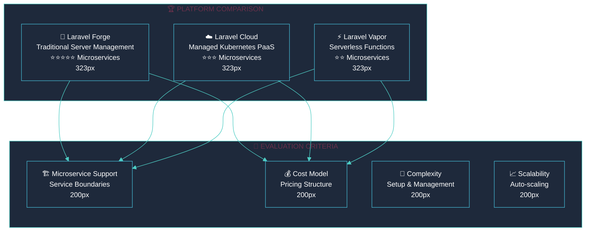
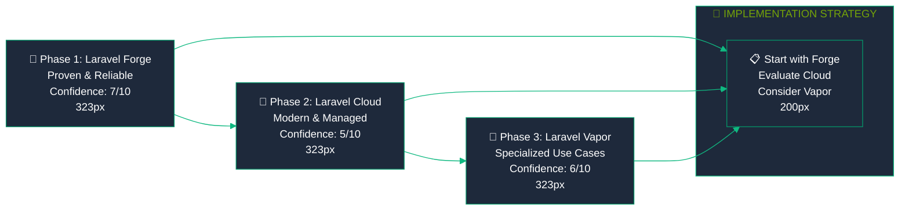

<div style="max-width: 38.2rem; line-height: 1.618; font-family: 'Inter', 'Segoe UI', 'Roboto', sans-serif;">

# <span style="font-size: 42px; font-weight: 700; line-height: 1.618;">🚀 Laravel Deployment Platforms Research</span>

<p style="font-size: 16px; line-height: 1.618; margin-bottom: 2rem;">Comprehensive analysis of <strong>Laravel Cloud, Forge, and Vapor</strong> deployment platforms, specifically evaluating their capabilities for microservice architectures like our notification system.</p>

## <span style="font-size: 26px; font-weight: 600; line-height: 1.618;">📊 Platform Analysis Summary</span>

<!-- 62% MAJOR CONCEPTS: Platform Comparison -->
<div style="margin-bottom: 3rem;">

### <span style="font-size: 20px; font-weight: 600; line-height: 1.618;">🎯 Quick Comparison Matrix</span>



| Platform | Type | Best For | Microservice Support | Complexity | Cost Model |
|----------|------|----------|---------------------|------------|------------|
| **🔨 Laravel Forge** | Server Management | Traditional deployments | ⭐⭐⭐⭐⭐ Excellent | Medium | Server-based |
| **☁️ Laravel Cloud** | Managed PaaS | Modern Laravel apps | ⭐⭐⭐ Good | Low | Usage-based |
| **⚡ Laravel Vapor** | Serverless | Auto-scaling workloads | ⭐⭐ Limited | Medium | Pay-per-use |

</div>

## <span style="font-size: 26px; font-weight: 600; line-height: 1.618;">☁️ Laravel Cloud</span>

### <span style="font-size: 20px; font-weight: 600; line-height: 1.618;">🏗️ Architecture and Capabilities</span>

<div style="margin-top: 1rem; padding: 1rem; background: #F0F9FF; border-left: 4px solid #45B7D1; border-radius: 4px;">
<p style="font-size: 16px; line-height: 1.618; margin: 0;"><strong>🎯 Platform Overview:</strong></p>
<ul style="font-size: 16px; line-height: 1.618; margin: 0.5rem 0;">
<li><strong>Platform Type:</strong> Fully managed Platform-as-a-Service (PaaS)</li>
<li><strong>Infrastructure:</strong> Kubernetes-based managed infrastructure</li>
<li><strong>Launch:</strong> 2024 (newest Laravel platform)</li>
<li><strong>Confidence Level:</strong> 5/10 (Medium - New platform)</li>
</ul>
</div>

#### <span style="font-size: 20px; font-weight: 600; line-height: 1.618;">✅ Strengths for Microservices</span>

**🎯 Zero Configuration Management:**
- No server management or complex setup required
- Kubernetes foundation naturally supports multiple services
- Automatic scaling for services based on demand
- Zero downtime deployments with rolling updates

**🔧 Integrated Services:**
- Built-in MySQL/Postgres databases
- Redis caching layer
- Object storage integration
- CDN and edge network support

**📊 Monitoring and Observability:**
- Built-in application monitoring
- Performance metrics and alerting
- Centralized logging across services
- Health check automation

#### <span style="font-size: 20px; font-weight: 600; line-height: 1.618;">⚠️ Limitations and Concerns</span>

<div style="margin-top: 1rem; padding: 1rem; background: #FFF7ED; border-left: 4px solid #F59E0B; border-radius: 4px;">
<p style="font-size: 16px; line-height: 1.618; margin: 0;"><strong>🚨 Platform Limitations:</strong></p>
<ul style="font-size: 16px; line-height: 1.618; margin: 0.5rem 0;">
<li><strong>New Platform:</strong> Limited production track record</li>
<li><strong>Documentation:</strong> Still evolving, fewer community resources</li>
<li><strong>Vendor Lock-in:</strong> Tight coupling to Laravel ecosystem</li>
<li><strong>Cost Predictability:</strong> Usage-based pricing can be unpredictable</li>
</ul>
</div>

<!-- 38% MINOR DETAILS: Technical Specifications -->
<details style="margin-bottom: 2rem;">
<summary style="font-size: 16px; font-weight: 500; cursor: pointer;">🔧 Technical Implementation Details</summary>
<div style="margin-top: 1rem; padding-left: 1rem; border-left: 3px solid #4ECDC4;">

**Microservice Deployment Pattern:**
```yaml
# cloud.yml example
applications:
  shared-service:
    build: composer install --no-dev
    environment: production
    scaling:
      min: 1
      max: 10
      
  notification-service:
    build: composer install --no-dev
    environment: production
    scaling:
      min: 1
      max: 20
```

**Service Communication:**
- Internal service discovery via Cloud URLs
- HTTP-based inter-service communication
- Shared database or separate database per service
- Queue-based async communication support

**Cost Estimation:**
- Small deployment: $50-150/month
- Medium deployment: $150-500/month
- Large deployment: $500-2000/month

</div>
</details>

## <span style="font-size: 26px; font-weight: 600; line-height: 1.618;">🔨 Laravel Forge</span>

### <span style="font-size: 20px; font-weight: 600; line-height: 1.618;">🏗️ Architecture and Capabilities</span>

<div style="margin-top: 1rem; padding: 1rem; background: #F0FDF4; border-left: 4px solid #10B981; border-radius: 4px;">
<p style="font-size: 16px; line-height: 1.618; margin: 0;"><strong>🎯 Platform Overview:</strong></p>
<ul style="font-size: 16px; line-height: 1.618; margin: 0.5rem 0;">
<li><strong>Platform Type:</strong> Server provisioning and management tool</li>
<li><strong>Infrastructure:</strong> VPS/Cloud servers (DigitalOcean, AWS, Linode)</li>
<li><strong>Launch:</strong> 2013 (mature, battle-tested platform)</li>
<li><strong>Confidence Level:</strong> 7/10 (High - Proven track record)</li>
</ul>
</div>

#### <span style="font-size: 20px; font-weight: 600; line-height: 1.618;">✅ Strengths for Microservices</span>

**🎯 Maximum Flexibility:**
- Full server control and customization
- Support for multiple applications per server
- Custom Nginx configurations for load balancing
- Direct database and Redis management

**🔧 Proven Reliability:**
- 10+ years of production use
- Extensive community knowledge and resources
- Well-documented deployment patterns
- Strong ecosystem integration

**📊 Cost Predictability:**
- Fixed server costs, easy to budget
- No usage-based surprises
- Direct control over resource allocation
- Efficient resource utilization

#### <span style="font-size: 20px; font-weight: 600; line-height: 1.618;">⚠️ Operational Overhead</span>

<div style="margin-top: 1rem; padding: 1rem; background: #FFF7ED; border-left: 4px solid #F59E0B; border-radius: 4px;">
<p style="font-size: 16px; line-height: 1.618; margin: 0;"><strong>🚨 Management Requirements:</strong></p>
<ul style="font-size: 16px; line-height: 1.618; margin: 0.5rem 0;">
<li><strong>Server Management:</strong> Requires ongoing maintenance and updates</li>
<li><strong>Scaling:</strong> Manual scaling decisions and implementation</li>
<li><strong>Monitoring:</strong> Need to set up custom monitoring solutions</li>
<li><strong>Security:</strong> Responsible for server security and patches</li>
</ul>
</div>

<!-- 38% MINOR DETAILS: Technical Specifications -->
<details style="margin-bottom: 2rem;">
<summary style="font-size: 16px; font-weight: 500; cursor: pointer;">🔧 Technical Implementation Details</summary>
<div style="margin-top: 1rem; padding-left: 1rem; border-left: 3px solid #4ECDC4;">

**Microservice Deployment Options:**

**Option 1: Single Server Deployment**
- 4GB RAM server ($40-60/month)
- Both services on same server
- Nginx reverse proxy for routing
- Shared MySQL and Redis

**Option 2: Multi-Server Deployment**
- Load balancer server ($20/month)
- Shared service server ($40/month)
- Notification service server ($40/month)
- Separate database server ($60/month)

**Service Communication:**
```nginx
# Nginx configuration for service routing
upstream shared_service {
    server 127.0.0.1:8000;
}

upstream notification_service {
    server 127.0.0.1:8001;
}
```

**Cost Breakdown:**
- Single server: $40-60/month
- Multi-server: $160-200/month
- Database scaling: +$60-120/month

</div>
</details>

## <span style="font-size: 26px; font-weight: 600; line-height: 1.618;">⚡ Laravel Vapor</span>

### <span style="font-size: 20px; font-weight: 600; line-height: 1.618;">🏗️ Architecture and Capabilities</span>

<div style="margin-top: 1rem; padding: 1rem; background: #F3E8FF; border-left: 4px solid #8B5CF6; border-radius: 4px;">
<p style="font-size: 16px; line-height: 1.618; margin: 0;"><strong>🎯 Platform Overview:</strong></p>
<ul style="font-size: 16px; line-height: 1.618; margin: 0.5rem 0;">
<li><strong>Platform Type:</strong> Serverless deployment platform</li>
<li><strong>Infrastructure:</strong> AWS Lambda + managed services</li>
<li><strong>Launch:</strong> 2020 (mature serverless solution)</li>
<li><strong>Confidence Level:</strong> 6/10 (Medium - Serverless complexity)</li>
</ul>
</div>

#### <span style="font-size: 20px; font-weight: 600; line-height: 1.618;">✅ Strengths for Auto-Scaling</span>

**🎯 Extreme Scalability:**
- Automatic scaling from 0 to thousands of requests
- Pay only for actual usage
- No server management required
- Built-in high availability

**🔧 AWS Integration:**
- Native AWS services integration
- RDS for databases
- ElastiCache for Redis
- S3 for file storage

#### <span style="font-size: 20px; font-weight: 600; line-height: 1.618;">⚠️ Microservice Limitations</span>

<div style="margin-top: 1rem; padding: 1rem; background: #FEF2F2; border-left: 4px solid #EF4444; border-radius: 4px;">
<p style="font-size: 16px; line-height: 1.618; margin: 0;"><strong>🚨 Serverless Constraints:</strong></p>
<ul style="font-size: 16px; line-height: 1.618; margin: 0.5rem 0;">
<li><strong>Stateless Requirements:</strong> Functions must be stateless</li>
<li><strong>Cold Starts:</strong> Initial request latency</li>
<li><strong>Service Communication:</strong> Complex inter-service communication</li>
<li><strong>Debugging:</strong> Harder to debug distributed functions</li>
<li><strong>Vendor Lock-in:</strong> Heavy AWS dependency</li>
</ul>
</div>

<!-- 38% MINOR DETAILS: Technical Specifications -->
<details style="margin-bottom: 2rem;">
<summary style="font-size: 16px; font-weight: 500; cursor: pointer;">🔧 Technical Implementation Details</summary>
<div style="margin-top: 1rem; padding-left: 1rem; border-left: 3px solid #4ECDC4;">

**Serverless Architecture Adaptation:**

**Challenge: Service Communication**
- Traditional HTTP calls between services become complex
- Need API Gateway for routing
- Database connections require connection pooling
- Shared state management becomes difficult

**Potential Solutions:**
- API Gateway for service routing
- SQS for async communication
- RDS Proxy for database connections
- ElastiCache for shared caching

**Cost Model:**
- Base infrastructure: $100-200/month
- Function execution: $0.0000166 per GB-second
- API Gateway: $3.50 per million requests
- Data transfer: $0.09 per GB

**Microservice Adaptation Complexity:**
- High: Requires significant architecture changes
- Service boundaries become function boundaries
- Shared database access patterns need redesign
- Inter-service communication requires careful planning

</div>
</details>

## <span style="font-size: 26px; font-weight: 600; line-height: 1.618;">🎯 Platform Recommendations</span>

<!-- 62% MAJOR CONCEPTS: Recommendations -->
<div style="margin-bottom: 3rem;">

### <span style="font-size: 20px; font-weight: 600; line-height: 1.618;">🏆 For Most Teams: Laravel Forge</span>
<p style="font-size: 16px; line-height: 1.618;"><strong>Best Overall Choice:</strong> Highest confidence level (7/10), excellent microservice support (⭐⭐⭐⭐⭐), and proven reliability make Forge the safest choice for most teams.</p>

**Why Forge Wins:**
- ✅ **Proven Track Record**: 10+ years of production use
- ✅ **Maximum Flexibility**: Full control over server configuration
- ✅ **Predictable Costs**: Fixed server pricing, easy to budget
- ✅ **Strong Community**: Extensive documentation and support

### <span style="font-size: 20px; font-weight: 600; line-height: 1.618;">🚀 For Modern Teams: Laravel Cloud</span>
<p style="font-size: 16px; line-height: 1.618;"><strong>Future-Forward Choice:</strong> If you prefer managed infrastructure and don't mind being an early adopter, Cloud offers modern Kubernetes-based deployment.</p>

**When to Choose Cloud:**
- ✅ **Zero Ops Preference**: Want minimal server management
- ✅ **Modern Architecture**: Kubernetes-native deployment
- ✅ **Auto-scaling Needs**: Built-in scaling capabilities
- ⚠️ **Risk Tolerance**: Comfortable with newer platform

### <span style="font-size: 20px; font-weight: 600; line-height: 1.618;">⚡ For Specific Use Cases: Laravel Vapor</span>
<p style="font-size: 16px; line-height: 1.618;"><strong>Specialized Choice:</strong> Only recommended for teams with specific serverless requirements and the expertise to handle the complexity.</p>

**When Vapor Makes Sense:**
- ✅ **Extreme Auto-scaling**: Need to scale from 0 to massive traffic
- ✅ **Variable Workloads**: Sporadic or unpredictable traffic patterns
- ✅ **AWS Expertise**: Team comfortable with AWS ecosystem
- ⚠️ **Architecture Complexity**: Willing to redesign for serverless

</div>

## <span style="font-size: 26px; font-weight: 600; line-height: 1.618;">📊 Implementation Priority</span>

### <span style="font-size: 20px; font-weight: 600; line-height: 1.618;">🎯 Recommended Implementation Order</span>



**Phase 1: Laravel Forge Implementation**
- ✅ **Priority**: High (Start here)
- ✅ **Risk**: Low (Proven platform)
- ✅ **Timeline**: 1-2 weeks for full deployment
- ✅ **Benefits**: Immediate production readiness

**Phase 2: Laravel Cloud Evaluation**
- 🔄 **Priority**: Medium (Future consideration)
- ⚠️ **Risk**: Medium (New platform)
- 🔄 **Timeline**: 2-3 weeks for evaluation and migration
- 🔄 **Benefits**: Modern architecture, reduced ops overhead

**Phase 3: Laravel Vapor Assessment**
- 📋 **Priority**: Low (Specialized scenarios only)
- ⚠️ **Risk**: High (Complex architecture changes)
- 📋 **Timeline**: 4-6 weeks for complete redesign
- 📋 **Benefits**: Extreme scalability for specific use cases

---

<p style="text-align: center; font-size: 16px; line-height: 1.618; margin-top: 2rem;"><strong>Platform Research Complete</strong> - Ready for implementation planning 🚀</p>

</div>
<!-- End Golden Ratio Container -->

