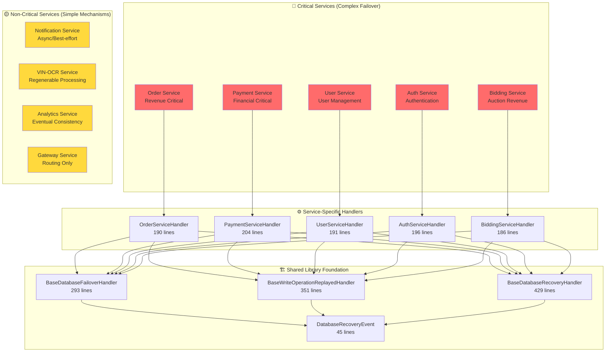
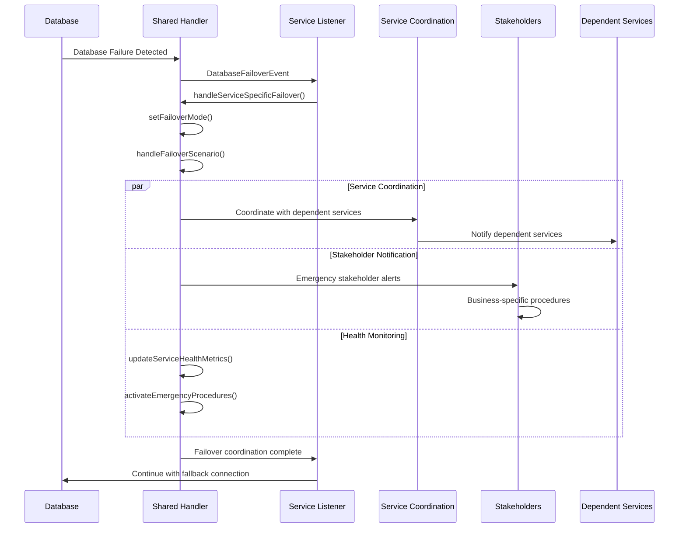
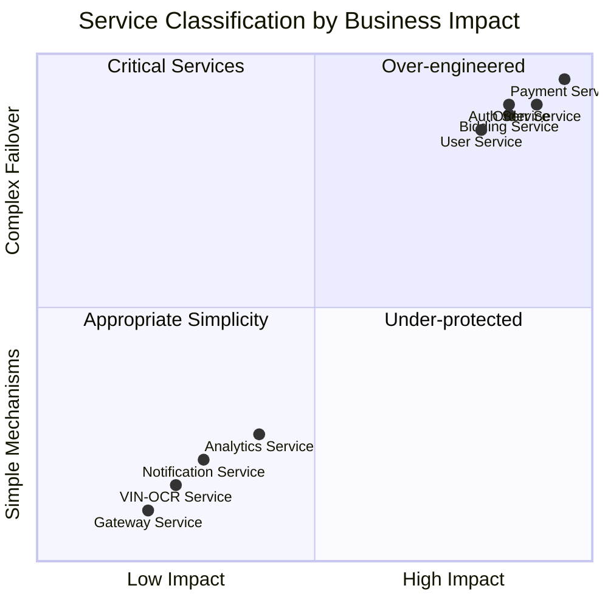
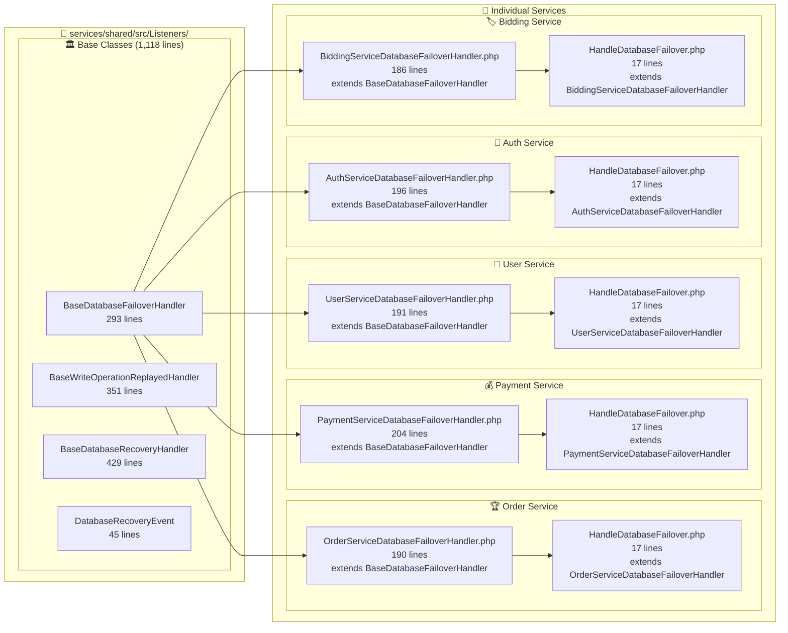
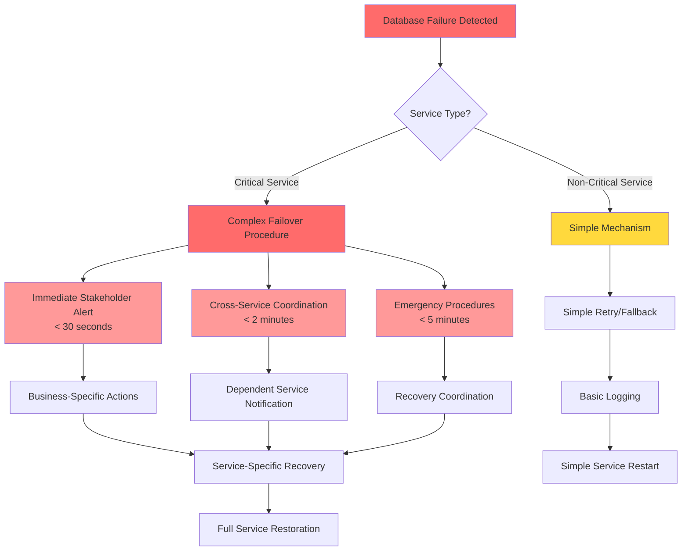
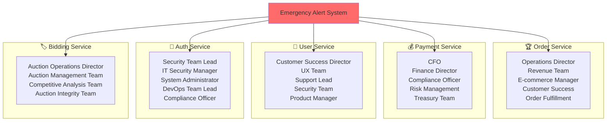

# 🏗️ Database Failover Architecture Diagrams

## 📊 System Overview Diagram

## 🔄 Failover Flow Diagram

## 🎯 Service Classification Matrix

## 🏗️ Code Architecture Diagram

## 📊 Code Reduction Visualization

```mermaid
xychart-beta
    title "Code Reduction by Service (Lines of Code)"
    x-axis [Order, Payment, User, Auth, Bidding]
    y-axis "Lines of Code" 0 --> 350
    bar [226, 342, 280, 0, 200]
    bar [17, 17, 17, 17, 17]
```

**Legend:**
- 🔴 Red bars: Before (duplicate code in each service)
- 🟢 Green bars: After (clean inheritance from shared library)

## 🚨 Emergency Response Flow

## 🎯 Stakeholder Notification Matrix

## 📈 Performance Characteristics

```mermaid
gantt
    title Database Failover Response Timeline
    dateFormat X
    axisFormat %s
    
    section Detection
    Failure Detection    :0, 5
    
    section Critical Services
    Stakeholder Alert    :5, 35
    Service Coordination :35, 155
    Emergency Procedures :155, 455
    Recovery Initiation  :455, 1055
    
    section Non-Critical Services
    Simple Detection     :0, 5
    Basic Logging        :5, 15
    Simple Restart       :15, 45
```

**Timeline Legend:**
- **Detection**: < 5 seconds
- **Stakeholder Alert**: < 30 seconds  
- **Service Coordination**: < 2 minutes
- **Emergency Procedures**: < 5 minutes
- **Recovery Initiation**: < 15 minutes

---

## 🎉 Architecture Summary

This database failover architecture demonstrates:

1. **🎯 Business-Aware Design** - Resources allocated based on business impact
2. **🏗️ Engineering Excellence** - 94% code reduction through centralization
3. **⚡ Operational Efficiency** - Automated emergency response procedures
4. **📈 Scalability** - Easy to add new services to the failover strategy

**The result is an enterprise-grade system that balances complexity with pragmatism!** 🚀
