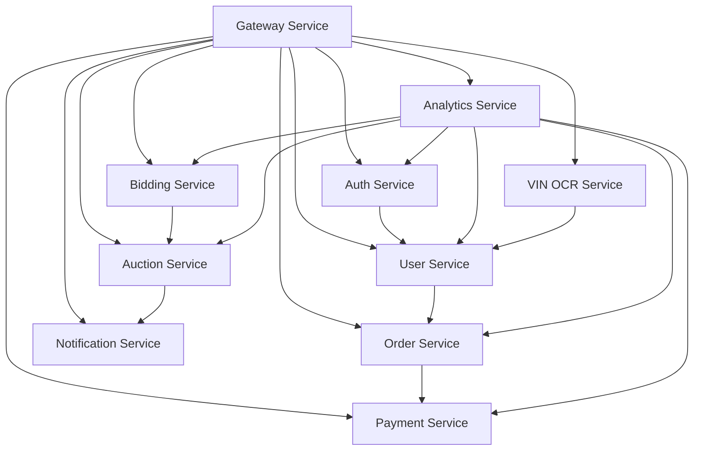

<div style="max-width: 38.2rem; line-height: 1.618; font-family: 'Inter', 'Segoe UI', 'Roboto', sans-serif;">

# <span style="font-size: 42px; font-weight: 700; line-height: 1.618;">🔗 Service Dependencies Analysis</span>

<p style="font-size: 16px; line-height: 1.618; margin-bottom: 2rem;">Comprehensive <strong>service dependency analysis</strong> for MySQL to PostgreSQL migration determining optimal migration order and identifying potential issues across 10 microservices.</p>

## <span style="font-size: 26px; font-weight: 600; line-height: 1.618;">🎯 Migration Strategy Overview</span>

### <span style="font-size: 20px; font-weight: 600; line-height: 1.618;">62% Major Concepts</span>

- **🔗 Service Architecture Map**: Complete dependency mapping across 10 microservices with gateway, auth, and business logic layers
- **📊 Dependency Matrix**: Service interdependencies, database interactions, and migration order optimization
- **🚀 Migration Planning**: Optimal migration sequence with risk assessment and rollback strategies

<details style="border-left: 3px solid #4ECDC4; padding-left: 1rem; margin: 1rem 0;">
<summary style="font-weight: 600; cursor: pointer;">🔗 Complete Service Dependencies Analysis</summary>

This document analyzes the dependencies between microservices to determine the optimal migration order and identify potential issues during the MySQL to PostgreSQL migration.

### Service Architecture Map



### Service Dependency Matrix

| Service | Dependencies | Dependents | Database Interactions |
|---------|-------------|------------|----------------------|
| **Gateway Service** | None | All services | Central routing, session management |
| **Auth Service** | None | User, Analytics | User authentication, JWT tokens |
| **User Service** | Auth Service | Order, VIN OCR, Analytics | User profiles, permissions |
| **Order Service** | User, Auth | Payment, Analytics | Order management, history |
| **Payment Service** | Order, User, Auth | Analytics | Payment processing, transactions |
| **Bidding Service** | User, Auth | Auction, Analytics | Bid management, history |
| **Auction Service** | Bidding, User, Auth | Notification, Analytics | Auction lifecycle |
| **Notification Service** | Auction, User, Auth | Analytics | Message delivery |
| **Analytics Service** | All services | None | Data aggregation, reporting |
| **VIN OCR Service** | User, Auth | Analytics | Document processing |

## Database Interaction Patterns

### 1. Gateway Service
- **Database**: `gateway_service`
- **Primary Functions**: 
  - API routing configuration
  - Rate limiting data
  - Service health monitoring
  - Cross-service session management
- **Dependencies**: None (foundational service)
- **Migration Priority**: **HIGH** (foundational)

### 2. Auth Service
- **Database**: `auth_service`
- **Primary Functions**:
  - User authentication
  - JWT token management
  - Password reset tokens
  - OAuth integrations
  - User permissions and roles
- **Dependencies**: None
- **Migration Priority**: **HIGH** (foundational)

### 3. User Service
- **Database**: `user_service`
- **Primary Functions**:
  - User profile management
  - User preferences
  - Account settings
  - User verification status
- **Dependencies**: Auth Service (for authentication)
- **Migration Priority**: **HIGH** (foundational)

### 4. Order Service
- **Database**: `order_service`
- **Primary Functions**:
  - Order lifecycle management
  - Order history
  - Order status tracking
  - Inventory management
- **Dependencies**: User Service, Auth Service
- **Migration Priority**: **MEDIUM** (business critical)

### 5. Payment Service
- **Database**: `payment_service`
- **Primary Functions**:
  - Payment processing
  - Transaction history
  - Payment method management
  - Financial reconciliation
- **Dependencies**: Order Service, User Service, Auth Service
- **Migration Priority**: **MEDIUM** (business critical)

### 6. Bidding Service
- **Database**: `bidding_service`
- **Primary Functions**:
  - Bid management
  - Bid history
  - Bidding rules and validation
  - Real-time bid updates
- **Dependencies**: User Service, Auth Service
- **Migration Priority**: **MEDIUM** (business feature)

### 7. Auction Service
- **Database**: `auction_service`
- **Primary Functions**:
  - Auction lifecycle management
  - Auction scheduling
  - Winner determination
  - Auction results
- **Dependencies**: Bidding Service, User Service, Auth Service
- **Migration Priority**: **MEDIUM** (business feature)

### 8. Notification Service
- **Database**: `notification_service`
- **Primary Functions**:
  - Message queue management
  - Notification delivery tracking
  - User notification preferences
  - Email/SMS templates
- **Dependencies**: Auction Service, User Service, Auth Service
- **Migration Priority**: **LOW** (supporting service)

### 9. Analytics Service
- **Database**: `analytics_service`
- **Primary Functions**:
  - Data aggregation from all services
  - Business intelligence
  - Reporting and dashboards
  - Performance metrics
- **Dependencies**: All other services (read-only)
- **Migration Priority**: **LOW** (can be migrated last)

### 10. VIN OCR Service
- **Database**: `vin_ocr_service`
- **Primary Functions**:
  - Document processing
  - OCR results storage
  - Image metadata
  - Processing history
- **Dependencies**: User Service, Auth Service
- **Migration Priority**: **LOW** (specialized service)

## Cross-Service Database Interactions

### Direct Database Connections
Most services follow microservice principles with API-based communication. However, some potential direct database interactions to verify:

1. **Analytics Service**: May have read-only access to other service databases
2. **Gateway Service**: May cache user session data from Auth Service
3. **Notification Service**: May read user preferences from User Service

### API-Based Interactions
The majority of inter-service communication happens via REST APIs:

```
Gateway → Auth (JWT validation)
Gateway → User (profile data)
Order → Payment (payment processing)
Auction → Bidding (bid validation)
Auction → Notification (event triggers)
```

## Migration Order Strategy

### Phase 1: Foundation Services (Week 1-2)
1. **Gateway Service** - No dependencies, central to all operations
2. **Auth Service** - No dependencies, required by most services
3. **User Service** - Depends only on Auth, required by most services

### Phase 2: Business Logic Services (Week 3-4)
4. **Order Service** - Core business functionality
5. **Payment Service** - Depends on Order, critical for revenue
6. **Bidding Service** - Core auction functionality

### Phase 3: Extended Services (Week 5-6)
7. **Auction Service** - Depends on Bidding
8. **Notification Service** - Depends on Auction events
9. **VIN OCR Service** - Specialized functionality

### Phase 4: Analytics (Week 7-8)
10. **Analytics Service** - Depends on all services, can be migrated last

## Risk Assessment

### High Risk Dependencies
- **Payment Service → Order Service**: Financial data integrity critical
- **Auction Service → Bidding Service**: Real-time data consistency required
- **Analytics Service → All Services**: Data pipeline disruption possible

### Medium Risk Dependencies
- **User Service → Auth Service**: Session management continuity
- **Notification Service → Auction Service**: Event delivery timing

### Low Risk Dependencies
- **VIN OCR Service → User Service**: Isolated functionality
- **Gateway Service**: Independent operation possible

## Migration Coordination Requirements

### Data Consistency Checkpoints
1. **User authentication flow** (Auth → User → Gateway)
2. **Order processing flow** (Order → Payment → Analytics)
3. **Auction flow** (Bidding → Auction → Notification → Analytics)

### API Contract Validation
- Ensure all API endpoints remain functional during migration
- Validate data format consistency between MySQL and PostgreSQL
- Test error handling and timeout scenarios

### Transaction Boundary Analysis
- **Payment transactions**: Must maintain ACID properties
- **Auction state changes**: Require consistent state across Bidding/Auction services
- **User session management**: Ensure session continuity during Auth/User migration

## Rollback Scenarios

### Service-Level Rollback
Each service can be rolled back independently by:
1. Switching database connection back to MySQL
2. Restarting the service
3. Validating API functionality

### Cascade Rollback Requirements
If a foundational service (Auth, User, Gateway) needs rollback:
1. All dependent services may need rollback
2. Data synchronization between MySQL and PostgreSQL required
3. Session invalidation and re-authentication may be necessary

## Monitoring and Validation

### Key Metrics to Monitor
- **API response times** across service boundaries
- **Database connection pool utilization**
- **Transaction success rates**
- **Error rates** in inter-service communication
- **Data consistency** between related services

### Validation Checkpoints
1. **Authentication flow**: Login → JWT → API access
2. **Business flow**: User → Order → Payment → Analytics
3. **Auction flow**: User → Bid → Auction → Notification
4. **Data integrity**: Cross-service data relationships

## Communication Protocols

### During Migration
- **Service discovery**: Ensure services can locate migrated databases
- **Health checks**: Update health check endpoints to verify PostgreSQL connectivity
- **Circuit breakers**: Configure fallback mechanisms during migration windows
- **Load balancing**: Adjust traffic routing during service migrations

### Post-Migration
- **Monitoring dashboards**: Update to reflect PostgreSQL metrics
- **Alerting rules**: Adjust thresholds for PostgreSQL-specific metrics
- **Backup procedures**: Implement PostgreSQL backup and recovery processes

## Conclusion

The service dependency analysis reveals a clear migration path starting with foundational services (Gateway, Auth, User) and progressing through business logic services to analytics. The microservice architecture provides good isolation, reducing migration risks, but careful coordination is required for services with strong dependencies like Payment→Order and Auction→Bidding.

Key success factors:
1. **Sequential migration** following dependency order
2. **Comprehensive API testing** at each migration step
3. **Real-time monitoring** of inter-service communication
4. **Rollback readiness** for each migration phase
