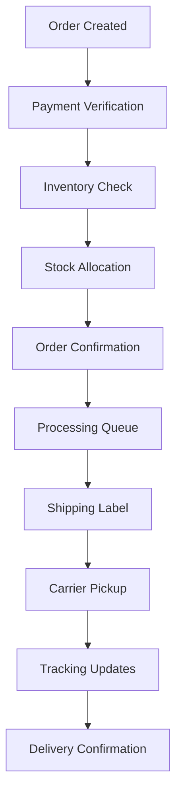

# Orders

## Overview

The Orders service manages the complete order lifecycle for the Reverse Tender platform, handling order creation, processing, fulfillment, tracking, and integration with payment and notification systems.

## Features

- **Order Management**: Complete order lifecycle from creation to fulfillment
- **Status Tracking**: Real-time order status updates and tracking
- **Inventory Integration**: Stock management and availability checking
- **Payment Integration**: Seamless integration with payment processing
- **Shipping Management**: Shipping provider integration and tracking
- **Order History**: Comprehensive order history and analytics
- **Bulk Operations**: Efficient bulk order processing
- **Workflow Automation**: Automated order processing workflows

## API Endpoints

### Order Management
- `GET /api/orders` - List orders with filtering and pagination
- `POST /api/orders` - Create new order
- `GET /api/orders/{id}` - Get order details
- `PUT /api/orders/{id}` - Update order
- `DELETE /api/orders/{id}` - Cancel order

### Order Processing
- `POST /api/orders/{id}/confirm` - Confirm order
- `POST /api/orders/{id}/process` - Process order
- `POST /api/orders/{id}/ship` - Mark order as shipped
- `POST /api/orders/{id}/deliver` - Mark order as delivered
- `POST /api/orders/{id}/cancel` - Cancel order

### Order Items
- `GET /api/orders/{id}/items` - Get order items
- `POST /api/orders/{id}/items` - Add items to order
- `PUT /api/orders/{id}/items/{itemId}` - Update order item
- `DELETE /api/orders/{id}/items/{itemId}` - Remove order item

### Tracking & Status
- `GET /api/orders/{id}/status` - Get order status
- `GET /api/orders/{id}/tracking` - Get tracking information
- `POST /api/orders/{id}/status` - Update order status
- `GET /api/orders/tracking/{trackingNumber}` - Track by tracking number

### Bulk Operations
- `POST /api/orders/bulk/create` - Create multiple orders
- `POST /api/orders/bulk/update` - Update multiple orders
- `POST /api/orders/bulk/process` - Process multiple orders

### Reports & Analytics
- `GET /api/orders/reports/summary` - Order summary report
- `GET /api/orders/reports/status` - Order status report
- `GET /api/orders/analytics/trends` - Order trends analytics

## Configuration

### Environment Variables

```bash
# Application Configuration
APP_NAME="Orders"
APP_ENV=local
APP_KEY=
APP_DEBUG=true
APP_URL=http://localhost:8008

# Database Configuration
DB_CONNECTION=pgsql
DB_HOST=postgres
DB_PORT=5432
DB_DATABASE=orders_db
DB_USERNAME=postgres
DB_PASSWORD=password

# Queue Configuration
QUEUE_CONNECTION=redis
REDIS_HOST=redis
REDIS_PASSWORD=null
REDIS_PORT=6379

# Service URLs
AUTH_URL=http://localhost:8001
USERS_URL=http://localhost:8002
AUCTIONS_URL=http://localhost:8003
PAYMENTS_URL=http://localhost:8009
NOTIFICATIONS_URL=http://localhost:8007
ANALYTICS_URL=http://localhost:8005

# Service Authentication Tokens
AUTH_TOKEN=your_auth_token_here
USERS_TOKEN=your_users_token_here
AUCTIONS_TOKEN=your_auctions_token_here
PAYMENTS_TOKEN=your_payments_token_here
NOTIFICATIONS_TOKEN=your_notifications_token_here
ANALYTICS_TOKEN=your_analytics_token_here

# Shipping Providers
SHIPPING_PRIMARY_PROVIDER=aramex
ARAMEX_API_KEY=your_aramex_api_key
ARAMEX_USERNAME=your_aramex_username
ARAMEX_PASSWORD=your_aramex_password
ARAMEX_ACCOUNT_NUMBER=your_account_number

DHL_API_KEY=your_dhl_api_key
DHL_USERNAME=your_dhl_username
DHL_PASSWORD=your_dhl_password

FEDEX_API_KEY=your_fedex_api_key
FEDEX_SECRET_KEY=your_fedex_secret_key
FEDEX_ACCOUNT_NUMBER=your_fedex_account

# Inventory Management
INVENTORY_TRACKING_ENABLED=true
LOW_STOCK_THRESHOLD=10
AUTO_REORDER_ENABLED=false

# Order Processing
ORDER_AUTO_CONFIRM=false
ORDER_PROCESSING_TIMEOUT=3600
ORDER_CANCELLATION_WINDOW=1800
```

## Development Setup

### Prerequisites
- PHP 8.3+
- Composer
- PostgreSQL 15+
- Redis 7+

### Installation

```bash
# Navigate to orders service
cd services/orders

# Install dependencies
composer install

# Copy environment file
cp .env.example .env

# Generate application key
php artisan key:generate

# Run database migrations
php artisan migrate

# Seed sample data (optional)
php artisan db:seed

# Start queue workers
php artisan queue:work

# Start the service
php artisan serve --port=8008
```

### Testing

```bash
# Run all tests
./vendor/bin/phpunit

# Run specific test suite
./vendor/bin/phpunit --testsuite=Feature

# Test with coverage
./vendor/bin/phpunit --coverage-html coverage
```

## Order Lifecycle

### Order States
1. **Draft** - Order being created
2. **Pending** - Awaiting confirmation
3. **Confirmed** - Order confirmed by customer
4. **Processing** - Order being processed
5. **Shipped** - Order shipped to customer
6. **Delivered** - Order delivered successfully
7. **Cancelled** - Order cancelled
8. **Refunded** - Order refunded

### State Transitions
```
Draft → Pending → Confirmed → Processing → Shipped → Delivered
  ↓       ↓         ↓           ↓
Cancelled ← Cancelled ← Cancelled ← Cancelled
                                    ↓
                                 Refunded
```

## Order Structure

### Order Model
```json
{
  "id": "ord_1234567890",
  "user_id": 123,
  "auction_id": 456,
  "status": "confirmed",
  "total_amount": 1500.00,
  "currency": "SAR",
  "items": [
    {
      "id": 1,
      "product_id": "prod_123",
      "name": "Product Name",
      "quantity": 2,
      "unit_price": 750.00,
      "total_price": 1500.00
    }
  ],
  "shipping_address": {
    "name": "John Doe",
    "address_line_1": "123 Main St",
    "city": "Riyadh",
    "postal_code": "12345",
    "country": "SA"
  },
  "payment_info": {
    "payment_id": "pay_123",
    "payment_method": "credit_card",
    "payment_status": "completed"
  },
  "tracking_info": {
    "tracking_number": "TRK123456789",
    "carrier": "aramex",
    "estimated_delivery": "2024-01-15"
  },
  "created_at": "2024-01-10T10:00:00Z",
  "updated_at": "2024-01-10T10:30:00Z"
}
```

## Integration with Other Services

### Auctions Service
- Retrieve auction details for order creation
- Validate auction completion status
- Get winning bid information

### Users Service
- Fetch user information and preferences
- Validate user addresses and contact details
- Get user order history

### Payments Service
- Process order payments
- Handle payment confirmations
- Manage refunds and cancellations

### Notifications Service
- Send order confirmation notifications
- Provide shipping updates
- Send delivery confirmations

### Analytics Service
- Track order metrics and trends
- Generate sales reports
- Monitor order performance

## Shipping Integration

### Supported Carriers
- **Aramex** (Primary for MENA region)
- **DHL** (International shipping)
- **FedEx** (Express shipping)
- **Local Carriers** (Region-specific)

### Shipping Features
- Real-time rate calculation
- Automatic tracking number generation
- Delivery status updates
- Shipping label generation
- Proof of delivery

## Inventory Management

### Stock Tracking
- Real-time inventory updates
- Low stock alerts
- Automatic stock reservation
- Stock reconciliation

### Inventory Operations
- Stock allocation on order confirmation
- Stock release on order cancellation
- Automatic reorder triggers
- Inventory reporting

## Order Processing Workflows

### Automatic Processing


### Manual Processing
- Order review and approval
- Custom shipping arrangements
- Special handling requirements
- Customer service interventions

## Error Handling

### Common Scenarios
- **Insufficient Stock**: Notify customer and suggest alternatives
- **Payment Failure**: Hold order and retry payment
- **Shipping Issues**: Update customer and provide alternatives
- **Address Validation**: Request address correction

### Recovery Mechanisms
- Automatic retry for transient failures
- Manual intervention workflows
- Customer notification systems
- Escalation procedures

## Monitoring & Analytics

### Key Metrics
- Order volume and trends
- Processing times
- Fulfillment rates
- Customer satisfaction scores
- Shipping performance

### Reporting
- Daily order summaries
- Weekly performance reports
- Monthly trend analysis
- Custom analytics dashboards

## Security Features

- **API Authentication**: JWT token validation
- **Data Encryption**: Sensitive data encryption
- **Audit Logging**: Complete order audit trail
- **Access Control**: Role-based permissions
- **PCI Compliance**: Payment data security

## Performance Optimization

- **Database Indexing**: Optimized query performance
- **Caching**: Order data caching
- **Queue Processing**: Asynchronous order processing
- **Batch Operations**: Efficient bulk processing
- **Connection Pooling**: Database connection optimization

## Deployment

### Docker
```bash
# Build image
docker build -t orders:latest .

# Run container
docker run -p 8008:8008 orders:latest
```

### Production Considerations
- Configure shipping provider credentials
- Set up inventory management systems
- Implement order processing workflows
- Configure monitoring and alerting
- Set up backup and recovery procedures

---

The Orders service provides comprehensive order management capabilities, ensuring efficient processing, tracking, and fulfillment of all customer orders on the Reverse Tender platform.
