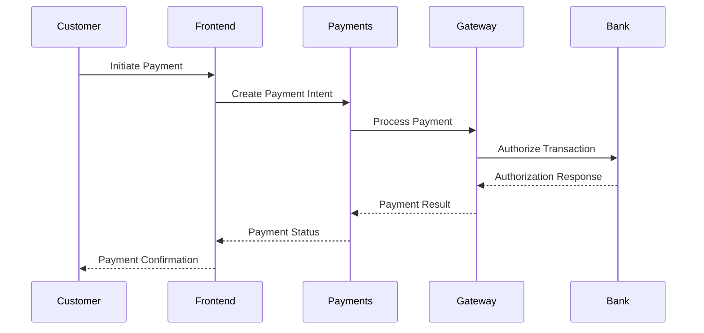
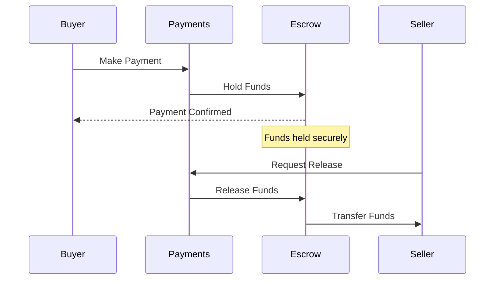

# Payments

## Overview

The Payments service handles all payment processing for the Reverse Tender platform, including credit card processing, digital wallets, bank transfers, and MENA-specific payment methods with comprehensive fraud detection and compliance features.

## Features

- **Multi-Payment Gateway Support**: PayPal, Stripe, Tap, HyperPay, and regional gateways
- **MENA Payment Methods**: SADAD, mada, KNET, and local bank transfers
- **Fraud Detection**: Advanced fraud prevention and risk assessment
- **PCI Compliance**: Full PCI DSS compliance for secure payment processing
- **Recurring Payments**: Subscription and recurring payment management
- **Multi-Currency**: Support for SAR, AED, USD, EUR and other currencies
- **Escrow Services**: Secure escrow for auction transactions
- **Refund Management**: Automated and manual refund processing

## API Endpoints

### Payment Processing
- `POST /api/payments/process` - Process payment
- `POST /api/payments/authorize` - Authorize payment
- `POST /api/payments/capture` - Capture authorized payment
- `POST /api/payments/void` - Void payment
- `POST /api/payments/refund` - Process refund

### Payment Methods
- `GET /api/payment-methods` - List available payment methods
- `POST /api/payment-methods` - Add payment method
- `GET /api/payment-methods/{id}` - Get payment method details
- `DELETE /api/payment-methods/{id}` - Remove payment method

### Transactions
- `GET /api/transactions` - List transactions
- `GET /api/transactions/{id}` - Get transaction details
- `POST /api/transactions/{id}/refund` - Refund transaction
- `GET /api/transactions/{id}/status` - Get transaction status

### Escrow Services
- `POST /api/escrow/create` - Create escrow account
- `POST /api/escrow/{id}/release` - Release escrow funds
- `POST /api/escrow/{id}/refund` - Refund escrow funds
- `GET /api/escrow/{id}/status` - Get escrow status

### Webhooks
- `POST /api/webhooks/paypal` - PayPal webhook handler
- `POST /api/webhooks/stripe` - Stripe webhook handler
- `POST /api/webhooks/tap` - Tap webhook handler

## Configuration

### Environment Variables

```bash
# Application Configuration
APP_NAME="Payments"
APP_ENV=local
APP_KEY=
APP_DEBUG=true
APP_URL=http://localhost:8009

# Database Configuration
DB_CONNECTION=pgsql
DB_HOST=postgres
DB_PORT=5432
DB_DATABASE=payments_db
DB_USERNAME=postgres
DB_PASSWORD=password

# Service URLs
AUTH_URL=http://localhost:8001
USERS_URL=http://localhost:8002
ORDERS_URL=http://localhost:8008
NOTIFICATIONS_URL=http://localhost:8007
ANALYTICS_URL=http://localhost:8005

# Service Authentication Tokens
AUTH_TOKEN=your_auth_token_here
USERS_TOKEN=your_users_token_here
ORDERS_TOKEN=your_orders_token_here
NOTIFICATIONS_TOKEN=your_notifications_token_here
ANALYTICS_TOKEN=your_analytics_token_here

# PayPal Configuration
PAYPAL_CLIENT_ID=your_paypal_client_id
PAYPAL_CLIENT_SECRET=your_paypal_client_secret
PAYPAL_MODE=sandbox

# Stripe Configuration
STRIPE_PUBLISHABLE_KEY=your_stripe_publishable_key
STRIPE_SECRET_KEY=your_stripe_secret_key
STRIPE_WEBHOOK_SECRET=your_stripe_webhook_secret

# Tap Payments (MENA)
TAP_SECRET_KEY=your_tap_secret_key
TAP_PUBLISHABLE_KEY=your_tap_publishable_key
TAP_WEBHOOK_SECRET=your_tap_webhook_secret

# HyperPay (MENA)
HYPERPAY_ENTITY_ID=your_hyperpay_entity_id
HYPERPAY_ACCESS_TOKEN=your_hyperpay_access_token
HYPERPAY_TEST_MODE=true

# SADAD (Saudi Arabia)
SADAD_MERCHANT_ID=your_sadad_merchant_id
SADAD_TERMINAL_ID=your_sadad_terminal_id
SADAD_SECRET_KEY=your_sadad_secret_key

# Fraud Detection
FRAUD_DETECTION_ENABLED=true
MAX_TRANSACTION_AMOUNT=50000
VELOCITY_CHECK_ENABLED=true
```

## Development Setup

### Prerequisites
- PHP 8.3+
- Composer
- PostgreSQL 15+
- Redis 7+

### Installation

```bash
# Navigate to payments service
cd services/payments

# Install dependencies
composer install

# Copy environment file
cp .env.example .env

# Generate application key
php artisan key:generate

# Run database migrations
php artisan migrate

# Start the service
php artisan serve --port=8009
```

## Payment Gateways

### International Gateways

#### PayPal
- **Regions**: Global
- **Methods**: Credit cards, PayPal balance, bank transfers
- **Features**: Express checkout, recurring payments, refunds

#### Stripe
- **Regions**: Global
- **Methods**: Credit cards, digital wallets, bank transfers
- **Features**: Advanced fraud detection, subscriptions, marketplace

### MENA-Specific Gateways

#### Tap Payments
- **Regions**: GCC, MENA
- **Methods**: Credit cards, Apple Pay, Google Pay, KNET, BENEFIT
- **Features**: Local payment methods, multi-currency

#### HyperPay
- **Regions**: MENA
- **Methods**: Credit cards, SADAD, mada, KNET
- **Features**: Local acquiring, fraud prevention

#### SADAD
- **Region**: Saudi Arabia
- **Methods**: Bank transfers, bill payments
- **Features**: Government-backed payment system

## Payment Flow

### Standard Payment Process


### Escrow Payment Process


## Security Features

### PCI Compliance
- **Level 1 PCI DSS**: Full compliance certification
- **Data Encryption**: End-to-end encryption of sensitive data
- **Tokenization**: Credit card tokenization for secure storage
- **Secure Transmission**: TLS 1.3 for all communications

### Fraud Detection
- **Machine Learning**: AI-powered fraud detection
- **Velocity Checks**: Transaction frequency monitoring
- **Geolocation**: Location-based risk assessment
- **Device Fingerprinting**: Device identification and tracking

### Risk Management
- **Transaction Limits**: Configurable transaction limits
- **Blacklist Management**: Blocked cards and accounts
- **Whitelist Support**: Trusted customer lists
- **Manual Review**: Flagged transaction review process

## Integration with Other Services

### Orders Service
- Process order payments
- Handle payment confirmations
- Manage order-related refunds

### Users Service
- Validate user payment methods
- Store customer payment preferences
- Manage user payment history

### Notifications Service
- Send payment confirmations
- Alert on failed payments
- Notify about refunds and chargebacks

### Analytics Service
- Track payment metrics
- Generate revenue reports
- Monitor payment gateway performance

## Error Handling

### Payment Failures
- **Insufficient Funds**: Notify customer and suggest alternatives
- **Card Declined**: Provide specific decline reasons
- **Gateway Timeout**: Retry with backup gateway
- **Fraud Detection**: Hold transaction for review

### Recovery Mechanisms
- **Automatic Retry**: Retry failed payments with exponential backoff
- **Gateway Failover**: Switch to backup payment gateway
- **Manual Processing**: Customer service intervention
- **Alternative Methods**: Suggest different payment methods

## Monitoring & Reporting

### Key Metrics
- Transaction success rates
- Payment gateway performance
- Fraud detection accuracy
- Revenue and settlement tracking

### Compliance Reporting
- PCI compliance reports
- Fraud analysis reports
- Settlement reconciliation
- Chargeback management

## Testing

```bash
# Run all tests
./vendor/bin/phpunit

# Test specific gateway
./vendor/bin/phpunit --filter PayPalTest

# Test fraud detection
./vendor/bin/phpunit --filter FraudDetectionTest
```

## Deployment

### Production Considerations
- Configure production payment gateway credentials
- Enable fraud detection and monitoring
- Set up webhook endpoints for payment status updates
- Implement proper logging and alerting
- Configure backup payment gateways

---

The Payments service ensures secure, compliant, and efficient payment processing with comprehensive support for global and MENA-specific payment methods.
